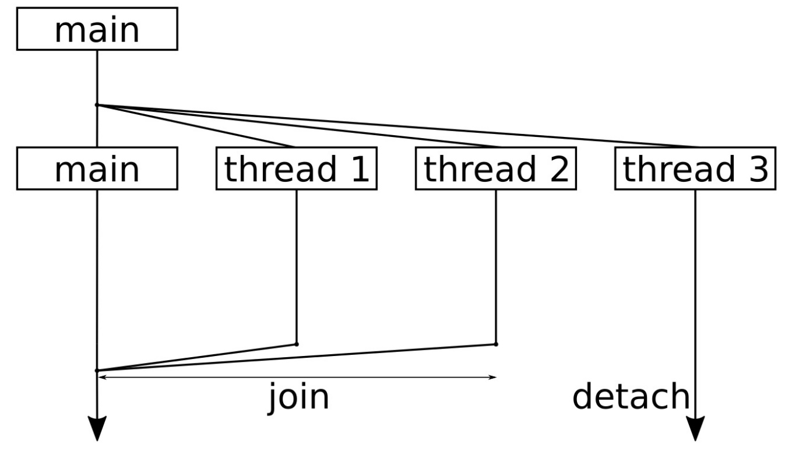

<h1 align="center">目录</h1>

* [1. 创建线程对象](#1-创建线程对象)
* [2. 使用可调用对象：线程的几种调用方式](#2-使用可调用对象线程的几种调用方式)
* [3. 启动和停止 thread](#3-启动和停止-thread)
* [4. std::async（坑）](#4-stdasync坑)

---

# 1. 创建线程对象
* 多并发编程

	* 多进程：通信部分：文件、管道、消息队列
	* 多线程：共享内存：不能在分布式系统下运行

* **函数对象** 或 **类对象** 能构造线程

	* 值传递：默认是值传递，但是过程中会产生大量的复制，可以考虑移动赋值。

		* 直接复制
		* 移动：`std::move()`

	* 引用传递：`std::ref()`

```cpp
// 函数对象
type function(type param);
/* 值传递：复制 */ thread th1(function, param);
/* 值传递：移动 */ thread th1(function, std::move(param));
type function(type& param)
/* 引用传递 */ thread th1(function, std::ref(param));

// 类对象
class className {
	className(type param):(){};
};
/* 值传递 和 引用传递 与函数写法一致 */
/* 类对象还能直接通过类对象构造，如下 */
thread th2( (className()), param);  // --> 但必须重载()操作符
```

* 线程对象只能移动，不能复制
* 获得线程对象 ID

	* 当前线程 ID，可用于主线程或者子线程对象：`std::this_thread::get_id()`
	* 只能用于线程对象 ID：`th.getid()`

* 获取当前系统能够同时运行的线程个数：`std::thread::hardware_concurrency()`

```cpp
// 类对象和lambda构造线程
#include <iostream>
#include <string>
#include <thread>

class Fctor {
public:
    void operator()(std::string msg) {
        std::cout << "original : " << msg << std::endl;
        msg = "222222";
        std::cout << "modify : " << msg << std::endl;
        std::cout << "Class thread id: " << std::this_thread::get_id() << std::endl;
    }
};

int main() {
    std::string s{"111111"};
    // std::thread th1((Fctor()), std::ref(s));
    std::thread th1((Fctor()), std::move(s));

    std::cout << "th1 thread id: " << th1.get_id() << std::endl;
    std::cout << "main thread id: " << std::this_thread::get_id() << std::endl;

    th1.join();

    std::cout << "max_thread_num: " << std::thread::hardware_concurrency() << std::endl;

    std::thread th2([]() { std::cout << "hello world." << std::endl; });
    th2.join();

    return 0;
}
```

```
th1 thread id: 140507420055296
main thread id: 140507420059456
original : 111111
modify : 222222
Class thread id: 140507420055296
max_thread_num: 8
hello world.
```


# 2. 使用可调用对象：线程的几种调用方式
2 种创建子进程方式：

1. `std::thread t1(a, 6);`
2. `std::async(std::launch::async, a, 6)`

8 种方式创建子线程对象 --> 都适用于 2 种创建子进程的方式：

1. `a` 的拷贝
2. `a` 的引用
3. `a` 的移动：`A.a`
4. `A()` 临时类对象
5. 全局函数
6. `lambda` 函数
7. `a` 的拷贝的成员函数 --> TODO:
8. `a` 的地址的成员函数 --> TODO:

```cpp
// 2种创建子线程的方式
// 8种创建子线程的方式
#include <fstream>
#include <future>
#include <iostream>
#include <mutex>
#include <string>
#include <thread>

class A {
public:
    void f(int, char) {
    }
    int operator()(int) {
        return 0;
    }
};

void foo(int) {
}

int main() {
    A a;
    // 2种创建线程的方式
    // std::thread(a, 6);
    // std::async(std::launch::async, a, 6);

    // 8种创建子线程的方式
    std::thread t1(a, 6);            // 传递a的拷贝给子线程
    std::thread t2(std::ref(a), 6);  // 传递a的引用给子线程
    std::thread t3(std::move(a), 6); // 移动a到子线程，a在主线程中不再有效

    std::thread t4(A(), 6); // 传递临时创建的a对象给子线程

    std::thread t5(foo, 6);                         // 传递全局函数对象
    std::thread t6([](int x) { return x * x; }, 6); // 传递 lambda 函数

    // TODO: 这2种不是很懂
    std::thread t7(&A::f, a, 8, 'w');  // 传递a的拷贝的成员函数给子线程
    std::thread t8(&A::f, &a, 8, 'w'); // 传递a的地址的成员函数给子线程

    t1.join();
    t2.join();
    t3.join();
    t4.join();
    t5.join();
    t6.join();
    t7.join();
    t8.join();
    return 0;
}
```

# 3. 启动和停止 thread
单核 CPU 可以有很多线程并行，但是不可能是并发，并发是真正的同步运行。以下几点是我们绝对无法控制的：

* 共享一个 CPU 核时，无法控制线程交替运行的顺序
* 线程也是有优先级的，优先级会影响线程执行的顺序
* 实际上线程是分布在所有 CPU 核上的，当然操作系统也可以将线程绑定在一个核上。这也就意味着所有的线程可以运行在单核上，也可以运行在具有 100 个 CPU 核的机器上



这幅图的顺序是自顶向下，你会看到我们将整个程序分成了 4 个线程。一开始，启动了额外 3 个线程来完成一些事情，之后主线程仅等待其他线程的结束。

线程结束对函数的执行后，会从函数中返回。标准库会进行相关的操作，将线程从操作系统的中删除，或用其他方式销毁，所以这里就不用操心了。

* `detach()` 意味着即使主线程停止了，该线程也可以继续运行。一个线程被 `detach` 后就不能再 `join` 了，可先判断 `joinable()`
* 当对线程对象调用函数 `x.join()` 时，其会让调用线程**休眠**，直至 `x` 线程返回

```cpp
// 9_3_threads.cpp

#include <chrono>
#include <iostream>
#include <thread>
using namespace std;
using namespace chrono_literals;

// 使用线程 ID 来控制线程休眠的时间，避免多个线程在同时执行 cout
static void thread_with_param(int i) {
    this_thread::sleep_for(1ms * i);
    cout << "Hello from thread " << i << '\n';
    this_thread::sleep_for(1s * i);
    cout << "Bye from thread " << i << '\n';
}

int main() {
    // 当前系统所能使用的线程数
    cout << thread::hardware_concurrency() << " concurrent threads are supported.\n";

    thread t1{thread_with_param, 1};
    thread t2{thread_with_param, 2};
    thread t3{thread_with_param, 3};

    // 使用 join 函数来停止线程
    // 调用 join 将会阻塞调用线程，直至对应的线程终止为止
    t1.join();
    t2.join();
    // 分离
    t3.detach();
    // 运行时，main 结束后 t3 线程还在休眠，所以 t3 是没有数据输出的
    cout << "Threads joined.\n";

    return 0;
}
```

```
8 concurrent threads are supported.
Hello from thread 1
Hello from thread 2
Hello from thread 3
Bye from thread 1
Bye from thread 2
Threads joined.
```


# 4. std::async（坑）
将执行的程序推到后台。

* `std::async` 函数能够接收一个策略和一个函数，以及函数对应的参数，可以并发进行多个不同事情，不显式创建线程。
* `std::async` 不一定会产生子进程，这取决于 `async` 的第一个参数：

策略选择 |意义
--|--
`launch::async`| 创建一个新的线程，以异步执行任务
`launch::deferred`| 不会创建子进程，会在同一个线程中延期启动任务。在对 `future` 调用 `get` 和 `wait` 的时候，才进行执行。如果什么都没有发生，那么执行函数就没有运行
`launch::async \| launch::deferred`|当没有提供策略时，这是**默认**的选择。具有两种策略共同的特性，STL 的 `async` 实现可以的选择策略


【注意】`get()` 可获得返回值，只能被调用一次，使用 `std::future<T>::get` ，会阻塞主函数，直到相应的值返回。

```cpp
std::future<int> ft = std::async(factorial, 4);
x = ft.get();
```

【注意】需要注意 `std::async` 的使用周期问题：运行这段代码时，程序会阻塞在这两个调用上，这并不是我们想看到的情况。虽然 `async` 是非阻塞式、异步的调用，但当对一个 `async` 使用 `launch::async` 策略时，获取一个 `future` 对象，之后其析构函数将会以**阻塞式**等待方式运行。这也就意味着，这两次调用阻塞的原因就是：`future` 生命周期只有一行的时间，所以我们可以通过获取其返回值的方式，来避免这个问题，从而让 `future` 对象的生命周期更长。

```cpp
async(launch::async, f);
async(launch::async, g);
```

【实例】从子线程中获取返回值到主线程中。

不涉及到创建线程对象，但通过在 `main` 函数和 `factorial` 函数中的 `this_thread::getid()` 获得到的线程 ID 缺失不一样的。

```cpp
#include <iostream>
#include <string>
#include <thread>
#include <fstream>
#include <future>

// 需要修改为有返回值
int factorial(int N) {
	int res = 1;
	for (int i = N; i > 1; i--)
		res *= i;

	std::cout << "Result is: " << res << std::endl;

	std::cout << "factorial id: " << std::this_thread::get_id() << std::endl;
	return res;
}

// 将主线程中的产生的数据传入到副线程中
// 首先想到的是新建变量，再传入到线程对象中，但是仅仅这做是不够的，因为x是在主线程和副线程中共享的
// 所有需要添加个互斥量，另外还需要保证主线程先把x计算出来，再传递到子线程中，所以还需要个条件变量
// 这样一来程序就变得复杂起来了
// -> 这里就不再需要子线程了，通过 std::async() 返回一个 future 给他
int main() {
	int x;
	// std::thread t1(factorial, 4, std::ref(x));
	// t1.join();
	std::future<int> ft = std::async(factorial, 4); // 此处会产生子线程
	// 第一个参数是std::launch::deferred，则表示会在同一个线程中等到调用get()才会启动factorial函数
	// 如果第一个参数是 std::launch::async，则会创建一个新线程来执行
	//std::future<int> ft = std::async(std::launch::deferred, factorial, 4); 

	x = ft.get(); // 可获得返回值，但只能被调用一次

	std::cout << "x: " << x << std::endl;    
	std::cout << "main id: " << std::this_thread::get_id() << std::endl;

	return 0;
}
/* 输出结果：
Result is: 24
factorial id: 140336783935232
x: 24
main id: 140336802191168
*/
```

【示例】

```cpp
// 9_8_async.cpp

#include <iostream>
#include <iomanip>
#include <map>
#include <string>
#include <algorithm>
#include <iterator>
#include <future>
// 将执行的程序推到后台——std::async
using namespace std;

// 对字符串中的字符进行统计
static map<char, size_t> histogram(const string &s) {
    map<char, size_t> m;

    for (char c : s) { m[c] += 1; }

    return m;
}
// 返回排序后的版本
static string sorted(string s)
{
    sort(begin(s), end(s));
    return s;
}
// 对字符串中的元音字符进行计数
static bool is_vowel(char c)
{
    char vowels[] {"aeiou"};
    return end(vowels) != find(begin(vowels), end(vowels), c);
}

static size_t vowels(const string &s)
{
    return count_if(begin(s), end(s), is_vowel);
}

int main()
{
    cin.unsetf(ios::skipws);    // 禁止对输入字符串进行分段
    string input {istream_iterator<char>{cin}, {}};
    input.pop_back();   // 从字符串中删除最后一个字符

    auto hist        (async(launch::async, histogram, input));
    auto sorted_str  (async(launch::async, sorted, input));
    auto vowel_count (async(launch::async, vowels, input));

    for(const auto &[c, count] : hist.get()) {
        cout << c << ": " << count << '\n';
    }

    cout << "Sorted string: " << quoted(sorted_str.get()) << '\n';
    cout << "Total vowels: " << vowel_count.get() << '\n';
}

/*
$ echo "foo bar baz foobazinga" | ./async
: 3
a: 4
b: 3
f: 2
g: 1
i: 1
n: 1
o: 4
r: 1
z: 2
Sorted string: " aaaabbbffginoooorzz"
Total vowels: 9
*/
```