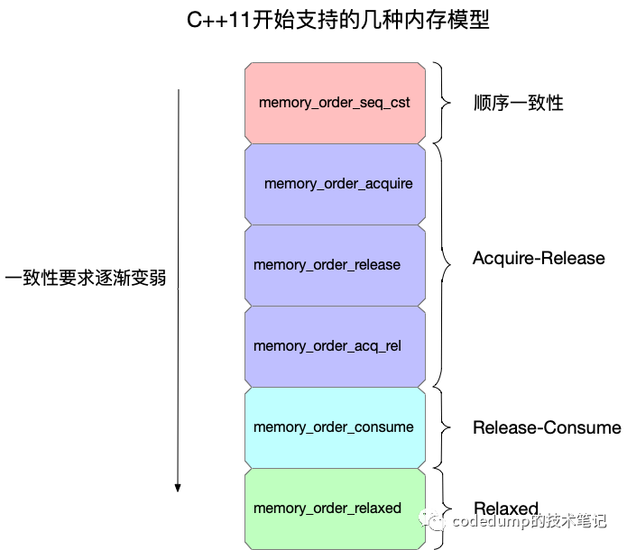
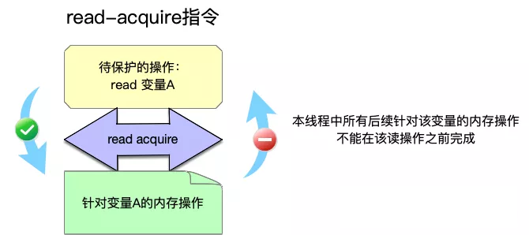
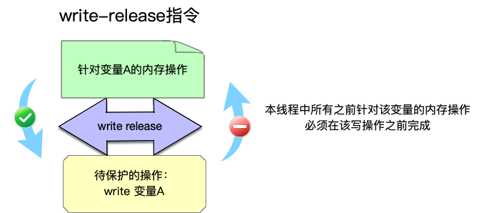
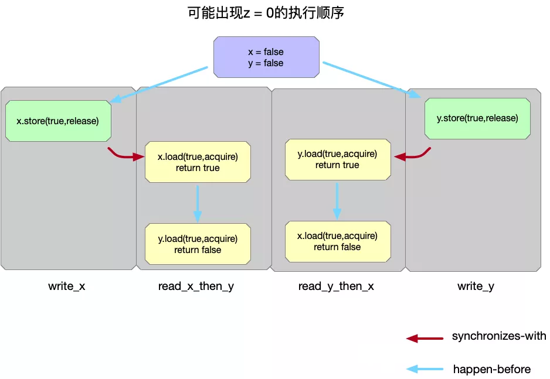
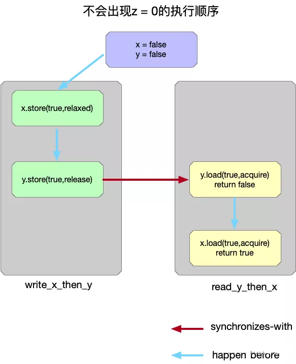

<h1 align="center">目录</h1>

* [1. 引出问题](#1-引出问题)
* [2. 原子操作](#2-原子操作)
* [3. 一致性模型](#3-一致性模型)
    * [3.1. 线性一致性](#31-线性一致性)
    * [3.2. 顺序一致性](#32-顺序一致性)
    * [3.3. 因果一致性](#33-因果一致性)
    * [3.4. 最终一致性](#34-最终一致性)
* [4. 内存顺序](#4-内存顺序)
    * [4.1. 宽松模型](#41-宽松模型)
    * [4.2. 释放/消费模型](#42-释放消费模型)
    * [4.3. 释放/获取模型](#43-释放获取模型)
    * [4.4. 顺序一致模型](#44-顺序一致模型)
* [TODO:](#todo)
    * [原子操作和内存模型](#原子操作和内存模型)
        * [例子](#例子)
        * [原子操作](#原子操作)
        * [一致性模型](#一致性模型)
        * [内存顺序](#内存顺序)
    * [知识点总结](#知识点总结)
    * [关系术语](#关系术语)
        * [sequenced-before](#sequenced-before)
        * [happens-before](#happens-before)
        * [synchronizes-with](#synchronizes-with)
    * [C++11 新标准中的内存模型](#c11-新标准中的内存模型)
        * [memory_order_seq_cst](#memory_order_seq_cst)
        * [memory_order_relaxed](#memory_order_relaxed)
    * [具体模型](#具体模型)
        * [Sequentially Consistent](#sequentially-consistent)
        * [Acquire-Release](#acquire-release)
        * [Release-Consume](#release-consume)
        * [Relaxed](#relaxed)
        * [小结](#小结)
    * [atomic_flag](#atomic_flag)
    * [std::atomic<T>](#stdatomict)

---

# 1. 引出问题

细心的读者可能会对前一小节中生产者消费者模型的例子**可能存在编译器优化导致程序出错**的情况产生疑惑。例如，布尔值 `notified` 没有被 **`volatile`** 修饰，编译器可能对此变量存在优化，例如将其作为一个寄存器的值，从而导致消费者线程永远无法观察到此值的变化。这是一个好问题，为了解释清楚这个问题，我们需要进一步讨论

**从 C++ 11 起引入的内存模型**这一概念。我们首先来看一个问题，下面这段代码输出结果是多少？

```cpp
// 7.6.bad.example.cpp

#include <thread>
#include <iostream>

int main() {
    int a = 0;
    int flag = 0;

    std::thread t1([&]() {
        while (flag != 1);

        int b = a;
        std::cout << "b = " << b << std::endl;
    });

    std::thread t2([&]() {
        a = 5;
        flag = 1;
    });

    t1.join();
    t2.join();
    return 0;
}
```

从直观上看，`t2` 中 `a = 5;` 这一条语句似乎总在 `flag = 1;` 之前得到执行，而 `t1` 中 `while (flag != 1)` 似乎保证了 `std::cout << "b = " << b << std::endl;` 不会再标记被改变前执行。从逻辑上看，似乎 `b` 的值应该等于 5。

但实际情况远比此复杂得多，或者说这段代码本身属于未定义的行为，因为对于 `a` 和 `flag` 而言，他们**在两个并行的线程中被读写**，出现了竞争。除此之外，即便我们忽略竞争读写，**仍然可能受 CPU 的乱序执行**，编译器对指令的重排的影响，导致 `a = 5` 发生在 `flag = 1` 之后。从而 `b` 可能输出 0。

# 2. 原子操作

`std::mutex` 可以解决上面出现的并发读写的问题，但互斥锁是**操作系统级**的功能，这是因为一个互斥锁的实现通常包含两条基本原理：

1. 提供线程间自动的状态转换，即『锁住』这个状态
2. 保障在互斥锁操作期间，所操作变量的内存与临界区外进行隔离

这是一组非常强的同步条件，换句话说当最终编译为 CPU 指令时会表现为非常多的指令（我们之后再来看如何实现一个简单的互斥锁）。这对于一个仅需原子级操作（没有中间态）的变量，似乎太苛刻了。

关于同步条件的研究有着非常久远的历史，我们在这里不进行赘述。读者应该明白，在现代 CPU 体系结构下提供了 CPU 指令级的原子操作，因此在 C++11 中多线程下**共享变量的读写**这一问题上，还引入了 `std::atomic` 模板，使得我们实例化一个原子类型，将一个原子类型读写操作从一组指令，最小化到单个 CPU 指令。

例如：

```cpp
std::atomic<int> counter;
```

并为整数或浮点数的原子类型提供了基本的数值成员函数，举例来说，包括 `fetch_add`, `fetch_sub` 等，同时通过重载方便的提供了对应的 `+`，`-` 版本。

比如下面的例子：

```cpp
// 7.6.atomic.cpp

#include <atomic>
#include <thread>
#include <iostream>

std::atomic<int> count = {0};

int main() {
    std::thread t1([](){
        count.fetch_add(1);
    });
    std::thread t2([](){
        count++;        // 等价于 fetch_add
        count += 1;     // 等价于 fetch_add
    });
    t1.join();
    t2.join();
    std::cout << count << std::endl;
    return 0;
}
```

当然，**并非所有的类型都能提供原子操作**，这是因为原子操作的可行性取决于 CPU 的架构以及所实例化的类型结构是否满足该架构对内存对齐条件的要求，因而我们总是可以通过 `std::atomic<T>::is_lock_free` 来**检查该原子类型是否需支持原子操作**，例如：

```cpp
// 7.7.is.lock.free.cpp

#include <atomic>
#include <iostream>

struct A {
    float x;
    int y;
    long long z;
};

int main() {
    std::atomic<A> a;
    std::cout << std::boolalpha << a.is_lock_free() << std::endl;
    return 0;
}
```

# 3. 一致性模型

并行执行的多个线程，从某种宏观层面上讨论，可以粗略的视为一种分布式系统。在分布式系统中，任何通信乃至本地操作都需要消耗一定时间，甚至出现不可靠的通信。

如果我们强行将一个变量 `v` 在多个线程之间的操作设为原子操作，即任何一个线程在操作完 `v` 后，其他线程均能**同步**感知到 `v` 的变化，则对于变量 `v` 而言，**表现为顺序执行的程序**，它并没有由于引入多线程而得到任何效率上的收益。对此有什么办法能够适当的加速呢？答案便是**削弱原子操作的在进程间的同步条件**。

从原理上看，每个线程可以对应为一个集群节点，而线程间的通信也几乎等价于集群节点间的通信。削弱进程间的同步条件，通常我们会考虑四种不同的一致性模型：

## 3.1. 线性一致性
线性一致性：又称强一致性或原子一致性。它要求任何一次**读操作**都能读到某个数据的最近一次**写的数据**，并且所有线程的操作顺序与全局时钟下的顺序是一致的。

```
        x.store(1)      x.load()
T1 ---------+----------------+------>


T2 -------------------+------------->
                x.store(2)
```

在这种情况下线程 `T1`, `T2` 对 `x` 的两次写操作是原子的，且 `x.store(1)` 是严格的发生在 `x.store(2)` 之前，`x.store(2)` 严格的发生在 `x.load()` 之前。

值得一提的是，线性一致性对全局时钟的要求是**难以实现**的，这也是人们不断研究比这个一致性更弱条件下其他一致性的算法的原因。

## 3.2. 顺序一致性
顺序一致性：同样要求任何一次读操作都能读到数据最近一次写入的数据，但未要求与全局时钟的顺序一致。

```
        x.store(1)  x.store(3)   x.load()
T1 ---------+-----------+----------+----->


T2 ---------------+---------------------->
                x.store(2)

或者

        x.store(1)  x.store(3)   x.load()
T1 ---------+-----------+----------+----->


T2 ------+------------------------------->
        x.store(2)
```

在顺序一致性的要求下，`x.load()` 必须读到最近一次写入的数据，因此 `x.store(2)` 与 `x.store(1)` 并无任何先后保障，即 只要 `T2` 的 `x.store(2)` 发生在 `x.store(3)` 之前即可。

## 3.3. 因果一致性
因果一致性：它的要求进一步降低，只需要有因果关系的操作顺序得到保障，而非因果关系的操作顺序则不做要求。

```
        a = 1      b = 2
T1 ----+-----------+---------------------------->


T2 ------+--------------------+--------+-------->
        x.store(3)         c = a + b    y.load()

或者

        a = 1      b = 2
T1 ----+-----------+---------------------------->


T2 ------+--------------------+--------+-------->
        x.store(3)          y.load()   c = a + b

亦或者

        b = 2       a = 1
T1 ----+-----------+---------------------------->


T2 ------+--------------------+--------+-------->
        y.load()            c = a + b  x.store(3)
```

上面给出的三种例子都是属于因果一致的，因为整个过程中，只有 `c` 对 `a` 和 `b` 产生依赖，而 `x` 和 `y` 在此例子中表现为没有关系（但实际情况中我们需要更详细的信息才能确定 `x` 与 `y` 确实无关）

## 3.4. 最终一致性
最终一致性：是最弱的一致性要求，它只保障某个操作在未来的某个时间节点上会被观察到，但并未要求被观察到的时间。因此我们甚至可以对此条件稍作加强，例如规定某个操作被观察到的时间总是有界的。当然这已经不在我们的讨论范围之内了。

```
    x.store(3)  x.store(4)
T1 ----+-----------+-------------------------------------------->


T2 ---------+------------+--------------------+--------+-------->
            x.read()      x.read()           x.read()   x.read()
```

在上面的情况中，如果我们假设 x 的初始值为 0，则 `T2` 中四次 `x.read()` 结果可能但不限于以下情况：

```
3 4 4 4 // x 的写操作被很快观察到
0 3 3 4 // x 的写操作被观察到的时间存在一定延迟
0 0 0 4 // 最后一次读操作读到了 x 的最终值，但此前的变化并未观察到
0 0 0 0 // 在当前时间段内 x 的写操作均未被观察到，但未来某个时间点上一定能观察到 x 为 4 的情况
```

# 4. 内存顺序

为了追求极致的性能，实现各种强度要求的一致性，C++11 为原子操作定义了六种不同的内存顺序 `std::memory_order` 的选项，表达了四种多线程间的同步模型：

## 4.1. 宽松模型
宽松模型：在此模型下，单个线程内的原子操作都是顺序执行的，不允许指令重排，但不同线程间原子操作的顺序是任意的。类型通过 `std::memory_order_relaxed` 指定。我们来看一个例子：

```cpp
// 7.8.memory.order.cpp

std::atomic<int> counter = {0};
std::vector<std::thread> vt;
for (int i = 0; i < 100; ++i) {
    vt.emplace_back([&](){
        counter.fetch_add(1, std::memory_order_relaxed);
    });
}

for (auto& t : vt) {
    t.join();
}
std::cout << "current counter:" << counter << std::endl;
```

## 4.2. 释放/消费模型
释放/消费模型：在此模型中，我们开始限制进程间的操作顺序，如果某个线程需要修改某个值，但另一个线程会对该值的某次操作产生依赖，即后者依赖前者。具体而言，线程 A 完成了三次对 `x` 的写操作，线程 `B` 仅依赖其中第三次 `x` 的写操作，与 `x` 的前两次写行为无关，则当 `A` 主动 `x.release()` 时候（即使用 `std::memory_order_release`），选项 `std::memory_order_consume` 能够确保 `B` 在调用 `x.load()` 时候观察到 `A` 中第三次对 `x` 的写操作。我们来看一个例子：

```cpp
// 初始化为 nullptr 防止 consumer 线程从野指针进行读取
std::atomic<int*> ptr(nullptr);
int v;
std::thread producer([&]() {
    int* p = new int(42);
    v = 1024;
    ptr.store(p, std::memory_order_release);
});
std::thread consumer([&]() {
    int* p;
    while(!(p = ptr.load(std::memory_order_consume)));

    std::cout << "p: " << *p << std::endl;
    std::cout << "v: " << v << std::endl;
});
producer.join();
consumer.join();
```

## 4.3. 释放/获取模型
释放/获取模型：在此模型下，我们可以进一步加紧对不同线程间原子操作的顺序的限制，在释放 `std::memory_order_release` 和获取 `std::memory_order_acquire` 之间规定时序，即发生在释放（release）操作之前的**所有**写操作，对其他线程的任何获取（acquire）操作都是可见的，亦即发生顺序（happens-before）。

可以看到，`std::memory_order_release` 确保了它之前的写操作不会发生在释放操作之后，是一个向后的屏障（backward），而 `std::memory_order_acquire` 确保了它之前的写行为不会发生在该获取操作之后，是一个向前的屏障（forward）。对于选项 `std::memory_order_acq_rel` 而言，则结合了这两者的特点，唯一确定了一个内存屏障，使得当前线程对内存的读写不会被重排并越过此操作的前后：

我们来看一个例子：

```cpp
std::vector<int> v;
std::atomic<int> flag = {0};
std::thread release([&]() {
    v.push_back(42);
    flag.store(1, std::memory_order_release);
});
std::thread acqrel([&]() {
    int expected = 1; // must before compare_exchange_strong
    while(!flag.compare_exchange_strong(expected, 2, std::memory_order_acq_rel)) {
        expected = 1; // must after compare_exchange_strong
    }
    // flag has changed to 2
});
std::thread acquire([&]() {
    while(flag.load(std::memory_order_acquire) < 2);

    std::cout << v.at(0) << std::endl; // must be 42
});
release.join();
acqrel.join();
acquire.join();
```

在此例中我们使用了 `compare_exchange_strong`，它便是比较交换原语（Compare-and-swap primitive），它有一个更弱的版本，即 `compare_exchange_weak`，它允许即便交换成功，也仍然返回 `false` 失败。其原因是因为在某些平台上虚假故障导致的，具体而言，当 CPU 进行上下文切换时，另一线程加载同一地址产生的不一致。除此之外，`compare_exchange_strong` 的性能可能稍差于 `compare_exchange_weak`，但大部分情况下，`compare_exchange_strong` 应该被有限考虑。

## 4.4. 顺序一致模型
顺序一致模型：在此模型下，原子操作满足顺序一致性，进而可能对性能产生损耗。可显式的通过 `std::memory_order_seq_cst` 进行指定。最后来看一个例子：

```cpp
std::atomic<int> counter = {0};
std::vector<std::thread> vt;
for (int i = 0; i < 100; ++i) {
    vt.emplace_back([&](){
        counter.fetch_add(1, std::memory_order_seq_cst);
    });
}

for (auto& t : vt) {
    t.join();
}
std::cout << "current counter:" << counter << std::endl;
```

这个例子与第一个宽松模型的例子本质上没有区别，仅仅只是将原子操作的内存顺序修改为了 `memory_order_seq_cst`，有兴趣的读者可以自行编写程序测量这两种不同内存顺序导致的性能差异。


# TODO:
## 原子操作和内存模型
### 例子
看看下面代码输出什么：

```cpp
#include <vector>
#include <iostream>
#include <thread>

int main()
{
    int a = 0;
    int flag = 0;

    std::thread t1([&]() {
        while (flag != 1)
            ;

        int b = a;
        std::cout << "b = " << b << std::endl;
    });

    std::thread t2([&]() {
        a = 5;
        flag = 1;
    });

    t1.join();
    t2.join();
    return 0;
}
```

从直观上看， t2 中 a = 5; 这一条语句似乎总在 flag = 1; 之前得到执行，而 t1 中 while (flag != 1) 似乎保证了 std::cout << "b = " << b << std::endl; 不会再标记被改变前执行。从逻辑上看，似乎 b 的值应该等于 5。但实际情况远比此复杂得多，或者说这段代码本身属于未定义的行为，因为对于 a 和 flag 而言，他们在两个并行的线程中被读写，出现了竞争。除此之外，即便我们忽略竞争读写，仍然可能收 CPU 的乱序执行，编译器对指令的重排的影响，导致 a = 5 发生在 flag = 1 之后。从而 b 可能输出 0。

### 原子操作
std::mutex 可以解决上面出现的并发读写的问题，但互斥锁是操作系统级的功能，这是因为一个互斥锁的实现通常包含两条基本原理：
1. 提供线程间自动的状态转换，即『锁住』这个状态
2. 保障在互斥锁操作期间，所操作变量的内存与临界区外进行隔离
这是一组非常强的同步条件，换句话说当最终编译为 CPU 指令时会表现为非常多的指令。这对于一个仅需原子级操作（没有中间态）的变量，似乎太苛刻了。

C++11 在多线程下共享变量的读写这一问题上，引入了 `std::atomic` 模板，使得我们实例化一个原子类型，将一个原子类型读写操作从一组指令，最小化到单个 CPU 指令。并为整数或浮点数的原子类型提供了基本的数值成员函数，举例来说，包括 `fetch_add` , `fetch_sub` 等，同时通过重载方便的提供了对应的 `+` ， `-` 版本。比如下面的例子：

```cpp
#include <atomic>
#include <thread>
#include <iostream>

std::atomic<int> count = {0};

int main()
{
    std::thread t1([]() {
        count.fetch_add(1);
    });
    std::thread t2([]() {
        count++;    // 等价于 fetch_add
        count += 1; // 等价于 fetch_add
    });
    t1.join();
    t2.join();
    std::cout << count << std::endl;
    return 0;
}
// 输出 3
```

当然，并非所有的类型都能提供原子操作，这是因为原子操作的可行性取决于 CPU 的架构以及所实例化的类型结构是否满足该架构对内存对齐条件的要求，因而我们总是可以通过 `std::atomic<T>::is_lock_free` 来检查该原子类型是否需支持原子操作，例如：

```cpp
#include <atomic>
#include <iostream>

struct A
{
    float x;
    int y;
    long long z;
};

int main()
{
    std::atomic<A> a;
    std::cout << std::boolalpha << a.is_lock_free() << std::endl;
    return 0;
}
// 无法通过编译
```

### 一致性模型
从原理上看，每个线程可以对应为一个集群节点，而线程间的通信也几乎等价于集群节点间的通信。削弱进程间的同步条件，通常我们会考虑 4 种不同的一致性模型：

1. 线性一致性：又称强一致性或原子一致性。它要求任何一次读操作都能读到某个数据的最近一次写的数据，并且所有线程的操作顺序与全局时钟下的顺序是一致的。

```
        x.store(1)          x.load()
T1 ---------+------------------+------>

T2 ---------------------+------------->
                    x.store(2)
```

在这种情况下线程 T1 , T2 对 x 的两次写操作是原子的，且 x.store(1) 是严格的发生在 x.store(2) 之前， x.store(2) 严格的发生在 x.load() 之前。值得一提的是，线性一致性对全局时钟的要求是难以实现的，这也是人们不断研究比这个一致性更弱条件下其他一致性的算法的原因。

2. 顺序一致性：同样要求任何一次读操作都能读到数据最近一次写入的数据，但未要求与全局时钟的顺序一致。

```
        x.store(1)      x.store(3)      x.load()
T1 ---------+---------------+--------------+----->

T2 -----------------+---------------------------->
                x.store(2)

或者：

        x.store(1)      x.store(3)      x.load()
T1 ---------+---------------+---------------+----->

T2 ------+--------------------------------------->
       x.store(2)
```

在顺序一致性的要求下， x.load() 必须读到最近一次写入的数据，因此 x.store(2) 与 x.store(1) 并无任何先后保障，即只要 T2 的 x.store(2) 发生在 x.store(3) 之前即可。

3. 因果一致性：它的要求进一步降低，只需要有因果关系的操作顺序得到保障，而非因果关系的操作顺序则不做要求。

```
    a = 1       b = 2
T1 ----+-----------+---------------------------->

T2 ------+--------------------+--------+-------->
    x.store(3)          c = a + b   y.load()

或者

     a = 1       b = 2
T1 ----+-----------+---------------------------->

T2 ------+--------------------+--------+-------->
      x.store(3)           y.load()  c = a + b

亦或者

     b = 2       a = 1
T1 ----+-----------+---------------------------->

T2 ------+--------------------+--------+-------->
       y.load()           c = a + b   x.store(3)
```

上面给出的三种例子都是属于因果一致的，因为整个过程中，只有 c 对 a 和 b 产生依赖，而 x 和 y 在此例子中表现为没有关系（但实际情况中我们需要更详细的信息才能确定 x 与 y 确实无关）

4. 最终一致性：是最弱的一致性要求，它只保障某个操作在未来的某个时间节点上会被观察到，但并未要求被观察到的时间。因此我们甚至可以对此条件稍作加强，例如规定某个操作被观察到的时间总是有界的。当然这已经不在我们的讨论范围之内了。

```
    x.store(3)   x.store(4)
T1 ----+-----------+-------------------------------------------->

T2 ---------+------------+------------------+----------+-------->
        x.read()      x.read()           x.read()   x.read()
```
在上面的情况中，如果我们假设 x 的初始值为 0，则 T2 中四次 x.read() 结果可能但不限于以下情况：

```
3 4 4 4     // x的写操作被很快观察到
2 0 3 3 4   // x的写操作被观察到的时间存在一定延迟
3 0 0 0 4   // 最后一次读操作读到了x的最终值，但此前的变化并未观察到
4 0 0 0 0   // 在当前时间段内x的写操作均未被观察到，但未来某个时间点上一定能观察到x为4的情况
```

### 内存顺序
为了追求极致的性能，实现各种强度要求的一致性，C++11 为原子操作定义了六种不同的内存顺序 `std::memory_order` 的选项，表达了 4 种多线程间的同步模型：

1. 宽松模型：在此模型下，单个线程内的原子操作都是顺序执行的，不允许指令重排，但不同线程间原子操作的顺序是任意的。类型通过 `std::memory_order_relaxed` 指定。我们来看一个例子：

```cpp
#include <vector>
#include <iostream>
#include <thread>
#include <atomic>

int main()
{
    std::atomic<int> counter = {0};
    std::vector<std::thread> vt;
    for (int i = 0; i < 100; ++i)
    {
        vt.emplace_back([&]() {
            counter.fetch_add(1, std::memory_order_relaxed);
        });
    }

    for (auto &t : vt)
    {
        t.join();
    }
    std::cout << "current counter:" << counter << std::endl;

    return 0;
}
// current counter:100
```

2. 释放/消费模型：在此模型中，我们开始限制进程间的操作顺序，如果某个线程需要修改某个值，但另一个线程会对该值的某次操作产生依赖，即后者依赖前者。具体而言，线程 A 完成了三次对 x 的写操作，线程 B 仅依赖其中第三次 x 的写操作，与 x 的前两次写行为无关，则当 A 主动 x.release() 时候（即使用 std::memory_order_release ），选项 std::memory_order_consume 能够确保 B 在调用 x.load() 时候观察到 A 中第三次对 x 的写操作。我们来看一个例子：

```cpp

#include <vector>
#include <iostream>
#include <thread>
#include <atomic>

int main()
{
    std::atomic<int *> ptr;
    int v;

    std::thread producer([&]() {
        int *p = new int(42);
        v = 1024;
        ptr.store(p, std::memory_order_release);
    });

    std::thread consumer([&]() {
        int *p;
        while (!(p = ptr.load(std::memory_order_consume)))
            ;

        std::cout << "p: " << *p << std::endl;
        std::cout << "v: " << v << std::endl;
    });

    producer.join();
    consumer.join();

    return 0;
}
/*
    p: 42
    v: 1024
*/
```

3. 释放/获取模型：在此模型下，我们可以进一步加紧对不同线程间原子操作的顺序的限制，在释放 `std::memory_order_release` 和获取 `std::memory_order_acquire` 之间规定时序，即发生在释放操作之前的 **所有** 写操作，对其他线程的任何获取操作都是可见的，亦即发生顺序（happens-before）。可以看到：
- `std::memory_order_release` 确保了它之后的 **写行为** 不会发生在释放操作之前，是一个向后的屏障，
- 而 `std::memory_order_acquire` 确保了它之后的前的 **写行为**，不会发生在该获取操作之后，是一个向前的屏障，
- 对于选项 `std::memory_order_acq_rel` 而言，则结合了这两者的特点，唯一确定了一个内存屏障，使得当前线程对内存的读写不会被重排到此操作的前后。

我们来看一个例子：

```cpp

#include <vector>
#include <iostream>
#include <thread>
#include <atomic>

int main()
{
    std::vector<int> v;
    std::atomic<int> flag = {0};

    std::thread release([&]() {
        v.push_back(42);
        flag.store(1, std::memory_order_release);
    });

    std::thread acqrel([&]() {
        // must before compare_exchange_strong
        int expected = 1;
        while (!flag.compare_exchange_strong(expected, 2, std::memory_order_acq_rel))
        {
            // must after compare_exchange_strong
            expected = 1;
        }
        // flag has changed to 2
    });

    std::thread acquire([&]() {
        while (flag.load(std::memory_order_acquire) < 2)
            ;
        // must be 42
        std::cout << v.at(0) << std::endl;
    });

    release.join();
    acqrel.join();
    acquire.join();
    return 0;
}
// 42
```

在此例中我们使用了 compare_exchange_strong ，它便是比较交换原语（Compare-and-swap prim-itive） ，它有一个更弱的版本，即 compare_exchange_weak ，它允许即便交换成功，也仍然返回 false 失败。其原因是因为在某些平台上虚假故障导致的，具体而言，当 CPU 进行上下文切换
时，另一线程加载同一地址产生的不一致。除此之外， compare_exchange_strong 的性能可能稍差于 compare_exchange_weak ，但大部分情况下， compare_exchange_strong 应该被有限考虑。

4. 顺序一致模型：在此模型下，原子操作满足顺序一致性，进而可能对性能产生损耗。可显式的通过 `std::memory_order_seq_cst` 进行指定。最后来看一个例子：

```cpp

#include <vector>
#include <iostream>
#include <thread>
#include <atomic>

int main()
{
    std::atomic<int> counter = {0};

    std::vector<std::thread> vt;
    for (int i = 0; i < 100; ++i)
    {
        vt.emplace_back([&]() {
            counter.fetch_add(1, std::memory_order_seq_cst);
        });
    }

    for (auto &t : vt)
    {
        t.join();
    }
    std::cout << "current counter:" << counter << std::endl;
    return 0;
}
// current counter:100
```

这个例子与第一个宽松模型的例子本质上没有区别，仅仅只是将原子操作的内存顺序修改为了 `memory_order_seq_cst`

## 知识点总结
原子操作 3 个方面语义：
1. 操作本身是不可分割的（Atomicity）
2. 一个线程对某个数据的操作何时对另外一个线程可见（Visibility）
3. 执行的顺序是否可以被重排（Ordering）


acquire barrier 内存模型：意味着该操作之后的 memory store 指令不允许重排到该操作之前去，不过该操作之前的 memory store 可以排到该操作之后去，

release barrier 内存模型：意味着之前的 memory store 是全局可见的，所有的 memory load 也都完成了，但是接下来的内存读取可能会被排序到该操作之前执行。

## 关系术语
### sequenced-before
sequenced-before 用于表示**单线程**之间，两个操作上的先后顺序，这个顺序是非对称、可以进行传递的关系。

它不仅仅表示两个操作之间的**先后顺序**，还表示了操作**结果之间的可见性关系**。两个操作 A 和操作 B，如果有 A sequenced-before B，除了表示操作 A 的顺序在 B 之前，还表示了操作 A 的结果操作 B 可见。

### happens-before
与 sequenced-before 不同的是，happens-before 关系表示的**不同线程**之间的操作先后顺序，同样的也是非对称、可传递的关系。

如果 A happens-before B，则 A 的内存状态将在 B 操作执行之前就可见。某些情况下一个写操作只是简单的写入内存就返回了，其他核心上的操作不一定能马上见到操作的结果，这样的关系是不满足 happens-before 的。

### synchronizes-with
synchronizes-with 关系强调的是变量被修改之后的传播关系（propagate），即如果一个线程修改某变量的之后的结果能被其它线程可见，那么就是满足 synchronizes-with 关
系的。

显然，满足 synchronizes-with 关系的操作一定满足 happens-before 关系了。


## C++11 新标准中的内存模型
原子变量的通用接口使用 `store()` 和 `load()` 方式进行存取，可以额外接受一个额外的 `memory order` 参数，而不传递的话默认是最强模式 `Sequentially Consistent`。

从 C++11 开始就支持以下几种内存模型：

```cpp
enum memory_order {
    memory_order_relaxed,

    memory_order_consume,

    memory_order_acquire,
    memory_order_release,
    memory_order_acq_rel,

    memory_order_seq_cst
};
```

与内存模型相关的枚举类型有以上 6 种，但是其实分为 4 类，如下图所示，其中对一致性的要求逐渐减弱（执行线程之间对变量的同步需求强度逐渐减弱）：



1. Sequentially Consistent：按顺序一致
2. Acquire - Release
3. Release - Consume
4. Relaxed

### memory_order_seq_cst
- 例子：由于采用了顺序一致性模型，因此最后的断言不可能发生，即在程序结束时不可能出现 z 为 0 的情况

```cpp
#include <atomic>
#include <thread>
#include <assert.h>

std::atomic<bool> x, y;
std::atomic<int> z;

void write_x()
{
    x.store(true, std::memory_order_seq_cst);
}
void write_y()
{
    y.store(true, std::memory_order_seq_cst);
}
void read_x_then_y()
{
    while (!x.load(std::memory_order_seq_cst))
        ;
    if (y.load(std::memory_order_seq_cst))
        ++z;
}
void read_y_then_x()
{
    while (!y.load(std::memory_order_seq_cst))
        ;
    if (x.load(std::memory_order_seq_cst))
        ++z;
}

int main()
{
    x = false;
    y = false;
    z = 0;
    std::thread a(write_x);
    std::thread b(write_y);
    std::thread c(read_x_then_y);
    std::thread d(read_y_then_x);
    a.join();
    b.join();
    c.join();
    d.join();
    assert(z.load() != 0);
}
```


### memory_order_relaxed
这种类型对应的松散内存模型，这种内存模型的特点是：
- 针对一个变量的读写操作是原子操作
- 不同线程之间针对该变量的访问操作先后顺序不能得到保证，即有可能乱序

- 例子：对原子变量的访问都使用 `memory_order_relaxed` 模型，导致了最后的断言可能失败，即在程序结束时 z 可能为 0

```cpp
#include <atomic>
#include <thread>
#include <assert.h>

std::atomic<bool> x, y;
std::atomic<int> z;

void write_x_then_y()
{
    x.store(true, std::memory_order_relaxed);
    y.store(true, std::memory_order_relaxed);
}
void read_y_then_x()
{
    while (!y.load(std::memory_order_relaxed))
        ;
    if (x.load(std::memory_order_relaxed))
        ++z;
}
int main()
{
    x = false;
    y = false;
    z = 0;
    std::thread a(write_x_then_y);
    std::thread b(read_y_then_x);
    a.join();
    b.join();
    assert(z.load() != 0);
}
```


## 具体模型
### Sequentially Consistent
该模型是最强的同步模式，参数表示为 `std::memory_order_seq_cst` ，同时也是默认的模型。

```cpp
-Thread 1-  -Thread 2-
if(x.load() == 2)
    y = 1;
x.store(2);
assert(y == 1)
```

对于上面的例子，即使 x 和 y 是不相关的，通常情况下处理器或者编译器可能会对其访问进行重排，但是在 seq_cst 模式下，`x.store(2)` 之前的所有 memory accesses 都会 happens-before 在这次 store 操作。

另外一个角度来说：对于 seq_cst 模式下的操作，所有 memory accesses 操作的重排不允许跨域这个操作，同时这个限制是双向的。


### Acquire-Release
> Acquire ：获取

> Release ：发布

下面是典型 Acquire/Release 的使用例子：

```cpp
std::atomic<int> a{0};
int b = 0;

-Thread 1-
b = 1;
a.store(1, memory_order_release);

-Thread 2-
/* waiting */
while(a.load(memory_order_acquire) != 1)
    ;
std::cout << b << '\n';
```

毫无疑问，如果是 seq_cst，那么上面的操作一定是成功的(打印变量 b 显示为 1)。

- `memory_order_release` 保证在这个操作之前的 memory accesses 不会重排到这个操作之后去，但是这个操作之后的 memory accesses 可能会重排到这个操作之前去。通常这个主要是用于之前准备某些资源后，通过 store + memory_order_release 的方式 "Release" 给别的线程
- `memory_order_acquire` 保证在这个操作之后的 memory accesses 不会重排到这个操作之前去，但是这个操作之前的 memory accesses 可能会重排到这个操作之后去。通常通过 load + memory_order_acquire 判断或者等待某个资源，一旦满足某个条件后就可以安全的 "Acquire" 消费这些资源了


- `memory_order_acquire`：

    用来修饰一个读操作，表示在本线程中，所有后续的关于此变量的内存操作都必须在本条原子操作完成后执行。



- `memory_order_release`：

    用来修饰一个写操作，表示在本线程中，所有之前的针对该变量的内存操作完成后才能执行本条原子操作。



- `memory_order_acq_rel`：

    同时包含 `memory_order_acquire` 和 `memory_order_release` 标志。

- 例子：

```cpp
#include <atomic>
#include <thread>
#include <assert.h>

std::atomic<bool> x, y;
std::atomic<int> z;

void write_x()
{
    x.store(true, std::memory_order_release);
}
void write_y()
{
    y.store(true, std::memory_order_release);
}
void read_x_then_y()
{
    while (!x.load(std::memory_order_acquire))
        ;
    if (y.load(std::memory_order_acquire))
        ++z;
}
void read_y_then_x()
{
    while (!y.load(std::memory_order_acquire))
        ;
    if (x.load(std::memory_order_acquire))
        ++z;
}

int main()
{
    x = false;
    y = false;
    z = 0;
    std::thread a(write_x);
    std::thread b(write_y);
    std::thread c(read_x_then_y);
    std::thread d(read_y_then_x);
    a.join();
    b.join();
    c.join();
    d.join();
    assert(z.load() != 0);
}
```

上面这个例子中，并不能保证程序最后的断言即 `z!=0` 为真，其原因在于：在不同的线程中分别针对 `x`、`y` 两个变量进行了同步操作并不能保证 `x`、`y` 变量的读取操作。

线程 `write_x` 针对变量 `x` 使用了 write-release 模型，这样保证了 `read_x_then_y` 函数中，在 load 变量 `y` 之前 `x` 为 true；同理线程 `write_y` 针对变量 `y` 使用了 write-release 模型，这样保证了 read_y_then_x 函数中，在 load 变量 `x` 之前 `y` 为 true。

然而即便是这样，仍然可能出现以下类似的情况：



如上图所示：
- 初始条件为 x = y = false
- 由于在 read_x_and_y 线程中，对 x 的 load 操作使用了 acquire 模型，因此保证了是先执行 write_x 函数才到这一步的；同理先执行 write_y 才到 read_y_and_x 中针对 y 的 load 操作
- 然而即便如此，也可能出现在 read_x_then_y 中针对 y 的 load 操作在 y 的 store 操作之前完成，因为 y.store 操作与此之间没有先后顺序关系；同理也不能保证 x 一定读到 true 值，因此到程序结束是就出现了 z = 0 的情况

从上面的分析可以看到，即便在这里使用了 release-acquire 模型，仍然没有保证 z=0，其原因在于：最开始针对 x、y 两个变量的写操作是分别在 write_x 和 write_y 线程中进行的，不能保证两者执行的顺序导致。因此修改如下：

```cpp
#include <atomic>
#include <thread>
#include <assert.h>

std::atomic<bool> x, y;
std::atomic<int> z;

void write_x_then_y()
{
    x.store(true, std::memory_order_relaxed);
    y.store(true, std::memory_order_release);
}
void read_y_then_x()
{
    while (!y.load(std::memory_order_acquire))
        ;
    if (x.load(std::memory_order_relaxed))
        ++z;
}
int main()
{
    x = false;
    y = false;
    z = 0;
    std::thread a(write_x_then_y);
    std::thread b(read_y_then_x);
    a.join();
    b.join();
    assert(z.load() != 0);
}
```



如上图所示：
- 初始条件为 x = y = false
- 在 write_x_then_y 线程中，先执行对 x 的写操作，再执行对 y 的写操作，由于两者在同一个线程中，所以即便针对 x 的修改操作使用 relaxed 模型，修改 x 也一定在修改 y 之前执行
- 在 write_x_then_y 线程中，对 y 的 load 操作使用了 acquire 模型，而在线程 write_x_then_y 中针对变量 y 的读操作使用 release 模型，因此保证了是先执行 write_x_then_y 函数才到 read_y_then_x 的针对变量 y 的 load 操作
- 因此最终的执行顺序如上图所示，此时不可能出现 z=0 的情况

从以上的分析可以看出，针对同一个变量的 release-acquire 操作，更多时候扮演了一种 “线程间使用某一变量的同步” 作用，由于有了这个语义的保证，做到了线程间操作的先后顺序保证（inter-thread happens-before）。


### Release-Consume
> Consume ：消耗

这是一个相比 Acquire/Release 更加宽松的内存模型，对非依赖的变量也去除了 happens-before 的限制，减少了所需同步的数据量，可以加快执行的速度。

```cpp
-Thread 1-
n = 1;
m = 1;
p.store(&n, memory_order_release);

-Thread 2-
t = p.load(memory_order_acquire);
assert( *t == 1 && m == 1);

-Thread 3-
t = p.load(memory_order_consume);
assert( *t == 1 && m == 1);
```

线程 2 的 assert 会 pass，而线程 3 的 assert 可能会 fail，因为 n 出现在了 store 表达式中，算是一个依赖变量，会确保对该变量的 memory access 会 happends-before 在这个 store 之前，但是 m 没有依赖关系，所以不会同步该变量，对其值不作保证。


Comsume 模式因为降低了需要在硬件之间同步的数量，所以理论上其执行的速度会比之上面的内存模型块一些，尤其在共享内存大规模数据量情况下，应该会有较明显的差异表现出来。

在这里，Acquire / Consume ~ Release 这种线程间同步协作的机制就被完全暴露了，通常会形成 Acquired / Consume 来等待 Release 的某个状态更新。需要注意的是这样的通信需要两个线程间成对的使用才有意义，同时对于没有使用这个内存模型的第三方线程没有任何作用效果。


新内容：


从上面对 Acquire-Release 模型的分析可以知道，虽然可以使用这个模型做到两个线程之间某些操作的 synchronizes-with 关系，然后这个粒度有些过于大了。

在很多时候，线程间只想针对有依赖关系的操作进行同步，除此之外线程中的其他操作顺序如何无所谓。比如下面的代码中：

```cpp
b = *a;
c = *b;
```

其中第二行代码的执行结果依赖于第一行代码的执行结果，此时称这两行代码之间的关系为 “carry-a-dependency ”。C++ 中引入的 memory_order_consume 内存模型就针对这类代码间有明确的依赖关系的语句限制其先后顺序。

- 例子：

```cpp
#include <string>
#include <thread>
#include <atomic>
#include <assert.h>

struct X
{
    int i;
    std::string s;
};

std::atomic<X *> p;
std::atomic<int> a;

void create_x()
{
    X *x = new X;
    x->i = 42;
    x->s = "hello";
    a.store(99, std::memory_order_relaxed);
    p.store(x, std::memory_order_release);
}
void use_x()
{
    X *x;
    while (!(x = p.load(std::memory_order_consume)))
        std::this_thread::sleep_for(std::chrono::microseconds(1));
    assert(x->i == 42);
    assert(x->s == "hello");
    assert(a.load(std::memory_order_relaxed) == 99);
}

int main()
{
    std::thread t1(create_x);
    std::thread t2(use_x);
    t1.join();
    t2.join();
}
```

- create_x 线程中的 store(x) 操作使用 memory_order_release，而在 use_x 线程中，有针对 x 的使用 memory_order_consume 内存模型的 load 操作，两者之间由于有 carry-a-dependency 关系，因此能保证两者的先后执行顺序。所以 x->i == 42 以及 x->s=="hello" 这两个断言都不会失败。
- 然而，create_x 中针对变量 a 的使用 relax 内存模型的 store 操作，use_x 线程中也有针对变量 a 的使用 relax 内存模型的 load 操作。这两者的先后执行顺序，并不受前面的 memory_order_consume 内存模型影响，所以并不能保证前后顺序，因此断言 a.load(std::memory_order_relaxed)==99 真假都有可能。

以上可以对比 Acquire-Release 以及 Release-Consume 两个内存模型，可以知道：

- Acquire-Release 能保证不同线程之间的 Synchronizes-With 关系，这同时也约束到同一个线程中前后语句的执行顺序。
- 而 Release-Consume 只约束有明确的 carry-a-dependency 关系的语句的执行顺序，同一个线程中的其他语句的执行先后顺序并不受这个内存模型的影响。


### Relaxed
最宽松的模式，`memory_order_relaxed` 没有 happens-before 的约束，编译器和处理器可以对 memory access 做任何的 re-order，因此另外的线程不能对其做任何的假设，这种模式下能做的唯一保证，就是一旦线程读到了变量 var 的最新值，那么这个线程将再也见不到var修改之前的值了。

这种情况通常是在需要原子变量，但是不在线程间同步共享数据的时候会用，同时当 relaxed 存一个数据的时候，另外的线程将需要一个时间才能 relaxed 读到该值，在非缓存一致性的构架上需要刷新缓存。在开发的时候，如果你的上下文没有共享的变量需要在线程间同步，选用 Relaxed 就可以了。

### 小结
除非你知道这是什么，需要减弱线程间原子上下文同步的耦合性增加执行效率，才考虑这里的内存模型来优化你的程序，否则还是老老实实的使用默认的 memory_order_seq_cst，虽然速度可能会慢点，但是稳妥些，万一由于你不成熟的优化带来问题，是很难去调试的。


## atomic_flag
> atomic_flag 与其他原子类型不同，它是无锁（lock_free）的，即线程对其访问不需要加锁，而其他的原子类型不一定是无锁的。
1. std::atomic_flag：提供了标志的管理，标志有三种状态：clear、set和未初始化状态
2. atomic_flag实例化：缺省情况下atomic_flag处于未初始化状态。除非初始化时使用了ATOMIC_FLAG_INIT宏，则此时atomic_flag处于clear状态
3. std::atomic_flag::clear：调用该函数将会把atomic_flag置为clear状态。clear状态您可以理解为bool类型的false，set状态可理解为true状态。clear函数没有任何返回值

```cpp
void clear(memory_order m = memory_order_seq_cst) volatile noexcept;
void clear(memory_order m = memory_order_seq_cst) noexcept;
```

- memory_order：

序号 | 值 | 意义
--|--|--
1 | memory_order_relaxed |宽松模型，</br>不对执行顺序做保证
2 | memory_order_consume |当前线程中,满足happens-before原则。</br>当前线程中该原子的所有后续操作,必须在本条操作完成之后执行
3 | memory_order_acquire |当前线程中,读操作满足happens-before原则。</br>所有后续的读操作必须在本操作完成后执行
4 | memory_order_release |当前线程中,写操作满足happens-before原则。</br>所有后续的写操作必须在本操作完成后执行
5 | memory_order_acq_rel |当前线程中，同时满足memory_order_acquire和memory_order_release
6 | memory_order_seq_cst |最强约束。</br>全部读写都按顺序执行

- test_and_set：该函数会检测flag是否处于set状态，如果不是，则将其设置为set状态，并返回false；否则返回true
- test_and_set是典型的read-modify-write(RMW)模型，保证多线程环境下只被设置一次。


```cpp
// 下面代码通过10个线程，模拟了一个计数程序，第一个完成计数的会打印"win"
#include <atomic>    // atomic_flag
#include <iostream>  // std::cout, std::endl
#include <list>      // std::list
#include <thread>    // std::thread

void race(std::atomic_flag &af, int id, int n) {
    for (int i = 0; i < n; i++) {
    }
    // 第一个完成计数的打印：Win
    if (!af.test_and_set()) {
        printf("%s[%d] win!!!\n", __FUNCTION__, id);
    }
}

int main() {
    std::atomic_flag af = ATOMIC_FLAG_INIT;

    std::list<std::thread> lstThread;
    for (int i = 0; i < 10; i++) {
        lstThread.emplace_back(race, std::ref(af), i + 1, 5000 * 10000);
    }

    for (std::thread &thr : lstThread) {
        thr.join();
    }

    return 0;
}
// 程序输出如下(每次运行，可能率先完成的thread不同):
// race[7] win!!!
```

- atomic_flag 只支持 test_and_set() 以及 clear() 两个成员函数，test_and_set()函数检查 std::atomic_flag 标志，如果 std::atomic_flag 之前没有被设置过，则设置 std::atomic_flag 的标志；如果之前 std::atomic_flag 已被设置，则返回 true，否则返回 false。clear()函数清除 std::atomic_flag 标志使得下一次调用 std::atomic_flag::test_and_set()返回 false。可以用 atomic_flag 的成员函数test_and_set() 和 clear() 来实现一个自旋锁（spin lock）：


- 使用原子操作实现一个线程等待另外一个线程：暂未通过测试

> 当然这个程序中存在对 cout 的资源竞争

```cpp
#include <atomic>
#include <thread>
#include <iostream>

std::atomic_flag lock = ATOMIC_FLAG_INIT;

void func1()
{
    // 在主线程中设置为true，需要等待t2线程clear
	while (lock.test_and_set(std::memory_order_acquire))
	{
		std::cout << "func1 wait" << std::endl;
	}
	std::cout << "func1 do something" << std::endl;
}

void func2()
{
	std::cout << "func2 start" << std::endl;
	lock.clear();
}

int main()
{
	lock.test_and_set();            // 设置状态
	std::thread t1(func1);
	std::this_thread::sleep_for(std::chrono::duration<long long, std::milli>(1));			 	//睡眠1us
	std::thread t2(func2);

	t1.join();
	t2.join();

	return 0;
}

/*
    func1 wait
    func1 wait
    func1 wait
    func1 wait
    func1 wait
    func2 start
    func1 wait
    func1 do something
*/
```

- 还可以封装成锁操作的方式，比如：

```cpp
void Lock(atomic_flag& lock){ while ( lock.test_and_set()); }
void UnLock(atomic_flag& lock){ lock.clear(); }
```

- 自己封装版本：

```cpp
#include <atomic>
#include <thread>
#include <iostream>

std::atomic_flag lock = ATOMIC_FLAG_INIT;

void MLock(std::atomic_flag& lock) {
	while (lock.test_and_set());
}

void MUnLock(std::atomic_flag& lock) {
	lock.clear();
}

void func1()
{
	{
		std::cout << "func1 wait" << std::endl;
		MLock(lock);
	}
	std::cout << "func1 do something" << std::endl;
}

void func2()
{
	std::cout << "func2 start" << std::endl;
	MUnLock(lock);
}

int main()
{
	lock.test_and_set();             // 设置状态
	std::thread t1(func1);
	std::this_thread::sleep_for(std::chrono::duration<long long, std::milli>(1));			 	//睡眠1us
	std::thread t2(func2);

	t1.join();
	t2.join();

	system("pause");
	return 0;
}
```

## std::atomic<T>
包括读（load）、写（store）、交换（exchange）等，is_lock_free() 成员函数来判断是否是无锁的

- std::atomic<T>：std::atomic是一个模板类，它定义了一些atomic应该具有的通用操作
- is_lock_free：atomic是否无锁操作。如果是，则在多个线程访问该对象时不会导致线程阻塞

```cpp
bool is_lock_free() const noexcept;
bool is_lock_free() const volatile noexcept;
```

- store：注：有些编译器，在实现store时限定m只能取以下三个值：memory_order_consume，memory_order_acquire，memory_order_acq_rel

```cpp
void store(T desr, memory_order m = memory_order_seq_cst) noexcept;
void store(T desr, memory_order m = memory_order_seq_cst) volatile noexcept;
T operator=(T d) noexcept;
T operator=(T d) volatile noexcept;
```

- 赋值操作：operator=实际上内部调用了store，并返回d。

```cpp
T operator=(T d) volatile noexpect {
    store(d);
    return d;
}
```

- load：读取，加载并返回变量的值。operator T是load的简化版，内部调用的是load(memory_order_seq_cst)形式

```cpp
T load(memory_order m = memory_order_seq_cst) const volatile noexcept;
T load(memory_order m = memory_order_seq_cst) const noexcept;
operator T() const volatile noexcept;
operator T() const noexcept;
```

- exchange：交换，赋值后返回变量赋值前的值。exchange也称为read-modify-write操作

```cpp
T exchange(T desr, memory_order m = memory_order_seq_cst) volatile noexcept;
T exchange(T desr, memory_order m = memory_order_seq_cst) noexcept;
```

- 原子类型：

原子类型名称	|对应内置类型
--|--
atomic_bool|	bool
atomic_char|	atomic_char
atomic_char|	signed char
atomic_uchar|	unsigned char
atomic_short|	short
atomic_ushort|	unsigned short
atomic_int|	int
atomic_uint|	unsigned int
atomic_long	|long
atomic_ulong|	unsigned long
atomic_llong|	long long
atomic_ullong|	unsigned long long
atomic_ullong	|unsigned long long
atomic_char16_t	|char16_t
atomic_char32_t	|char32_t
atomic_wchar_t	|wchar_t


