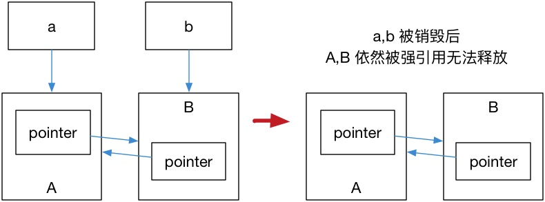
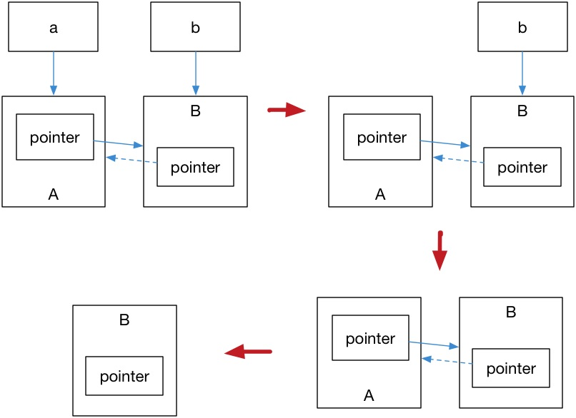

<h1 align="center">目录</h1>

* [1. RAII 与引用计数](#1-raii-与引用计数)
* [2. 智能指针](#2-智能指针)
    * [2.1. std::shared_ptr](#21-stdshared_ptr)
    * [2.2. std::unique_ptr](#22-stdunique_ptr)
    * [2.3. std::weak_ptr](#23-stdweak_ptr)
* [3. enable_shared_from_this](#3-enable_shared_from_this)
* [4. 仿写](#4-仿写)
    * [4.1. 仿 shared_ptr 的实现](#41-仿-shared_ptr-的实现)
    * [4.2. 仿 unique_ptr 的实现](#42-仿-unique_ptr-的实现)
* [5. 创建 make](#5-创建-make)
* [6. 使用](#6-使用)
    * [6.1. 指针作为函数参数时的选择](#61-指针作为函数参数时的选择)
    * [6.2. 当类中出现智能指针成员](#62-当类中出现智能指针成员)
    * [6.3. 使用时与裸指针的区别和相似](#63-使用时与裸指针的区别和相似)
        * [6.3.1. 用法](#631-用法)
        * [6.3.2. 拷贝赋值](#632-拷贝赋值)
* [7. resize 和 release 的区别](#7-resize-和-release-的区别)

---

# 1. RAII 与引用计数
引用计数这种计数是为了防止内存泄露而产生的。基本想法是对于动态分配的对象，进行引用计数，每当增加一次对同一个对象的引用，那么引用对象的引用计数就会增加一次，每删除一次引用，引用计数就会减一，当一个对象的引用计数减为零时，就自动删除指向的堆内存。

在传统 C++ 中，『记得』手动释放资源，总不是最佳实践。因为我们很有可能就忘记了去释放资源而导致泄露。
所以通常的做法是对于一个对象而言，我们在构造函数的时候申请空间，而在析构函数（在离开作用域时调用）的时候释放空间，
也就是我们常说的 **RAII 资源获取即初始化技术**。

凡事都有例外，我们总会有需要将对象在自由存储上分配的需求，在传统 C++ 里我们只好使用 `new` 和 `delete` 去
『记得』对资源进行释放。而 C++11 引入了智能指针的概念，使用了引用计数的想法，让程序员不再需要关心手动释放内存。
这些智能指针就包括 `std::shared_ptr`/`std::unique_ptr`/`std::weak_ptr`，使用它们需要包含头文件 `<memory>`。

> 注意：引用计数不是垃圾回收，引用计数能够尽快收回不再被使用的对象，同时在回收的过程中也不会造成长时间的等待，更能够清晰明确的表明资源的生命周期。

# 2. 智能指针
【备注】实际上是对所有权和生命周期的思考。

## 2.1. std::shared_ptr

`std::shared_ptr` 是一种智能指针，它能够记录多少个 `shared_ptr` 共同指向一个对象，从而消除显式的调用 `delete`，当引用计数变为零的时候就会将对象自动删除。

但还不够，因为使用 `std::shared_ptr` 仍然需要使用 `new` 来调用，这使得代码出现了某种程度上的不对称。`std::make_shared` 就能够用来消除显式的使用 `new`，所以`std::make_shared` 会分配创建传入参数中的对象，并返回这个对象类型的`std::shared_ptr`指针。例如：

```cpp
// 5.1.shared.ptr.cpp

#include <iostream>
#include <memory>
void foo(std::shared_ptr<int> i) {
    (*i)++;
}
int main() {
    // auto pointer = new int(10); // illegal, no direct assignment
    // Constructed a std::shared_ptr
    auto pointer = std::make_shared<int>(10);
    foo(pointer);
    std::cout << *pointer << std::endl; // 11
    // The shared_ptr will be destructed before leaving the scope
    return 0;
}
```

`std::shared_ptr` 可以通过 `get()` 方法来**获取原始指针**，通过 `reset()` 来减少一个引用计数，并通过`use_count()`来查看一个对象的引用计数。例如：

```cpp
auto pointer = std::make_shared<int>(10);
auto pointer2 = pointer; // 引用计数+1
auto pointer3 = pointer; // 引用计数+1
int *p = pointer.get(); // 这样不会增加引用计数
std::cout << "pointer.use_count() = " << pointer.use_count() << std::endl; // 3
std::cout << "pointer2.use_count() = " << pointer2.use_count() << std::endl; // 3
std::cout << "pointer3.use_count() = " << pointer3.use_count() << std::endl; // 3

pointer2.reset();
std::cout << "reset pointer2:" << std::endl;
std::cout << "pointer.use_count() = " << pointer.use_count() << std::endl; // 2
std::cout << "pointer2.use_count() = " << pointer2.use_count() << std::endl; // 0, pointer2 已 reset
std::cout << "pointer3.use_count() = " << pointer3.use_count() << std::endl; // 2
pointer3.reset();
std::cout << "reset pointer3:" << std::endl;
std::cout << "pointer.use_count() = " << pointer.use_count() << std::endl; // 1
std::cout << "pointer2.use_count() = " << pointer2.use_count() << std::endl; // 0
std::cout << "pointer3.use_count() = " << pointer3.use_count() << std::endl; // 0, pointer3 已 reset
```


在使用 `shared_ptr` 之前应该考虑，是否真的需要使用 `shared_ptr`，而非 `unique_ptr`。`shared_ptr` 代表的是共享所有权，即多个 `shared_ptr` 可以共享同一块内存。

`shared_ptr` 内部是利用引用计数来实现内存的自动管理，每当复制一个 `shared_ptr`，引用计数会 +1 。当一个 `shared_ptr` 离开作用域时，引用计数会 -1。当引用计数为 0 的时候，则 `delete` 内存。

从语义上来看，`shared_ptr` 是支持复制的，同时，`shared_ptr` 也支持移动。从语义上来看，移动指的是所有权的传递。

```cpp
// 复制
auto w = std::make_shared<Widget>();
{
    auto w2 = w;
    cout << w.use_count() << endl;  // 2
}
cout << w.use_count() << endl;  // 1

// 移动
auto w = std::make_shared<Widget>();
auto w2 = std::move(w); // 此时w等于nullptr，w2.use_count()等于1
```

【性能】：

* 内存占用高：shared_ptr 的内存占用是裸指针的两倍。因为除了要管理一个裸指针外，还要维护一个引用计数。因此相比于 unique_ptr, shared_ptr 的内存占用更高。
* 原子操作性能低：考虑到线程安全问题，引用计数的增减必须是原子操作。而原子操作一般情况下都比非原子操作慢。
* 使用移动优化性能：shared_ptr 在性能上固然是低于 unique_ptr。而通常情况，我们也可以尽量避免 shared_ptr 复制。如果一个 shared_ptr 需要将所有权共享给另外一个新的 shared_ptr，而我们确定在之后的代码中都不再使用这个 shared_ptr，那么这是一个非常鲜明的移动语义。对于此种场景，我们尽量使用 std::move，将 shared_ptr 转移给新的对象。因为移动不用增加引用计数，因此性能比复制更好。


## 2.2. std::unique_ptr

`std::unique_ptr` 是一种独占的智能指针，它禁止其他智能指针与其共享同一个对象，从而保证代码的安全：

```cpp
std::unique_ptr<int> pointer = std::make_unique<int>(10); // make_unique 从 C++14 引入
std::unique_ptr<int> pointer2 = pointer; // 非法
```

`make_unique` 并不复杂，C++11 没有提供 `std::make_unique`，【[stackoverflow 上关于『C++11为什么没有 make_unique』的讨论](https://stackoverflow.com/questions/12580432/why-does-c11-have-make-shared-but-not-make-unique)】，可以自行实现：

```cpp
template<typename T, typename ...Args>
std::unique_ptr<T> make_unique( Args&& ...args ) {
  return std::unique_ptr<T>( new T( std::forward<Args>(args)... ) );
}
```

至于为什么没有提供，C++ 标准委员会主席 Herb Sutter 在他的[博客](https://herbsutter.com/gotw/_102/)中提到原因是因为『被他们忘记了』。

既然是独占，换句话说就是不可复制。但是，我们可以利用 `std::move` 将其转移给其他的 `unique_ptr`，例如：

```cpp
// 5.2.unique.ptr.cpp

#include <iostream>
#include <memory>

struct Foo {
    Foo() { std::cout << "Foo::Foo" << std::endl; }
    ~Foo() { std::cout << "Foo::~Foo" << std::endl; }
    void foo() { std::cout << "Foo::foo" << std::endl; }
};

void f(const Foo &) {
    std::cout << "f(const Foo&)" << std::endl;
}

int main() {
    std::unique_ptr<Foo> p1(std::make_unique<Foo>());
    // p1 不空, 输出
    if (p1) p1->foo();
    {
        std::unique_ptr<Foo> p2(std::move(p1));
        // p2 不空, 输出
        f(*p2);
        // p2 不空, 输出
        if(p2) p2->foo();
        // p1 为空, 无输出
        if(p1) p1->foo();
        p1 = std::move(p2);
        // p2 为空, 无输出
        if(p2) p2->foo();
        std::cout << "p2 被销毁" << std::endl;
    }
    // p1 不空, 输出
    if (p1) p1->foo();
    // Foo 的实例会在离开作用域时被销毁
}
```

`unique_ptr`：专属所有权，即由 `unique_ptr` 管理的内存，只能被一个对象持有。所以 `unique_ptr` 不支持复制和赋值，只支持移动。如果想要把一个 `unique_ptr` 的内存交给另外一个 `unique_ptr` 对象管理。只能使用 `std::move` 转移当前对象的所有权。转移之后，当前对象不再持有此内存，新的对象将获得专属所有权。

```cpp
auto w = std::make_unique<Widget>();
auto w2 = w; // 编译错误，不能复制
p
auto w = std::make_unique<Widget>();
auto w2 = std::move(w); // w2获得内存所有权，w此时等于nullptr
```

【性能】：因为 C++ 的 zero cost abstraction 的特点，`unique_pt`r 在默认情况下和裸指针的大小是一样的。所以**内存上没有任何的额外消耗，性能是最优的**。

【实例】：异常安全

```cpp
// 创建一个对象，处理一些事情后返回，返回之前将对象销毁
void process()
{
    Widget* w = new Widget();
    w->do_something(); // 可能会发生异常
    delete w;
}
// 如果w->do_something()发生了异常，那么delete w将不会被执行。此时就会发生内存泄漏
// 解决方法：可以使用try…catch捕捉异常，在catch里面执行delete，但是这样代码上并不美观，也容易漏写
// 或用 std::unique_ptr，无论代码怎么抛异常，在unique_ptr离开函数作用域的时候，内存就将会自动释放
```

【使用】：

```cpp
#include <iostream>
#include <memory>

using namespace std;

class CTest {
public:
    CTest(string str) {
        m_str = str;
        cout << "CTest create\n";
    }
    ~CTest() {
        cout << "CTest delete:" << m_str << endl;
    }
    void print() {
        cout << m_str << endl;
    }

private:
    string m_str;
};

unique_ptr<CTest> fun() {
    return unique_ptr<CTest>(new CTest("789"));
}

int main() {
    unique_ptr<CTest> ptest(new CTest("123"));  // CTest create
    unique_ptr<CTest> ptest2(new CTest("456")); // CTest create
    ptest->print();                             // 123
    // 不能直接ptest2 = ptest
    ptest2 = std::move(ptest); // CTest delete:456
    if (ptest == NULL)
        cout << "ptest = NULL\n"; // ptest = NULL
    CTest *p = ptest2.release();
    p->print(); // 123
    ptest.reset(p);
    ptest->print(); // 123

    // 这里可以用=，因为使用了移动构造函数
    ptest2 = fun();  // CTest create
    ptest2->print(); // 789
    // CTest delete:789
    // CTest delete:123
    return 0;
}
```


## 2.3. std::weak_ptr

如果你仔细思考 `std::shared_ptr` 就会发现依然存在着资源无法释放的问题。看下面这个例子：

```cpp
// 5.3.weak.ptr.cpp

struct A;
struct B;

struct A {
    std::shared_ptr<B> pointer;
    ~A() {
        std::cout << "A 被销毁" << std::endl;
    }
};
struct B {
    std::shared_ptr<A> pointer;
    ~B() {
        std::cout << "B 被销毁" << std::endl;
    }
};
int main() {
    auto a = std::make_shared<A>();
    auto b = std::make_shared<B>();
    a->pointer = b;
    b->pointer = a;
}
```

运行结果是 A, B 都不会被销毁，这是因为 a,b 内部的 pointer 同时又引用了 `a,b`，这使得 `a,b` 的引用计数均变为了 2，而离开作用域时，`a,b` 智能指针被析构，却只能造成这块区域的引用计数减一，这样就导致了 `a,b` 对象指向的内存区域引用计数不为零，而外部已经没有办法找到这块区域了，也就造成了内存泄露，如图 5.1：



解决这个问题的办法就是使用弱引用指针 `std::weak_ptr`，`std::weak_ptr`是一种弱引用（相比较而言 `std::shared_ptr` 就是一种强引用）。弱引用不会引起引用计数增加，当换用弱引用时候，最终的释放流程如图 5.2 所示：



在上图中，最后一步只剩下 B，而 B 并没有任何智能指针引用它，因此这块内存资源也会被释放。

`std::weak_ptr` 没有 `*` 运算符和 `->` 运算符，所以不能够对资源进行操作，它可以用于检查 `std::shared_ptr` 是否存在，其 `expired()` 方法能在资源未被释放时，会返回 `false`，否则返回 `true`；除此之外，它也可以用于获取指向原始对象的 `std::shared_ptr` 指针，其 `lock()` 方法在原始对象未被释放时，返回一个指向原始对象的 `std::shared_ptr` 指针，进而访问原始对象的资源，否则返回`nullptr`。


`weak_ptr` 是为了解决 `shared_ptr` 双向引用的问题。

```cpp
// pa和pb存在着循环引用，根据shared_ptr引用计数的原理，pa和pb都无法被正常的释放
class B;
struct A{
    shared_ptr<B> b;
};
struct B{
    shared_ptr<A> a;
};
auto pa = make_shared<A>();
auto pb = make_shared<B>();
pa->b = pb;
pb->a = pa;

// 使用weak_ptr不会增加引用计数，因此可以打破shared_ptr的循环引用
class B;
struct A{
    shared_ptr<B> b;
};
struct B{
    weak_ptr<A> a;
};
auto pa = make_shared<A>();
auto pb = make_shared<B>();
pa->b = pb;
pb->a = pa;
// 通常做法是parent类持有child的shared_ptr, child持有指向parent的weak_ptr。这样也更符合语义
```


# 3. enable_shared_from_this
> [C++智能指针的enable_shared_from_this和shared_from_this机制](https://blog.csdn.net/QIANGWEIYUAN/article/details/88973735)
> [C++11新特性之十：enable_shared_from_this](https://blog.csdn.net/caoshangpa/article/details/79392878)

`enable_shared_from_this` 是一个模板类，定义于头文件 `<memory>`，其原型为：

```cpp
template< class T > class enable_shared_from_this;
```

`std::enable_shared_from_this` 能让一个对象（假设其名为 t ，且已被一个 `std::shared_ptr` 对象 pt 管理）安全地生成其他额外的 `std::shared_ptr` 实例（假设名为 pt1, pt2, ... ） ，它们与 pt 共享对象 t 的所有权。

若一个类 T 继承 `std::enable_shared_from_this<T>` ，则会为该类 T 提供成员函数： `shared_from_this` 。 当 T 类型对象 t 被一个为名为 pt 的 `std::shared_ptr<T>` 类对象管理时，调用 `T::shared_from_this` 成员函数，将会返回一个新的 `std::shared_ptr<T>` 对象，它与 pt 共享 t 的所有权。

**【使用场合】**：

当类 A 被 share_ptr 管理，且在类 A 的成员函数里需要把当前类对象作为参数传给其他函数时，就需要传递一个指向自身的 share_ptr。

**为何会出现这种使用场合**：因为在 **异步调用** 中，存在一个保活机制，异步函数执行的时间点我们是无法确定的，然而异步函数可能会使用到异步调用之前就存在的变量。为了保证该变量在异步函数执期间一直有效，我们可以传递一个指向自身的 `share_ptr` 给异步函数，这样在异步函数执行期间 `share_ptr` 所管理的对象就不会析构，所使用的变量也会一直有效了（保活）。


**【问题】**：

* 为何不直接传递 this 指针

    使用智能指针的初衷就是为了方便资源管理，如果在某些地方使用智能指针，某些地方使用原始指针，很容易破坏智能指针的语义，从而产生各种错误。

	【备注】其实也就是用这种方法代替原本要传出的 this 指针。

* 可以直接传递 `share_ptr<this>` 吗

    答案是不能，因为这样会造成 2 个非共享的 share_ptr 指向同一个对象，未增加引用计数导对象被析构两次。

* 【错误的例子】：

```cpp
#include <iostream>
#include <memory>

class Bad {
public:
    std::shared_ptr<Bad> getptr() {
        return std::shared_ptr<Bad>(this);
    }
    ~Bad() {
        std::cout << "Bad::~Bad() called" << std::endl;
    }
};

int main() {
    {
        // 错误的示例，每个shared_ptr都认为自己是该对象仅有的所有者
        std::shared_ptr<Bad> bp1(new Bad());
        std::shared_ptr<Bad> bp2 = bp1->getptr();
        // 打印bp1和bp2的引用计数
        std::cout << "bp1.use_count() = " << bp1.use_count() << std::endl;
        std::cout << "bp2.use_count() = " << bp2.use_count() << std::endl;
    } // 在生命周期结束的此处， Bad 对象将会被删除两次
    return 0;
}

//   bp1.use_count() = 1
//   bp2.use_count() = 1
//   Bad::~Bad() called
//   Bad::~Bad() called
//   程序奔溃

```

* 【正确的实现】：

```cpp
#include <iostream>
#include <memory>

struct Good : std::enable_shared_from_this<Good> // 注意：继承
{
public:
    std::shared_ptr<Good> getptr() {
        return shared_from_this();
    }
    ~Good() {
        std::cout << "Good::~Good() called" << std::endl;
    }
};

int main() {
    {
        std::shared_ptr<Good> gp1(new Good());
        std::shared_ptr<Good> gp2 = gp1->getptr();
        // 打印gp1和gp2的引用计数
        std::cout << "gp1.use_count() = " << gp1.use_count() << std::endl;
        std::cout << "gp2.use_count() = " << gp2.use_count() << std::endl;
    }

    return 0;
}

// gp1.use_count() = 2
// gp1.use_count() = 2
// Good::~Good() called
// Good::~Good() called
```

【再一个例子】：

```cpp
#include <iostream>
#include <memory>

using namespace std;

class A {
public:
    A()
        : m_pt(new int(0)) {
        std::cout << "A()" << std::endl;
    }
    ~A() {
        std::cout << "~A()" << std::endl;
        delete m_pt;
        m_pt = nullptr;
    }

    // A类提供了一个成员方法，返回指向自身对象的shared_ptr智能指针。
    shared_ptr<A> getSharedPtr() {
        /* 注意：不能直接返回this，在多线程环境下，根本无法获知this指针指向
        的对象的生存状态，通过shared_ptr和weak_ptr可以解决多线程访问共享
        对象的线程安全问题 */
        return shared_ptr<A>(this);
    }

private:
    int *m_pt;
};

int main() {
    {
        shared_ptr<A> ptr1(new A());
        shared_ptr<A> ptr2 = ptr1->getSharedPtr();

        /* 按原先的想法，上面两个智能指针管理的是同一个A对象资源，但是这里打印都是1
        导致出main函数A对象析构两次，析构逻辑有问题*/
        cout << ptr1.use_count() << endl;
        cout << ptr2.use_count() << endl;
    }

    return 0;
}

/*
    A()
    1
    1
    ~A()
    ~A()
    程序奔溃
*/
```

改进：

```cpp
#include <iostream>
#include <memory>

using namespace std;

class A : public enable_shared_from_this<A> {
public:
    A()
        : m_pt(new int(0)) {
        std::cout << "A()" << std::endl;
    }
    ~A() {
        std::cout << "~A()" << std::endl;
        delete m_pt;
        m_pt = nullptr;
    }

    // A类提供了一个成员方法，返回指向自身对象的shared_ptr智能指针。
    shared_ptr<A> getSharedPtr() {
        /*通过调用基类的shared_from_this方法得到一个指向当前对象的
        智能指针*/
        return shared_from_this();
    }

private:
    int *m_pt;
};

int main() {
    {
        shared_ptr<A> ptr1(new A());
        shared_ptr<A> ptr2 = ptr1->getSharedPtr();

        /* 按原先的想法，上面两个智能指针管理的是同一个A对象资源，但是这里打印都是1
        导致出main函数A对象析构两次，析构逻辑有问题*/
        cout << ptr1.use_count() << endl;
        cout << ptr2.use_count() << endl;
    }

    return 0;
}
// A()
// 2
// 2
// ~A()
```


# 4. 仿写
## 4.1. 仿 shared_ptr 的实现

```cpp
#include <iostream>
#include <memory>

template <typename T> 
class my_shared_ptr {
private:
    T      *m_ptr;
    size_t *m_count;

public:
    // 构造函数
    my_shared_ptr(T *ptr = nullptr)
        : m_ptr(ptr) {
        if (m_ptr)
            m_count = new size_t(1);
        else
            m_count = new size_t(0);
    }
    // 拷贝构造
    my_shared_ptr(const my_shared_ptr &other) {
        if (this != &other) {
            this->m_ptr = other.m_ptr;
            // 所以实际上是共用了一个m_count，是同一个内存
            this->m_count = other.m_count;
            (*this->m_count)++;
        }
    }
    // 拷贝赋值
    my_shared_ptr &operator=(const my_shared_ptr &other) {
        if (this->m_ptr == other.m_ptr)
            return *this;

        if (this->m_ptr) {
            (*this->m_count)--;
            if (this->m_count == 0) {
                delete this->m_ptr;
                delete this->m_count;
            }
        }

        this->m_ptr   = other.m_ptr;
        this->m_count = other.m_count;
        (*this->m_count)++;

        return *this;
    }
    // 析构函数
    ~my_shared_ptr() {
        (*this->m_count)--;

        if (*this->m_count == 0) {
            delete this->m_ptr;
            delete this->m_count;
        }
    }

    // * 取值
    T &operator*() {
        assert(this->m_ptr == nullptr);
        return *(this->m_ptr);
    }
    // -> 访问
    T *operator->() {
        assert(this->m_ptr == nullptr);
        return this->m_ptr;
    }
    // 内部计数
    size_t use_count() const {
        return *this->m_count;
    }
};

int main() {
    {
        my_shared_ptr<int> sp1(new int(10));
        my_shared_ptr<int> sp2(sp1);
        my_shared_ptr<int> sp3(new int(20));
        sp2 = sp3;
        std::cout << sp1.use_count() << std::endl; // 1
        std::cout << sp3.use_count() << std::endl; // 2
    }
    {
        std::shared_ptr<int> sp1(new int(10));
        std::shared_ptr<int> sp2(sp1);
        std::shared_ptr<int> sp3(new int(20));
        sp2 = sp3;
        std::cout << sp1.use_count() << std::endl; // 1
        std::cout << sp3.use_count() << std::endl; // 2
    }

    return 0;
}
```

## 4.2. 仿 unique_ptr 的实现

```cpp
#include <cassert>
#include <iostream>

template <typename T> 
class my_unique_ptr {
private:
    T *m_ptr;

    void del() {
        if (*this) {
            if (m_ptr) {
                delete m_ptr;
            }
            m_ptr = nullptr;
        }
    }

public:
    // 构造函数
    my_unique_ptr(T *ptr = nullptr)
        : m_ptr(ptr) {
    }
    // 析构函数
    ~my_unique_ptr() {
        del();
    }
    // 禁用拷贝构造和拷贝赋值
    my_unique_ptr(const my_unique_ptr &) = delete;
    my_unique_ptr &operator=(const my_unique_ptr &) = delete;
    // 重置指针
    void reset(T *p) {
        del();
        m_ptr = p;
    }
    // 返还原始指针
    T *release() {
        T *p  = m_ptr;
        m_ptr = nullptr;
        return p;
    }
    // 操作原始指针
    T *get() const {
        return m_ptr;
    }
    // 重载 () 以判断当前指针是否仍存在
    operator bool() const {
        return nullptr != m_ptr;
    }
    // * 取值
    T &operator*() {
        assert(*this);
        return *m_ptr;
    }
    // -> 访问
    T *operator->() {
        return m_ptr;
    }
};

struct CTest {
    int val;
    CTest() {
        std::cout << "new object this =" << this << std::endl;
    }
    ~CTest() {
        std::cout << "delete object this =" << this << std::endl;
    }
};

int main() {
    my_unique_ptr<CTest> uptr(new CTest);
    assert(uptr);
    uptr->val = 100;
    std::cout << "val = " << (*uptr).val << std::endl;

    CTest *p = uptr.release();
    std::cout << "p =" << p << std::endl;
    if (p) {
        delete p;
        p = nullptr;
    }

    return 0;
}
// new object this =0x55703df8ceb0
// val = 100
// p =0x55703df8ceb0
// delete object this =0x55703df8ceb0
```


# 5. 创建 make
`make` 函数是：把任意集合的参数完美转发给动态分配对象的构造函数，然后返回一个指向那对象的智能指针。

* **比起直接使用 `new`，更偏爱使用 `std::make_unique` 和 `std::make_shared`**。

1. 使用 `new` 的版本重复着需要创建的类型（即出现了两次 T，分配了 2 次内存），而使用 `make` 函数不需要

	```cpp
	std::unique_ptr<T> up1(std::make_unique<T>());
	std::unique_ptr<T> up2(new T());

	std::shared_ptr<T> sp2(new T());
	std::shared_ptr<T> sp1(std::make_shared<T>());
	```

2. 使用 `make` 函数的第二个原因异常安全

	```cpp
	void processWidget(std::shared_ptr<T> spw, int priority);
	int computePriority();
	
	// 可能会资源泄漏
	processWidget(std::shared_ptr<T>(new T),
				computePriority());

	// 安全
	processWidget(std::make_shared<T>(),
				computePriority());
	```


【备注】使用 `vector` 修饰 `std::unique_ptr` 时，只能使用 `std::make_unique`，不要使用 `std::unique_ptr<Camera>(new Hik)`，这样已经就是复制了，而 `unique_ptr` 是不允许复制的。


* `std::make_unique` C++14 才有，C++11 的实现版本：

```cpp
template<typename T, typename... Ts>
std::unique_ptr<T> make_unique(Ts&&... params)
{
    return std::unique_ptr<T>(new T(std::forward<Ts>(params)...));
}
```

`make_unique` 只是把参数完美转发给要创建对象的构造函数，再从 `new` 出来的原生指针构造 `std::unique_ptr`，最后返回创建的 `std::unique_ptr`。这种形式的函数不支持数组和自定义删除器，但它说明了只要一点点工作，你就可以创造你需要的 `make_unique` 了。【记住不要把你自己的版本放入命名空间 `std`】，因为当你提升到 C++14 标准库实现的时候，你不会想要它和标准库的版本冲突。


# 6. 使用
## 6.1. 指针作为函数参数时的选择
* 只在函数使用指针，但并不保存

	假如我们只需要在函数中，用这个对象处理一些事情，但不打算涉及其生命周期的管理，不打算通过函数传参延长 `shared_ptr` 的生命周期。对于这种情况，可以使用 `raw pointer` 或者 `const shared_ptr&`。

```cpp
void func(Widget*);
void func(const shared_ptr<Widget>&)
```

* 在函数中保存智能指针

	假如我们需要在函数中把这个智能指针保存起来，这个时候建议直接传值，这样的话，外部传过来值的时候，可以选择 move 或者赋值。函数内部直接把这个对象通过 move 的方式保存起来。

```cpp
void func(std::shared_ptr<Widget> ptr);
```


## 6.2. 当类中出现智能指针成员
* 当类中出现 `unique_ptr` 变量时，整个类就不允许拷贝和赋值了，因此可通过显示禁用拷贝构造和拷贝赋值。

```cpp
// 拷贝构造函数
Person(const Person& p) = delete;
//拷贝赋值函数
Person& operator=(const Person& p) = delete;
```

* `sharded_ptr` 的值被多个类实例共享了，所以一旦通过**默认**拷贝构造和**默认**拷贝赋值把指针传递出去（TODO: 看看移动构造和移动赋值会不会，同时思考是否可用过禁用默认拷贝构造和默认移动构造来达到跟 `unique_ptr` 一样的效果？），原类中的指针所指向的对象也会发生变化。会出现非本类就能修改类中变量。一不小心就会造成数据被拷贝构造和拷贝赋值的对象更改而传递回来，稳妥点还是使用 `unique_ptr`。

```cpp
#include <iostream>
#include <memory>

class Rect {
public:
    Rect() {
        m_point = std::shared_ptr<int>(new int(100));
    }

    void Print() {
        std::cout << "p：" << *m_point << std::endl;
        (*m_point)--;
    }

private:
    std::shared_ptr<int> m_point;
};

int main() {
    {
        Rect rect1;
        rect1.Print();     // p：100
        Rect rect2(rect1); // 默认拷贝构造
        rect2.Print();     // p：99
        Rect rect3;
        rect3 = rect2; // 默认拷贝赋值
        rect3.Print(); // p：98
        rect1.Print(); // p：97
    }
    return 0;
}
```

## 6.3. 使用时与裸指针的区别和相似
### 6.3.1. 用法
```cpp
#include <iostream>
#include <memory>

int main() {
    std::shared_ptr<int> sp;
    sp = std::shared_ptr<int>(new int(4));

    std::cout << *sp << std::endl;      // 取值 *ptr
    std::cout << sp.get() << std::endl; // 取地址 ptr
    std::cout << sp << std::endl;       // 取地址 ptr
    *sp = 44;                           // 修改值
    std::cout << *sp << std::endl;

    // 错误的方法
    // std::unique_ptr<int> up;
    // up = std::unique_ptr<int>(new int(5)); // 拷贝构造

    std::unique_ptr<int> up(std::unique_ptr<int>(new int(5))); // 赋值构造

    std::cout << *up << std::endl;      // 取值 *ptr
    std::cout << up.get() << std::endl; // 取地址 ptr
    // std::cout << up << std::endl;	// 取地址 ptr -> 不可
    *up = 55; // 修改值
    std::cout << *up << std::endl;

    return 0;
}
```

### 6.3.2. 拷贝赋值

```cpp
#include <iostream>
#include <memory>

using namespace std;

class A {
public:
    A()
        : mptr(new int(0)) {
        std::cout << "A()" << std::endl;
    }
    ~A() {
        std::cout << "~A()" << std::endl;
        delete mptr;
        mptr = nullptr;
    }

private:
    int *mptr;
};

int main() {
    {
        //	A *p = new A(); // 裸指针指向堆上的对象

        //	shared_ptr<A> ptr1(p);// 用shared_ptr智能指针管理指针p指向的对象
        //	shared_ptr<A> ptr2(p);// 用shared_ptr智能指针管理指针p指向的对象
        //	// 下面两次打印都是1，因此同一个new A()被析构两次，逻辑错误
        //	cout << ptr1.use_count() << endl;
        //	cout << ptr2.use_count() << endl;

        //	A()
        //	1
        //	1
        //	~A()
        //	~A()
    } 
	// 改进
    {
        A *p = new A();

        shared_ptr<A> ptr1(p);
        shared_ptr<A> ptr2(ptr1); // 用ptr1拷贝构造ptr2
        // 下面两次打印都是2，最终随着ptr1和ptr2析构，资源只释放一次，正确！
        cout << ptr1.use_count() << endl;
        cout << ptr2.use_count() << endl;

        // A()
        // 2
        // 2
        // ~A()
    }

    return 0;
}
```


# 7. resize 和 release 的区别
* `resize`：重置智能指针对象，先析构旧的智能指针对象，再创建新的智能指针对象。而直接使用 `nullptr` 直接析构旧的智能指针对象。

* `release`：释放 `unique_ptr` 的所有权，**退化成普通指针**，之后再使用 `get()` 就返回 `nullptr`，同时移交给一般指针后，相当于该指针已经 `new` 了，后面需要手动进行 `delete`。（`shared_ptr` 没有该成员函数）

* 可直接使用 `if` 判断智能指针是否存在。


【实例】：`resize` 的使用：智能指针的提前结束，重新构建

```cpp
#include <iostream>
#include <memory>

struct Foo {
    Foo(int n = 0) noexcept
        : bar(n) {
        std::cout << "Foo: 构造, bar = " << bar << '\n';
    }
    ~Foo() {
        std::cout << "Foo: 析构, bar = " << bar << '\n';
    }
    int getBar() const noexcept {
        return bar;
    }

private:
    int bar;
};

int main() {
    std::shared_ptr<Foo> sptr = std::make_shared<Foo>(1);
    std::cout << "第 1 个 bar 值：" << sptr->getBar() << "\n";
    // 重置 shared_ptr，给它一个新的 Foo 实例
    // 调用的时候：先构建新的实例，再对旧的实例进行销毁
    sptr.reset(new Foo(2));
    std::cout << "第 2 个 bar 值：" << sptr->getBar() << "\n";
    return 0;
}
/*
    Foo: 构造, bar = 1
    第 1 个 bar 值：1
    Foo: 构造, bar = 2
    Foo: 析构, bar = 1
    第 2 个 bar 值：2
    Foo: 析构, bar = 2
*/
```

【实例】：`resize` 和 `release` 的区别

```cpp
#include <iostream>
#include <memory>

class Foo {
public:
    Foo(int num)
        : m_num(num) {
        std::cout << "构造 Foo：" << m_num << std::endl;
    }
    ~Foo() {
        std::cout << "析构 Foo：" << m_num << std::endl;
    }

private:
    int m_num;
};

int main() {
    // reset
    {
        std::cout << "*****  reset  *****" << std::endl;
        std::unique_ptr<Foo> smartPt(new Foo(1));
        std::cout << "替代" << std::endl;
        // 先构建新的智能指针对象 再析构旧的指针对象
        smartPt.reset(new Foo(2));
        std::cout << "替代和删除" << std::endl;
        // 删除智能指针对象
        smartPt.reset(nullptr);

        if (!smartPt) {
            std::cout << "智能指针不存在\n";
        }
        if (!smartPt.get()) {
            std::cout << "智能指针不存在\n";
        }
        // 执行 2 次而不会报错
        smartPt.reset(nullptr);
    }
    // release
    {
        std::cout << "*****  release  *****" << std::endl;
        std::unique_ptr<Foo> smartPt(new Foo(3));

        Foo *fp = smartPt.release();

        if (smartPt.get() == nullptr) {
            std::cout << "unique_ptr == nullptr" << std::endl;
        }

        delete fp;
    }

    return 0;
}
/*
    *****  reset  *****
    构造 Foo：1
    替代
    构造 Foo：2
    析构 Foo：1
    替代和删除
    析构 Foo：2
    智能指针不存在
    智能指针不存在
    *****  release  *****
    构造 Foo：3
    unique_ptr == nullptr
    析构 Foo：3
    *****  reset  *****
*/
```
