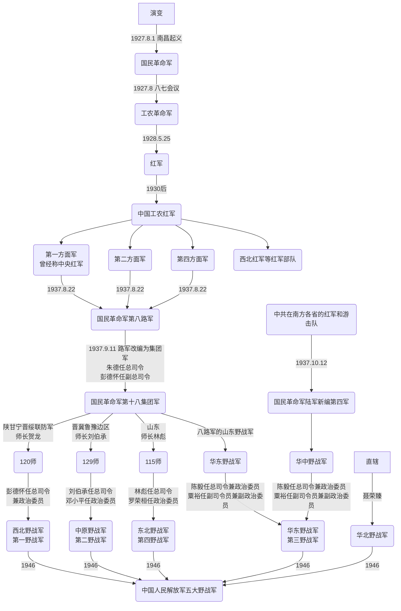

```mermaid
flowchart TB
	演变 -- 1927.8.1 南昌起义 --> 1(国民革命军)
	1 -- 1927.8 八七会议 --> 2(工农革命军)
	2 -- 1928.5.25 --> 3(红军)
	3 -- 1930后 --> 4(中国工农红军)
	4 --> 5.1(第一方面军\n曾经称中央红军)
	4 --> 5.2(第二方面军)
	4 --> 5.3(第四方面军)
	4 --> 5.4(西北红军等红军部队)
	5.1 & 5.2 & 5.3 -- 1937.8.22  --> 6(国民革命军第八路军)
	6 -- 1937.9.11 路军改编为集团军\n朱德任总司令\n彭德怀任副总司令 --> 7(国民革命军第十八集团军)
	7 -- 陕甘宁晋绥联防军\n师长贺龙--> 7.1(120师) 
		7.1 -- 彭德怀任总司令\n兼政治委员 --> 7.1.1(西北野战军\n第一野战军)
	7 -- 晋冀鲁豫边区\n师长刘伯承--> 7.2(129师)
		7.2 -- 刘伯承任总司令\n邓小平任政治委员 --> 7.2.1(中原野战军\n第二野战军)
	7 -- 山东\n师长林彪--> 7.3(115师)
		7.3 -- 林彪任总司令\n罗荣桓任政治委员 --> 7.3.1(东北野战军\n第四野战军)
	7 -- 八路军的山东野战军 --> 7.4.1(华东野战军)
	8(中共在南方各省的红军和游击队) -- 1937.10.12 --> 9(国民革命军陆军新编第四军)
	9 --> 10(华中野战军) 
	10 & 7.4.1 -- 陈毅任总司令兼政治委员\n粟裕任副司令员兼副政治委员 --> 7.5.1(华东野战军\n第三野战军)
	直辖 -- 聂荣臻 --> 7.6.1(华北野战军)
	7.1.1 & 7.2.1 & 7.3.1 & 7.5.1 & 7.6.1  -- 1946 --> 11(中国人民解放军五大野战军)
```
