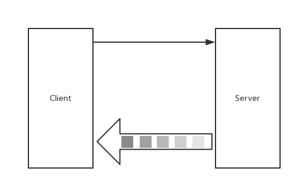
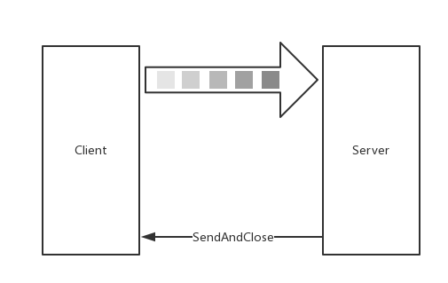

<h1 align="center">目录</h1>

* [1. 四种调用方式及应用场景](#1-四种调用方式及应用场景)
* [2. 一元RPC](#2-一元rpc)
* [3. 流式RPC](#3-流式rpc)
	* [3.1. 服务端流式RPC](#31-服务端流式rpc)
	* [3.2. 客户端流式RPC](#32-客户端流式rpc)
	* [3.3. 双向流式 RPC](#33-双向流式-rpc)
* [4. Client与Server是如何交互的](#4-client与server是如何交互的)
* [5. 代码示例](#5-代码示例)

---

# 1. 四种调用方式及应用场景

在 gRPC 中，一共包含四种调用方式，分别是：

1. Unary RPC：一元 RPC
2. Server-side streaming RPC：服务端流式 RPC
3. Client-side streaming RPC：客户端流式 RPC
4. Bidirectional streaming RPC：双向流式 RPC

不同的调用方式往往代表着不同的应用场景。

【使用场景区别】：

* 为什么不用 Unary RPC，在使用 Unary RPC 时，有如下问题：

	* 在一些业务场景下，数据包过大，可能会造成瞬时压力
	* 接收数据包时，需要所有数据包都接受成功且正确后，才能够回调响应，进行业务处理（无法客户端边发送，服务端边处理）

* 为什么用 Streaming RPC
	
	* 持续且大数据包场景
	* 实时交互场景


* gRPC 在建立连接之前，客户端/服务端都会发送连接前言（Magic+SETTINGS），确立协议和配置项
* gRPC 在传输数据时，是会涉及滑动窗口（WINDOW_UPDATE）等流控策略的
* 传播 gRPC 附加信息时，是基于 HEADERS 帧进行传播和设置；而具体的请求/响应数据是存储的 DATA 帧中的
* gRPC 请求/响应结果会分为 HTTP 和 gRPC 状态响应（grpc-status、grpc-message）两种类型
* 客户端发起 PING，服务端就会回应 PONG，反之亦可


# 2. 一元RPC
一元 RPC，也就是是单次 RPC 调用，简单来讲就是客户端发起一次普通的 RPC 请求，响应，是最基础的调用类型，也是最常用的方式，大致如图：


* proto

```protobuf
service Greeter {
    rpc SayHello (HelloRequest) returns (HelloReply) {}
}
```

* server

```go
func main() {
	// 创建 gRPC Server 对象，可以理解为它是 Server 端的抽象对象
	server := grpc.NewServer()
	// 将 GreeterServer（其包含需要被调用的服务端接口）注册到 gRPC Server 的内部注册中心
	// 这样可以在接受到请求时，通过内部的 “服务发现”，发现该服务端接口并转接进行逻辑处理
	pb.RegisterGreeterServer(server, &GreeterServer{})
	// 创建 Listen，监听 TCP 端口
	lis, _ := net.Listen("tcp", ":"+port)
	// gRPC Server 开始 lis.Accept，直到 Stop 或 GracefulStop
	server.Serve(lis)
}
```

* client

```go
func main() {
	// 创建与给定目标（服务端）的连接句柄
	conn, _ := grpc.Dial(":"+port, grpc.WithInsecure())
	defer conn.Close()

	// 创建 Greeter 的客户端对象
	client := pb.NewGreeterClient(conn)
	// 发送 RPC 请求，等待同步响应，得到回调后返回响应结果
	_ = SayHello(client)
}

func SayHello(client pb.GreeterClient) error {
	resp, _ := client.SayHello(context.Background(), &pb.HelloRequest{Name: "okito"})
	log.Printf("client.SayHello resp: %s", resp.Message)
	return nil
}
```

* **代码运行**

```bash
# 编译
$ make unary
# 服务端端
$ ./cmd/unary_server 8800
# 客户端
$ ./cmd/unary_client 8800
2021/05/10 19:11:54 client.SayHello resp: 你好，我是服务端
```


# 3. 流式RPC
## 3.1. 服务端流式RPC
服务器端流式 RPC，也就是是单向流，并代指 Server 为 Stream，Client 为普通的一元 RPC 请求。

简单来讲就是客户端发起一次普通的 RPC 请求，服务端通过流式响应多次发送数据集，客户端 Recv 接收数据集。大致如图：



* proto

    在 `Reply` 前加 `stream` 标识

```protobuf
service Greeter {
    rpc SayList (HelloRequest) returns (stream HelloReply) {}
}
```

* server

    在 Server 端，主要留意 `stream.Send` 方法。

    通过阅读源码，可得知是 protoc 在生成时，根据定义生成了各式各样符合标准的接口方法。最终再统一调度内部的 SendMsg 方法，该方法涉及以下过程:

    * 消息体（对象）序列化。
    * 压缩序列化后的消息体。
    * 对正在传输的消息体增加 5 个字节的 header（标志位）。
    * 判断压缩 + 序列化后的消息体总字节长度是否大于预设的 maxSendMessageSize（预设值为 math.MaxInt32），若超出则提示错误。
    * 写入给流的数据集。

```go
func (s *GreeterServer) SayList(r *pb.HelloRequest, stream pb.Greeter_SayListServer) error {
    for n := 0; n <= 6; n++ {
        _ = stream.Send(&pb.HelloReply{Message: "hello.list"})
    }

    return nil
}
```

* client

    `stream.Recv` 方法，是对 `ClientStream.RecvMsg` 方法的封装，而 `RecvMsg` 方法会从流中读取完整的 gRPC 消息体。可得知：

    * `RecvMsg` 是阻塞等待的
    * `RecvMsg` 当流成功/结束（调用了 `Close`）时，会返回 `io.EOF`
    * `RecvMsg` 当流出现任何错误时，流会被中止，错误信息会包含 RPC 错误码。而在 `RecvMsg` 中可能出现如下错误，例如：
        * `io.EOF`、`io.ErrUnexpectedEOF`
        * `transport.ConnectionError`
        * `google.golang.org/grpc/codes`（gRPC 的预定义错误码）

    需要注意的是，默认的 `MaxReceiveMessageSize` 值为 `1024 *1024* 4`，若有特别需求，可以适当调整。

```go
func SayList(client pb.GreeterClient, r *pb.HelloRequest) error {
    stream, _ := client.SayList(context.Background(), r)
    for {
        resp, err := stream.Recv()
        if err == io.EOF {
            break
        }
        if err != nil {
            return err
        }

        log.Printf("resp: %v", resp)
    }

    return nil
}
```


```
$ make serverside
$ ./cmd/serverside_server 8800 
$ ./cmd/serverside_client 8800
2021/05/10 19:37:04 resp: message:"hello.list" 
2021/05/10 19:37:04 resp: message:"hello.list" 
2021/05/10 19:37:04 resp: message:"hello.list" 
2021/05/10 19:37:04 resp: message:"hello.list" 
2021/05/10 19:37:04 resp: message:"hello.list" 
2021/05/10 19:37:04 resp: message:"hello.list" 
2021/05/10 19:37:04 resp: message:"hello.list"
```

## 3.2. 客户端流式RPC
客户端流式 RPC，单向流，客户端通过流式发起多次 RPC 请求给服务端，服务端发起一次响应给客户端，大致如图：



* proto

```protobuf
service Greeter {
    rpc SayRecord(stream HelloRequest) returns (HelloReply) {}
}
```

* server

    对每一个 Recv 都进行了处理，当发现 `io.EOF` (流关闭) 后，需要通过 `stream.SendAndClose` 方法将最终的响应结果发送给客户端，同时关闭正在另外一侧等待的 Recv。

```go
func (s *GreeterServer) SayRecord(stream pb.Greeter_SayRecordServer) error {
    for {
        resp, err := stream.Recv()
        if err == io.EOF {
            return stream.SendAndClose(&pb.HelloReply{Message:"say.record"})
        }
        if err != nil {
            return err
        }

        log.Printf("resp: %v", resp)
    }

    return nil
}
```

* client

    在 Server 端的 `stream.CloseAndRecv` 与 Client 端 `stream.SendAndClose` 是配套使用的方法。

```go
func SayRecord(client pb.GreeterClient, r *pb.HelloRequest) error {
    stream, _ := client.SayRecord(context.Background())
    for n := 0; n < 6; n++ {
        _ = stream.Send(r)
    }
    resp, _ := stream.CloseAndRecv()
    
    log.Printf("resp err: %v", resp)
    return nil
}
```

* 编译运行

```
$ make clientside
$ ./cmd/clientside_server 8800
2021/05/10 19:59:15 resp: name:"\346\210\221\346\230\257okito" 
2021/05/10 19:59:15 resp: name:"\346\210\221\346\230\257okito" 
2021/05/10 19:59:15 resp: name:"\346\210\221\346\230\257okito" 
2021/05/10 19:59:15 resp: name:"\346\210\221\346\230\257okito" 
2021/05/10 19:59:15 resp: name:"\346\210\221\346\230\257okito" 
2021/05/10 19:59:15 resp: name:"\346\210\221\346\230\257okito" 
```

```
$ ./cmd/clientside_client 8800
2021/05/10 19:59:15 resp err: message:"say.record"
```

## 3.3. 双向流式 RPC
双向流式 RPC，顾名思义是双向流，由客户端以流式的方式发起请求，服务端同样以流式的方式响应请求。

首个请求一定是 Client 发起，但具体交互方式（谁先谁后、一次发多少、响应多少、什么时候关闭）根据程序编写的方式来确定（可以结合协程）。

假设该双向流是**按顺序发送**的话，大致如图：


* proto

```protobuf
service Greeter {
    rpc SayRoute(stream HelloRequest) returns (stream HelloReply) {}
}
```

* server

```go
func (s *GreeterServer) SayRoute(stream pb.Greeter_SayRouteServer) error {
    n := 0
    for {
        _ = stream.Send(&pb.HelloReply{Message: "say.route"})
        
        resp, err := stream.Recv()
        if err == io.EOF {
            return nil
        }
        if err != nil {
            return err
        }

        n++
        log.Printf("resp: %v", resp)
    }
}
```

* client

```go
func SayRoute(client pb.GreeterClient, r *pb.HelloRequest) error {
    stream, _ := client.SayRoute(context.Background())
    for n := 0; n <= 6; n++ {
        _ = stream.Send(r)
        resp, err := stream.Recv()
        if err == io.EOF {
            break
        }
        if err != nil {
            return err
        }

        log.Printf("resp err: %v", resp)
    }

    _ = stream.CloseSend()
    
    return nil
}
```

* 编译运行

```
$ make bidirectional
$ ./cmd/bidirectional_server 8800
2021/05/10 20:16:45 resp: name:"\346\210\221\346\230\257okito" 
2021/05/10 20:16:45 resp: name:"\346\210\221\346\230\257okito" 
2021/05/10 20:16:45 resp: name:"\346\210\221\346\230\257okito" 
2021/05/10 20:16:45 resp: name:"\346\210\221\346\230\257okito" 
2021/05/10 20:16:45 resp: name:"\346\210\221\346\230\257okito" 
2021/05/10 20:16:45 resp: name:"\346\210\221\346\230\257okito" 
2021/05/10 20:16:45 resp: name:"\346\210\221\346\230\257okito"  
```

```
$ ./cmd/bidirectional_client 8800
2021/05/10 20:16:45 resp err: message:"say.route" 
2021/05/10 20:16:45 resp err: message:"say.route" 
2021/05/10 20:16:45 resp err: message:"say.route" 
2021/05/10 20:16:45 resp err: message:"say.route" 
2021/05/10 20:16:45 resp err: message:"say.route" 
2021/05/10 20:16:45 resp err: message:"say.route" 
2021/05/10 20:16:45 resp err: message:"say.route"
```


# 4. Client与Server是如何交互的
* [ ] [3.3 gRPC 的使用和了解](https://golang2.eddycjy.com/posts/ch3/03-simple-grpc/)


# 5. 代码示例
path : codes/4种调节模式