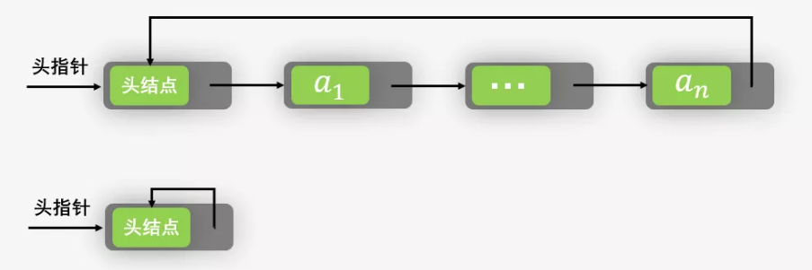

<h1 align="center">目录</h1>

* [1. 定义](#1-定义)
* [2. C++实现](#2-c实现)
* [3. 参考资料](#3-参考资料)

---

# 1. 定义
* 对于单链表，由于每个结点只存储了向后的指针，到了尾部标识就停止了向后链的操作。也就是说，按照这样的方式，只能索引后继结点不能索引前驱结点。这样一来，不从头结点出发，这样就无法访问到全部结点。
* 将单链表中尾结点的指针由空指针改为指向头结点，就使整个单链表形成一个环，这种头尾相接的单链表成为单循环链表，简称循环链表。**注**：这里并不是说循环链表一定有头结点。
* 循环链表的单链表的主要差异就在于<b>循环的判断空链表的条件上</b>，原来判断 `head->next` 是否为空，现在则是 <b>`head->next` 是否等于 `head`</b>。
* 终端结点用尾指针 `rear` 指示，则查找终端结点是 O(1)，而开始结点是 `rear->next->next`，当然也是 O(1)。
* `last->link=first`，这是循环链表的关键




# 2. C++实现
❓ 目前的插入顺序好像是有些问题的

```cpp
#ifndef _CYCLE_LIST_H_
#define _CYCLE_LIST_H_

#include <iostream>

class List {
private:
    struct ListNode {
        int       data;
        ListNode *next;
        ListNode(int n)
            : data(n)
            , next(nullptr) {
        }
    };

    ListNode *head;

public:
    // 一个空的链表，只有一个表头
    List()
        : head(nullptr) {
    }
    ~List() {
        clear();
    }

    void insert(int k) {
        if (head == nullptr) {
            head       = new ListNode(k);
            head->next = head;
            return;
        }

        ListNode *node = new ListNode(k);
        node->next     = head->next; // 形成闭环
        head->next     = node;
    }

    void erase(int k) {
        ListNode *prev = head; //前一个的指针
        ListNode *cur  = head->next;
        // 查找 k 值，cur 指向 k 值所在节点
        // prev 指向 cur 的前一个节点
        while ((cur != head) && cur->data != k) {
            prev = cur;
            cur  = cur->next;
        }

        if (cur != head) {
            prev->next = cur->next;
            delete cur;
        }
    }

    void print() {
        ListNode *p = head;
        for (; p->next != head; p = p->next)
            std::cout << p->data << " ";
        std::cout << p->data << " "; // 打印最后一个数
    }

private:
    void clear() {
        ListNode *p = head->next;
        while (p && p->next && p->next != head) {
            ListNode *q = p->next;
            delete p;
            p = q;
        }
        // 删除最后一个
        delete p;
        // 最后删除头节点
        delete head;
    }
};

#endif // _CYCLE_LIST_H_
```

```cpp
#include "include/clist.hpp"
#include <iostream>

int main() {
    List intList;

    intList.insert(5);
    intList.insert(15);
    intList.insert(25);
    intList.insert(35);

    intList.print();
    std::cout << std::endl;
    // 5 35 25 15

    intList.erase(25);
    intList.print();
    std::cout << std::endl;
    // 5 35 15

    return 0;
}
```

# 3. 参考资料
* [图解：链式存储结构之循环链表（修订版）](https://www.cxyxiaowu.com/9515.html)
