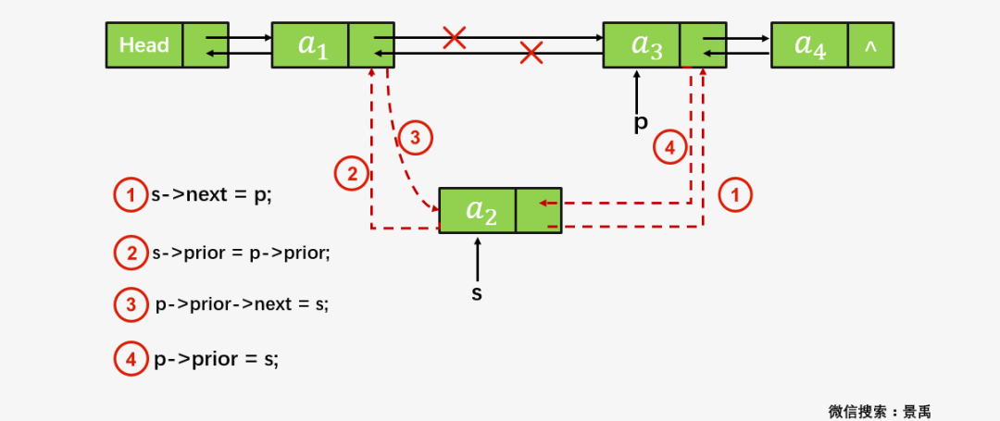
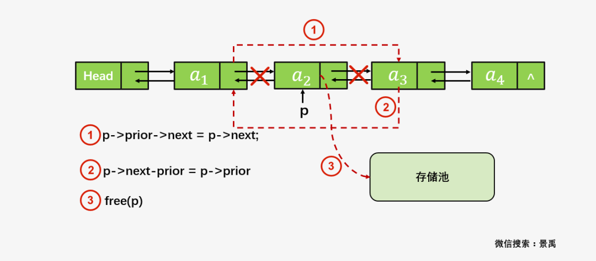
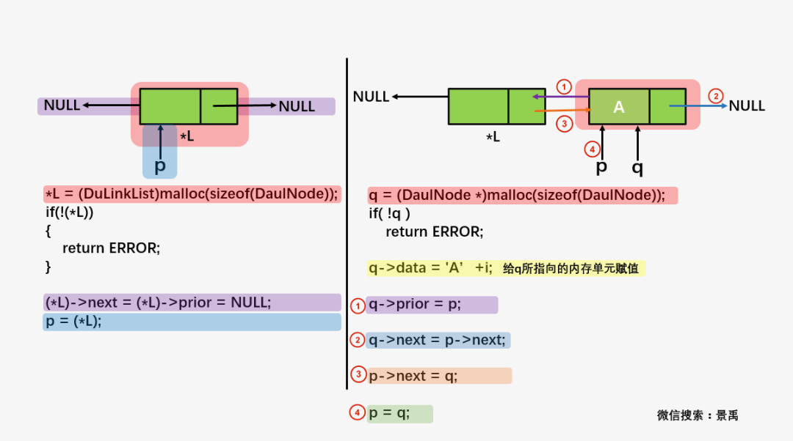
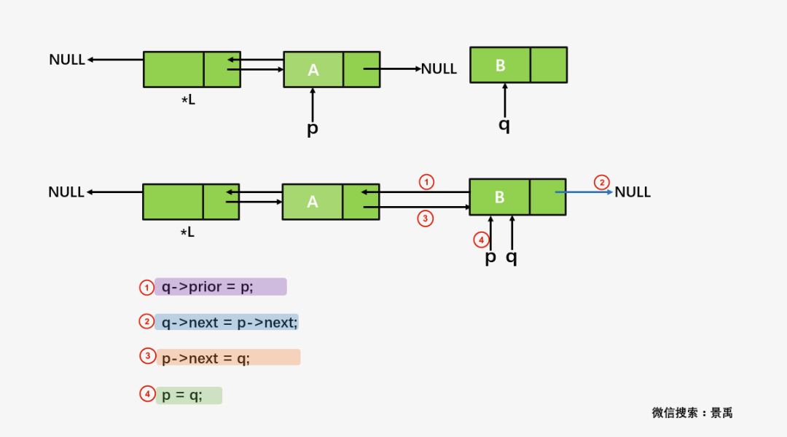
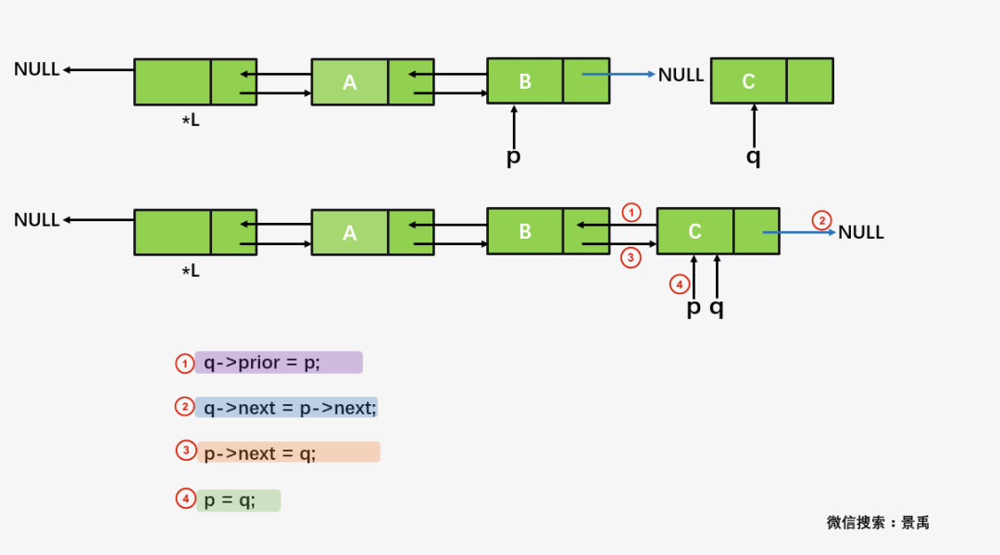
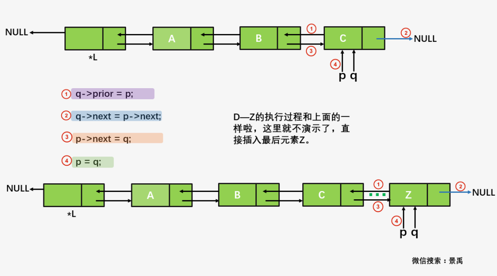
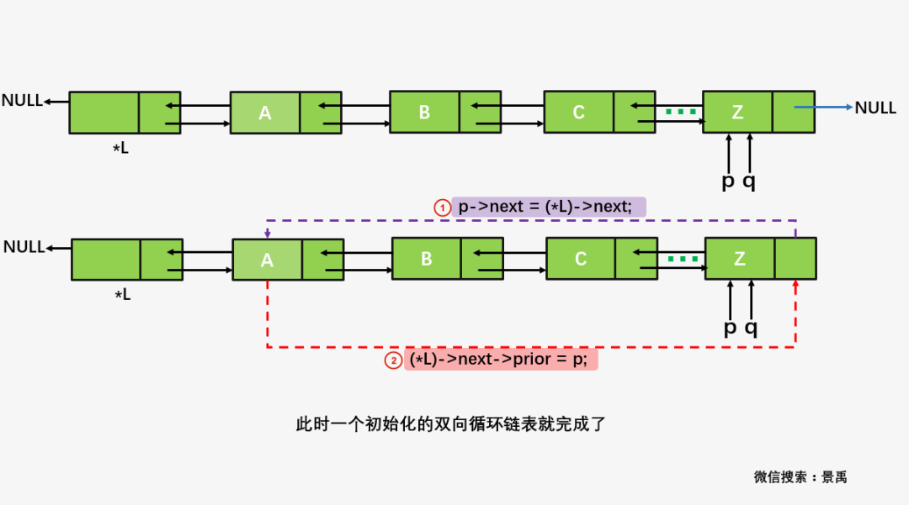
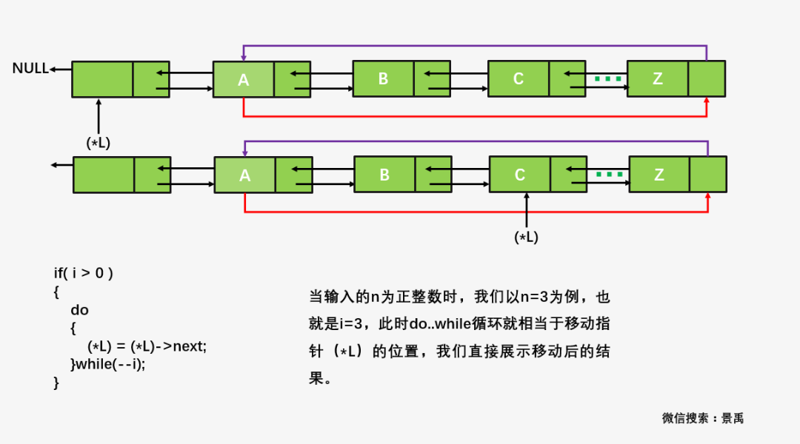
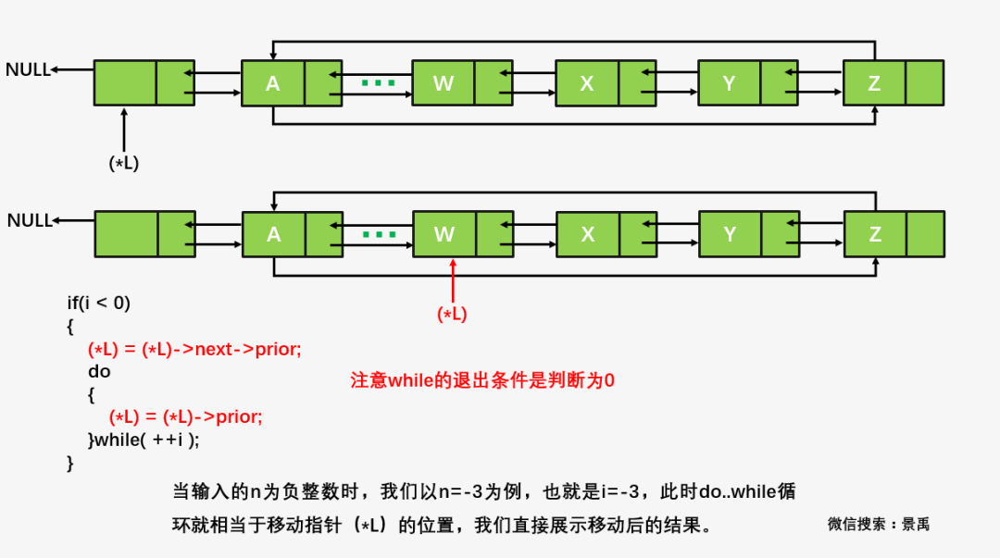

<h1 align="center">目录</h1>

* [1. 知识点](#1-知识点)
    * [1.1. 插入](#11-插入)
    * [1.2. 删除](#12-删除)
    * [1.3. 题目：凯撒密码](#13-题目凯撒密码)
* [2. C++实现](#2-c实现)
    * [2.1. 自己](#21-自己)
    * [2.2. 参考](#22-参考)
* [3. Go实现](#3-go实现)
* [4. 参考资料](#4-参考资料)

---

# 1. 知识点
对于双向链表的理解就相当简单。双向链表就是在单链表的基础之上，为每一个结点增加了它的前继结点。双向链表的定义如下：

需要明白：

* `p` 指当前节点
* `p->next` 指后一个节点
* `p->front` 指前一个节点

```cpp
struct Node
{
	int val;
	Node *next;	// 前驱节点
	Node *prev; // 后继节点
	Node(int data) : val(data), next(nullptr), prev(nullptr) { }
};
```

## 1.1. 插入
需要 2 个指针对象 `p` 和 `p->next`。

```
p  =  p->next
 \\   //
  node
```

```cpp
// 先设置 node 对象
node->front = p;
node->next = p->next;
// 再以 p 为对象进行连接
p->next = node;
p->next->front = node;
```



## 1.2. 删除
**删除**：p 为要删除点

1. 先更换 p 的 front
2. 再换 p 的 next

```
p->front   p   p->next
```

```cpp
p->front->next = p->next;
p->next->front = p->front;
delete p;
```




## 1.3. 题目：凯撒密码
题目描述：

要求实现用户输入一个数使得 26 个字母的排列发生变化，例如用户输入 3，输出结果：

```
DEFGHIJKLMNOPQRSTUVWXYZABC
```

同时需要支持负数，例如用户输入 -3，输出结果：

```
XYZABCDEFGHIJKLMNOPQRSTUVW
```

双向循环链表初始化操作（InitList()函数）执行流程：












Caesar()函数的执行过程：






```cpp
#include <stdio.h>
#include <stdlib.h>

#define OK 1
#define ERROR 0

typedef char ElemType;
typedef int Status;

typedef struct DaulNode
{
    ElemType data;
    struct DaulNode *prior;
    struct DaulNode *next;
}DaulNode, *DuLinkList;

Status InitList(DuLinkList *L)
{
    DaulNode *p, *q;
    int i;

    *L = (DuLinkList)malloc(sizeof(DaulNode));
    if(!(*L))
    {
        return ERROR;
    }

    (*L)->next = (*L)->prior = NULL;
    p = (*L);

    for( i = 0; i < 26; i++)
    {
        q = (DaulNode *)malloc(sizeof(DaulNode));
        if( !q )
            return ERROR;

        q->data = 'A'+i;
        q->prior = p;
        q->next = p->next;
        p->next = q;

        p = q;
    }

    p->next = (*L)->next;
    (*L)->next->prior = p;

    return OK;
}

void Caesar(DuLinkList *L, int i)
{
    if( i > 0 )
    {
        do
        {
            (*L) = (*L)->next;
        }while(--i);
        printf("%d", i);
    }

    if(i < 0)
    {
        (*L) = (*L)->next->prior;
        do
        {
            (*L) = (*L)->prior;
        }while( ++i );
    }

}

int main()
{
    DuLinkList L;
    int i, n;

    InitList(&L);

    printf("Please input n :");
    scanf("%d",&n);
    printf("\n");
    Caesar(&L, n);

    for( i=0; i < 26; i++)
    {
        L = L->next;
        printf("%c",L->data);
    }
}
```

# 2. C++实现
## 2.1. 自己
* 维护了一个头节点 `head` 和尾节点 `tail` 以及长度 `len`
* 查找时总需要全部遍历，从头到尾

```cpp
#ifndef _DOUBLE_LINK_H_
#define _DOUBLE_LINK_H_

#include <iostream>

class CList {
private:
    struct Node {
        int   val;
        Node *next;
        Node *prev;
        Node(int data)
            : val(data)
            , next(nullptr)
            , prev(nullptr) {
        }
    };

    Node *head; // 头节点
    Node *tail; // 尾节点
    int   len;

public:
    // 创建双向链表
    CList()
        : len(0)
        , head(new Node(0))
        , tail(head) {
    }

    ~CList() {
        clear();
    }

    void push_back(int val) {
        Node *temp = new Node(val);
        temp->next = nullptr;
        temp->prev = tail;

        tail->next = temp;
        tail       = temp;
        len++;
    }

    // 4 步原则
    void push_front(int val) {
        Node *temp = new Node(val);
        temp->next = head->next;
        temp->prev = head;

        head->next       = temp;
        temp->next->prev = temp;
        len++;
    }

    void pop_back() {
        Node *temp = tail;
        tail       = temp->prev;
        tail->next = nullptr;
        delete temp;
        len--;
    }

    // 3 步原则
    void pop_front() {
        Node *temp       = head->next;
        head->next       = temp->next;
        temp->next->prev = temp->prev;

        delete temp;
        len--;
    }

    // 正向遍历
    void forward_traversal() const {
        Node *p = head->next;
        while (p != nullptr) {
            std::cout << p->val << "  ";
            p = p->next;
        }
        std::cout << std::endl;
    }

    // 逆向遍历
    void reverse_traversal() const {
        Node *p = tail;
        while (p->prev != nullptr) {
            std::cout << p->val << "  ";
            p = p->prev;
        }
        std::cout << std::endl;
    }

    // 冒泡排序
    void bubble_sort() {
        // Node *p = new Node(0);
        // Node *q = new Node(0);
        Node *q = nullptr;
        int   temp;
        for (Node *p = head->next; p->next != nullptr; p = p->next) {
            for (q = p->next; q != nullptr; q = q->next) {
                if (q->val < p->val) {
                    temp   = q->val;
                    q->val = p->val;
                    p->val = temp;
                }
            }
        }
        
        // 重新查找 tail 的位置
        Node *point = head;
        while (point->next) {
            point = point->next;
        }
        tail = point;
    }

    // 插入排序
    void insert_sort() {
        if (head->next == nullptr || head->next->next == nullptr) {
            return;
        }
        Node *p2         = head->next->next;
        Node *p1         = head;
        head->next->next = nullptr;
        while (p2) {
            Node *pN = p2->next;
            while (p1->next) {
                // 小的插在前面
                if (p2->val < p1->next->val) {
                    p2->next       = p1->next;
                    p2->prev       = p1;
                    p1->next->prev = p2;
                    p1->next       = p2;
                    break;
                }
                p1 = p1->next;
            }
            if (p1->next == nullptr) {
                // 如果没找到小值，则就是大值，插在后面
                p2->next = nullptr;
                // 此时p1已经在尾部了
                p2->prev = p1;
                p1->next = p2;
            }
            p2 = pN;
        }

        // 重新查找 tail 的位置
        Node *pt = head;
        while (pt->next) {
            pt = pt->next;
        }
        tail = pt;
    }

    // 修改链表中指定位置的节点
    void update(int val, int position) {
        Node *p = head->next;
        if (position > len || position <= 0) {
            std::cout << "over stack !" << std::endl;
            return;
        }
        for (int i = 0; i < position - 1; i++) {
            p = p->next;
        }
        p->val = val;
    }

    // position 从1开始
    void insert(int num, int position) {
        Node *p = head->next;
        if (position > len || position <= 0) {
            std::cout << "over stack !" << std::endl;
            return;
        }
        for (int i = 0; i < position - 1; i++) {
            p = p->next;
        }

        Node *temp    = new Node(num);
        temp->next    = p;
        temp->prev    = p->prev;
        p->prev->next = temp;
        p->prev       = temp;
        len++;
    }

    void clear() {
        Node *q = nullptr;
        Node *p = head->next;
        while (p != nullptr) {
            q = p;
            p = p->next;
            delete q;
        }
        p = nullptr;
        q = nullptr;
    }

    // 删除指定位置的节点
    void erase(int position) {
        Node *p = head->next;
        if (position > len || position <= 0) {
            std::cout << "over stack !" << std::endl;
            return;
        }
        for (int i = 0; i < position - 1; i++) {
            p = p->next;
        }
        p->prev->next = p->next;
        p->next->prev = p->prev;
        delete p;
        len--;
    }

    // 查找指定位置的节点
    int find(int position) const {
        Node *p = head->next;
        if (position > len || position <= 0) {
            std::cout << "over stack !" << std::endl;
            return 0;
        }
        for (int i = 0; i < position - 1; i++) {
            p = p->next;
        }
        return p->val;
    }
};

#endif // _DOUBLE_LINK_H_
```

```cpp
#include "include/clist.hpp"
#include <iostream>

int main() {
    CList l;
    l.push_back(35);
    l.push_back(30);
    l.push_back(32);
    l.push_front(4);
    l.push_front(5);
    l.pop_back();
    l.pop_front();
    l.forward_traversal();
    // 4  35  30

    std::cout << "排序" << std::endl;
    //    l.bubble_sort();      //冒泡排序
    l.insert_sort(); //插入排序
    l.forward_traversal();
    // 4  30  35

    std::cout << "插入：" << std::endl;
    l.insert(55, 1);
    l.forward_traversal();
    // 55  4  30  35

    std::cout << "删除：" << std::endl;
    l.erase(1);
    l.forward_traversal();
    // 4  30  35

    std::cout << "反向遍历" << std::endl;
    l.reverse_traversal();
    // 35  30  4

    std::cout << "打印第 2 个点的数据" << l.find(2) << std::endl;
    // 30

    return 0;
}
```

## 2.2. 参考
* 只维护一个头节点 `head` 和长度 `count`

```cpp

#ifndef _DOUBLE_LINK_H_
#define _DOUBLE_LINK_H_

#include <iostream>

class DoubleLink {
private:
    struct DNode {
        int    val;
        DNode *prev;
        DNode *next;
        DNode(int t, DNode *pprev, DNode *pnext)
            : val(t)
            , prev(pprev)
            , next(pnext) {
        }
    };

    int    count;
    DNode *head;

public:
    DoubleLink()
        : count(0) {
        // 创建“表头”。注意：表头没有存储数据！
        head       = new DNode(0, nullptr, nullptr);
        head->prev = head->next = head;
    }

    ~DoubleLink() {
        // 删除所有的节点
        DNode *ptmp;
        DNode *pnode = head->next;
        while (pnode != head) {
            ptmp  = pnode;
            pnode = pnode->next;
            delete ptmp;
        }

        // 删除"表头"
        delete head;
        head = nullptr;
    }

    int size() const {
        return count;
    }

    bool empty() const {
        return count == 0 ? true : false;
    };

    // 获取第index位置的节点的值
    int get(int index) {
        return get_node(index)->val;
    }

    // 获取第1个节点的值
    int front() {
        return get_node(0)->val;
    }

    // 获取最后一个节点的值
    int back() {
        return get_node(count - 1)->val;
    };

    // 将节点插入第一个节点处
    void push_front(int val) {
        DNode *pnode     = new DNode(val, head, head->next);
        head->next->prev = pnode;
        head->next       = pnode;
        count++;
    }

    // 将节点追加到链表的末尾
    void push_back(int val) {
        // 🔥特别注意：链表最后一个node的next是指向head，而head的prev实际上指向的是链表最后一个node
        // 🔥 实际上有循环链表的感觉了
        DNode *pnode     = new DNode(val, head->prev, head);
        head->prev->next = pnode;
        head->prev       = pnode;
        count++;
    }

    void insert(int index, int val) {
        if (index == 0) {
            push_front(val);
        } else {
            DNode *pindex      = get_node(index);
            DNode *pnode       = new DNode(val, pindex->prev, pindex);
            pindex->prev->next = pnode;
            pindex->prev       = pnode;
            count++;
        }
    }

    // 删除index位置的节点
    void erase(int index) {
        DNode *pindex      = get_node(index);
        pindex->next->prev = pindex->prev;
        pindex->prev->next = pindex->next;
        delete pindex;
        count--;
    }

    // 删除第一个节点
    void pop_front() {
        erase(0);
    }

    // 删除最后一个节点
    void pop_back() {
        erase(count - 1);
    }

private:
    // 获取第index位置的节点
    DNode *get_node(int index) const {
        // 判断参数有效性
        if (index < 0 || index >= count) {
            std::cout << "get node failed! the index in out of bound!" << std::endl;
            return nullptr;
        }

        // 正向查找
        if (index <= count / 2) {
            int    i      = 0;
            DNode *pindex = head->next;
            while (i++ < index) {
                pindex = pindex->next;
            }

            return pindex;
        }

        // 反向查找
        int    j       = 0;
        int    rindex  = count - index - 1;
        DNode *prindex = head->prev;
        while (j++ < rindex) {
            prindex = prindex->prev;
        }

        return prindex;
    }
};

#endif // _DOUBLE_LINK_H_
```

```cpp
#include "include/clist.hpp"
#include <iostream>

int main() {
    DoubleLink pdlink;

    pdlink.insert(0, 20);  // 将 20 插入到第一个位置
    pdlink.push_back(10);  // 将 10 追加到链表末尾
    pdlink.push_front(30); // 将 30 插入到第一个位置

    std::cout << "empty()=" << (pdlink.empty() ? "true" : "false") << std::endl;
    // empty() = false
    std::cout << "size()=" << pdlink.size() << std::endl;
    // size() = 3

    for (int i = 0; i < pdlink.size(); i++)
        std::cout << "pdlink(" << i << ")=" << pdlink.get(i) << std::endl;
    // pdlink(0) = 30
    // pdlink(1) = 20
    // pdlink(2) = 10

    return 0;
}
```

# 3. Go实现

```go
package main

import (
	"fmt"
)

// 定义节点
type Node struct {
	Value 	int
	Prev	*Node
	Next 	*Node
}

// 初始化头节点
var head = new(Node)

// 添加节点
func addNode(t *Node, v int) int {
	if head == nil {
		t = &Node{v, nil, nil}
		head = t
		return 0
	}

	if v == t.Value {
		fmt.Println("节点已经存在：", v)
		return -1
	}

	// 如果当前节点的下一个节点为空
	if t.Next == nil {
		// 与单链表不同的是每个节点还要维护前驱节点指针
		temp := t
		t.Next = &Node{v, temp, nil}
		return -2
	}

	// 如果当前节点的下一个节点不为空，则继续遍历
	return addNode(t.Next, v)
}

func traverse(t *Node)  {
	if t == nil {
		fmt.Println("-> 空链表！")
		return	
	}

	for t != nil {
		fmt.Printf("%d -> ", t.Value)
		t = t.Next
	}

	fmt.Println()
}

// 方向遍历链表
func reverse(t *Node)  {
	if t == nil {
		fmt.Println("-> 空链表！")
		return	
	}

	// temp 为尾节点
	temp := t
	for t != nil {
		temp = t
		t = t.Next
	}

	for temp.Prev != nil {
		fmt.Printf("%d -> ", temp.Value)
		temp = temp.Prev
	}

	fmt.Printf("%d -> ", temp.Value)
	fmt.Println()
}


// 获取链表长度
func size(t *Node) int {
	if t == nil {
		fmt.Println("-> 空链表！")
		return 0
	}

	n := 0
	for t != nil {
		n++
		t = t.Next
	}

	return n
}

// 查找节点
func lookupNode(t *Node, v int) bool {
	if head == nil {
		return false
	}

	if v == t.Value {
		return true
	}

	// 终点
	if t.Next == nil {
		return false
	}

	return lookupNode(t.Next, v)
}

func main() {
	fmt.Println(head)
	head = nil	
	traverse(head)

	addNode(head, 1)
	traverse(head)

	addNode(head, 10)
	addNode(head, 5)
	addNode(head, 100)
	traverse(head)

	// 添加已存在节点
	addNode(head, 100)
	fmt.Println("链表长度：", size(head))
	traverse(head)

	// 反向遍历
	reverse(head)

	// 查找已存在节点
	if lookupNode(head, 5) {
		fmt.Println("该节点已存在！")
	} else {
		fmt.Println("该节点不存在！")
	}
}
```

```
&{0 <nil> <nil>}
-> 空链表！
1 -> 
1 -> 10 -> 5 -> 100 -> 
节点已经存在： 100
链表长度： 4
1 -> 10 -> 5 -> 100 -> 
100 -> 5 -> 10 -> 1 -> 
该节点已存在！
```

# 4. 参考资料
* [链式存储结构之双向链表与跳表](https://mp.weixin.qq.com/s/002qc9zj1h1yti6_Ui2MtQ)
* [线性表--数组、单链表、双链表(C/C++/Java)](http://wangkuiwu.github.io/2013/01/01/dlink/)
