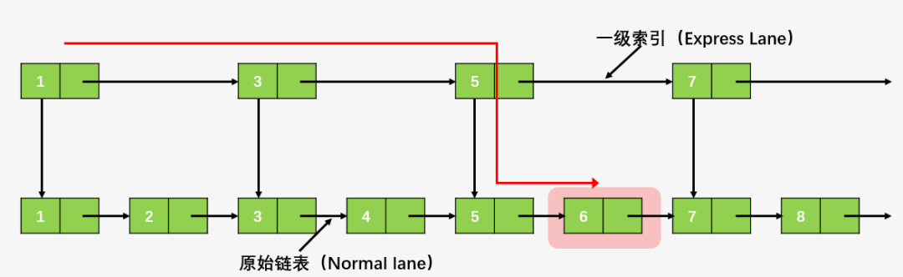
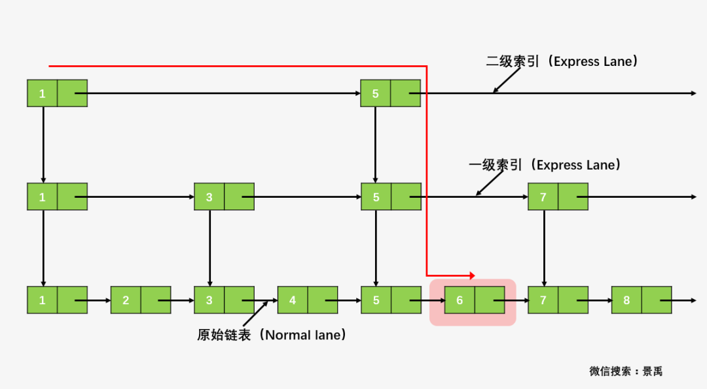
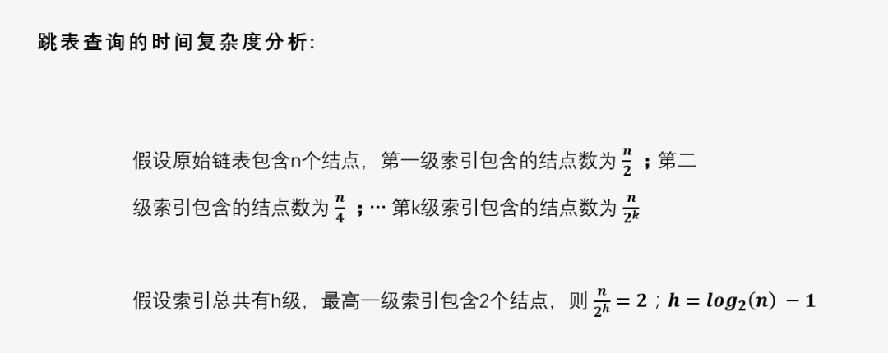
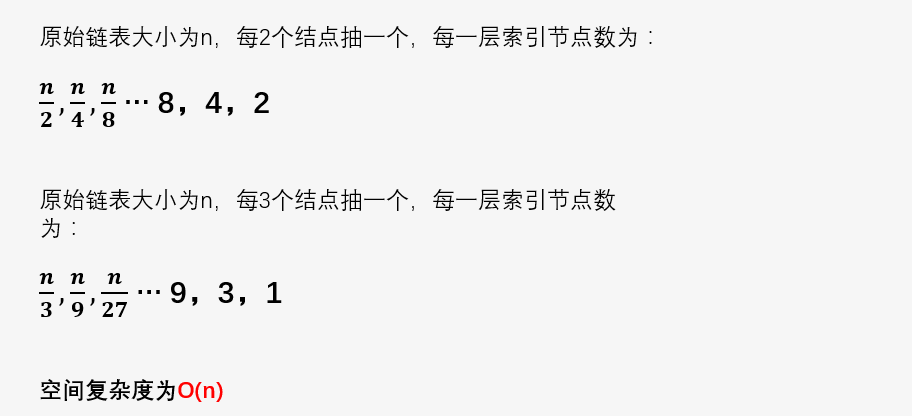

# 知识点
Skip List是一种随机化的数据结构，基于并联的链表，其效率可比拟于二叉查找树（对于大多数操作需要O(log n)平均时间）。基本上，跳跃列表是对有序的链表增加上附加的前进链接，增加是以随机化的方式进行的，所以在列表中的查找可以快速的跳过部分列表(因此得名)。所有操作都以对数随机化的时间进行。Skip List可以很好解决有序链表查找特定值的困难。

对于一个有序单链表，查找一个元素的平均时间复杂度为 O(n)，那么是否有**一种更快的方式查找元素**呢？--> 可以通过在原始链表的基础之上，为其**增加索引**来解决这个问题：

以查找元素 6 为例，当我们在原始链表（Normal Line）上进行查找，将需要从头结点开始依次遍历直至找到值为 6 的结点；当我们在一级索引（Express Lane）上进行查找，将只需要从 1->3->5->6，就可以找到元素 6。相当于之前查找步数的一半，速度提升了一倍，

通过上图可以发现，从二级索引开始，我们仅需要1->5->6，进一步的提升了查找的效率。

**注意**：跳表只能用于元素**有序**的情况。所以跳表对标的是平衡树和二分查找，是一种 插入/删除/搜索 都是 O(log n) 的数据结构。它最大的优势是原理简单、容易实现、方便扩展、效率更高。因此，在一些热门的项目里用来代替平衡树，如 Redis、LevelDB 等。

跳表查找的时间复杂度分析：

跳表查找的空间复杂度分析：

总结：跳表的查询时间复杂度为 O(log(n))，空间复杂度为 O(n)。

# 参考资料
* [链式存储结构之双向链表与跳表](https://mp.weixin.qq.com/s/002qc9zj1h1yti6_Ui2MtQ)
* [Skip List（跳跃表）原理详解与实现](https://www.iteye.com/blog/dsqiu-1705530)
