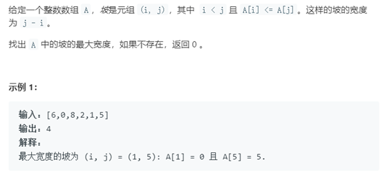

# 数组类型题分类

划分为 4 个常考问题：

1. 子数组问题：就是给定一个数组，围绕该数组的子数组列出诸多难题，等待我们来解答
2. 矩阵问题：给定一个矩阵（或者称为二维数组），围绕该矩阵列出不同方式遍历矩阵中元素等难题，等待我们来解答
3. O(n) 类型问题：O(n)是指时间复杂度为O(n)，给定的题目题意一般很容易理解，其一般解法（俗称暴力解法，时间复杂度一般为O(n^2)，甚至更高）也很简单，但是题目要求你的解法时间复杂度为O(n)。看到这些题目的某些解答后，会让我们忍不住夸赞：真乃神人、好厉害、奇异特解、巧妙、强、优雅
4. 思维转换类型问题：其解答不属于上述三种类型问题，但是解答方式有点巧妙，或者说该类型题目较为基础，很可能考察你的快速应用代码能力的题目

# 子数组问题
题目数量共 17 题，其中难度为简单有 1 题，难度为中等的有 12 题，难度为困难的有 4 题

1. 最大子序和
2. 乘积最大子序列
3. 子集
4. 最长连续序列
5. 乘积小于K的子数组
6. 和为K的子数组
7. 可被K整除的子数组
8. 三个无重叠子数组的最大和
9. 最长重复子数组
10. 匹配子序列的单词数
11. 区间子数组个数
12. 子数组的最小值之和
13. 子序列宽度之和
14. 环形子数组的最大和
15. 最长湍流子数组
16. 两个非重叠子数组的最大和
17. 子数组中占绝大多数的元素


## 例4 最长连续序列
题号：128，难度：困难

题目描述：


解题思路：

采用哈希表存储数组中所有元素，然后应用哈希表查询当前元素的左右两边序列数字是否存在，查询操作的时间复杂度为 O(1)，所以整体的时间复杂度为 O(n)。

```java
class Solution {
    public int longestConsecutive(int[] nums) {
        int result = 0;
        Set<Integer> set = new HashSet<>();
        for(Integer n: nums)
            set.add(n);
        for(Integer n: nums) {
            if(set.contains(n)) {
                int len = 1;
                int temp = n;
                while(set.contains(--temp)) {
                    len++;
                    set.remove(temp);
                }
                temp = n;
                while(set.contains(++temp)) {
                    len++;
                    set.remove(temp);
                }
                result = Math.max(result, len);
            }
        }

        return result;
    }
}
```


## 例7 可被K整除的子数组
题号：974，难度：中等

题目描述：


解题思路：

从第一个元素开始，求取连续子数组的余数（sum % k），采用Map存储每个余数的个数。

相同余数的子数组个数大于等于2时，任意选取其中两个子数组余数相减，即余数抵消，可得到一个符合题目要求的sum。（此处的个数计算方式为：n*(n-1) / 2）

但是，此处有两个需要注意的点:

(1) 如果余数为0，最终0的余数个数只有一个时（1*（1-1）/2 = 0），这样计算会漏掉（如果为多个，也会有遗漏，可以自己计算，可以自己稍微琢磨）。所以，在初始化Map时，添加以下代码：

```java
map.put(0, 1);
```

(2) 如果余数为负数，就不能执行相同余数相减抵消的操作。此时，需要做以下处理：

```java
// sum % K 正常计算方法

((sum % K) + K) % K   // 如果为负数时，需要转换为正数，这个转换原
```

```java
class Solution {
    public int subarraysDivByK(int[] A, int K) {
        Map<Integer, Integer> map = new HashMap<>();
        map.put(0, 1);
        int result = 0;
        int sum = 0;

        for(Integer a: A) {
            sum += a;
            map.put(((sum % K) + K) % K , map.getOrDefault(((sum % K) + K) % K, 0)+1);
        }
        // System.out.println("map = "+map);
        for(Integer key: map.keySet())
            result += map.get(key) * (map.get(key) - 1) / 2;

        return result;
    }
}
```

## 例8 三个无重叠子数组的最大和
题号：689，难度：困难

题目描述：


解题思路：

采用动态规划求解，状态转移方程：dp[2][n] = max(dp[2][n-1], dp[1][n-k] + sumRange(n, n -k+1))。其中一维长度为 3，表示三个子数组。

```java
class Solution {
     public int[] maxSumOfThreeSubarrays(int[] nums, int k) {
        int[][] dp = new int[3][nums.length];
        int[] cummulative = new int[nums.length];
        int sum = 0;
        for (int i = 0; i < nums.length; i++) {
            sum += nums[i];
            cummulative[i] = sum;
        }
        for (int i = 0; i < 3; i++) {
            for (int j = 0; j < nums.length; j++) {
                if (j < (i + 1) * k - 1) {
                    dp[i][j] = 0;
                } else {
                    if (i == 0) {
                        // 易错点: 当k=1的时候，边界条件需要处理一下。
                        dp[i][j] = Math.max(j > 0 ? dp[i][j - 1] : 0, rangeSum(cummulative, j - k + 1, j));
                    } else {
                        dp[i][j] = Math.max(j > 0 ? dp[i][j - 1]: 0, rangeSum(cummulative, j - k + 1, j) + dp[i - 1][j - k]);
                    }
                }

            }
        }
        int[] ans = new int[3];
        int length = dp[2].length - 1;
        for (int i = 2; i >= 0; i--) {
            int[] row = dp[i];
            for (int j = length - 1; j >= 0; j--) {
                if (row[j] != row[length]) {
                    ans[i] = j - k + 2;
                    length = j - k + 1;
                    break;
                }
            }
        }
        return ans;
    }

    private int rangeSum(int[] cummulative, int left, int right) {
        if (left == 0) {
            return cummulative[right];
        } else {
            return cummulative[right] - cummulative[left - 1];
        }
    }

}
```

## 例9 最长重复子数组
题号：718，难度：中等

题目描述：


解题思路：

本题既可以用哈希表来解答，也可以用动态规划的思想来解答。应用动态规划的思路解答的时间效率最高。此处介绍一下动态规划的解题思路。dp[i][j] 表示 A [i-1]为终点,B[j-1]为终点时两者的最长公共子数组。具体更新策略见代码。

```java
class Solution {
      public int findLength(int[] A, int[] B) {

        int[][] dp = new int[A.length + 1][B.length + 1];
        int res = 0;
        for (int i = 1; i <= A.length; i++)
            for (int j = 1; j <= B.length; j++) {

                if (A[i - 1] == B[j - 1])
                    dp[i][j] = dp[i - 1][j - 1] + 1;

                res = Math.max(res, dp[i][j]);
            }

        return res;
    }
}
```

## 例10 匹配子序列的单词数
题号：792，难度：中等

题目描述：


解题思路：

要特别注意子序列的含义，子序列是按照从前往后的顺序任意多个元素组成的序列，其中的顺序不能更改。因此，不能应用哈希表统计字母的个数来判断是否包含某个单词。此处可采用暴力法直接匹配查找，时间效率较低。此处可采用二分查找来优化匹配结果，能提高时间效率。

```java
class Solution {
    List<Integer> index[]=new ArrayList[26];

    public int numMatchingSubseq(String S, String[] words) {
         for(int i=0;i<S.length();i++){
            char ch=S.charAt(i);
            if(index[ch-'a']==null)
                index[ch-'a']=new ArrayList();
            index[ch-'a'].add(i);
         }
         int res=0,pre;
         for(String str:words){
            pre=-1;
            for(int i=0;i<str.length();i++){
                pre=helper(str.charAt(i)-'a',pre);
                if(pre==-1)
                    break;
            }
            if(pre!=-1)
                res++;
         }
         return res;
    }

    private int helper(int i,int pre){
        if(index[i]==null)
            return -1;

        int l=0,r=index[i].size()-1;
        if(pre==-1)
            return index[i].get(0);
        if(index[i].get(r)<=pre)
            return -1;

        while(l<r){
            int mid=(l+r)/2;
            if(index[i].get(mid)<=pre)
                l=mid+1;
            else
                r=mid;
        }

        return index[i].get(l);
   }
}
```

## 例11 区间子数组个数
题号：795， 难度：中等

题目描述：


解题思路：

最大元素满足大于等于L小于等于R的子数组个数 = 最大元素小于等于R的子数组个数 - 最大元素小于L的子数组个数。

```java
class Solution {
    public int numSubarrayBoundedMax(int[] A, int L, int R) {
        return numSubarrayBoundedMax(A, R) - numSubarrayBoundedMax(A, L - 1);
    }

    private int numSubarrayBoundedMax(int[] A, int Max) {
        int res = 0;
        int numSubarry = 0;
        for (int num : A) {
            if (num <= Max) {
                numSubarry++;
                res += numSubarry;
            } else {
                numSubarry = 0;
            }
        }
        return res;
    }
}
```

## 例12 子数组的最小值之和
题号：907，难度：中等

题目描述：


解题思路：

参考自LeetCode的评论解答：计算每个数在子数组中最小的次数。

```java
class Solution {
    public int sumSubarrayMins(int[] A) {
        long res = 0;
        long mod = 1000000007;
        for (int i = 0; i<A.length; i++) {
            int l = i-1;
            for (; l>=0 && A[i] < A[l]; l--) ;
            int r = i+1;
            for (; r<A.length && A[i] <= A[r]; r++) ;

            res += (i-l)*(r-i)*A[i];
        }
        return (int)(res % mod);
    }
}
```

## 例13 子序列宽度之和
题号：891，难度：困难

题目描述：


```java
class Solution {
    public int sumSubseqWidths(int[] A) {
        final int MOD = (int) (1e9 + 7);
        Arrays.sort(A);
        int n = A.length;
        long res = 0;
        long p = 1;
        for (int i = 0; i < n; ++i) {
            res = (res + (A[i] - A[n - 1 - i]) * p) % MOD;
            p = (p << 1) % MOD;
        }
        return (int) ((res + MOD) % MOD);
    }
}
```

## 例14 环形子数组的最大和
题号：918， 难度：中等

题目描述：


解题思路：

因为题目要求有环形，所以需要定义两个变量。一个变量存储当前无环形是的连续最大子数组和，一个存储无环形连续最小子数组和。最后采用数组的总和减去最小和，和已经保存的最大和进行比较。另外，需要注意一点如果数组全部为负数时，此时直接返回子数组的最大值（因为此时，最小子数组和就是数组的和）。

```java
class Solution {
    public int maxSubarraySumCircular(int[] A) {
        int max = A[0];
        int min = A[0];
        int maxSoFar = A[0];
        int minSoFar = A[0];
        int sum = A[0];
        for (int i=1;i<A.length;i++) {
          sum += A[i];
          maxSoFar = Math.max(A[i],maxSoFar+A[i]);
          minSoFar = Math.min(A[i],minSoFar+A[i]);
          max = Math.max(max,maxSoFar);
          min = Math.min(min,minSoFar);
        }
        if (max < 0)
            return max;
        return Math.max(max,sum-min);
    }
}
```

## 例15 最长湍流子数组
题号：978，难度：中等

题目描述：


解题思路：

采用连续三个位置数据是否符合湍流特征来判断，时间复杂度为 O(n)。

```java
class Solution {
    public int maxTurbulenceSize(int[] A) {
        int N = A.length;
        int ans = 1;
        int anchor = 0;

        for (int i = 1; i < N; ++i) {
            int c = Integer.compare(A[i-1], A[i]);
            if (i == N-1 || c * Integer.compare(A[i], A[i+1]) != -1) {
                if (c != 0) ans = Math.max(ans, i - anchor + 1);
                anchor = i;
            }
        }

        return ans;
    }
}
```

## 例16 两个非重叠子数组的最大和
题号：1031，难度：中等

题目描述：


解题思路：

采用滑动窗口的思路来解答，对长度为L的数组，采用大小为 L 的滑动窗口，对于长度为M的数组采用大小为 M 的窗口。然后，通过两个窗口之间的距离来遍历。

```java
class Solution {
    public  int maxSumTwoNoOverlap(int[] A, int L, int M) {
        int len = A.length, dpL[] = new int[len - L + 1], dpM[] = new int[len - M + 1], max = 0;
        for (int i = 0; i < L; i++)
            dpL[0] += A[i];
        for (int i = 0; i < M; i++)
            dpM[0] += A[i];
        for (int i = 1; i < len - L + 1; i++)
            dpL[i] = dpL[i - 1] + A[i + L - 1] - A[i - 1];
        for (int i = 1; i < len - M + 1; i++)
            dpM[i] = dpM[i - 1] + A[i + M - 1] - A[i - 1];
        for (int i = 0; i < len - L - M + 1; i++) {
            int count = len - i - L - M;
            while (count >= 0) {
                max = Math.max(max, Math.max(dpL[i] + dpM[i + L + count], dpM[i] + dpL[i + M + count]));
                count--;
            }
        }
        return max;
    }
}
```

## 例17 子数组中占绝大多数的元素
题号：1157，难度：困难

题目描述：


解题思路：

采用哈希数组来解答，一旦哈希数组中目标元素值大于等于 threshold，就返回目标数字，否则返回 -1。

```java
class MajorityChecker {

    private int[] nums;
    private int[] ans;
    private int max;

    public MajorityChecker(int[] arr) {
        nums = arr;
        max = arr[0];
        for(int x : arr)
            if(x > max)
                max = x;

    }

    public int query(int left, int right, int threshold) {
        ans = new int[max + 5];
        for(int i = left;i <= right;i++){
            if(++ans[nums[i]] >= threshold)
                return nums[i];
        }
        return -1;
    }
}
```

# 矩阵问题
矩阵也可以称为二维数组。考点有：
- 矩阵元素的遍历
- 矩阵位置的旋转
- 矩阵行或列次序的交换
- 空间复杂度为 O(1) 等

本期共 12 道题，2 道简单题，8 道中等题，2 道困难题。

- 例 1 是杨辉三角的一个延申题，是一道非常经典的矩阵习题，本题理想解法是动态规划，但是也可以采用递归来求解。
- 例 2 是一道顺时针访问矩阵元素的习题，在不少面试题中有见到。
- 例 3、例 4 和例 5 则强调如何利用矩阵本身的空间，来变换矩阵中的元素，即空间复杂度为 O(1)。用到了元素间交换和位运算策略，其中相关解法很巧妙。
- 例6 是一道如何移动矩阵的问题。
- 例 7 和例 8 则是考察我们快速理解题意，并在较短时间内完成较高质量代码的能力。即编写的代码争取一次性通过。
- 例 9 考察我们如何把二分查找的应用场景由一维数组转换到二维数组。
- 例 10 是一道动态规划结合矩阵的经典习题，并且还可以延申出求最短路径的问题。
- 例 11 则很有意思，该题是上篇例 6 中《和为 K 的子数组》的一个升级版，把一维数组的场景变换成了二维的场景，并结合了动态思想，因此题目难度由中等变成了困难。
- 例 12 是一道困难级别的习题，该题主要考察我们的数学分析能力，如何灵活变换矩阵的行和列，以及细节的处理能力。

1. 杨辉三角 II
2. 螺旋矩阵
3. 旋转图像
4. 矩阵置零
5. 生命游戏
6. 图像重叠
7. 车的可用捕获量
8. 可以攻击国王的皇后
9. 搜索二维矩阵（对应 7.3）
10. 最小路径和
11. 元素和为目标值的子矩阵数量
12. 变为棋盘


## 例4 矩阵置零
题号：73，难度：中等

题目描述：


解题思路：

先说一下空间复杂度为O(m+n)的思路（PS：该思路不符合题意的原地算法要求）。申请两个一维数组，一个表示矩阵行，一个表示矩阵列。然后，遍历矩阵中所有元素，一旦出现零，把该零对应行和对应列的一维数组的值标记为常数1。最后，分别按行和按列给原始矩阵赋值零。

现在参考LeetCode上一个评论的思路，空间复杂度为O(2)。申请两个布尔变量cow和col，分别记录原矩阵第0行和第0列中是否存在零，如果存在标记为True，否则标记为False。然后，接下来的思路就是上面O(m+n)的解决思路，唯一不同的是此时的空间是采用原始矩阵的空间。

```java
class Solution {
    public void setZeroes(int[][] matrix) {
        boolean row = false, col = false;
        for(int i = 0;i < matrix.length;i++) {
            if(matrix[i][0] == 0) {
                row = true;
                break;
            }
        }

        for(int j = 0;j < matrix[0].length;j++) {
            if(matrix[0][j] == 0) {
                col = true;
                break;
            }
        }

        for(int i = 1;i < matrix.length;i++) {
            for(int j = 1;j < matrix[0].length;j++) {
                if(matrix[i][j] == 0) {
                    matrix[i][0] = 0;
                    matrix[0][j] = 0;
                }
            }
        }

        for(int i = 1;i < matrix.length;i++) {
            if(matrix[i][0] == 0) {
                for(int j = 1;j < matrix[0].length;j++)
                    matrix[i][j] = 0;
            }
        }

        for(int j = 1;j < matrix[0].length;j++) {
            if(matrix[0][j] == 0) {
                for(int i = 1;i < matrix.length;i++)
                    matrix[i][j] = 0;
            }
        }

        if(row) {
            for(int i = 0;i < matrix.length;i++)
                matrix[i][0] = 0;
        }

        if(col) {
            for(int j = 0;j < matrix[0].length;j++)
                matrix[0][j] = 0;
        }

    }
}
```

## 例5 生命游戏
题号：289，难度：中等

题目描述：


解题思路：

此题在要求采用原地算法，即不能应用额外的空间来更新原始的矩阵元素。此题的解决方案需要使用位运算来解决。

先观察题目对活细胞和死细胞的定义，然后把它们转化为二进制表示。

活细胞：1变换为二进制01，如果活细胞变为死细胞，只需要把01变为11，即1变为3，其最后一位依然可以识别为活细胞。

死细胞：0变换为二进制00，如果死细胞变为活细胞，只需要把00变为10，即0变为2，其最后一位依然可以识别为死细胞。

最后，采用board[i][j]&1进行位运算的法则来求取一个细胞周围的活细胞数量，并更新当前细胞的状态。

```java
class Solution {

    public void gameOfLife(int[][] board) {
       // 01表示活细胞，01——>11变为死细胞，即由1变为3
       // 00表示死细胞，00——>10变为活细胞，即由0变为2
        for(int i = 0;i < board.length;i++) {
            for(int j = 0;j < board[0].length;j++) {
                int count = countLive(board, i, j);
                if((board[i][j] & 1) == 1) {
                    if(count < 2 || count > 3)
                        board[i][j] = 3;
                } else {
                    if(count == 3)
                        board[i][j] = 2;
                }
            }
        }

        for(int i = 0;i < board.length;i++) {
            for(int j = 0;j < board[0].length;j++) {
                if(board[i][j] == 3)
                    board[i][j] = 0;
                if(board[i][j] == 2)
                    board[i][j] = 1;
            }
        }
    }

    public int countLive(int[][] board, int x, int y) {
        int[][] step = {{-1, -1}, {-1, 0}, {-1, 1}, {0, -1}, {0, 1}, {1, -1}, {1, 0}, {1, 1}};
        int count = 0;
        for(int i = 0;i < step.length;i++) {
            int temp_x = x + step[i][0];
            int temp_y = y + step[i][1];
            if(temp_x >= 0 && temp_x < board.length && temp_y >= 0 && temp_y < board[0].length) {
                if((board[temp_x][temp_y] & 1) == 1)
                    count++;
            }
        }

        return count;
    }
}
```

## 例6 图像重叠
题号：835，难度：中等

题目描述：


解题思路：

此题注意如何处理矩阵的移动，使得移动后两个矩阵进行匹配。直接采用两个for循环表示其中一个矩阵移动后的位置。具体变换形式参考代码。

```java
class Solution {

    public int largestOverlap(int[][] A, int[][] B) {
        int result = 0, len = A.length;
        for(int i = 0;i < len;i++) {
            for(int j = 0;j < len;j++) {
                int count1 = 0, count2 = 0;
                for(int m = 0;m < len - i;m++) {
                    for(int n = 0;n < len - j;n++) {
                        count1 += (A[m][n] & B[m+i][n+j]);
                        count2 += (B[m][n] & A[m+i][n+j]);
                    }
                }
                result = Math.max(result, count1);
                result = Math.max(result, count2);
            }
        }
        return result;
    }
}
```

## 例7 车的可用捕获量
题号：999，难度：简单

题目描述：


解题思路：

本题较为简单，直接遍历矩阵找到车的位置，然后在车能行走的四个方向依次遍历即可。（放入此题的意图，题目比较长，读懂题意需要耗费一些时间，另外编写代码需要注意边界问题）

```java
class Solution {

    public int numRookCaptures(char[][] board) {
        for(int i = 0;i < board.length;i++) {
            for(int j = 0;j < board[0].length;j++) {
                if(board[i][j] == 'R')
                    return getResult(board, i, j);
            }
        }

        return 0;
    }

    public int getResult(char[][] board, int x, int y) {
        int count = 0;
        int tempX = x, tempY = y;
        //向上
        while(--tempX >= 0) {
            if(board[tempX][y] == 'B')
                break;
            else if(board[tempX][y] == 'p') {
                count++;
                break;
            }
        }
        tempX = x;
        //向下
        while(++tempX < board.length) {
            if(board[tempX][y] == 'B')
                break;
            else if(board[tempX][y] == 'p') {
                count++;
                break;
            }
        }
        //向左
        while(--tempY >= 0) {
            if(board[x][tempY] == 'B')
                break;
            else if(board[x][tempY] == 'p') {
                count++;
                break;
            }
        }
        tempY = y;
        //向右
        while(++tempY < board[0].length) {
            if(board[x][tempY] == 'B')
                break;
            else if(board[x][tempY] == 'p') {
                count++;
                break;
            }
        }

        return count;
    }
}
```

## 例8 可以攻击国王的皇后
题号：1222，难度：中等

题目描述：


解题思路：

此题是例7的一个小小的升级版，重点还是处理边界问题，以及快速编写代码和一次通过的能力。

```java
class Solution {
    private int[][] used;

    public List<List<Integer>> queensAttacktheKing(int[][] queens, int[] king) {
        used = new int[8][8];
        used[king[0]][king[1]] = 2;
        for(int i = 0;i < queens.length;i++)
            used[queens[i][0]][queens[i][1]] = 1;
        List<List<Integer>> result = new ArrayList<>();
        for(int i = 0;i < queens.length;i++) {
            if(judgeQ(queens[i][0], queens[i][1])) {
                List<Integer> temp = new ArrayList<>();
                temp.add(queens[i][0]);
                temp.add(queens[i][1]);
                result.add(temp);
            }
        }
        return result;
    }

    public boolean judgeQ(int x, int y) {
        int x1 = x;
        while(--x1 >= 0) {
            if(used[x1][y] == 2)
                return true;
            if(used[x1][y] == 1)
                break;
        }
        int x2 = x;
        while(++x2 < 8) {
            if(used[x2][y] == 2)
                return true;
            if(used[x2][y] == 1)
                break;
        }
        int y1 = y;
        while(--y1 >= 0) {
            if(used[x][y1] == 2)
                return true;
            if(used[x][y1] == 1)
                break;
        }
        int y2 = y;
        while(++y2 < 8) {
            if(used[x][y2] == 2)
                return true;
            if(used[x][y2] == 1)
                break;
        }
        int x3 = x, y3 = y;
        while(--x3 >= 0 && --y3 >= 0) {
            if(used[x3][y3] == 2)
                return true;
            if(used[x3][y3] == 1)
                break;
        }
        int x4 = x, y4 = y;
        while(++x4 < 8 && ++y4 < 8) {
            if(used[x4][y4] == 2)
                return true;
            if(used[x4][y4] == 1)
                break;
        }
        int x5 = x, y5 = y;
        while(--x5 >= 0 && ++y5 < 8) {
            if(used[x5][y5] == 2)
                return true;
            if(used[x5][y5] == 1)
                break;
        }
        int x6 = x, y6 = y;
        while(++x6 < 8 && --y6 >= 0) {
            if(used[x6][y6] == 2)
                return true;
            if(used[x6][y6] == 1)
                break;
        }
        return false;
    }
}
```

## 例9 搜索二维矩阵
题号：74，难度：中等

题目描述：


解题思路：

正常的想法是把矩阵想象成一个一维数组，然后采用二分查找的思路来实现。但是，这种方法可能需要处理（1，m）和（m，1）这两种特殊的二维矩阵边界问题（PS：在LeetCode上看到过直接应用二分查找很快解决的代码）。因为矩阵按照行是有序的，不妨采用每行最后一个值作为边界与目标值进行比较大小，每次增加一行或者减少一列的数据，具体实现可参考代码。

```java
class Solution {

    /* 二分查找的代码
      public boolean searchMatrix(int[][] matrix, int target) {
        if (matrix.length == 0 || matrix[0].length == 0)
            return false;
        int begin, mid, end;
        begin = mid = 0;
        int len1 = matrix.length, len2 = matrix[0].length;
        end = len1 * len2 - 1;
        while (begin < end) {
            mid = (begin + end) / 2;
            if (matrix[mid / len2][mid % len2] < target)
                begin = mid + 1;
            else
                end = mid;
        }
        return matrix[begin / len2][begin % len2] == target;
    } */

    public boolean searchMatrix(int[][] matrix, int target) {
        if(matrix.length == 0)
            return false;
        int row = 0, col = matrix[0].length-1;
        while(row < matrix.length && col >= 0){
            if(matrix[row][col] < target)
                row++;
            else if(matrix[row][col] > target)
                col--;
            else
                return true;
        }
        return false;
    }
}
```

LeetCode-cpp 的解法：

写一个有效的算法，搜索一个值在一个 **mxn**矩阵。该矩阵具有以下性质:
- 每行的整数从左到右排序。
- 每一行的第一个整数大于前一行的最后一个整数。

**分析**：

二分查找

**代码**：时间复杂度：O(log n)，空间复杂度：O(1)

```cpp
class Solution
{
public:
    bool searchMatrix(const vector<vector<int>> &matrix, int target)
    {
        if (matrix.empty())
            return false;
        const size_t m = matrix.size();
        const size_t n = matrix.front().size();
        int first = 0;
        int last = m * n;
        while (first < last)
        {
            int mid = first + (last - first) / 2;
            int value = matrix[mid / n][mid % n];
            if (value == target)
                return true;
            else if (value < target)
                first = mid + 1;
            else
                last = mid;
        }
        return false;
    }
};
```


## 例10 最小路径和
题号：64，难度：中等

题目描述：


解题思路：

此题最直接的思路是采用递归进行深度搜索遍历来解决，但是提交代码后发现会出现超时的问题。此时，需要考虑应用动态规划的思想来解题。动态规划的转换方程：dp[i][j] = min(dp[i-1][j], dp[i][j-1]) + grid[i][j]，另外需要考虑矩阵边界的问题。

```java
class Solution {

    public int minPathSum(int[][] grid) {
        int[][] dp = new int[grid.length + 1][grid[0].length + 1];
        for(int i = 1;i < dp.length;i++) {
            for(int j = 1;j < dp[0].length;j++) {
                if(i == 1)
                    dp[i][j] = dp[i][j-1] + grid[i-1][j-1];
                else if(j == 1)
                    dp[i][j] = dp[i-1][j] + grid[i-1][j-1];
                else
                    dp[i][j] = Math.min(dp[i-1][j], dp[i][j-1]) + grid[i-1][j-1];
            }
        }

        return dp[grid.length][grid[0].length];
    }

}
```

## 例11 元素和为目标值的子矩阵数量
题号：1074，难度：困难

题目描述：


解题思路：

这道题其实是《和为K的子数组，题号：560，难度：中等》的一个升级版，560题是一维数组，本题是二维数组，其和变成了一个子矩阵的形式。此处我们可以采用把矩阵每行的元素变换成从该行开始道当前元素的和，另外单独选两列求矩阵和，这样就把二维数组变成了列形式的一维数组求和。此时，解题思路就和560题一样。

```java
class Solution {

    public int numSubmatrixSumTarget(int[][] matrix, int target) {
        for(int i = 0;i < matrix.length;i++)
            for(int j = 1;j < matrix[0].length;j++)
                matrix[i][j] += matrix[i][j-1];

        int result = 0;
        for(int j1 = 0;j1 < matrix[0].length;j1++) {
            for(int j2 = j1;j2 < matrix[0].length;j2++) {
                Map<Integer, Integer> map = new HashMap<>();
                map.put(0,1);
                int pre = 0;
                for(int i = 0;i < matrix.length;i++) {
                    int val = pre + (j1 == 0 ? matrix[i][j2] : matrix[i][j2] - matrix[i][j1-1]);
                    result += map.getOrDefault(val - target, 0);
                    map.put(val, map.getOrDefault(val, 0)+1);
                    pre = val;
                }
            }
        }

        return result;
    }
}
```

## 例12 变为棋盘
题号：782，难度：困难

题目描述：


解题思路：

本题分析一下01出现的规律，可知如果n为偶数，那么每行每列中0和1的个数必然相等；如果n为奇数，那么0和1个数差的绝对值为1。由于矩阵只能交换行和列，结果要出现0和1不断相间排列，那么所有行中只能出现两种模式的01排列方式，并且这两种排列方式互补。例如，n=4, 第一行排序：1001，那么其他行要不等于1001，要么等于0110，否则就不可能转换为棋盘，直接输出-1即可。对于列的情况，和行一样。（PS：此题需要处理最小变换次数的边界问题，分奇偶讨论行或者列的最小交换次数）

```java
class Solution {
    public int movesToChessboard(int[][] board) {
        if(check(board)) {
            int row = 0, start = board[0][0];
            for(int i = 1;i < board.length;i++) {
                if(board[i][0] == start)
                    row++;
                start = 1 - start;
            }
            int col = 0;
            start = board[0][0];
            for(int j = 1;j < board[0].length;j++) {
                if(board[0][j] == start)
                    col++;
                start = 1 - start;
            }
            if(board.length % 2 == 0) { // 分奇数偶数讨论行和列最小交换次数
                row = Math.min(board.length-row, row);
                col = Math.min(board.length-col, col);
            } else {
                if(row % 2 == 1)
                    row = board.length-row;
                if(col % 2 == 1)
                    col =  board.length-col;
            }
            return row / 2 + col / 2;
        }

        return -1;
    }

    public boolean judgeEqual(int[][] board, int i, int j) {
        for(int k = 0;k < board[0].length;k++) {
            if(board[i][k] != board[j][k])
                return false;
        }

        return true;
    }

    public boolean judgeNotEqual(int[][] board, int i, int j) {
        for(int k = 0;k < board[0].length;k++) {
            if(board[i][k] == board[j][k])
                return false;
        }

        return true;
    }

    public boolean check(int[][] board) {
        int row_0 = 0, row_1 = 0, col_0 = 0, col_1 = 0;
        for(int i = 0;i < board[0].length;i++) {
            if(board[0][i] == 0)
                row_0++;
            else if(board[0][i] == 1)
                row_1++;
            if(board[i][0] == 0)
                col_0++;
            else if(board[i][0] == 1)
                col_1++;
        }

        if(Math.abs(row_0 - row_1) > 1 || row_0+row_1 != board[0].length)
            return false;
        if(Math.abs(col_0 - col_1) > 1 || col_0+col_1 != board.length)
            return false;

        row_0 = 0;
        row_1 = 0;
        for(int j = 1;j < board[0].length;j++) {
            if(judgeEqual(board, 0, j))
                row_0++;
            else if(judgeNotEqual(board, 0, j))
                row_1++;
            else
                return false;
        }

        return true;
    }

}
```

# 思维转换类型问题
共 7 道题，三道简单题，四道中等题。

此部分题目是作者认为有价值去做的一些题，但是其考察的知识点不在前三篇总结系列里面。

- 例1解法：采用数组索引位置排序的思想。
- 例2解法：考察了组合数学的组合公式应用。有点类似动态规划的思想。
- 例3解法:  考察灵活运用二进制和整除余数的数学知识。
- 例4解法：动态规划思想的应用。
- 例5解法：分类讨论的数学思想。
- 例6解法：考察灵活运用哈希字典。
- 例7解法：考察闰年的数学判断公式，计算周几的细节处理能力。

## 例1 最大宽度坡
题号：962，难度：中等

题目描述：



解题思路：

采用索引排序的思路，使得从前往后遍历时，A[i] < A[j]。然后不断更新i的最小值，当前遍历的索引即为j。即可求取最终结果。

```java
class Solution {
    public int maxWidthRamp(int[] A) {
        int N = A.length;
        Integer[] B = new Integer[N];
        for (int i = 0; i < N; ++i)
            B[i] = i;

        Arrays.sort(B, (i, j) -> ((Integer) A[i]).compareTo(A[j]));

        int result = 0;
        int i = N;
        for (int j: B) {
            result = Math.max(result, j - i);
            i = Math.min(i, j);
        }

        return result;
    }
}
```

## 例2 总持续时间可被60整除的歌曲
题号:1010，难度：简单

题目描述：


解题思路：

本题考察了组合数学公式的应用，以及数学知识的转换和迁移应用。

```java
class Solution {
    public int numPairsDivisibleBy60(int[] time) {
        int[] temp = new int[60];
        int result = 0;
        for(Integer t: time) {
            if(t % 60 == 0)
                result += temp[0];
            else
                result += temp[60 - (t % 60)];
            temp[t % 60]++;
        }

        return result;
    }
}
```

## 例3 可被5整除的二进制前缀
题号：1018，难度：简单

题目描述：


解题思路：

此题需要抓住整除的核心，即个位数是5的倍数时，即可整除5。我们只需要统计当前二进制数的个位数即可。

```java
class Solution {
    public List<Boolean> prefixesDivBy5(int[] A) {
        List<Boolean> ans = new ArrayList<>();

        int num = 0;
        for (int i = 0;i < A.length;i++) {
            num <<= 1;
            num += A[i];
            num %= 10;
            ans.add(num % 5 == 0);
        }

        return ans;
    }
}
```

## 例4 不相交的线
题号：1035，难度：中等

题目描述：


解题思路：

此题考察我们动态规划思想的应用。动态递推方程

```java
class Solution {
    public int maxUncrossedLines(int[] A, int[] B) {

        int[][] dp = new int[A.length + 1][B.length + 1];
        for (int i = 1; i < dp.length; i++) {
            for (int j = 1; j < dp[0].length; j++) {
                if (A[i - 1] == B[j - 1])
                    dp[i][j] = dp[i - 1][ j - 1] + 1;
                else
                    dp[i][j] = Math.max(dp[i][j - 1], dp[i - 1][j]);
            }
        }
        return dp[A.length][B.length];
    }
}
```

## 例5 递减元素使数组呈锯齿状
题号：1144，难度：中等

题目描述：


解题思路：

分类讨论。按照题目的意思，分奇数偶数讨论求解最终的最小操作次数即可。

```java
class Solution {
     public int movesToMakeZigzag(int[] nums) {
        int odd = 0;
        int eve = 0;
        //偶数最高
        for (int i = 0; i < nums.length; i+=2) {
            int temp = 0;
            if(i ==0){
               temp = nums [1];
            }else if (i==nums.length -1){
                temp= nums[nums.length -2];
            }else {
                temp = nums [i-1]>nums[i+1]?nums[i+1]:nums [i-1];
            }
            if(temp<=nums[i]){
                eve+=nums[i]-temp+1;
            }
        }

        //奇数最高
        for (int i = 1; i < nums.length; i+=2) {
            int temp = 0;
           if (i==nums.length -1){
                temp= nums[nums.length -2];
            }else {
                temp = nums [i-1]>nums[i+1]?nums[i+1]:nums [i-1];
            }
            if(temp<=nums[i]){
                odd+=nums[i]-temp+1;
            }
        }

        return eve>odd?odd:eve;
    }
}
```

## 例6 快照数组
题号：1146， 难度：中等

题目描述：


解题思路：

考察哈希字典的应用。

```java
import java.util.Map.Entry;
class SnapshotArray {
    int snap_id;
    ArrayList<TreeMap<Integer,Integer>> list = new ArrayList<TreeMap<Integer,Integer>>();
    public SnapshotArray(int length) {
        list.clear();
        for(int i = 0;i < length;i++) {
            list.add(new TreeMap<Integer,Integer>());
        }
    }
    public void set(int index, int val) {
        TreeMap<Integer, Integer> pairMap = list.get(index);
        Integer value = pairMap.getOrDefault(snap_id, val);
        pairMap.put(snap_id, val);
    }
    public int snap() {
        return snap_id++;
    }
    public int get(int index, int snap_id) {
        Entry<Integer, Integer> entry = list.get(index).floorEntry(snap_id);
        return entry == null ? 0 : entry.getValue();
    }
}

/**
 * Your SnapshotArray object will be instantiated and called as such:
 * SnapshotArray obj = new SnapshotArray(length);
 * obj.set(index,val);
 * int param_2 = obj.snap();
 * int param_3 = obj.get(index,snap_id);
 */
```

## 例7 一周中的第几天
题号：1185，难度：简单

题目描述：


解题思路：

此题考察闰年的数学判定公式，以及对于月份的边界处理，对于细节的处理考察比较多。也是一道锻炼我们代码能力的经典算法题。（PS：不能调用库函数）当然，此题还可以参考LeetCode的评论中，一个名为蔡乐公式的解法，但是一般是记不住的。

```java
class Solution {
    public String dayOfTheWeek(int day, int month, int year) {
        int[] months = {31, 28, 31, 30, 31, 30, 31, 31, 30, 31, 30, 31};
        String[] result = {"Sunday", "Monday", "Tuesday", "Wednesday", "Thursday", "Friday", "Saturday"};
        int init_y = 1999, init_m = 7, init_d = 18;
        int all_days = 0;
        if(year > init_y) {
            all_days += 13;
            for(int i = 7;i < 12;i++)
                all_days += months[i];
            for(int j = 2000;j < year;j++) {
                if((j % 4 == 0 && j % 100 != 0) || j % 400 == 0)
                    all_days += 366;
                else
                    all_days += 365;
            }
            for(int i = 0;i < month - 1;i++)
                all_days += months[i];
            all_days += day;
            if((year % 4 == 0 && year % 100 != 0) || year % 400 == 0)
                if(month > 2)
                    all_days++;
            return result[all_days % 7];
        } else if(year == init_y) {
            if(month > init_m) {
                all_days += 13;
                for(int i = 7;i < month - 1;i++)
                    all_days += months[i];
                all_days += day;
                return result[all_days % 7];
            } else if(month == init_m) {
                if(day >= init_d)
                    all_days += (day - init_d);
                int k = all_days % 7;
                if(day < init_d) {
                    all_days += (init_d - day);
                    k = (7 - all_days % 7) % 7;
                }
                return result[k];
            }
        } else {
            all_days += 18;
            for(int i = 0;i < 6;i++)
                all_days += months[i];
            for(int j = 1998;j > year;j--) {
                if((j % 4 == 0 && j % 100 != 0) || j % 400 == 0)
                    all_days += 366;
                else
                    all_days += 365;
            }
            for(int i = month;i < 12;i++)
                all_days += months[i];
            all_days += months[month - 1] - day;
            if((year % 4 == 0 && year % 100 != 0) || year % 400 == 0)
                if(month < 2)
                    all_days++;
            all_days = (7 - all_days % 7) % 7;
            return result[all_days];
        }
        return result[0];
    }
}
```

# O(n)类型问题
共 14 题。3 道简单题，9 道中等题，2 道困难题

O(n)类型问题，是指要求算法的时间复杂度为O(n)。这类题目的特点是题意一般比较容易理解，而且其暴力求解的方案也比较容易想到。但是，题目确要求你不能采用暴力法求解，这往往是考察我们对双指针、快慢指针、动态规划、哈希数组和特定数学思想的应用。


在双指针方面，一般基础的策略是采用空间换取时间的策略。即先采用一个数组从原数组右边开始遍历，保存当前更新的临时变量。最后，从数组的左边开始依次遍历，不断更新最终的结果。此思路的应用，可以参考例9、例10和例11。

另外，双指针的应用解法也可以在 O(1) 的空间复杂度里面实现，采用一个临时变量随着遍历不断更新当前状态，夹杂着动态规划的思想。这类考点的应用，可以参考例5和例12。


在数学思维考察方面，组合数学的知识应用也是比较常见。比如考察对组合数学中字典序求解的应用，可以参考例1。数学中正负数转换为数组下标的思想，可以参考例2、例6。快速找到当前示例的数学规律，归纳出递推公式，可以参考例8、例13。

例3是一道非常经典的面试题，题目有多种解法，本文中给出是采用三次翻转求得最终结果的解法。在矩阵应用中，利用翻转操作一般也可以取得令人惊奇的效果。活用翻转也是一种技巧。

例4则是让人感叹的解法。采用摩尔投票法寻找数组中最多的元素。该思维应该可以归纳为寻找最多元素的一种特解思路。

在数组哈希思路的应用方面，可以参考例7和例14，是很典型的以空间换取时间的例题。

## 例1 下一个排列
题号：31，难度：中等

题目描述：


解题思路：

本题需要注意的关键点：原地修改，字典序。此题的解答用到了组合数学的知识，寻找比当前序列大的最小字典序。即从该序列尾部开始遍历，直到当前元素（假设位置为i）比该元素前面的元素大的时候停止。然后从i道最后一个元素序列中找到比第i-1个元素大的最小元素进行交换，最后把最后i个元素从小到大排序即可。

```java
class Solution {
    public void nextPermutation(int[] nums) {
        int i = nums.length - 2;
        while(i >= 0 && nums[i] >= nums[i+1])
            i--;
        if(i >= 0) {
            int j = nums.length - 1;
            while(nums[j] <= nums[i])
                j--;
            int temp = nums[i];
            nums[i] = nums[j];
            nums[j] = temp;
            reverse(nums, i+1, nums.length - 1);
        } else {
            reverse(nums, 0, nums.length-1);
        }
    }

    public void reverse(int[] nums, int i, int j) {
        while(i < j) {
            int temp = nums[i];
            nums[i++] = nums[j];
            nums[j--] = temp;
        }
    }
}
```

## 例2 缺失的第一个正数
题号：41，难度：困难

题目描述：


解题思路：

此题虽然被划分为困难题，实际上比较简单。题目要求是没有出现的最小正整数，那么返回的结果最大值只能是数组长度加1，最小值是1。那么只需要利用原有数组，把其中小于等于0的数字标记为大于数组长度*2的元素，剩下的把在1到数组长度之间的元素采用数组的下标元素取负数表示。最后，从数组第一个元素开始遍历，一旦出现大于0的元素，那么该元素下标即为最终结果。

```java
class Solution {

    public int firstMissingPositive(int[] nums) {
        int len = nums.length * 2;
        for(int i = 0;i < nums.length;i++) {
            if(nums[i] <= 0)
                nums[i] = len++;
        }

        int j = 0;
        for(;j < nums.length;j++) {
            if(Math.abs(nums[j]) <= nums.length && nums[Math.abs(nums[j]) - 1] > 0)
                nums[Math.abs(nums[j]) - 1]  *= -1;
        }
        for(j = 0;j < nums.length;j++) {
            if(nums[j] > 0)
                break;
        }

        return j + 1;
    }
}
```

## 例3 旋转数组
题号：189，难度：简单

题目描述：


解题思路：

采用三次翻转操作。第一次将整个数组翻转一次，第二次将要右移的前K个元素翻转一次，第三次将剩余的k-n-1个元素翻转一次。最终得到的结构即为目标值。

```java
class Solution {
    public void rotate(int[] nums, int k) {
        int n = nums.length;
        k %= n;
        reverse(nums, 0, n - 1);
        reverse(nums, 0, k - 1);
        reverse(nums, k, n - 1);
    }

    private void reverse(int[] nums, int start, int end) {
        while (start < end) {
            int temp = nums[start];
            nums[start++] = nums[end];
            nums[end--] = temp;
        }
    }
}
```

## 例4 求众数II
题号：229，难度：中等

题目描述：


解题思路：

采用摩尔投票法，具体就是遇到相等的数，统计该数的个数自动加1，否则自动减一，一旦减到0后，更换当前存储的数字。摩尔投票法首次运用的题是求一维数组中数目超过一半的数（具体可参考题目：求众数， 题号169, 难度：简单）。本题稍作变换即可，开启两个变量计数和存储当前的数。开启两个数的数学意义在于，一个数组最多只能有两个数超过数组的三分之一。

```java
class Solution {

    public List<Integer> majorityElement(int[] nums) {
        List<Integer> result = new ArrayList<>();  //摩尔投票法
        int count1 = 0, temp1 = 0;
        int count2 = 0, temp2 = 0;
        for(int i = 0;i < nums.length;i++) {
            if((count1 == 0 || temp1 == nums[i]) && temp2 != nums[i]) {
                count1++;
                temp1 = nums[i];
            } else if(count2 == 0 || temp2 == nums[i]) {
                count2++;
                temp2 = nums[i];
            } else{
                count1--;
                count2--;
            }
        }

        count1 = 0;
        count2 = 0;
        for(int i = 0;i < nums.length;i++) {
            if(nums[i] == temp1)
                count1++;
            else if(nums[i] == temp2)
                count2++;
        }
        if(count1 > nums.length / 3)
            result.add(temp1);
        if(temp1 != temp2 && count2 > nums.length / 3)
            result.add(temp2);

        return result;
    }
}
```

## 例5 除自身以外数组的乘积
题号：238，难度：中等

题目描述：


解题思路：

以空间换时间的策略，从数组左边依次遍历，保存连续乘积；然后，从数组右边依次遍历，保存连续乘积。最后，从数组第一数字开始遍历，取该数组左边的连续乘积和右边的连续乘积相乘即可。时间复杂度为O(n)，空间复杂度为O(n)。

进阶如何使得空间复杂度为O(1)呢？即采用常数空间保存左边连续乘积，和右边连续乘积即可。这里感觉采用了动态规划的思路来临时保存左右连续乘积。


```java
class Solution {

    public int[] productExceptSelf(int[] nums) {
        int[] result = new int[nums.length];
        int left = 1;
        int right = 1;

        for(int i = 0;i < nums.length;i++) {
            result[i] = left;
            left *= nums[i];
        }

        for(int i = nums.length - 1;i >= 0;i--) {
            result[i] *= right;
            right *= nums[i];
        }

        return result;
    }
}
```

## 例6 数组中重复的数据
题号：442，难度：中等

题目描述：


解题思路：

此题采用数组下标来判定出现两次的元素。题目中表明1 <= a[i] <= n，那么出现两次的元素i，对应下标i -1，出现一次时使得a[i - 1] * -1，当再次出现a[i - 1]小于零时，那么i就出现了两次。

```java
class Solution {

    public List<Integer> findDuplicates(int[] nums) {
        List<Integer> result = new ArrayList<>();
        for(int i = 0;i < nums.length;i++) {
            int j = Math.abs(nums[i]) - 1;
            if(nums[j] < 0)
                result.add(j + 1);
            else
                nums[j] *= -1;
        }

        return result;
    }
}
```

## 例7 数组拆分I
题号：561，难度：简单

题目描述：


解题思路：

题目中有说明元素的范围，且比较小。观察示例的数据发现，只需要对数据进行从小到大排序，依次选取两个元素中第一个元素作为最终结果的一部分即可。此时，可以采取数据哈希的思路来完成数据的排序操作，时间复杂度为O(n)。

```java
class Solution {

    public int arrayPairSum(int[] nums) {
        int[] temp = new int[20001];
        for(int i = 0;i < nums.length;i++) {
            int j = nums[i] + 10000;
            temp[j]++;
        }

        int result = 0;
        for(int i = 0;i < temp.length;i++) {
            if(temp[i] > 0) {
                int a = i - 10000;
                temp[i]--;
                while(i < temp.length && temp[i] <= 0) {
                    i++;
                }
                // if(i < temp.length)
                //     System.out.println("i = "+i+", temp[i] = "+temp[i]);
                if(i < temp.length) {
                    result += a;
                    temp[i]--;
                }
                if(temp[i] > 0)
                    i--;
            }
        }

        return result;
    }
}
```

## 例8 优美的排列II
题号：667，难度：中等

题目描述：


解题思路：

此题考察我们寻找数学规律。先从1到k存储每个元素，然后从k+1开始每两个数存储(n--, k++)即可。

```java
class Solution {

    public int[] constructArray(int n, int k) {
        int[] result = new int[n];
        int temp = 1;
        for(int i = 0;i < n - k;i++)
            result[i] = temp++;
        int count = n;
        boolean judge = true;
        for(int i = n - k;i < n;i++) {
            if(judge) {
                result[i] = count--;
                judge = false;
            } else {
                result[i] = temp++;
                judge = true;
            }
        }

        return result;
    }
}
```

## 例9 最多能完成排序的块 II
题号：768，难度：困难

题目描述：


解题思路：

此题考察双指针和动态规划思想的应用。双指针，从右边依次遍历存储当前的最小值。从左边开始依次遍历，存储当前的最大值。如果左边当前的最大值小于等于右边的最小值，则可以分割为一个块。

```java
class Solution {

    public int maxChunksToSorted(int[] arr) {
        int[] right_min = new int[arr.length];
        for(int i = arr.length - 1;i >= 0;i--) {
            if(i == arr.length - 1)
                right_min[i] = arr[i];
            else
                right_min[i] = Math.min(arr[i], right_min[i+1]);
        }

        int result = 1;
        int left_max = 0;
        for(int i = 0;i < arr.length - 1;i++) {
            if(arr[left_max] <= right_min[i + 1]) {
                result++;
                left_max = i + 1;
            } else {
                if(arr[left_max] < arr[i])
                    left_max = i;
            }
        }

        return result;
    }
}
```

## 例10 最佳观光组合
题号：1014，难度：中等

题目描述：


解题思路：

此题是一个双指针和动态规划思想的应用。可以把得分拆为两个部分，左边遍历，寻找max(A[i] + i)；右边遍历，寻找max(A[j] - j)。可以采用一个数组保存右边最大值，让后从左边开始遍历，不断更新最终的最大值。

```java
class Solution {

    public int maxScoreSightseeingPair(int[] A) {
        int[] right_max = new int[A.length];
        for(int i = A.length - 1;i >= 0;i--) {
            if(i == A.length - 1)
                right_max[i] = A[i] - i;
            else
                right_max[i] = Math.max(A[i] - i, right_max[i+1]);
        }
        int result = 0;
        for(int i = 0;i < A.length - 1;i++)
            result = Math.max(result, A[i] + i + right_max[i+1]);

        return result;
    }
}
```

## 例11 到最近的人的最大距离
题号：849，难度：简单

题目描述：


解题思路：

此题考察我们双指针的思想应用。可以采用一个指针从右边依次遍历，存储到当前元素的连续零的个数（此处需要注意尾部全为零的特殊情况）。然后，从左边开始遍历，计算左边连续零的个数，最后比较左边和右边零个数的大小即可。

```java
class Solution {

    public int maxDistToClosest(int[] seats) {
        int[] right = new int[seats.length];
        for(int i = seats.length - 1;i >= 0;i--) {
            if(i == seats.length - 1) {
                right[i] = seats[i] == 1 ? 0 : 1;
            } else if(seats[i] == 0){
                right[i] = 1 + right[i+1];
            }
        }
        int result = 0, left = seats.length;
        for(int i = 0;i < seats.length;i++) {
            // System.out.println("i = "+i+", left = "+left+", right = "+right[i]+", result = "+result);
            if(seats[i] == 1)
                left = 1;
            else {
                int temp = left;
                if(right[i] < left && right[i] + i < seats.length)
                    temp = right[i];
                result = Math.max(result, temp);
                left++;
            }
        }

        return result;
    }
}
```

## 例12 分割数组
题号：915，难度：中等

题目描述：


解题思路：

此题同样是双指针思路的应用，但是可采用当前最大值和左数组最大值的思想来做。

```java
class Solution {
    public int partitionDisjoint(int[] A) {
        int[] right_min = new int[A.length];
        for(int i = A.length - 1;i >= 0;i--) {
            if(i == A.length - 1)
                right_min[i] = A[i];
            else
                right_min[i] = Math.min(A[i], right_min[i+1]);
        }
        int result = 0, left_max = A[0];
        for(;result < A.length - 1;result++) {
            left_max = Math.max(A[result], left_max);
            if(left_max <= right_min[result + 1])
                break;
        }

        return result + 1;
    }

    /* 当前最大值和左边最大值
    public int partitionDisjoint(int[] A) {
        if (A == null || A.length == 0) {
            return 0;
        }

        int leftMax = A[0];
        int max = A[0];
        int index = 0;

        for (int i = 0; i < A.length; i++) {
            max = Math.max(max, A[i]);
            if(A[i] < leftMax) {
                leftMax = max;
                index = i;
            }
        }

        return index + 1;
    } */
}
```

## 例13 将字符串翻转到单调递增
题号：926， 难度：中等

题目描述：


解题思路：

此题考察我们的数学思维。统计从左到右遍历时0的个数和1的个数，一旦零的个数大于1，结果自动增加1的个数，同时把0和1的个数置零，从新开始统计。

```java
class Solution {
    /*
    * 某一位为1时，前面一位是0或者1都可以
    * 某一位为0时，前面一位只能为0
    */
    public int minFlipsMonoIncr(String S) {
        int zero = 0, one = 0;
        int result = 0;
        for(char s: S.toCharArray()){
            if(s == '0')
                zero++;
            else
                one++;
            if(zero > one) {
                result += one;
                zero = 0;
                one = 0;
            }
        }
        result += zero;

        return result;
    }
}
```

## 例14 使数组唯一的最小增量
题号：945，难度：中等

题目描述：


解题思路：

此题提示说明，0 <= A[i] < 40000。可知可以采用数组哈希的思想来求解本题，以空间换时间的思想，最终的时间复杂度为O(n)。

```java
class Solution {

    public int minIncrementForUnique(int[] A) {
        int[] value_A = new int[41000];
        for(Integer a: A)
            value_A[a]++;
        int result = 0;
        for(int i = 0;i < A.length;i++) {
            if(value_A[A[i]] == 1)
                continue;
            int temp = A[i];
            int count = 0;
            while(value_A[temp] > 1) {
                value_A[temp]--;
                while(value_A[A[i]] > 0) {
                    count++;
                    A[i]++;
                }
                value_A[A[i]]++;
                result += count;
            }
        }

        return result;
    }
}
```

# 参考资料
- [LeetCode刷题总结-数组篇（上）](https://www.cnblogs.com/liuzhen1995/p/11789339.html)
- [LeetCode刷题总结-数组篇（中）](https://www.cnblogs.com/liuzhen1995/p/11806842.html)
- [LeetCode刷题总结-数组篇（番外）](https://www.cnblogs.com/liuzhen1995/p/11838623.html)
- [LeetCode刷题总结-数组篇（下）](https://www.cnblogs.com/liuzhen1995/p/11840387.html)

