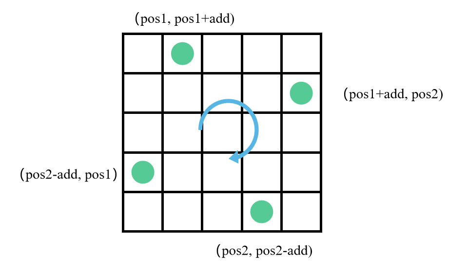

# 子数组问题

序号|题号|题目|难度|完成度|备注
--|--|--|--|--|--
1|53|最大子序和|🟢|✔|
2|152|乘积最大子序列|🟡|✔|
3|78|子集|🟡|✔|
4| | 最长连续序列||
5|713|乘积小于K的子数组|🟡|✔|
6|560| 和为K的子数组|🟡|✔|
7| | 可被K整除的子数组||
8| | 三个无重叠子数组的最大和||
9| | 最长重复子数组||
10| | 匹配子序列的单词数||
11| | 区间子数组个数||
12| | 子数组的最小值之和||
13| | 子序列宽度之和||
14| | 环形子数组的最大和||
15| | 最长湍流子数组||
16| | 两个非重叠子数组的最大和||
17| | 子数组中占绝大多数的元素||


🟢🔴🟡✔✖


## 最大子序和
**描述**：

```
给定一个整数数组 nums ，找到一个具有最大和的连续子数组（子数组最少包含一个元素），返回其最大和。

示例:

输入: [-2,1,-3,4,-1,2,1,-5,4],
输出: 6
解释: 连续子数组 [4,-1,2,1] 的和最大，为 6。

进阶:

如果你已经实现复杂度为 O(n) 的解法，尝试使用更为精妙的分治法求解。
```

**思路**：

本题最为经典和广泛的解法是应用动态规划的思想来解答，其时间复杂度为 O(n)。题目中鼓励尝试使用更为精妙的分治法求解，通过翻阅相关解答和评论发现，分治法并没有动态规划解答的优雅，其时间复杂度为 O(nlogn)，也并不是最优。所以，介绍一下应用动态规划解题的思路。

从数组第一个元素开始遍历，用一个一维数组存储遍历到当前元素的最大连续子数组的和。

当遍历到第 i 个元素时，如果前 i-1 和元素中连续子数组和加上第 i 个元素时比第 i 个元素的值要大，那么就更新 dp[i] = dp[i-1] + nums[i]，否则 dp[i] = nums[i]。

备注：动态规划
```cpp
int maxSubArray(vector<int> &nums)
{
    //类似寻找最大最小值的题目，初始值一定要定义成理论上的最小最大值
    int result = INT_MIN;
    //dp[i]表示nums中以nums[i]结尾的最大子序和
    vector<int> dp(nums.size());
    dp[0] = nums[0];
    result = dp[0];
    for (int i = 1; i < nums.size(); i++)
    {
        dp[i] = max(dp[i - 1] + nums[i], nums[i]);
        result = max(result, dp[i]);
    }

    return result;
}
```

## 乘积最大子序列


题目描述：

```
给你一个整数数组 nums ，请你找出数组中乘积最大的连续子数组（该子数组中至少包含一个数字），并返回该子数组所对应的乘积。


示例 1:

输入: [2,3,-2,4]
输出: 6
解释: 子数组 [2,3] 有最大乘积 6。
示例 2:

输入: [-2,0,-1]
输出: 0
解释: 结果不能为 2, 因为 [-2,-1] 不是子数组。
```

解题思路：

这题其实是例1 最大子序和一个变例，由加法变换成了乘法操作（依旧是应用动态规划的思路）。此时需要做的改变是定义两个变量来存储当前子序列的乘积，一个是保存最大值，一个是保存最小值（包含负数的子序列）。

这题是求数组中子区间的最大乘积，对于乘法，我们需要注意，负数乘以负数，会变成正数，所以解这题的时候我们需要维护两个变量，当前的最大值，以及最小值，最小值可能为负数，但没准下一步乘以一个负数，当前的最大值就变成最小值，而最小值则变成最大值了。

动态方程可能这样：

```
maxDP[i + 1] = max(maxDP[i] * A[i + 1], A[i + 1], minDP[i] * A[i + 1])
minDP[i + 1] = min(minDP[i] * A[i + 1], A[i + 1], maxDP[i] * A[i + 1])
dp[i + 1] = max(dp[i], maxDP[i + 1])
```
这里，我们还需要注意元素为 0 的情况，如果 A[i] 为 0，那么 maxDP 和 minDP 都为 0，我们需要从 A[i + 1] 重新开始。

备注：动态规划
```cpp
int maxProduct(vector<int> &nums)
{
    int n = nums.size();
    if (n == 0) {
        return 0;
    }
    else if (n == 1) {
        return nums[0];
    }

    int p = nums[0];
    int maxP = nums[0];
    int minP = nums[0];
    for (int i = 1; i < n; i++) {
        int temp = maxP;
        maxP = max(max(maxP * nums[i], nums[i]), minP * nums[i]);
        minP = min(min(temp * nums[i], nums[i]), minP * nums[i]);
        p = max(maxP, p);
    }
    return p;
}
```

## 子集
> 可参考子集II, 题号90，难度：中等

**描述**：

```
给定一组不含重复元素的整数数组 nums，返回该数组所有可能的子集（幂集）。

说明：解集不能包含重复的子集。

示例:

输入: nums = [1,2,3]
输出:
[
  [3],
  [1],
  [2],
  [1,2,3],
  [1,3],
  [2,3],
  [1,2],
  []
]
```

**思路**：

本题考查我们应用回溯来求解所有子集的问题，在一些算法教材中最经典的问题时求解全排列的问题，解法和这道题类似。

此题需要特别注意的是，首先采用链表在递归过程中添加元素，在回溯时删除元素，能够有效提高时间效率。其次，给递归调用程序设计一个start参数，可以避免同一个元素被重复递归调用，达到了剪枝效果。

最后，在结果列表中采用重新创建一个列表存储子集的结果，是因为在递归函数中列表参数只对应一个地址，采用重新创建相当于应用了深拷贝的思想，避免了结果均为空集的情况。

备注：采用回溯算法
```cpp
class Solution
{
public:
    vector<vector<int>> subsets(vector<int> &nums)
    {
        vector<vector<int>> res;
        vector<int> tmp;
        helper(nums, 0, tmp, res);
        return res;
    }
    void helper( vector<int> &nums, int level, vector<int> tmp, vector<vector<int>> &res)
    {
        if (tmp.size() <= nums.size())
        {
            res.push_back(tmp);
        }
        for (int i = level; i < nums.size(); i++)
        {
            tmp.push_back(nums[i]);
            helper(nums, i + 1, tmp, res);
            tmp.pop_back();
        }
    }
};
```


## 乘积小于K的子数组
**描述**：

```
给定一个正整数数组 nums。

找出该数组内乘积小于 k 的连续的子数组的个数。

示例 1:

输入: nums = [10,5,2,6], k = 100
输出: 8
解释: 8个乘积小于100的子数组分别为: [10], [5], [2], [6], [10,5], [5,2], [2,6], [5,2,6]。
需要注意的是 [10,5,2] 并不是乘积小于100的子数组。

说明:

0 < nums.length <= 50000
0 < nums[i] < 1000
0 <= k < 10^6
```

**思路**：

本题考查应用双指针的思想，一前一后同时往后遍历。

备注：双指针加滑动窗口

```
窗口：注意每次循环 right 都会前进一步
窗口        left right  size
[10]         0     1     1
[10,5]       0     2     2
[5,2]        1     3     2
[5,2,6]      1     4     3
```

```cpp
int numSubarrayProductLessThanK(vector<int> &nums, int k)
{
    int target = 1, count = 0;
    size_t left = 0, right = 0;
    while (right < nums.size())
    {
        target *= nums[right++];
        while (target >= k && right > left)
            target /= nums[left++];
        count += (right - left);
    }
    return count;
}
```


## 和为K的子数组
**描述**：

```
给定一个整数数组和一个整数 k，你需要找到该数组中和为 k 的连续的子数组的个数。

示例 1 :

输入:nums = [1,1,1], k = 2
输出: 2 , [1,1] 与 [1,1] 为两种不同的情况。

说明 :

数组的长度为 [1, 20,000]。
数组中元素的范围是 [-1000, 1000] ，且整数 k 的范围是 [-1e7, 1e7]。
```

**思路**：

本题采用哈希表存储从数组第一个元素不断往后的子序列和，然后判断到当前元素的序列总和减去 K 的值在哈希表中有多少个，即为包含当前元素的子序列可以得到目标结果，利用前后子序列的差可以得到目标子序列和为 K。

```cpp
int subarraySum(vector<int> &nums, int k)
{
	int sum = 0, res = 0;
	// 需注意：这里前缀和多了一个0，防止漏掉数组的前缀和刚好等于k的情况
	// 空数组的前缀和为0，所以前缀和为0的连续子数组个数初始化为1
	unordered_map<int, int> um{ { 0, 1 } };
	for (int &num : nums)
	{
		sum += num;
		res += um[sum - k]; //加上前缀和为 sum - k 的数组的个数
		um[sum]++;//前缀和为sum的个数++，这条语句要写在后面，写在前面有可能自己用到了自己。
	}
	return res;
}
```


# 矩阵问题

序号|题号|题目|难度|完成度|备注
--|--|--|--|--|--
1|119|杨辉三角 II|🟢|✔|
2|54|螺旋矩阵|🟡|✔|
3|48|旋转图像|🟡|✔|


🟢🔴🟡✔


## 杨辉三角 II
> 可参考 杨辉三角，题号：118，难度：简单）

**描述**：

```
给定一个非负索引 k，其中 k ≤ 33，返回杨辉三角的第 k 行。

在杨辉三角中，每个数是它左上方和右上方的数的和。

示例:
    输入: 3
    输出: [1,3,3,1]

进阶：

你可以优化你的算法到 O(k) 空间复杂度吗？
```


**思路**：

依据杨辉三角的规律，当前行的数据和上一行的数据有着递推关系：`dp[i][j] = dp[i-1][j-1] + dp[i-1][j]`。依据该递推公式可以写一个较为清晰的动态规划解法，其空间复杂度为O(k)。但是，也可以采用递归的思想来解决。此处提供一个应用递归思想来解决该问题的代码。

递归：
```cpp
vector<int> getRow(int rowIndex) {
    if (rowIndex == 0)
        return vector<int>(1, 1);
    if (rowIndex == 1)
        return vector<int>(2, 1);
    
    vector<int> vecc = getRow(rowIndex - 1);
    vector<int> vecz(vecc.size() + 1, 1);
    
    for (int i = 1; i < vecc.size(); i++) {
        vecz[i] = vecc[i - 1] + vecc[i];
    }
    return vecz;
}
```

**思路 2**：

todo: 不理解

因为我们只需要返回第 k 行的结果，所以相比于前一题，我们不需要记录整个三角形的数，只需要对一行数组不断循环操作即可。[链接](https://leetcode-cn.com/problems/pascals-triangle-ii/solution/c-brief-solution-by-easier/)。

```
1
1 1
1 2 1
1 3 3 1
从第二个数开始都是上一级 自身 + 前一位之和
```

```cpp
vector<int> getRow(int rowIndex) {
    vector<int> res(rowIndex + 1, 0);
    res[0] = 1;
    for (int i = 1; i < rowIndex + 1; i++) {
        for (int j = i; j >= 1; j--)
            res[j] += res[j - 1];
    }

    return res;
}
```


## 螺旋矩阵
**描述**：

```
给定一个包含 m x n 个元素的矩阵（m 行, n 列），请按照顺时针螺旋顺序，返回矩阵中的所有元素。

示例 1:

输入:
[
 [ 1, 2, 3 ],
 [ 4, 5, 6 ],
 [ 7, 8, 9 ]
]
输出: [1,2,3,6,9,8,7,4,5]

示例 2:

输入:
[
  [1, 2, 3, 4],
  [5, 6, 7, 8],
  [9,10,11,12]
]
输出: [1,2,3,4,8,12,11,10,9,5,6,7]
```

**思路**：

[这种方法](https://leetcode-cn.com/problems/spiral-matrix/solution/cxiang-xi-ti-jie-by-youlookdeliciousc-3/)不需要记录已经走过的路径：
1. 首先设定上下左右边界
2. 其次向右移动到最右，此时第一行因为已经使用过了，可以将其从图中删去，体现在代码中就是重新定义上边界
3. 判断若重新定义后，上下边界交错，表明螺旋矩阵遍历结束，跳出循环，返回答案
4. 若上下边界不交错，则遍历还未结束，接着向下向左向上移动，操作过程与第一，二步同理
5. 不断循环以上步骤，直到某两条边界交错，跳出循环，返回答案

```cpp
vector<int> spiralOrder(vector<vector<int>>& matrix) {
    vector <int> ans;
    // 若数组为空，直接返回答案
    if(matrix.empty()) 
        return ans; 
    
    // 赋值上下左右边界
    int u = 0; 
    int d = matrix.size() - 1;
    int l = 0;
    int r = matrix[0].size() - 1;
    while(true)
    {
        for(int i = l; i <= r; ++i) ans.push_back(matrix[u][i]); //向右移动直到最右
        if(++ u > d) break; //重新设定上边界，若上边界大于下边界，则遍历完成，下同
        for(int i = u; i <= d; ++i) ans.push_back(matrix[i][r]); //向下
        if(-- r < l) break; //重新设定有边界
        for(int i = r; i >= l; --i) ans.push_back(matrix[d][i]); //向左
        if(-- d < u) break; //重新设定下边界
        for(int i = d; i >= u; --i) ans.push_back(matrix[i][l]); //向上
        if(++ l > r) break; //重新设定左边界
    }
    return ans;
}
```

**思路 2**：未整理

这题只需要不停的往内顺时针旋转访问即可。但是，在实现代码时需要注意边界的问题，可以给访问过的元素做一个标记，或者统计当前已经访问的元素个数，这样更加有利于判断访问结束的时间节点。

```java
class Solution {
    public List<Integer> spiralOrder(int[][] matrix) {
        if(matrix.length == 0)
            return new ArrayList<Integer>();
        List<Integer> result = new ArrayList<>();
        int start_x = 0, start_y = 0;
        int max_x = matrix.length, max_y = matrix[0].length;
        int len = matrix.length * matrix[0].length;

        while(result.size() < len) {
            int x = start_x, y = start_y;

            for(;y < max_y && result.size() < len;y++)
                result.add(matrix[x][y]);  // 向右
            y = y -1;
            for(x = x + 1;x < max_x && result.size() < len;x++)
                result.add(matrix[x][y]);  // 向下
            x = x - 1;
            for(y = y -1;y >= start_y && result.size() < len;y--)
                result.add(matrix[x][y]);  // 向左
            y = y + 1;
            for(x = x - 1;x > start_x && result.size() < len;x--)
                result.add(matrix[x][y]);  // 向上

            max_x--;
            max_y--;
            start_x++;
            start_y++;
        }

        return result;
    }
}
```


## 旋转图像
**描述**：

```
给定一个 n × n 的二维矩阵表示一个图像。

将图像顺时针旋转 90 度。

说明：

你必须在原地旋转图像，这意味着你需要直接修改输入的二维矩阵。请不要使用另一个矩阵来旋转图像。

示例 1:

给定 matrix = 
[
  [1,2,3],
  [4,5,6],
  [7,8,9]
],

原地旋转输入矩阵，使其变为:
[
  [7,4,1],
  [8,5,2],
  [9,6,3]
]

示例 2:

给定 matrix =
[
  [ 5, 1, 9,11],
  [ 2, 4, 8,10],
  [13, 3, 6, 7],
  [15,14,12,16]
], 

原地旋转输入矩阵，使其变为:
[
  [15,13, 2, 5],
  [14, 3, 4, 1],
  [12, 6, 8, 9],
  [16, 7,10,11]
]
```

**思路**：[对应旋转，逐层收缩](https://leetcode-cn.com/problems/rotate-image/solution/li-kou-48xiao-bai-du-neng-kan-dong-de-fang-fa-zhu-/)

依据正方形矩阵不停往内进行旋转转圈，每次转动的步数为边长长度减去 1 的大小，每往内旋转一步，正方形边长减  2。另外，看到 LeetCode 评论的解答思路，有一个很有意思：把矩阵翻转两次，第一次沿着主对角线翻转，第二次沿着垂直中线翻转。



```cpp
void rotate(vector<vector<int>> &matrix) {
    int pos1 = 0, pos2 = matrix.size() - 1;
    int add, temp;
    while (pos1 < pos2) {
        add = 0;
        while (add < pos2 - pos1) {
            temp = matrix[pos2 - add][pos1];
            matrix[pos2 - add][pos1] = matrix[pos2][pos2 - add];
            matrix[pos2][pos2 - add] = matrix[pos1 + add][pos2];
            matrix[pos1 + add][pos2] = matrix[pos1][pos1 + add];
            matrix[pos1][pos1 + add] = temp;
            add++;
        } //左上角为0块，右上角为1块，右下角为2块，左下角为3块
        pos1++;
        pos2--;
    }
}
```


