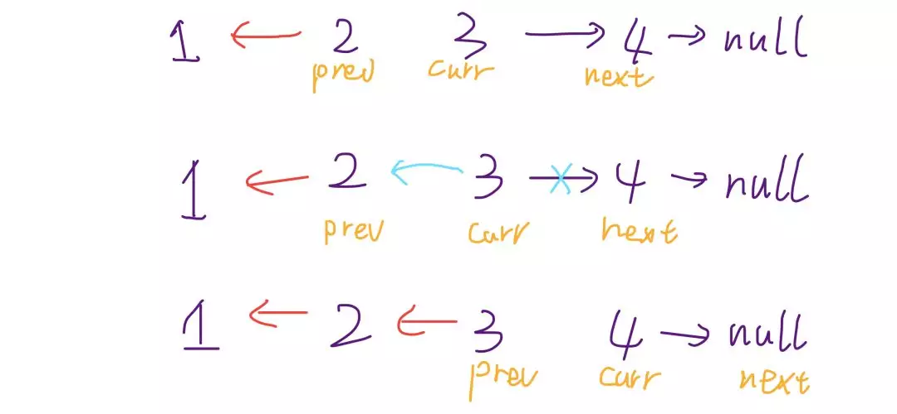
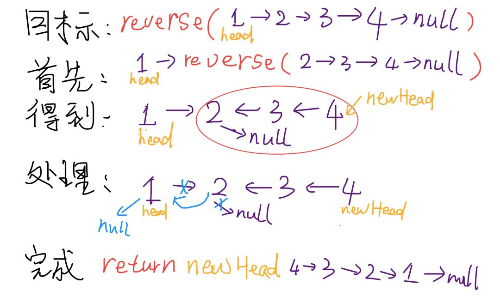
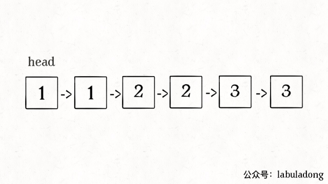

# 类型
节点定义：

```cpp
struct ListNode {
    int val;
    ListNode *next;
    ListNode(int x) : val(x), next(nullptr) { }
};
```


题号|题目|难度|完成度|备注
--|--|--|--|--
**148**|[排序链表](#排序链表)|🟡|✔|从下到上的归并排序（对应 6.5）
24|[两两交换链表中的节点](#两两交换链表中的节点)|🟡|✔|递归和迭代（对应 2.2.8）
206|[反转链表](#反转链表)|🟢|✔|递归和迭代
92|[反转链表 II](#反转链表-ii)|🟡|✔|迭代（对应 2.2.2）
83|[删除排序链表中的重复元素](#删除排序链表中的重复元素)|🟢|✔|快慢指针（对应 2.2.4）
82|[删除排序链表中的重复元素 II](#删除排序链表中的重复元素-ii)|🟡|✔|维持一个 pre 指针（对应 2.2.5）
21|[合并两个有序链表](#合并两个有序链表)|🟢|✔|递归和迭代（对应 6.2）
2|[两数相加](#两数相加)|🟡|✔|重建1条链表（对应 2.2.1）
86|[分隔链表](#分隔链表)|🟡|✔|维护2条链表（对应 2.2.3）
61|[旋转链表](#旋转链表)|🟡|✔|首尾循环（对应 2.2.6）
19|删除链表的倒数第N个节点|🟡|✔|在 “双指针” 的快慢指针专题中（对应 2.2.7）
141|环形链表|🟢|✔|在 “双指针” 的快慢指针专题中（对应 2.2.11）
142|环形链表 II|🟡|✔|在 “双指针” 的快慢指针专题中（对应 2.2.12）
143|重排链表|🟡|✔|找到中间点，把后半截反转再合并2个链表（对应 2.2.13）


2.2 单链表一章已整理完成

尚未完成：
题号|题目|难度|完成度|备注
--|--|--|--|--
23|合并K个排序链表|🔴||（对应 6.3）
25|K 个一组翻转链表|🔴||（对应 2.2.9）
138|复制带随机指针的链|||（对应 2.2.10）


🟢 🔴 🟡 ✔ ✖

# LeetCode
## 排序链表
**描述**：

```
在 O(n log n) 时间复杂度和常数级空间复杂度下，对链表进行排序。

示例 1:

输入: 4->2->1->3
输出: 1->2->3->4

示例 2:

输入: -1->5->3->4->0
输出: -1->0->3->4->5
```

**思路**：

由于题目要求空间复杂度是 O(1)，因此不能使用递归。因此这里使用 bottom-to-up 的算法：先 2 个 2 个的 merge，完成一趟后，再 4 个 4 个的 merge，直到结束。例如：

```
        [4,3,1,7,8,9,2,11,5,6]
step=1: (3->4)->(1->7)->(8->9)->(2->11)->(5->6)
step=2: (1->3->4->7)->(2->8->9->11)->(5->6)
step=4: (1->2->3->4->7->8->9->11)->5->6
step=8: (1->2->3->4->5->6->7->8->9->11)
```

链表里操作最难掌握的应该就是各种断链啊，然后再挂接啊。在这里，我们主要用到链表操作的 3 个技术：
- `merge(l1, l2)`，双路归并
- `cut(l, n)`，其实就是一种 split 操作，即断链操作。表示将链表 l 切掉前 n 个节点，并返回后半部分的链表头。
- 再额外补充一个 dummy 大法

**伪代码**：
```cpp
current = dummy.next;
tail = dummy;
for (step = 1; step < length; step *= 2) {
	while (current) {
		// left->@->@->@->@->@->@->null
		left = current;

		// left->@->@->null   right->@->@->@->@->null
		right = cut(current, step); // 将 current 切掉前 step 个头切下来。

		// left->@->@->null   right->@->@->null   current->@->@->null
		current = cut(right, step); // 将 right 切掉前 step 个头切下来。

		// dummy.next -> @->@->@->@->null，最后一个节点是 tail，始终记录
		//                        ^
		//                        tail
		tail.next = merge(left, right);
		while (tail->next)
            tail = tail->next; // 保持 tail 为尾部
	}
}
```

备注：未仔细查看
```cpp
class Solution
{
public:
    ListNode *sortList(ListNode *head)
    {
        ListNode dummyHead(0);
        dummyHead.next = head;
        auto p = head;
        int length = 0;
        while (p)
        {
            ++length;
            p = p->next;
        }

        for (int size = 1; size < length; size <<= 1)
        {
            auto curr = dummyHead.next;
            auto tail = &dummyHead;

            while (curr)
            {
                auto left = curr;
                auto right = cut(left, size); // left->@->@ right->@->@->@...
                curr = cut(right, size);       // left->@->@ right->@->@  curr->@->...

                tail->next = merge(left, right);
                while (tail->next)
                {
                    tail = tail->next;
                }
            }
        }
        return dummyHead.next;
    }

    ListNode *cut(ListNode *head, int n)
    {
        auto p = head;
        while (--n && p)
        {
            p = p->next;
        }

        if (!p)
            return nullptr;

        auto next = p->next;
        p->next = nullptr;
        return next;
    }

    ListNode *merge(ListNode *l1, ListNode *l2)
    {
        ListNode dummyHead(0);
        auto p = &dummyHead;
        while (l1 && l2)
        {
            if (l1->val < l2->val)
            {
                p->next = l1;
                p = l1;
                l1 = l1->next;
            }
            else
            {
                p->next = l2;
                p = l2;
                l2 = l2->next;
            }
        }
        p->next = l1 ? l1 : l2;
        return dummyHead.next;
    }
};
```

备注：未仔细看

```cpp
class Solution
{
public:
    ListNode *sortList(ListNode *head)
    {
        if (head == NULL || head->next == NULL)
            return head;
        // 快慢指针找到中间节点
        ListNode *fast = head, *slow = head;
        while (fast->next != NULL && fast->next->next != NULL)
        {
            fast = fast->next->next;
            slow = slow->next;
        }
        // 断开
        fast = slow;
        slow = slow->next;
        fast->next = NULL;
        ListNode *l1 = sortList(head); // 前半段排序
        ListNode *l2 = sortList(slow); // 后半段排序
        return mergeTwoLists(l1, l2);
    }
    // Merge Two Sorted Lists
    ListNode *mergeTwoLists(ListNode *l1, ListNode *l2)
    {
        ListNode dummy(-1);
        for (ListNode *p = &dummy; l1 != nullptr || l2 != nullptr; p = p->next)
        {
            int val1 = l1 == nullptr ? INT_MAX : l1->val;
            int val2 = l2 == nullptr ? INT_MAX : l2->val;
            if (val1 <= val2)
            {
                p->next = l1;
                l1 = l1->next;
            }
            else
            {
                p->next = l2;
                l2 = l2->next;
            }
        }
        return dummy.next;
    }
};
```


## 两两交换链表中的节点
**描述**：

```
给定一个链表，两两交换其中相邻的节点，并返回交换后的链表。

你不能只是单纯的改变节点内部的值，而是需要实际的进行节点交换。

示例:

给定 1->2->3->4, 你应该返回 2->1->4->3.
```

**思路**：

迭代法：

```cpp
ListNode *swapPairs(ListNode *head)
{
    // 创建虚拟结点
    ListNode *p = new ListNode(0);
    p->next = head;
    // p 始终指向头结点，curr 则参与计算，不断变化
    ListNode *curr = p;
    // 循环条件为当前节点为NULL或当前的下一个节点为 NULL
    // 分别对应偶数和奇数个节点的终止标志
    while (head != NULL && head->next != NULL)
    {
        ListNode *first = head;
        ListNode *second = head->next;

        curr->next = second;
        first->next = second->next;
        second->next = first;

        curr = first;
        head = first->next;
    }
    return p->next;
}
```

递归法：

```cpp
ListNode *swapPairs(ListNode *head)
{
    if (head == NULL || head->next == NULL)
        return head;

    // 递归单元内两个节点做交换
    ListNode *p = head->next;
    ListNode *temp = p->next;
    p->next = head;

    head->next = swapPairs(temp);
    return p;
}
```


## 删除排序链表中的重复元素 II
**描述**：

```
给定一个排序链表，删除所有含有重复数字的节点，只保留原始链表中 没有重复出现的数字。

示例 1:

输入: 1->2->3->3->4->4->5
输出: 1->2->5
示例 2:

输入: 1->1->1->2->3
输出: 2->3
```

备注：也就是说将出现重复的点**全部删掉**，而不是去重

**思路**：

```cpp
ListNode *deleteDuplicates(ListNode *head)
{
    ListNode temp(-1);
    ListNode *dummy = &temp;
    // 保存头结点
    ListNode *tmp = dummy;
    dummy->next = head;
    while (dummy && dummy->next && dummy->next->next)
    {
        if (dummy->next->next->val == dummy->next->val)
        {
            int k = dummy->next->val;
            dummy->next = dummy->next->next->next;
            while (dummy->next != NULL && dummy->next->val == k)
                dummy->next = dummy->next->next;
        }
        else
            dummy = dummy->next;
    }
    return tmp->next;
}
```

## 反转链表
```
反转一个单链表。

示例:

输入: 1->2->3->4->5->NULL
输出: 5->4->3->2->1->NULL

进阶:
    你可以迭代或递归地反转链表。你能否用两种方法解决这道题？
```

**思路**：

迭代法：

```cpp
ListNode* reverseList(ListNode* head) {
    if (head == NULL)
        return NULL;

    ListNode *curr = head;
    ListNode *prev = NULL;

    while (curr != NULL){
        ListNode* temp = curr->next;
        curr->next = prev;
        prev = curr;
        curr = temp;
    }
    return prev;
}
```



递归法：

```cpp
ListNode* reverseList(ListNode* head) {
    if (head == NULL || head->next == NULL)
        return head;

    ListNode* ret = reverseList(head->next);
    head->next->next = head;
    head->next = NULL;

    return ret;
}
```




## 反转链表 II
**描述**：

```
反转从位置 m 到 n 的链表。请使用一趟扫描完成反转。

说明:
1 ≤ m ≤ n ≤ 链表长度。

示例:

输入: 1->2->3->4->5->NULL, m = 2, n = 4
输出: 1->4->3->2->5->NULL
```

**思路**：

需要找到第一个开始变换结点的**前一个结点**，只要让 pre 向后走 m-1 步即可，为啥要减 1 呢，因为题目中是从 1 开始计数的，这里只走了 1 步，就是结点 1，用 pre 指向它。万一是结点 1 开始变换的怎么办，这就是我们为啥要用 dummy 结点了，pre 也可以指向 dummy 结点。然后就要开始交换了，由于一次只能交换两个结点，所以我们按如下的交换顺序：

```
1 -> 2 -> 3 -> 4 -> 5 -> NULL
1 -> 3 -> 2 -> 4 -> 5 -> NULL
1 -> 4 -> 3 -> 2 -> 5 -> NULL
```

我们可以看出来，总共需要 n-m 步即可：

1. 是将结点 3 放到结点 1 的后面
2. 将结点 4 放到结点 1 的后面

这是很有规律的操作。比如刚开始，pre 指向结点 1，cur 指向结点 2，然后我们建立一个临时的结点 temp，指向结点 3（注意我们用临时变量保存某个结点就是为了首先断开该结点和前面结点之间的联系，这可以当作一个规律记下来），然后我们断开结点 2 和结点 3，将结点 2 的 next 连到结点 4 上，也就是 `curr->next = temp->next`，再把结点 3 连到结点 1 的后面结点（即结点 2）的前面，即 `temp->next = pre->next`，最后再将原来的结点 1 和结点 2 的连接断开，将结点 1连到结点 3，即 `pre->next = temp` 。这样我们就完成了将结点 3 取出，加入结点 1 的后方。第二步将结点 4 取出，加入结点 1 的后方，也是同样的操作。

```cpp
ListNode *reverseBetween(ListNode *head, int m, int n)
{
    ListNode *dummy = new ListNode(-1);
    ListNode *pre = dummy;
    dummy->next = head;

    // 遍历找到该第一个节点的前一个点
    for (int i = 0; i < m - 1; i++)
        pre = pre->next;
    
    ListNode *curr = pre->next;
    // 循环内的操作跟 i 无关
    for (int i = m; i < n; i++)
    {
        ListNode *temp = curr->next;
        curr->next = temp->next;
        // 注意：由于 curr 保持不变的 next 一直在变化
        temp->next = pre->next;
        pre->next = temp;
    }
    return dummy->next;
}
```


## 删除排序链表中的重复元素
再简单扩展一下，如果给你一个**有序链表**，如何去重呢：其实和数组是一模一样的，唯一的区别是把数组赋值操作变成操作指针而已：

**描述**：

```
给定一个排序链表，删除所有重复的元素，使得每个元素只出现一次。

示例 1:
    输入: 1->1->2
    输出: 1->2
示例 2:
    输入: 1->1->2->3->3
    输出: 1->2->3
```

```cpp
ListNode* deleteDuplicates(ListNode* head) {
    if (head == NULL)
        return NULL;

    ListNode *slow = head;
    ListNode *fast = head->next;
    while (fast != NULL)
    {
        if (fast->val != slow->val)
        {
            slow->next = fast;
            slow = slow->next;
        }
        fast = fast->next;
    }

    // 断开与后面重复元素的连接
    slow->next = NULL;
    return head;
}
```




## 合并两个有序链表
**描述**：

```
将两个升序链表合并为一个新的 升序 链表并返回。新链表是通过拼接给定的两个链表的所有节点组成的。 

示例：

输入：1->2->4, 1->3->4
输出：1->1->2->3->4->4
```

迭代法：

使用虚拟头结点 dummy，逐一拼接

时间复杂度：`O(min(m, n))`，空间复杂度：`O(1)`
```cpp
ListNode* mergeTwoLists(ListNode* l1, ListNode* l2) {
    if (l1 == NULL || l2 == NULL)
        return l1 == NULL ? l2 : l1;
    
    ListNode *dummy = new ListNode(0);
    ListNode *p = dummy;
    
    while (l1 != NULL && l2 != NULL) {
        if (l1->val > l2->val) {
            p->next = l2;
            l2 = l2->next;
        } else {
            p->next = l1;
            l1 = l1->next;
        }
        p = p->next;
    }
    
    p->next = l1 == NULL ? l2 : l1;
    return dummy->next;
}
```


递归法：

总的逻辑就是：抽出当前两个节点中（head1 和 head2 中）较小的那个，然后把剩下的烂摊子丢给递归，因为剩下的问题和原问题具有相同结构，且减小了规模。

```cpp
ListNode* mergeTwoLists(ListNode* l1, ListNode* l2) {
    if (l1 == NULL || l2 == NULL)
        return l1 == NULL ? l2 : l1;
        
    if (l1->val > l2->val) {
        l2->next = mergeTwoLists(l1, l2->next);
        return l2;
    } else {
        l1->next = mergeTwoLists(l1->next, l2);
        return l1;
    }
}
```


优化
```cpp
ListNode *mergeTwoLists(ListNode *l1, ListNode *l2) {
    if (l1 == NULL || l2 == NULL)
        return l1 == NULL ? l2 : l1;
    
    // 保证 head1 总是值较小的
    if (l1->val > l2->val)
        std::swap(l1, l2);
    l1->next = mergeTwoLists(l1->next, l2);
    return l1;
}
```

## 两数相加
**描述**：

```
给出两个 非空 的链表用来表示两个非负的整数。其中，它们各自的位数是按照 逆序 的方式存储的，并且它们的每个节点只能存储 一位 数字。

如果，我们将这两个数相加起来，则会返回一个新的链表来表示它们的和。

您可以假设除了数字 0 之外，这两个数都不会以 0 开头。

示例：

输入：(2 -> 4 -> 3) + (5 -> 6 -> 4)
输出：7 -> 0 -> 8
原因：342 + 465 = 807
```

**思路**：

重建一条链表

时间复杂度 `O(m+n)`、空间复杂度 `O(1)`
```cpp
class Solution {
public:
    ListNode *addTwoNumbers(ListNode *l1, ListNode *l2) {
        ListNode dummy(-1); // 头节点
        ListNode *prev = &dummy;
        int carry = 0; // 用于记录是否进位
        ListNode *temp1 = l1, *temp2 = l2;
        int val1 = 0, val2 = 0; // 节点对应的值
        
        while(temp1 != NULL || temp2 != NULL) {
            val1 = temp1 == NULL ? 0 : temp1->val;
            val2 = temp2 == NULL ? 0 : temp2->val;
            
            int value = (val1 + val2 + carry) % 10;
            carry = (val1 + val2 + carry) / 10;
            
            prev->next = new ListNode(value); // 尾插法

            temp1 = temp1 == NULL ? NULL : temp1->next;
            temp2 = temp2 == NULL ? NULL : temp2->next;
            prev = prev->next;
        }
        if (carry > 0)
            prev->next = new ListNode(carry);
        return dummy.next;
    }
};
```

## 分隔链表
**描述**：

```
给定一个链表和一个特定值 x，对链表进行分隔，使得所有小于 x 的节点都在大于或等于 x 的节点之前。

你应当保留两个分区中每个节点的初始相对位置。

示例:

输入: head = 1->4->3->2->5->2, x = 3
输出: 1->2->2->4->3->5
```

**思路**：

使用了 2 条链表分别存储，最后再进行合并。

时间复杂度：`O(n)`、空间复杂度：`O(1)`

```cpp
class Solution {
public:
    ListNode *partition(ListNode *head, int x) {
        ListNode first_dummy(-1);  // 头节点
        ListNode second_dummy(-1); // 头节点
        ListNode *first  = &first_dummy;
        ListNode *second = &second_dummy;
        ListNode *curr = head;

        while (curr != NULL) {
            if (curr->val < x) {
                first->next = curr;
                first = curr;
            }
            else {
                second->next = curr;
                second = curr;
            }
            curr = curr->next;
        }

        first->next = second_dummy.next;
        second->next = NULL;
        return first_dummy.next;
    }
};
```

## 旋转链表
**描述**：

```
给定一个链表，旋转链表，将链表每个节点向右移动 k 个位置，其中 k 是非负数。

示例 1:

输入: 1->2->3->4->5->NULL, k = 2
输出: 4->5->1->2->3->NULL
解释:
    向右旋转 1 步: 5->1->2->3->4->NULL
    向右旋转 2 步: 4->5->1->2->3->NULL

示例 2:

输入: 0->1->2->NULL, k = 4
输出: 2->0->1->NULL

解释:
    向右旋转 1 步: 2->0->1->NULL
    向右旋转 2 步: 1->2->0->NULL
    向右旋转 3 步: 0->1->2->NULL
    向右旋转 4 步: 2->0->1->NULL
```

**思路**：

先遍历一遍，得出链表长度 len，注意 k 可能大于 len，因此令 `k %= len`。将尾节点 next 指针指向首节点，形成一个环，接着**往后跑 `len - k` 步**，从这里断开，就是要求的结果了。

时间复杂度：`O(n)`、空间复杂度：`O(1)`

```cpp
class Solution {
public:
    ListNode *rotateRight(ListNode *head, int k) {
        if (head == NULL || k == 0)
            return head;

        int len = 1;
        ListNode *p = head;
        // 求长度
        while (p->next) { 
            len++;
            p = p->next;
        }
        // 此时的 p 指向尾节点，首尾相连
        p->next = head; 

        k = len - k % len;
        for (int step = 0; step < k; step++)
        {
            p = p->next; // 接着往后跑
        }
        // 此时的 p 指向尾部。则 p->next 是新的首节点
        head = p->next;
        // 断开环
        p->next = NULL; 
        return head;
    }
};
```

## 重排链表
**描述**：

```

给定一个单链表 L：L0→L1→…→Ln-1→Ln ，
将其重新排列后变为： L0→Ln→L1→Ln-1→L2→Ln-2→…

你不能只是单纯的改变节点内部的值，而是需要实际的进行节点交换。

示例 1:

给定链表 1->2->3->4, 重新排列为 1->4->2->3.

示例 2:

给定链表 1->2->3->4->5, 重新排列为 1->5->2->4->3.
```

**思路**：

题目规定要 in-place，也就是只能使用 O(1) 的空间。

可以找到中间节点，断开，把后半截链表反转一下，再合并 2 个链表。

时间复杂度：`O(n)`、空间复杂度：`O(1)`

```cpp
class Solution {
private:
    ListNode *reverse(ListNode *head) {
        if (head == NULL || head->next == NULL)
            return head;
        ListNode *prev = head;
        ListNode *curr = head->next;
        ListNode *next = curr->next;

        while (curr != NULL) {
            curr->next = prev;
            prev = curr;
            curr = next;
            next = next ? next->next : NULL;
        }

        head->next = NULL;
        return prev;
    }
public:
    void reorderList(ListNode *head) {
        if (head == NULL || head->next == NULL)
            return;

        ListNode *slow = head;
        ListNode *fast = head;
        ListNode *prev = NULL;

        while (fast && fast->next) {
            prev = slow;
            slow = slow->next;
            fast = fast->next->next;
        }
        // 从中间部分切开
        prev->next = NULL;
        // 反转链表
        slow = reverse(slow);
        
        // 合并2条链表
        ListNode *curr = head;
        while (curr->next) {
            ListNode *temp = curr->next;
            curr->next = slow;
            slow = slow->next;
            curr->next->next = temp;
            curr = temp;
        }
        // 无论奇偶
        curr->next = slow;
    }
};
```


# 参考资料
- [LeetCode刷题总结-栈、链表、堆和队列篇](https://www.cnblogs.com/liuzhen1995/p/12063330.html)
- [如何高效对有序数组/链表去重？](https://mp.weixin.qq.com/s?__biz=MzAxODQxMDM0Mw==&mid=2247484478&idx=1&sn=685308e10c32ee5ad3508a5789633b3a&chksm=9bd7fa36aca07320ecbae4a53ed44ff6acc95c69027aa917f5e10b93dedca86119e81c7bad26&scene=21#wechat_redirect)
- [递归反转链表](https://mp.weixin.qq.com/s?__biz=MzAxODQxMDM0Mw==&mid=2247484467&idx=1&sn=beb3ae89993b812eeaa6bbdeda63c494&chksm=9bd7fa3baca0732dc3f9ae9202ecaf5c925b4048514eeca6ac81bc340930a82fc62bb67681fa&scene=21#wechat_redirect)
- [递归实现链表操作](https://mp.weixin.qq.com/s?__biz=MzAxODQxMDM0Mw==&mid=2247484531&idx=1&sn=3a72d94271531b42c0fec60f89abd716&chksm=9bd7fa7baca0736d5476e74bf2ca82edfcac3e8e7302af70ccd3cd253f70d0ec2b2e30115547&scene=21#wechat_redirect)
