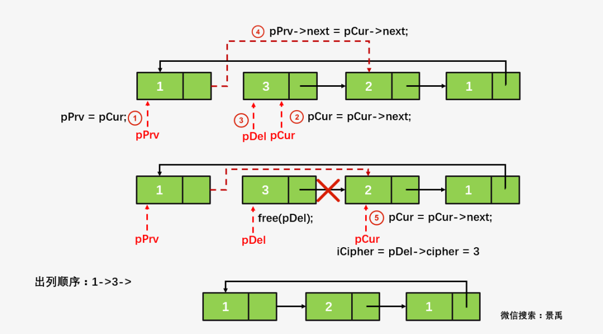

# 1. 特点
* 在<b>单链表</b>中，我们有了头结点时，我们可以用 `O(1)` 的时间访问第一个结点，但对于要访问的最后一个结点，我们必须挨个向下索引，所以需要 `O(n)`。
* 对于<b>循环链表</b>，用 `O(1)` 的时间就可以有链表指针访问到最后一个结点。我们定义一个用于指向终端结点的尾指针来表示循环链表，此时查找开始结点和终端结点就很方便了。


# 2. 题目
## 2.1. 将两个线性表连接成一个线性表
**题目**：实现将两个线性表连接成一个线性表的运算。

**分析**：

若在单链表或头指针表示的单链表上做这种链接操作，都需要遍历第一个链表，找到最后一个结点，然后将第二个链表链接到第一个的后面，其执行时间是 `O(n)`。

若在尾指针表示的单循环链表上实现，则只需要修改指针，无需遍历，其执行时间是 `O(1)`。

```cpp
// 注意循环链表的 A 和 B 所在的位置
LinkList Connect(LinkList A, LinkList B)
{
    LinkList p = A->next;
    A->next = B->next->next;

    free(B->next);

    B->next = p;

    return B;
}
```


## 2.2. 判断单链表中是否有环
> 有环的定义是：链表的尾结点指向了链表中的某个结点。

### 2.2.1. 方法1
使用 p，q 两个指针，p 总是向前走，但 q 每次都从头开始走，对于每个结点，看 p 走的步数是否和 q 一样。如上面的图，当 p 从 1 走到 3 时用了 5 步，此时若 q 从 head 出发，则需要两步就到了3，因而步数不等，出现矛盾，存在环。


```cpp
int HasLoop_StepCount(LinkList L)
{
    LinkList p = L; // 定义结点 p
    int step_p = 0; // 指针 p 走过的步数

    while(p) // p 结点存在
    { 
        LinkList q = L; // 定义结点 q
        int step_q = 0; // 指针 q 的步数
        while(q) // q 指向的结点不为空
        { 
            if(q == p) // 当p与q到达相同结点时
            { 
                if(step_p == step_q) // 走过的步数一样
                    break; // 说明没有环
                else
                {
                    printf("环的位置在第%d个结点处。\n\n", step_q);
                    return 1; // 有环并返回1
                }
            }
            q = q->next; // 如果没发现环，继续下一个结点
            step_q++; // step_q 步数自增
        }
        p = p->next; // p继续向后一个结点
        step_p++; // step_p 步数自增
    }
    return 0;
}
```

### 2.2.2. 方法2
使用 p，q 两个指针，p 每次向前走一步，q 每次向前走两步，若在某个时候 `p == q`，则存在环。(快慢指针法)


```cpp
int hasLoop_SpeedPointer(LinkList L)
{
    int step1 = 1;
    int step2 = 2;
    LinkList p = L;
    LinkList q = L;

    while(p != NULL && q != NULL && q->next != NULL)
    {
        p = p->next;
        if(q->next != NULL)
        {
            q = q->next->next;
        }

        printf("p:%d, q:%d\n", p->data, q->data);

        if(p == q)
            return 1;
    }
    return 0;
}
```

## 2.3. 魔术师发牌问题
**题目描述**：魔术师利用一副牌中的 13 张黑牌，预先将他们排好后叠放在一起，牌面朝下。对观众说：“我不看牌，只数数就可以猜到每张牌是什么，我大声数数，你们听，不信？现场演示。”魔术师将最上面的那张牌数为1，把他翻过来正好是黑桃A，将黑桃A放在桌子上，第二次数1,2，将第一张牌放在这些牌的下面，将第二张牌翻过来，正好是黑桃2，也将它放在桌子上这样依次进行将13张牌全部翻出，准确无误。

**问题**：牌的开始顺序是如何安排的？


```cpp
void Magician(LinkList head)
{
    LinkList p;
    int j;
    int Countnumber = 2;

    p = head;
    p->data = 1;

    while(1)
    {
        // 计数，找到位置
        for( j = 0; j < Countnumber; j++)
        {
            p = p->next;
            if(p->data != 0)
            {
                p = p->next;
                j--; //j--就相当于跳过已经有值的存储单元
            }
        }
        // 赋值替换
        if(p->data == 0)
        {
            p->data == CountNumber;
            CountNumber++;
            if(CountNumber == 14)
                break;
        }
    }
}
```

## 2.4. 拉丁方阵问题
> 拉丁方阵小故事：拉丁方阵追溯到 18 世纪的欧洲，据说普鲁士的腓特列大帝曾组成一支仪仗队。仪仗队共有 36 名军官，来自 6 支部队，每支部队中，上校、中校、少校、上尉、中尉、少尉各一名。他希望这 36 名军官排成 6×6 的方阵，方阵的每一行，每一列的 6 名军官来自不同的部队并且军衔各不相同。后来，他去求教瑞士著名的大数学家欧拉。欧拉发现这是一个不可能完成的任务。

**描述**：拉丁方阵是一种 n×n 的方阵，方阵中恰有 n 种不同的元素，每种元素恰有 n 个，并且每种元素在一行和一列中 恰好出现一次。著名数学家和物理学家欧拉使用拉丁字母来作为拉丁方阵里元素的符号，拉丁方阵因此而得名。

```cpp
// 【备注】：LinkList 应该是循环链表才成立
void Latin_square(LinkList head)
{
    LinkList p;
    int n; // 方阵的大小
    int i,j; // 计数器
    p = head;
    p_cur = head;

    for(i = 0; i < n; i++)
    {
        for(j = 0; i < n; j++)
        {
            printf("%d,", p_cur->data);
            p_cur = p_cur->next;
        }
        printf("\n");

        p = p->next;
        p_cur = p;
    }
}
```

## 2.5. 约瑟夫环问题
> 据说著名犹太历史学家 Josephus 有过以下的故事：在罗马人占领乔塔帕特后，39 个犹太人与 Josephus 及他的朋友躲到一个洞中，39 个犹太人决定宁愿死也不要被敌人抓到，于是决定了一个自杀方式，41 个人排成一个圆圈，由第 1 个人开始报数，每报数到**第 3 人**该人就必须自杀，然后再由下一个重新报数，直到所有人都自杀身亡为止。然而 Josephus 和他的朋友并不想遵从。首先从一个人开始，越过 k-2 个人（因为第一个人已经被越过），并杀掉第 k 个人。接着，再越过 k-1 个人，并杀掉第 k 个人。这个过程沿着圆圈一直进行，直到最终只剩下一个人留下，这个人就可以继续活着。问题是，给定了和，一开始要站在什么地方才能避免被处决？ Josephus 要他的朋友先假装遵从，他将朋友与自己安排在第 16 个与第 31 个位置，于是逃过了这场死亡游戏。


【备注】：16 和 31 是最后的两个位置。

### 2.5.1. C实现

```cpp
typedef struct node {
    int          data;
    struct node *next;
} node;

node *create(int n) {
    node *p = NULL, *head;
    //创建一个头结点
    head = (node *)malloc(sizeof(node));
    //指向当前结点的指针
    p = head;                      
    node *s;
    int   i = 1;

    if (0 != n) {
        while (i <= n) {
            s       = (node *)malloc(sizeof(node));
            s->data = i++;
            p->next = s;
            p       = s;
        }
        s->next = head->next;
    }

    free(head);

    return s->next;
}

int main() {
    int   n = 41;
    int   m = 3;
    int   i;
    node *p = create(n);
    node *temp;

    while (p != p->next) //不是空表执行while循环
    {
        for (i = 1; i < m - 1; i++) {
            p = p->next;
        }
        printf("%d->", p->next->data);
        temp    = p->next;
        p->next = temp->next;

        free(temp);

        p = p->next;
    }

    printf("%d\n", p->data);

    return 0;
}
/*
   3->6->9->12->15->18->21->24->27->30->33->36->39
    ->1->5->10->14->19->23->28->32->37->41
    ->7->13->20->26->34->40
    ->8->17->29->38
    ->11->25
    ->2->22
    ->4->35
    ->16->31
*/
```

### 2.5.2. C++实现

```cpp
#include <iostream>

class CGame {
private:
    struct node {
        int   data;
        node *next;
        node(int n)
            : data(n)
            , next(nullptr) {
        }
    };

    // 创建值从 1->n，含 n 个元素的循环链表
    node *create(int n) {
        // 创建一个头结点，只用于记录头结点的位置
        node *head = new node(-1);
        // 指向当前结点的指针
        node *p = head;

        node *s;
        int   i = 1;

        if (0 != n) {
            while (i <= n) {
                s       = new node(-1);
                s->data = i++;
                p->next = s;
                p       = s;
            }
            s->next = head->next;
        }

        delete head;
        return s->next;
    }

public:
    void start_game(int len, int gap) {
        node *p = create(len);

        int   i;
        node *temp;

        // p为循环链表，判断部分为检查p不是空表
        while (p != p->next) {
            // 单链表都是从 prev 指针操作
            for (i = 1; i < gap - 1; i++) {
                p = p->next;
            }

            std::cout << p->next->data << "->";
            temp    = p->next;
            p->next = temp->next;

            delete temp;

            p = p->next;
        }

        std::cout << p->data << std::endl;
    }
};

int main() {
    CGame game;
    int   len = 41;
    int   gap = 3;
    game.start_game(len, gap);

    return 0;
}
/*
   3->6->9->12->15->18->21->24->27->30->33->36->39
    ->1->5->10->14->19->23->28->32->37->41
    ->7->13->20->26->34->40
    ->8->17->29->38
    ->11->25
    ->2->22
    ->4->35
    ->16->31
*/
```


## 2.6. 约瑟夫环变体
<b>约瑟夫环变体，每一次 m 的值发生变化</b>。编号为 1～N 的 N 个人按顺时针方向围坐一圈，每人持有一个密码（正整数，可以自由输入），开始人选一个正整数作为报数上限值 M，从第一个人按顺时针方向自 1 开始顺序报数，报道 M 时停止报数。报 M 的人出列，将他的密码作为新的 M 值，从他顺时针方向上的下一个人开始从 1 报数，如此下去，直至所有人全部出列为止。




```cpp
static void StatGame(NodeType **ppHead, int iCipher)
{
    int iCounter, iFlag = 1;
    NodeType *pPrv, *pCur, *pDel;

    pPrv = pCur = *ppHead;
    /* 将pPrv初始为指向尾结点，为删除作好准备 */
    while (pPrv->next != *ppHead)
        pPrv = pPrv->next;

    while (iFlag)
    {
        for (iCounter = 1; iCounter < iCipher; iCounter++)
        {
            pPrv = pCur;
            pCur = pCur->next;
        }

        if (pPrv == pCur)
            iFlag = 0;

        pDel = pCur; /* 删除pCur指向的结点，即有人出列 */
        pPrv->next = pCur->next;
        pCur = pCur->next;
        iCipher = pDel->cipher;

        printf("第%d个人出列, 密码: %d\n", pDel->id, pDel->cipher);
        free(pDel);
    }
    *ppHead = NULL;
    getchar();
}
```
