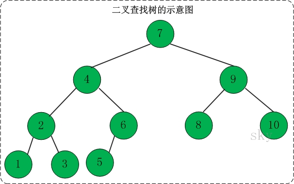

<h1 align="center">二叉树</h1>

* [1. 二叉树](#1-二叉树)
* [2. 分类](#2-分类)
    * [2.1. 满二叉树](#21-满二叉树)
    * [2.2. 完全二叉树](#22-完全二叉树)
    * [2.3. 二叉查找树](#23-二叉查找树)
* [3. 复杂度](#3-复杂度)

---

# 1. 二叉树
**概念**：二叉树是每个节点最多有 2 个子树的树结构。

* 结点的度：结点拥有的子树的数目
* 树的度：树中结点的最大的度
* 层次：根结点的层次为 1，其余结点的层次等于该结点的双亲结点的层次加 1
* 树的高度：树中结点的最大层次

**性质**：

1. 二叉树第 i 层上的结点数目最多为 2{i-1} （i ≥ 1）
2. 深度为 k 的二叉树至多有 2{k} - 1 个结点（ k ≥ 1）
3. 包含 n 个结点的二叉树的高度至少为 log2(n+1)
4. 在任意一棵二叉树中，若终端结点的个数为 n，度为 2 的结点数为 m，则 n = m + 1

# 2. 分类
## 2.1. 满二叉树
**满二叉树**：高度为 h，并且有 2h –1 个结点的二叉树

## 2.2. 完全二叉树
**完全二叉树**：一棵二叉树中，只有最下面两层结点的度可以小于 2，并且最下一层的叶结点集中在靠左的若干位置上

特点：叶子结点只能出现在最下层和次下层，且最下层的叶子结点集中在树的左部。显然，一棵满二叉树必定是一棵完全二叉树，而完全二叉树未必是满二叉树

## 2.3. 二叉查找树
**二叉查找树**（Binary Search Tree），又被称为二叉搜索树。

设 x 为二叉查找树中的一个结点，x 节点包含关键字 val，节点 x 的 val 值记为 val[x]。如果 y 是 x 的左子树中的一个结点，则 val[y] <= val[x]；如果 y 是 x 的右子树的一个结点，则 val[y] >= val[x]

在二叉查找树中：

* 若任意节点的左子树不空，则左子树上所有结点的值均小于它的根结点的值
* 任意节点的右子树不空，则右子树上所有结点的值均大于它的根结点的值
* 任意节点的左、右子树也分别为二叉查找树
* 没有键值相等的节点

# 3. 复杂度
**相关操作时间复杂度**：

操作 |	二叉查找树 |	平衡二叉树 |	红黑树
--|--|--|--
查找 |	O(n) |	O(logn) |	O(logn)
插入 |	O(n) |	O(logn) |	O(logn)
删除 |	O(n) |	O(logn) |	O(logn)
