<h1 align="center">二叉搜索树</h1>

* [1. 定义](#1-定义)
* [2. 实现](#2-实现)
	* [2.1. 节点定义](#21-节点定义)
	* [2.2. 前驱和后驱](#22-前驱和后驱)
	* [2.3. 删除](#23-删除)
	* [2.4. 具体实现代码](#24-具体实现代码)

---

# 1. 定义
二叉查找树（Binary Sort Tree BST）也称二叉排序树，是指一棵空树或者具有以下性质的二叉树：

1. 左子节点的值比父节点小
2. 右子节点的值比父节点大
3. 任意节点的左右字树也分别为二叉查找树
4. 没有键值相等的点

显然二叉排序树的定义是一个递归形式的定义，所以插入、查找和删除都是基于递归的形式。

在理想情况下，二叉查找树增删改查的时间复杂度为 `O(log n)`，但是若是二叉树极度不平衡，比如形成了一个线性链后，就会产生最坏运行情况 `O(n)`。

也因此产生平衡二叉树：**AVL 树** 和 **红黑树**。因为 AVL 是严格的平衡二叉树，但是插入和删除的性能较差，所以在实际生产环境中不如红黑树应用广泛

特点：通过 **中序遍历** 就能得到有序数组

# 2. 实现
## 2.1. 节点定义
**定义节点**：
- val ：它是关键字，是用来对二叉查找树的节点进行排序的
- left ：它指向当前节点的左孩子
- right ：它指向当前节点的右孩子
- parent ：它指向当前节点的父结点

```cpp
struct BSTNode
{
    int val;         // 键值
    BSTNode *left;   // 左孩子
    BSTNode *right;  // 右孩子
    BSTNode *parent; // 父结点

    BSTNode(int value, BSTNode *p, BSTNode *l, BSTNode *r) : val(value), parent(), left(l), right(r) {}
};
```

## 2.2. 前驱和后驱
* 节点的前驱：是该节点的左子树中的最大节点
* 节点的后继：是该节点的右子树中的最小节点

找结点 x 的前驱结点。即查找 “二叉树中数据值小于该结点” 的最大结点：

1. 如果 x 存在左孩子，则 "x的前驱结点" 为 "以其左孩子为根的子树的最大结点"
2. 如果 x 没有左孩子。则 x 有以下两种可能：

	* x 是 "一个右孩子"，则 "x的前驱结点" 为 "它的父结点"
    * x 是 "一个左孩子"，则查找 "x的最低的父结点，并且该父结点要具有右孩子"，找到的这个 "最低的父结点" 就是 "x的前驱结点"

```cpp
BSTNode *predecessor(BSTNode *x) 
{
    if (x->left != nullptr)
        return maximum(x->left);
    
    BSTNode *y = x->parent;
    while ((y != nullptr) && (x == y->left))
    {
        x = y;
        y = y->parent;
    }

    return y;
}
```

- 找结点 x 的后继结点。即查找 “二叉树中数据值大于该结点” 的最小结点：
1. 如果 x 存在右孩子，则 "x 的后继结点" 为 "以其右孩子为根的子树的最小结点"。
2. 如果 x 没有右孩子。则 x 有以下两种可能：
    - x 是"一个左孩子"，则 "x 的后继结点"为 "它的父结点"
    - x 是"一个右孩子"，则查找 "x 的最低的父结点，并且该父结点要具有左孩子"，找到的这个 "最低的父结点" 就是 "x 的后继结点"

```cpp
BSTNode *successor(BSTNode *x)
{
    if (x->right != nullptr)
        return minimum(x->right);

    BSTNode *y = x->parent;
    while ((y != nullptr) && (x == y->right)) 
    {
        x = y;
        y = y->parent;
    }

    return y;
}
```

## 2.3. 删除
有 3 种情况：

第 1 种情况：被删除的结点 D 是叶子结点：直接从二叉排序树当中移除即可，也不会影响树的结构

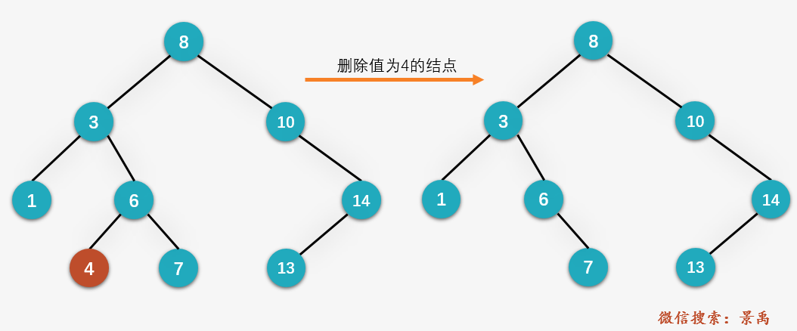

第 2 种情况：被删除的结点 D 仅有一个孩子：
- 如果只有左孩子，没有右孩子，那么只需要把要删除结点的左孩子链接到要删除结点的父亲节点，然后删除 D 结点就好了（也就是用要删除结点的左孩子替换掉删除结点）
- 如果只有右孩子，没有左孩子，那么只要将要删除结点 D 的右孩子重接到要删除结点 D 的父亲结点。（也就是用要删除结点的右孩子替换掉删除结点）

假设我们要删除值为 14 的结点，其只有一个左孩子结点 13 ，没有右孩子 。

第一步：保存要删除结点 14 的 左孩子 结点 13 到临时变量 temp，并删除结点 14：

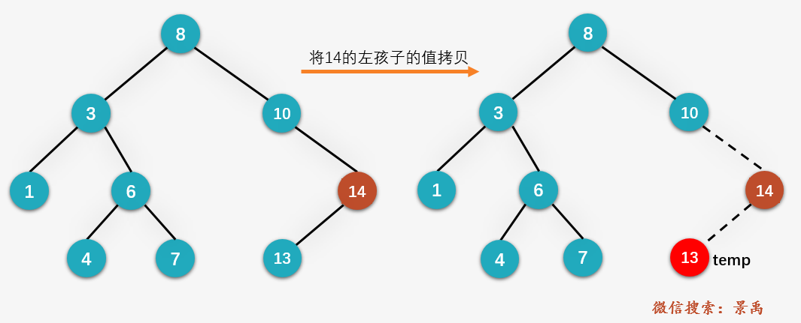

第二步：将删除结点 14 的父结点 10 的 右孩子 设置为 temp，即结点 13：

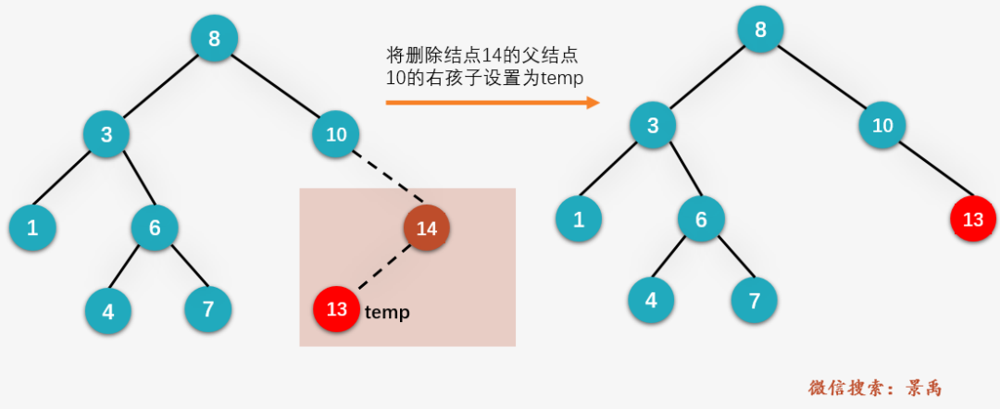

我们再以删除结点 10 为例，再看一下没有左孩子，只有一个右孩子的情况。

第一步：保存要删除结点 10 的 右孩子 结点 14 到临时变量 temp，并删除结点 10：

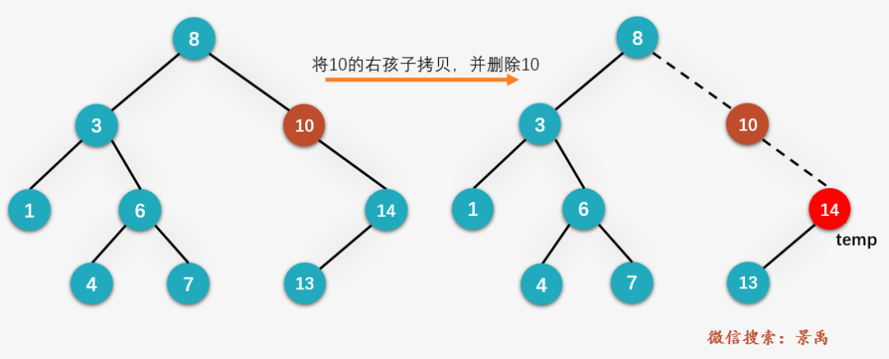

第二步：将删除结点 10 的父结点 8 的 右孩子 设置为 temp，即结点 14：

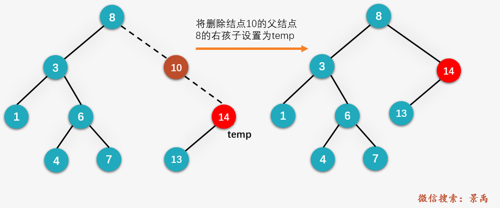

第 3 种情况：被删除结点的左右孩子都存在

给原来结点 10 增加了一个左孩子结点 9 。

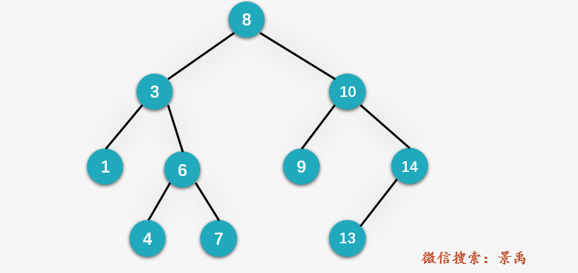

对于上面的二叉排序树的中序遍历结果如下所示：

```
1 3 4 6 7 8 9 10 13 14
```

现在我们先不考虑二叉排序上的删除操作，而仅在得到的中序遍历结果上进行删除操作。我们以删除中序遍历结果当中的顶点 8 为例进行说明：

```
1 3 4 6 7 9 10 13 14
```

当删除中序遍历结果中的 8 之后，如何保证不改变中序遍历结果的有序性呢？

删除根节点 8，然后跟 **根节点左子树当中最大的元素** 7 来替换根节点 8 的位置，或者用 **根节点的右子树当中最小的元素** 9 来替换根节点的位置

第一种情况：以删除根结点 8 为例。先用根结点的左子树当中值最大的结点 7 来替换根结点的情况。

第一步：获得待删除结点 8 的左子树当中值最大的结点 7 ，并保存在临时指针变量 temp 当中（这一步可以通过从删除结点的左孩子 3 开始，一个劲地访问右子结点，直到叶子结点为止获得）：

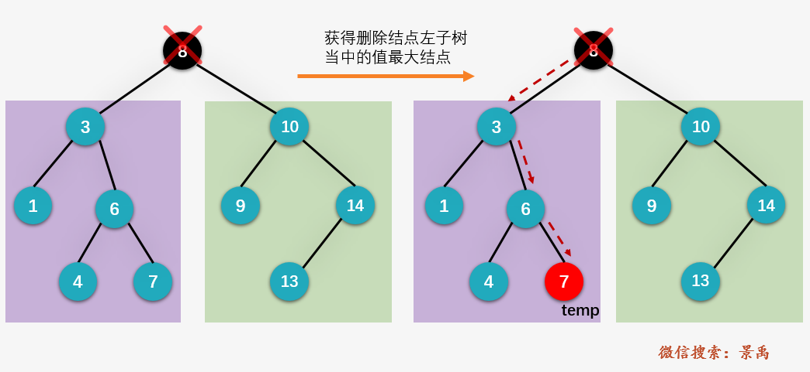

第二步：将删除结点 8 的值替换为 7 ；

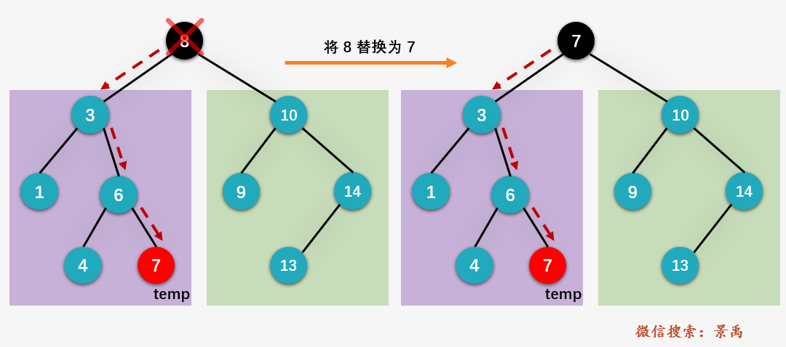

第三步：删除根结点左子树当中值最大的结点（这一步可能左子树中值最大的结点存在左子结点，而没有右子结点的情况，那么删除就退化成了第二种情况，递归调用即可）：

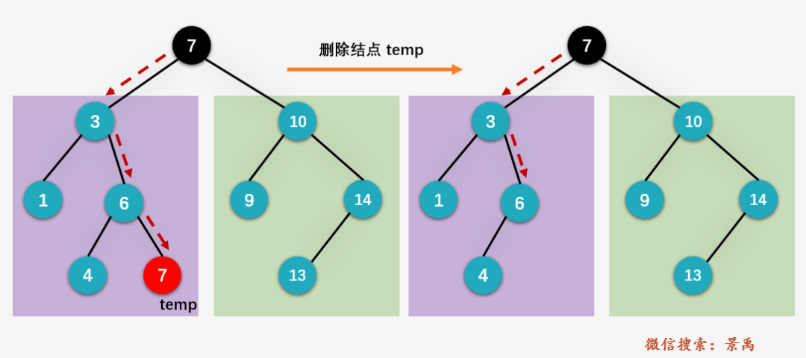

第二种：使用删除结点的 右子树 当中值最小的结点替换删除结点的情况

第一步：查找删除结点 8 的右子树当中值最小的结点，即 9 （先访问删除结点的右子结点 10，然后一直向左走，直到左子结点为空，则得到右子树当中值最小的结点）。

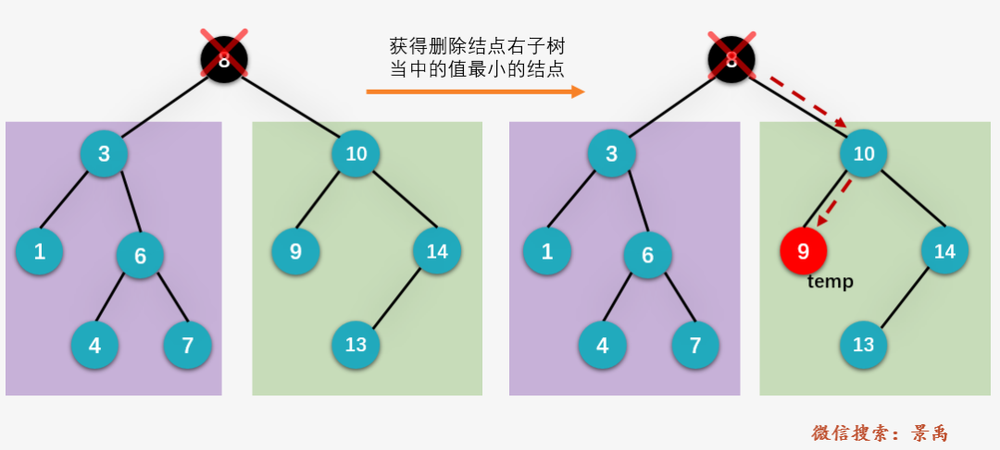

第二步：将删除结点 8 的值替换为 9 ；

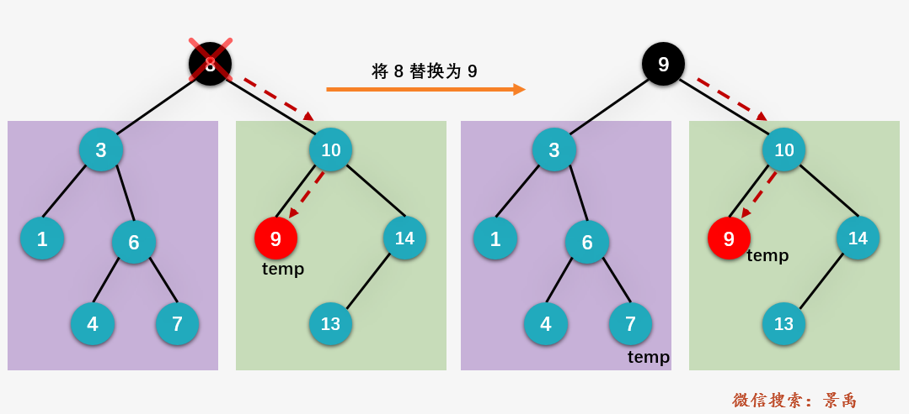

第三步：删除根结点右子树当中值最小的结点。

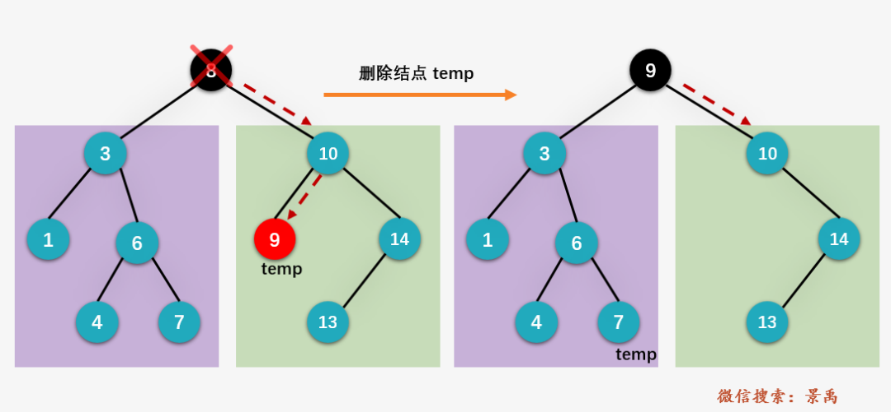


**注意**：代码对第 3 种情况是通过修改 node 的值，然后转而去删除其后继结点的

```cpp
// 删除结点(val为节点键值)
void remove(int val) {
    BSTNode *z, *node;

    if ((z = search(root_, val)) != nullptr)
        if ((node = remove(root_, z)) != nullptr)
            delete node;
}

// 删除二叉树(tree)中的结点(z)，并返回被删除的结点
BSTNode *remove(BSTNode *&tree, BSTNode *z) {
    BSTNode *x = nullptr;
    BSTNode *y = nullptr;

    // 第 1 种情况：y 即为要删除的结点
    // 第 2 种情况：y 即为要删除的结点
    if ((z->left == nullptr) || (z->right == nullptr))
        y = z;
    // 第 3 种情况：y 为结点(z)的后继结点
    else
        y = successor(z);

    // 第 2 种情况(只有左孩子，没有右孩子)：x 为左孩子
    if (y->left != nullptr)
        x = y->left;
    // 第 1 种情况：x 为 nullptr
    // 第 2 种情况(只有右孩子，没有左孩子)：x 为右孩子
    // 第 3 种情况：x 为 y 的右孩子
    else
        x = y->right;

    // 第 2 种情况(只有左孩子，没有右孩子)：更改要删除结点的左孩子的父结点为其爷爷结点
    // 第 2 种情况(只有右孩子，没有左孩子)：更改要删除结点的右孩子的父结点为其爷爷结点
    // 第 3 种情况：如果y存在右孩子，则修改y的右孩子的父结点为其爷爷结点
    if (x != nullptr)
        x->parent = y->parent;

    
    if (y->parent == nullptr)
        tree = x;
    // 第 1 种情况：更改爷爷结点的左孩子为 nullptr
    // 第 3 种情况：更改爷爷结点的左孩子为要删除结点 y 的右孩子
    else if (y == y->parent->left)
        y->parent->left = x;
    // 第 2 种情况(只有左孩子，没有右孩子)：更改爷爷结点的右孩子为要删除结点的左孩子
    // 第 2 种情况(只有右孩子，没有左孩子)：更改爷爷结点的右孩子为要删除结点的右孩子
    else
        y->parent->right = x;

    // 第 3 种情况：由于y为z的后继，只需更新z的值，z的左右孩子仍不变，然后删除后继结点即可
    if (y != z)
        z->val = y->val;

    return y;
}
```


## 2.4. 具体实现代码
- BSTree.h

```cpp
#ifndef _BINARY_SEARCH_TREE_HPP_
#define _BINARY_SEARCH_TREE_HPP_

#include <iomanip>
#include <iostream>

class BSTree
{
private:
	// 结点定义
	struct BSTNode
	{
		int val;         // 键值
		BSTNode *left;   // 左孩子
		BSTNode *right;  // 右孩子
		BSTNode *parent; // 父结点

		BSTNode(int value, BSTNode *p, BSTNode *l, BSTNode *r) : val(value), parent(), left(l), right(r) {}
	};

	BSTNode *root_; // 根结点

public:
	BSTree() : root_(nullptr) {	}
	~BSTree() { destroy(); }

	// 前序遍历"二叉树"
	void preOrder() const {
		preOrder(root_);
	}

	// 中序遍历"二叉树"
	void inOrder() const {
		inOrder(root_);
	}

	// 后序遍历"二叉树"
	void postOrder() const {
		postOrder(root_);
	}

	// (递归实现)查找"二叉树"中键值为val的节点
	BSTNode *search(int val) const {
		return search(root_, val);
	}

	// (迭代实现)查找"二叉树"中键值为val的节点
	BSTNode *iterativeSearch(int val) const {
		return iterativeSearch(root_, val);
	}

	// 查找最小结点：返回最小结点的键值。
	int min() const {
		BSTNode *p = min(root_);
		if (p != nullptr)
			return p->val;

		return 0;
	}

	// 查找最大结点：返回最大结点的键值。
	int max() {
		BSTNode *p = max(root_);
		if (p != nullptr)
			return p->val;

		return 0;
	}

	// 找结点(x)的后继结点。即，查找"二叉树中数据值大于该结点"的"最小结点"。
	BSTNode *successor(BSTNode *x) const {
		// 如果x存在右孩子，则"x的后继结点"为 "以其右孩子为根的子树的最小结点"。
		if (x->right != nullptr)
			return min(x->right);

		// 如果x没有右孩子。则x有以下两种可能：
		// (01) x是"一个左孩子"，则"x的后继结点"为 "它的父结点"。
		// (02) x是"一个右孩子"，则查找"x的最低的父结点，并且该父结点要具有左孩子"，找到的这个"最低的父结点"就是"x的后继结点"。
		BSTNode *y = x->parent;
		while ((y != nullptr) && (x == y->right)) {
			x = y;
			y = y->parent;
		}

		return y;
	}

	// 找结点(x)的前驱结点。即，查找"二叉树中数据值小于该结点"的"最大结点"。
	BSTNode *predecessor(BSTNode *x) const {
		// 如果x存在左孩子，则"x的前驱结点"为 "以其左孩子为根的子树的最大结点"。
		if (x->left != nullptr)
			return max(x->left);

		// 如果x没有左孩子。则x有以下两种可能：
		// (01) x是"一个右孩子"，则"x的前驱结点"为 "它的父结点"。
		// (01) x是"一个左孩子"，则查找"x的最低的父结点，并且该父结点要具有右孩子"，找到的这个"最低的父结点"就是"x的前驱结点"。
		BSTNode *y = x->parent;
		while ((y != nullptr) && (x == y->left)) {
			x = y;
			y = y->parent;
		}

		return y;
	}

	// 将结点(val为节点键值)插入到二叉树中
	void insert(int val) {
		BSTNode *z = nullptr;

		// 如果新建结点失败，则返回。
		if ((z = new BSTNode(val, nullptr, nullptr, nullptr)) == nullptr)
			return;

		insert(root_, z);
	}

	// 删除结点(val为节点键值)
	void remove(int val) {
		BSTNode *z, *node;

		if ((z = search(root_, val)) != nullptr)
			if ((node = remove(root_, z)) != nullptr)
				delete node;
	}

	// 销毁二叉树
	void destroy() {
		destroy(root_);
	}

	// 打印二叉树
	void print() {
		if (root_ != nullptr)
			print(root_, root_->val, 0);
	}

private:
	// 前序遍历"二叉树"
	void preOrder(BSTNode *tree) const {
		if (tree != nullptr) {
			std::cout << tree->val << " ";
			preOrder(tree->left);
			preOrder(tree->right);
		}
	}

	// 中序遍历"二叉树"
	void inOrder(BSTNode *tree) const {
		if (tree != nullptr) {
			inOrder(tree->left);
			std::cout << tree->val << " ";
			inOrder(tree->right);
		}
	}

	// 后序遍历"二叉树"
	void postOrder(BSTNode *tree) const {
		if (tree != nullptr) {
			postOrder(tree->left);
			postOrder(tree->right);
			std::cout << tree->val << " ";
		}
	}

	// (递归实现)查找"二叉树x"中键值为val的节点
	BSTNode *search(BSTNode *x, int val) const {
		if (x == nullptr || x->val == val)
			return x;

		if (val < x->val)
			return search(x->left, val);
		else
			return search(x->right, val);
	}

	// (迭代实现)查找"二叉树x"中键值为val的节点
	BSTNode *iterativeSearch(BSTNode *x, int val) const {
		while ((x != nullptr) && (x->val != val)) {
			if (val < x->val)
				x = x->left;
			else
				x = x->right;
		}
		return x;
	}

	// 查找最小结点：返回tree为根结点的二叉树的最小结点。
	BSTNode *min(BSTNode *tree) const {
		if (tree == nullptr)
			return nullptr;

		while (tree->left != nullptr)
			tree = tree->left;
		return tree;
	}
	// 查找最大结点：返回tree为根结点的二叉树的最大结点。
	BSTNode *max(BSTNode *tree) const {
		if (tree == nullptr)
			return nullptr;

		while (tree->right != nullptr)
			tree = tree->right;
		return tree;
	}

	// 将结点(z)插入到二叉树(tree)中
	void insert(BSTNode *&tree, BSTNode *z) {
		BSTNode *y = nullptr;
		BSTNode *x = tree;

		// 查找z的插入位置
		while (x != nullptr)
		{
			y = x;
			if (z->val < x->val)
				x = x->left;
			else
				x = x->right;
		}

		z->parent = y;
		if (y == nullptr)
			tree = z;
		else if (z->val < y->val)
			y->left = z;
		else
			y->right = z;
	}

	// 删除二叉树(tree)中的结点(z)，并返回被删除的结点
	BSTNode *remove(BSTNode *&tree, BSTNode *z) {
		BSTNode *x = nullptr;
		BSTNode *y = nullptr;

		if ((z->left == nullptr) || (z->right == nullptr))
			y = z;
		else
			y = successor(z);

		if (y->left != nullptr)
			x = y->left;
		else
			x = y->right;

		if (x != nullptr)
			x->parent = y->parent;

		if (y->parent == nullptr)
			tree = x;
		else if (y == y->parent->left)
			y->parent->left = x;
		else
			y->parent->right = x;

		if (y != z)
			z->val = y->val;

		return y;
	}

	// 销毁二叉树
	void destroy(BSTNode *&tree) {
		if (tree == nullptr)
			return;

		if (tree->left != nullptr)
			return destroy(tree->left);
		if (tree->right != nullptr)
			return destroy(tree->right);

		delete tree;
		tree = nullptr;
	}

	/* 打印二叉树
	* direction  --  0，表示该节点是根节点;
	*               -1，表示该节点是它的父结点的左孩子;
	*                1，表示该节点是它的父结点的右孩子。
	*/
	void print(BSTNode *tree, int val, int direction) {
		if (tree != nullptr) {
			if (direction == 0) // tree是根节点
				std::cout << std::setw(2) << tree->val << " is root" << std::endl;
			else // tree是分支节点
				std::cout << std::setw(2) << tree->val << " is " << std::setw(2) << val << "'s " << std::setw(12) << (direction == 1 ? "right child" : "left child") << std::endl;

			print(tree->left, tree->val, -1);
			print(tree->right, tree->val, 1);
		}
	}
};


#endif
```


- BSTreeTest.cpp

```cpp
int main()
{
	int arr[] = { 1, 5, 4, 3, 2, 6 };
	size_t len = sizeof(arr) / sizeof(int);
	
	BSTree *root = new BSTree();

	std::cout << "== 依次添加: ";
	for (size_t i = 0; i < len; i++)
	{
		std::cout << arr[i] << " ";
		root->insert(arr[i]);
	}

	std::cout << "\n== 前序遍历: ";
	root->preOrder();

	std::cout << "\n== 中序遍历: ";
	root->inOrder();

	std::cout << "\n== 后序遍历: ";
	root->postOrder();
	std::cout << std::endl;

	std::cout << "== 最小值: " << root->min() << std::endl;
	std::cout << "== 最大值: " << root->max() << std::endl;
	std::cout << "== 树的详细信息: " << std::endl;
	root->print();

	std::cout << "\n== 删除节点: " << arr[3];
	root->remove(arr[3]);

	std::cout << "\n== 中序遍历: ";
	root->inOrder();
	std::cout << std::endl;

	// 销毁二叉树
	root->destroy();

	return 0;
}

/*
	== 依次添加: 1 5 4 3 2 6
	== 前序遍历: 1 5 4 3 2 6
	== 中序遍历: 1 2 3 4 5 6
	== 后序遍历: 2 3 4 6 5 1
	== 最小值: 1
	== 最大值: 6
	== 树的详细信息:
	1 is root
	5 is  1's  right child
	4 is  5's   left child
	3 is  4's   left child
	2 is  3's   left child
	6 is  5's  right child

	== 删除节点: 3
	== 中序遍历: 1 2 4 5 6
*/
```
