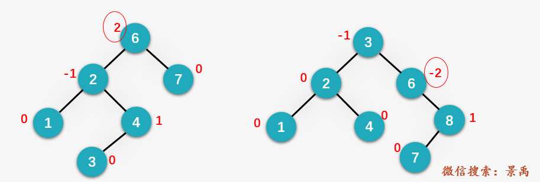
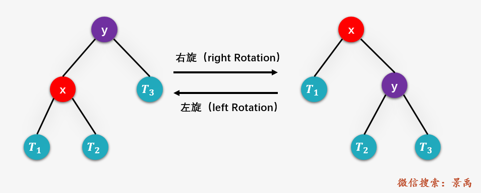
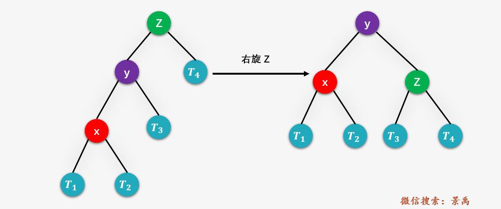
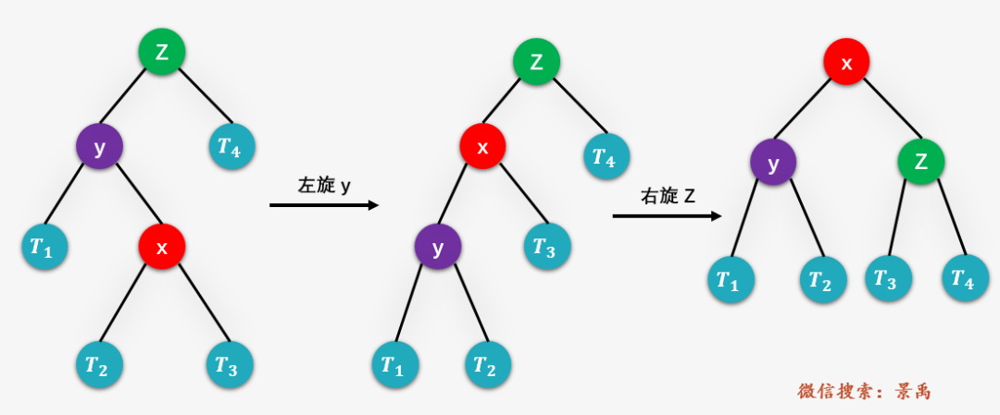
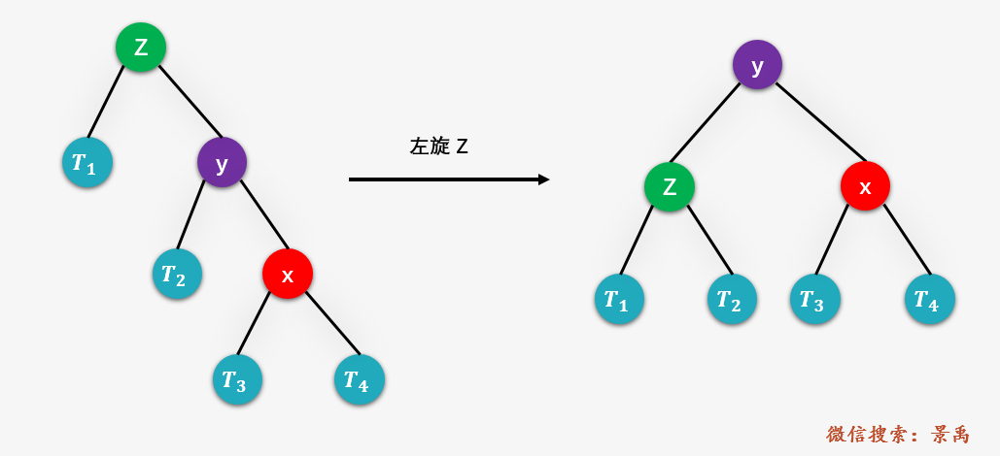
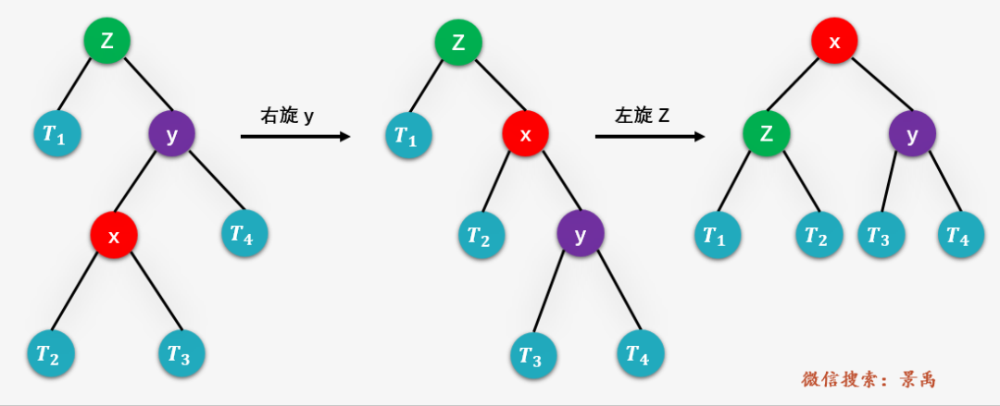

<h1 align="center">平衡二叉树</h1>

* [1. 定义](#1-定义)
* [2. 实现](#2-实现)
	* [2.1. 节点及平衡因子](#21-节点及平衡因子)
	* [2.2. 旋转](#22-旋转)
	* [2.3. 插入](#23-插入)
	* [2.4. 删除](#24-删除)
	* [2.5. 具体的代码实现](#25-具体的代码实现)
* [3. 参考资料](#3-参考资料)

---

# 1. 定义
- 平衡二叉树（Balanced Binary Tree 或 Height-Balanced Tree）又称为 AVL 树，其实就是一颗 **平衡的二叉排序树**，解决了二叉排序树的不平衡问题，即斜树。

- 特点：它的左子树和右子树都是平衡二叉树，且左子树和右子树的深度之差的绝对值不超过 1。

- 平衡因子：平衡二叉树上结点的 平衡因子  BF(Balanced Factor) 定义为该结点的 **左子树** 深度减去它的 **右子树** 的深度，平衡二叉树上所有结点的平衡因子只可能是 -1，0，1。



- 特点：由于平衡二叉树是二叉排序树的一种，所以**中序遍历**后得到的是升序的数组

# 2. 实现
## 2.1. 节点及平衡因子
二叉平衡树节点的定义：

```cpp
struct AVLTreeNode {
	int val;			// 键值
	int height;     	// 高度
	AVLTreeNode *left;	// 左孩子
	AVLTreeNode *right;	// 右孩子

	AVLTreeNode(int value, AVLTreeNode *l, AVLTreeNode *r) :
		val(value), height(0), left(l), right(r) {}
};
```

计算平衡因子：结点的左子树深度减去右子树深度：

todo: 等待更新
todo: 为什么深度是 max - 1？
```cpp
int getBalance(struct Node *N)
{
    if (N == NULL)
        return 0;
    return height(N->left) - height(N->right);
}
```

## 2.2. 旋转
- 左旋：取**右子的左儿**作自己的右儿，与**右子的左儿**的位置互换
- 右旋：取**左子的右儿**作自己的左儿，与**左子的右儿**的位置互换



```cpp
// 对节点 node 进行右旋，返回旋转后的根节点
AVLTreeNode* RightRotation(AVLTreeNode* node) {
	AVLTreeNode* root = node->left;
	node->left = root->right;
	root->right = node;

	node->height = max(height(node->left), height(node->right)) + 1;
	root->height = max(height(root->left), node->height) + 1;

	return root;
}
```
```cpp
// 对节点 node 进行左旋，返回旋转后的根节点
AVLTreeNode* rightRightRotation(AVLTreeNode* node) {
	AVLTreeNode* root = node->right;
	node->right = root->left;
	root->left = node;

	node->height = max(height(node->left), height(node->right)) + 1;
	root->height = max(height(root->right), node->height) + 1;

	return root;
}
```


## 2.3. 插入
我们以插入一个结点 w 为例进行说明平衡二叉树插入操作的具体算法步骤：

1. 对结点 w 执行标准的二叉排序树的插入操作
2. 从结点 w 开始，向上回溯

	- 找到第一个不平衡的结点（即平衡因子不是 -1，0或1的结点） z
	- y 为从结点 w 到结点 z 的 **路径** 上，z 的孩子结点（**这里强调路径**）
	- x 是从结点 w 到结点 z 的路径上，z 的孙子结点

3. 然后对以 z 为根结点的子树进行平衡操作，其中 x、y、z 可以的位置有一种情况，平衡操作也就处理以下四种情况：
    - y 是 z 的左孩子，x 是 y 的左孩子 （Left Left ，**LL** )
    - y 是 z 的左孩子，x 是 y 的右孩子 （Left Right ，**LR** )
    - y 是 z 的右孩子，x 是 y 的右孩子 （Right Right ，**RR** )
    - y 是 z 的右孩子，x 是 y 的左孩子 （Right Right ，**RL** )

- 第 1 种情况：LL -> 对 z 进行右旋



```cpp
// LL：左左对应的情况(左单旋转)。返回值：旋转后的根节点
AVLTreeNode* leftLeftRotation(AVLTreeNode* k2) {
	AVLTreeNode* k1;

	k1 = k2->left;
	k2->left = k1->right;
	k1->right = k2;

	k2->height = max(height(k2->left), height(k2->right)) + 1;
	k1->height = max(height(k1->left), k2->height) + 1;

	return k1;
}
```

- 第 2 种情况：LR -> 对 y 进行左旋，对 z 进行右旋



```cpp
// LR：左右对应的情况(左双旋转)。旋转后的根节点
AVLTreeNode* leftRightRotation(AVLTreeNode* k3) {
	k3->left = rightRightRotation(k3->left);

	return leftLeftRotation(k3);
}
```

- 第 3 种情况：RR -> 对 z 进行左旋



```cpp
// RR：右右对应的情况(右单旋转)。返回值：旋转后的根节点
AVLTreeNode* rightRightRotation(AVLTreeNode* k1) {
	AVLTreeNode* k2;

	k2 = k1->right;
	k1->right = k2->left;
	k2->left = k1;

	k1->height = max(height(k1->left), height(k1->right)) + 1;
	k2->height = max(height(k2->right), k1->height) + 1;

	return k2;
}
```

- 第 4 种情况：RL -> 对 y 进行右旋，对 z 进行左旋



```cpp
// RL：右左对应的情况(右双旋转)。旋转后的根节点
AVLTreeNode* rightLeftRotation(AVLTreeNode* k1) {
	k1->right = leftLeftRotation(k1->right);

	return rightRightRotation(k1);
}
```

- 插入和查找的时间复杂度为：`O(log n)`

    因为 AVL 树上的结点的左右子树的深度之差都不超过 1，也就是取值只能是 -1，0，1 ，则 AVL 树的深度和 `log n` 是同数量级的（其中 n 为结点个数）。因此平衡二叉树的平均查找长度和 `log n` 也是同数量级的，二叉排序树的插入和查找的时间复杂度即为 `O(log n)` 量级。

**实现**：

1. 执行标准的平衡二叉树的插入操作
2. 更新当前结点（从根结点到新插入结点的路径上经过的结点）的深度
3. 获取当前结点的平衡因子（左子树的深度 - 右子树的深度）
4. 如果平衡因子大于 1 ，则当前结点是不平衡结点，且当前结点的子树存在 **LL** 或 **LR** 的情况：检查是否是 LL 的情况，将新插入结点的值与当结点的左孩子的值进行比较，如果小于则是 LL 的情况，否则是 LR 的情况
5. 如果平衡因子小于 -1 ，则当前结点是不平衡结点，且当前结点的子树存在 RR 或 RL 的情况；检查是否是 RR 的情况，判断新插入结点的值是否大于当前结点的右孩子的值，如果大于，则属于 RR 的情况，否则为 RL 的情况

```cpp
// 将结点(z)插入到AVL树(tree)中，并返回根节点
AVLTreeNode* insert(AVLTreeNode* &tree, int val) {
	if (tree == nullptr)
	{
		// 新建节点
		tree = new AVLTreeNode(val, nullptr, nullptr);
		if (tree == nullptr)
		{
			std::cout << "ERROR: create avltree node failed!" << std::endl;
			return nullptr;
		}
	}
	// 1. 执行标准的平衡二叉树的插入操作
	// 应该将 val 插入到 "tree的左子树" 的情况
	else if (val < tree->val)
	{
		tree->left = insert(tree->left, val);
		// 插入节点后，若 AVL 树失去平衡，则进行相应的调节
		if (height(tree->left) - height(tree->right) == 2)
		{
			// LL 情况
			if (val < tree->left->val)
				tree = leftLeftRotation(tree);
			// LR 情况
			else
				tree = leftRightRotation(tree);
		}
	}
	// 应该将 val 插入到 "tree的右子树" 的情况
	else if (val > tree->val)
	{
		tree->right = insert(tree->right, val);
		// 插入节点后，若 AVL 树失去平衡，则进行相应的调节
		if (height(tree->right) - height(tree->left) == 2)
		{
			// RR 情况
			if (val > tree->right->val)
				tree = rightRightRotation(tree);
			// RL 情况
			else
				tree = rightLeftRotation(tree);
		}
	}
	// 二叉树排序树种不允许出现等于的情况
	else
	{
		std::cout << "添加失败：不允许添加相同的节点！" << std::endl;
	}
	// 更新节点深度
	tree->height = max(height(tree->left), height(tree->right)) + 1;

	return tree;
}
```


## 2.4. 删除
以删除一个结点 w 为例

1. 对结点 w 执行标准的二叉排序树的删除操作
2. 从结点 w 开始，向上回溯
	
	- 找到**第一个不平衡**的结点（即平衡因子不是 -1，0 或 1 的结点） z
	- y 为结点 z 的**高度最高**的孩子结点
	- x 是结点 y 的**高度最高**的孩子结点（**这里一定注意和平衡二叉树插入操作区分开来，y 不再是从 w 回溯到 z 的路径上 z 的孩子，x 也不再是 z 的孙子这样的描述**）

3. 然后对以 z 为根结点的子树进行平衡操作，其中 x、y、z 可以的位置有 4 种情况，BST 删除操作之后的平衡操作也就处理以下 4 种情况：

	- y 是 z 的左孩子，x 是 y 的左孩子 （Left Left ，LL )
	- y 是 z 的左孩子，x 是 y 的右孩子 （Left Right ，LR )
	- y 是 z 的右孩子，x 是 y 的右孩子 （Right Right ，RR )
	- y 是 z 的右孩子，x 是 y 的左孩子 （Right Right ，RL )

这里的 4 种情况与插入操作一样，但**需要注意的是**：插入操作仅需要对以 z 为根的子树进行平衡操作，而删除操作就不一样，先对以 z 为根的子树进行平衡操作，之后可能需要对 z 的祖先结点进行平衡操作，**向上回溯**直到根结点。

```cpp
// 删除AVL树(tree)中的结点(z)，返回根节点
AVLTreeNode* remove(AVLTreeNode* &tree, AVLTreeNode* z) {
	// 根为空 或者 没有要删除的节点，直接返回 nullptr
	if (tree == nullptr || z == nullptr)
		return nullptr;

	// 待删除的节点在 "tree的左子树" 中
	if (z->val < tree->val)		
	{
		tree->left = remove(tree->left, z);
		// 删除节点后，若 AVL 树失去平衡，则进行相应的调节。
		if (height(tree->right) - height(tree->left) == 2)
		{
			AVLTreeNode *r = tree->right;
			if (height(r->left) > height(r->right))
				tree = rightLeftRotation(tree);
			else
				tree = rightRightRotation(tree);
		}
	}
	// 待删除的节点在 "tree的右子树" 中
	else if (z->val > tree->val)
	{
		tree->right = remove(tree->right, z);
		// 删除节点后，若 AVL 树失去平衡，则进行相应的调节。
		if (height(tree->left) - height(tree->right) == 2)
		{
			AVLTreeNode *l = tree->left;
			if (height(l->right) > height(l->left))
				tree = leftRightRotation(tree);
			else
				tree = leftLeftRotation(tree);
		}
	}
	// tree 是对应要删除的节点
	else	
	{
		// tree 的左右孩子都非空
		if ((tree->left != nullptr) && (tree->right != nullptr))
		{
			if (height(tree->left) > height(tree->right))
			{
				// 如果tree的左子树比右子树高；
				// 则(01)找出tree的左子树中的最大节点
				//   (02)将该最大节点的值赋值给tree。
				//   (03)删除该最大节点。
				// 这类似于用"tree的左子树中最大节点"做"tree"的替身；
				// 采用这种方式的好处是：删除"tree的左子树中最大节点"之后，AVL树仍然是平衡的。
				AVLTreeNode* max = maximum(tree->left);
				tree->val = max->val;
				tree->left = remove(tree->left, max);
			}
			else
			{
				// 如果tree的左子树不比右子树高(即它们相等，或右子树比左子树高1)
				// 则(01)找出tree的右子树中的最小节点
				//   (02)将该最小节点的值赋值给tree。
				//   (03)删除该最小节点。
				// 这类似于用"tree的右子树中最小节点"做"tree"的替身；
				// 采用这种方式的好处是：删除"tree的右子树中最小节点"之后，AVL树仍然是平衡的。
				AVLTreeNode* min = minimum(tree->right);
				tree->val = min->val;
				tree->right = remove(tree->right, min);
			}
		}
		// tree只有一个孩子或者没有孩子
		else
		{
			AVLTreeNode* temp = tree;
			tree = (tree->left != nullptr) ? tree->left : tree->right;
			delete temp;
		}
	}

	return tree;
}
```


## 2.5. 具体的代码实现
AVL.hpp

```cpp
#ifndef _AVL_TREE_HPP_
#define _AVL_TREE_HPP_

#include <iomanip>
#include <iostream>

class AVLTree {
private:
	struct AVLTreeNode {
		int val;			// 键值
		int height;     	// 高度
		AVLTreeNode *left;	// 左孩子
		AVLTreeNode *right;	// 右孩子

		AVLTreeNode(int value, AVLTreeNode *l, AVLTreeNode *r) :
			val(value), height(0), left(l), right(r) {}
	};

	AVLTreeNode *root;	// 根结点

public:
	AVLTree() :root(nullptr) {}
	~AVLTree() { destroy(root); }

	// 获取树的高度
	int height() {
		return height(root);
	}

	// 获取树的高度
	int max(int a, int b) {
		return a > b ? a : b;
	}

	// 前序遍历"AVL树"
	void preOrder() {
		preOrder(root);
	}

	// 中序遍历"AVL树"
	void inOrder() {
		inOrder(root);
	}

	// 后序遍历"AVL树"
	void postOrder() {
		postOrder(root);
	}

	// (递归实现)查找"AVL树"中键值为val的节点
	AVLTreeNode* search(int val) {
		return search(root, val);
	}

	// (迭代实现)查找"AVL树"中键值为val的节点
	AVLTreeNode* iterativeSearch(int val) {
		return iterativeSearch(root, val);
	}

	// 查找最小结点：返回最小结点的键值。
	int minimum() {
		AVLTreeNode *p = minimum(root);
		if (p != nullptr)
			return p->val;

		return 0;
	}

	// 查找最大结点：返回最大结点的键值。
	int maximum() {
		AVLTreeNode *p = maximum(root);
		if (p != nullptr)
			return p->val;

		return 0;
	}

	// 将结点(val为节点键值)插入到AVL树中
	void insert(int val) {
		insert(root, val);
	}

	// 删除结点(val为节点键值)
	void remove(int val) {
		AVLTreeNode* z;

		if ((z = search(root, val)) != nullptr)
			root = remove(root, z);
	}

	// 销毁AVL树
	void destroy() {
		destroy(root);
	}

	// 打印AVL树
	void print() {
		if (root != nullptr)
			print(root, root->val, 0);
	}

private:
	// 获取树的高度
	int height(AVLTreeNode* tree) {
		if (tree != nullptr)
			return tree->height;
		return 0;
	}

	// 前序遍历"AVL树"
	void preOrder(AVLTreeNode* tree) const {
		if (tree != nullptr)
		{
			std::cout << tree->val << " ";
			preOrder(tree->left);
			preOrder(tree->right);
		}
	}

	// 中序遍历"AVL树"
	void inOrder(AVLTreeNode* tree) const {
		if (tree != nullptr)
		{
			inOrder(tree->left);
			std::cout << tree->val << " ";
			inOrder(tree->right);
		}
	}

	// 后序遍历"AVL树"
	void postOrder(AVLTreeNode* tree) const {
		if (tree != nullptr)
		{
			postOrder(tree->left);
			postOrder(tree->right);
			std::cout << tree->val << " ";
		}
	}

	// (递归实现)查找"AVL树x"中键值为val的节点
	AVLTreeNode* search(AVLTreeNode* x, int val) const {
		if (x == nullptr || x->val == val)
			return x;

		if (val < x->val)
			return search(x->left, val);
		else
			return search(x->right, val);
	}

	// (迭代实现)查找"AVL树x"中键值为val的节点
	AVLTreeNode* iterativeSearch(AVLTreeNode* x, int val) const {
		while ((x != nullptr) && (x->val != val))
		{
			if (val < x->val)
				x = x->left;
			else
				x = x->right;
		}
		return x;
	}

	// 查找最小结点：返回tree为根结点的AVL树的最小结点。
	AVLTreeNode* minimum(AVLTreeNode* tree) {
		if (tree == nullptr)
			return nullptr;

		while (tree->left != nullptr)
			tree = tree->left;
		return tree;
	}

	// 查找最大结点：返回tree为根结点的AVL树的最大结点。
	AVLTreeNode* maximum(AVLTreeNode* tree) {
		if (tree == nullptr)
			return nullptr;

		while (tree->right != nullptr)
			tree = tree->right;
		return tree;
	}

	// LL：左左对应的情况(左单旋转)。返回值：旋转后的根节点
	AVLTreeNode* leftLeftRotation(AVLTreeNode* k2) {
		AVLTreeNode* k1;

		k1 = k2->left;
		k2->left = k1->right;
		k1->right = k2;

		k2->height = max(height(k2->left), height(k2->right)) + 1;
		k1->height = max(height(k1->left), k2->height) + 1;

		return k1;
	}

	// RR：右右对应的情况(右单旋转)。返回值：旋转后的根节点
	AVLTreeNode* rightRightRotation(AVLTreeNode* k1) {
		AVLTreeNode* k2;

		k2 = k1->right;
		k1->right = k2->left;
		k2->left = k1;

		k1->height = max(height(k1->left), height(k1->right)) + 1;
		k2->height = max(height(k2->right), k1->height) + 1;

		return k2;
	}

	// LR：左右对应的情况(左双旋转)。旋转后的根节点
	AVLTreeNode* leftRightRotation(AVLTreeNode* k3) {
		k3->left = rightRightRotation(k3->left);

		return leftLeftRotation(k3);
	}

	// RL：右左对应的情况(右双旋转)。旋转后的根节点
	AVLTreeNode* rightLeftRotation(AVLTreeNode* k1) {
		k1->right = leftLeftRotation(k1->right);

		return rightRightRotation(k1);
	}

	// 将结点(z)插入到AVL树(tree)中，并返回根节点
	AVLTreeNode* insert(AVLTreeNode* &tree, int val) {
		if (tree == nullptr)
		{
			// 新建节点
			tree = new AVLTreeNode(val, nullptr, nullptr);
			if (tree == nullptr)
			{
				std::cout << "ERROR: create avltree node failed!" << std::endl;
				return nullptr;
			}
		}
		else if (val < tree->val) // 应该将val插入到"tree的左子树"的情况
		{
			tree->left = insert(tree->left, val);
			// 插入节点后，若AVL树失去平衡，则进行相应的调节。
			if (height(tree->left) - height(tree->right) == 2)
			{
				if (val < tree->left->val)
					tree = leftLeftRotation(tree);
				else
					tree = leftRightRotation(tree);
			}
		}
		else if (val > tree->val) // 应该将val插入到"tree的右子树"的情况
		{
			tree->right = insert(tree->right, val);
			// 插入节点后，若AVL树失去平衡，则进行相应的调节。
			if (height(tree->right) - height(tree->left) == 2)
			{
				if (val > tree->right->val)
					tree = rightRightRotation(tree);
				else
					tree = rightLeftRotation(tree);
			}
		}
		else //val == tree->val)
		{
			std::cout << "添加失败：不允许添加相同的节点！" << std::endl;
		}

		tree->height = max(height(tree->left), height(tree->right)) + 1;

		return tree;
	}

	// 删除AVL树(tree)中的结点(z)，返回根节点
	AVLTreeNode* remove(AVLTreeNode* &tree, AVLTreeNode* z) {
		// 根为空 或者 没有要删除的节点，直接返回 nullptr
		if (tree == nullptr || z == nullptr)
			return nullptr;

		// 待删除的节点在 "tree的左子树" 中
		if (z->val < tree->val)
		{
			tree->left = remove(tree->left, z);
			// 删除节点后，若 AVL 树失去平衡，则进行相应的调节。
			if (height(tree->right) - height(tree->left) == 2)
			{
				AVLTreeNode *r = tree->right;
				if (height(r->left) > height(r->right))
					tree = rightLeftRotation(tree);
				else
					tree = rightRightRotation(tree);
			}
		}
		// 待删除的节点在 "tree的右子树" 中
		else if (z->val > tree->val)
		{
			tree->right = remove(tree->right, z);
			// 删除节点后，若 AVL 树失去平衡，则进行相应的调节。
			if (height(tree->left) - height(tree->right) == 2)
			{
				AVLTreeNode *l = tree->left;
				if (height(l->right) > height(l->left))
					tree = leftRightRotation(tree);
				else
					tree = leftLeftRotation(tree);
			}
		}
		// tree 是对应要删除的节点
		else
		{
			// tree 的左右孩子都非空
			if ((tree->left != nullptr) && (tree->right != nullptr))
			{
				if (height(tree->left) > height(tree->right))
				{
					// 如果tree的左子树比右子树高；
					// 则(01)找出tree的左子树中的最大节点
					//   (02)将该最大节点的值赋值给tree。
					//   (03)删除该最大节点。
					// 这类似于用"tree的左子树中最大节点"做"tree"的替身；
					// 采用这种方式的好处是：删除"tree的左子树中最大节点"之后，AVL树仍然是平衡的。
					AVLTreeNode* max = maximum(tree->left);
					tree->val = max->val;
					tree->left = remove(tree->left, max);
				}
				else
				{
					// 如果tree的左子树不比右子树高(即它们相等，或右子树比左子树高1)
					// 则(01)找出tree的右子树中的最小节点
					//   (02)将该最小节点的值赋值给tree。
					//   (03)删除该最小节点。
					// 这类似于用"tree的右子树中最小节点"做"tree"的替身；
					// 采用这种方式的好处是：删除"tree的右子树中最小节点"之后，AVL树仍然是平衡的。
					AVLTreeNode* min = minimum(tree->right);
					tree->val = min->val;
					tree->right = remove(tree->right, min);
				}
			}
			// tree只有一个孩子或者没有孩子
			else
			{
				AVLTreeNode* temp = tree;
				tree = (tree->left != nullptr) ? tree->left : tree->right;
				delete temp;
			}
		}

		return tree;
	}

	// 销毁AVL树
	void destroy(AVLTreeNode* &tree) {
		if (tree == nullptr)
			return;

		if (tree->left != nullptr)
			destroy(tree->left);
		if (tree->right != nullptr)
			destroy(tree->right);

		delete tree;
	}

	/* 打印"二叉查找树"
	 * direction  --  0，表示该节点是根节点;
	 *               -1，表示该节点是它的父结点的左孩子;
	 *                1，表示该节点是它的父结点的右孩子。
	 */
	void print(AVLTreeNode* tree, int val, int direction) {
		if (tree != nullptr)
		{
			if (direction == 0)	// tree是根节点
				std::cout << std::setw(2) << tree->val << " is root" << std::endl;
			else				// tree是分支节点
				std::cout << std::setw(2) << tree->val << " is " << std::setw(2) << val << "'s " << std::setw(12) << (direction == 1 ? "right child" : "left child") << std::endl;

			print(tree->left, tree->val, -1);
			print(tree->right, tree->val, 1);
		}
	}
};

#endif
```

main.cpp

```cpp
int main()
{
	int arr[] = { 3,2,1,4,5,6,7,16,15,14,13,12,11,10,8,9 };
	size_t len = sizeof(arr) / sizeof(int);
	
	AVLTree* tree = new AVLTree();

	std::cout << "== 依次添加: ";
	for (size_t i = 0; i < len; i++)
	{
		std::cout << arr[i] << " ";
		tree->insert(arr[i]);
	}

	std::cout << "\n== 前序遍历: ";
	tree->preOrder();

	std::cout << "\n== 中序遍历: ";
	tree->inOrder();

	std::cout << "\n== 后序遍历: ";
	tree->postOrder();
	std::cout << std::endl;

	std::cout << "== 高度: " << tree->height() << std::endl;
	std::cout << "== 最小值: " << tree->minimum() << std::endl;
	std::cout << "== 最大值: " << tree->maximum() << std::endl;
	std::cout << "== 树的详细信息: " << std::endl;
	tree->print();

	int i = 8;
	std::cout << "\n== 删除节点: " << i;
	tree->remove(i);

	std::cout << "\n== 高度: " << tree->height();
	std::cout << "\n== 中序遍历: ";
	tree->inOrder();
	std::cout << "\n== 树的详细信息: " << std::endl;
	tree->print();

	// 销毁二叉树
	tree->destroy();

	return 0;
}

/*
	== 依次添加: 3 2 1 4 5 6 7 16 15 14 13 12 11 10 8 9
	== 前序遍历: 7 4 2 1 3 6 5 13 11 9 8 10 12 15 14 16
	== 中序遍历: 1 2 3 4 5 6 7 8 9 10 11 12 13 14 15 16
	== 后序遍历: 1 3 2 5 6 4 8 10 9 12 11 14 16 15 13 7
	== 高度: 5
	== 最小值: 1
	== 最大值: 16
	== 树的详细信息:
	7 is root
	4 is  7's   left child
	2 is  4's   left child
	1 is  2's   left child
	3 is  2's  right child
	6 is  4's  right child
	5 is  6's   left child
	13 is  7's  right child
	11 is 13's   left child
	9 is 11's   left child
	8 is  9's   left child
	10 is  9's  right child
	12 is 11's  right child
	15 is 13's  right child
	14 is 15's   left child
	16 is 15's  right child

	== 删除节点: 8
	== 高度: 5
	== 中序遍历: 1 2 3 4 5 6 7 9 10 11 12 13 14 15 16
	== 树的详细信息:
	7 is root
	4 is  7's   left child
	2 is  4's   left child
	1 is  2's   left child
	3 is  2's  right child
	6 is  4's  right child
	5 is  6's   left child
	13 is  7's  right child
	11 is 13's   left child
	9 is 11's   left child
	10 is  9's  right child
	12 is 11's  right child
	15 is 13's  right child
	14 is 15's   left child
	16 is 15's  right child
*/
```


# 3. 参考资料
* [图解：什么是AVL树？](https://mp.weixin.qq.com/s/POX8QV9JFrRcAi-q-sJvOA)
* [图解：什么是AVL树？（删除总结篇）](https://mp.weixin.qq.com/s/9no2Ge0hWo1lZHRm_JS0hA)
* [AVL树(二)之 C++语言详解](http://wangkuiwu.github.io/2013/02/02/avltree-cpp/)
