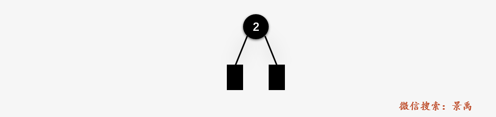

<h1 align="center">红黑树</h1>

* [1. 定义](#1-定义)
* [2. 实现](#2-实现)
    * [2.1. 插入](#21-插入)
    * [2.2. 插入实例](#22-插入实例)
    * [2.3. 插入应用](#23-插入应用)
* [3. 删除](#3-删除)
* [4. 参考资料](#4-参考资料)

---

# 1. 定义
红黑树（Red Black Tree）是一颗**自平衡的二叉排序树**（BST），树上的每一个结点都遵循下面的规则（特别提醒，这里的自平衡和平衡二叉树 AVL 的高度平衡有别）：

1. 每一个结点都有一个颜色，要么为红色，要么为黑色
2. 树的**根结点为黑色**
3. 树中不存在两个相邻的红色结点（即红色结点的父结点和孩子结点均不能是红色）（备注：如果一个结点是红色的，那其父和孙子就必须是黑的）
4. 从任意一个结点（包括根结点）到其任何后代 **NULL 结点**（默认是**黑色**的）的每条路径都具有**相同数量**的**黑色**结点

与 **二叉排序树** 的区别：

大多数二叉排序树 BST 的操作（查找、最大值、最小值、插入、删除等等）都是 O(h) 的时间复杂度，h 为树的高度。但是对于斜树而言（BST 极端情况下出现），BST 的这些操作的时间复杂度将达到 O(n) 。为了保证 BST 的所有操作的时间复杂度的上限为 O(logn) ，就要想办法把一颗 BST 树的高度一直维持在 logn ，而红黑树就做到了这一点，红黑树的高度始终都维持在 logn ，n 为树中的顶点数目。

与 **平衡二叉树** 的区别：

AVL 树比红黑树更加平衡，但 AVL 树在插入和删除的时候也会存在大量的旋转操作。所以当你的应用涉及到频繁的插入和删除操作，切记放弃 AVL 树，选择性能更好的红黑树；当然，如果你的应用中涉及的插入和删除操作并不频繁，而是查找操作相对更频繁，那么就优先选择 AVL 树进行实现。

红黑树的黑高：在一颗红黑树中，从某个结点 x 出发（**不包含该结点**）到达一个叶结点的任意一条简单路径上包含的黑色结点的数目称为 **黑高** ，记为 bh(x) 。根据红黑树的性质 3、4，一颗红黑树的黑高 `bh >= h/2`

**引理**：一棵有 n 个内部结点的红黑树的高度 `h <= 2lg(n+1)`

# 2. 实现
## 2.1. 插入
在一棵 AVL 树中，我们通过 **左旋** 和 **右旋** 来调整由于插入和删除所造成的不平衡问题。在红黑树中，可以使用 2 种方式进行平衡操作：

- 重新着色
- 旋转

当红黑树中出现不平衡的状态，我们首先会考虑重新着色，如果重新着色依旧不能使红黑树平衡，那么就考虑旋转。

插入操作主要有 2 种情况，具体取决于叔叔结点的颜色：
- 如果叔叔结点是红色的，我们会重新着色
- 如果叔叔结点是黑色的，我们会旋转或者重新着色，或者两者都考虑

**注意**：一个 NULL 结点被认为是黑色的，

设 x 为新插入的结点。

1. 进行标准的 BST 插入并将新插入的结点设置为红色
2. 如果 x 是根结点，将 x 的颜色转化为黑色（整棵树的黑高增加 1）
3. 如果 x 的父结点 parent 不是黑色并且 x 不是根结点，则：
    
    - 如果 x 的叔叔结点 uncle 是红色
    - 如果 x 的叔叔结点 uncle 是黑色，则对于 x、 x 的父结点 parent 和 x 的爷爷结点 grandparent 有以下 4 种情况：
        
        - LL ：parent 是 grandparent 的左孩子，且 x 是 parent 的左孩子
        - LR ：parent 是 grandparent 的左孩子，且 x 是 parent 的右孩子
        - RR ：parent 是 grandparent 的右孩子，且 x 是 parent 的右孩子
        - RL ：parent 是 grandparent 的右孩子，且 x 是 parent 的左孩子
    
    - 将插入结点 x 的父结点 parent 和叔叔 uncle 结点 u 的颜色变为黑色；
    - 将 x 的爷爷结点 grandparent 设置为红色；
    - 将 x = x 的爷爷结点 grandparent ，对于新的 x 重复 2，3 两步。


对于新插入结点 x，我们执行标准的 BST 插入之后，将插入结点 x 着色为红色；如果插入结点不是根结点，且x的父结点 p 为红色结点，分为 2 种情况处理：

**1. 插入结点 x 的叔叔结点 u 为红色**：


1、将 parent 和 uncle 的颜色设置为 **黑色**


2、将 grandparent 的颜色设置为 **红色**


3、将 grandparent 当作新的 x，对 grandparent 重复执行算法框架中的 2，3 两步


总的来说就是：


**2. 插入结点 x 的叔叔结点 u 为黑色**：当插入结点 x 的叔叔结点 uncle 为黑色的时候，根据插入结点 x 、x 的父结点 parent 和 x 的爷爷结点 grandparent 可能出现的位置关系，分为以下 4 种情况：

1、**LL**：右旋 g，交换 g 和 p 的颜色


2、**LR**：首先通过 左旋 parent 转化为 LL 的情况：


然后按照 LL 的情况处理：


3、**RR**：左旋 g，交换 g 和 p 的颜色


4、**RL**：首先 右旋 parent 转化为 RR 的情况：


然后按照 RR 的情况处理：


## 2.2. 插入实例
初始时，我们仅已知下面要依次插入的序列：


第一步：插入结点 2 ，结点 2 就是根结点，设置为**黑色**：



第二步：插入结点 6 ，首先执行标准的 BST 插入操作并将结点 6 设置为红色，但 6 号结点的父结点 2 的颜色为黑色，所以什么都不做了。


第三步：插入结点 9（x） ，执行标准的 BST 插入操作并设置为红色，其父结点 6（p） 的颜色为红色且且叔叔结点为 NULL结点为黑色，属于 RR 的情况，故对其爷爷结点 2（g） 进行左旋操作，并交换 g 和 p  的颜色。


第四步：插入结点 10（x） ，执行标准的 BST 插入操作并设置为红色，其父结点 9（p） 为红色，其叔叔结点 2（u） 为红色结点，属于 a)的情况，将其父结点 9 和叔叔结点涂黑色，并将其爷爷结点涂红色并设置为新的x，判断其爷爷结点 6 ，发现为根结点，重新更新为黑色。


第五步：插入结点 12（x） ，执行标准的BST插入操作并设置为红色，其父结点 10（p） 为红色，其叔叔结点为黑色，其爷爷结点 9（g） 为红色，RR 的情况，则左旋 g ，交换 g 和 p 的颜色。


第六步：插入结点 15


第七步：插入结点 20


第八步：插入结点 18 （注意这里我故意少了一步，要心中补上）


第九步：插入结点 1


第十步：插入结点 5


第十一步：插入结点 13


结点的定义，增加了父结点指针以及结点颜色标记：

```cpp
struct Node
{
    int data;
    bool color;
    Node *left, *right, *parent;

    Node(int tdata) : data(tdata), color(RED), left(NULL), right(NULL), parent(NULL) {}
};
```

标准的二叉排序树的插入操作：

```cpp
/*标准的二叉排序树的插入操作*/
Node *BSTInsert(Node *root, Node *x)
{
    /* 如果树为空，则插入的结点作为根结点返回 */
    if (root == NULL)
        return x;

    /* x的值小于根结点的值，则向左子树走 */
    if (x->data < root->data)
    {
        root->left = BSTInsert(root->left, x);
        root->left->parent = root;
    }
    else if (x->data > root->data)
    {
        root->right = BSTInsert(root->right, x);
        root->right->parent = root;
    }

    /* 返回插入结点 x 的树根*/
    return root;
}
```

红黑树中结点的**左旋**操作：


```cpp
void rotateLeft(Node *&root, Node *&g)
{
    Node *p = g->right;

    g->right = p->left; //g->right = T3

    if (g->right != NULL)     //T3 != NULL
        g->right->parent = g; //T3->parent = g

    p->parent = g->parent;

    if (g->parent == NULL)
    {
        root = p;
    }
    else if (g == g->parent->left)
    {
        g->parent->left = p;
    }
    else
    {
        g->parent->right = p;
    }

    p->left = g;
    g->parent = p;
}
```

红黑树中结点的**右旋**操作：


```cpp
void rotateRight(Node *&root, Node *&g)
{
    Node *p = g->left;

    g->left = p->right;

    if (g->left != NULL)
        g->left->parent = g;

    p->parent = g->parent;

    if (g->parent == NULL)
        root = p;

    else if (g == g->parent->left)
        g->parent->left = p;

    else
        g->parent->right = p;

    p->right = g;
    g->parent = p;
}
```

由于插入结点造成不平衡时的平衡处理：

```cpp
void fixViolation(Node *&root, Node *&pt)
{
    Node *parent_pt = NULL;
    Node *grand_parent_pt = NULL;

    while ((pt != root) && (pt->color != BLACK) && (pt->parent->color == RED))
    {

        parent_pt = pt->parent;
        grand_parent_pt = pt->parent->parent;

        /* 情况一: pt的父结点parent_pt 是其爷爷结点grand_parent_pt的左孩子 */
        if (parent_pt == grand_parent_pt->left)
        {

            Node *uncle_pt = grand_parent_pt->right;

            /* Case : a) pt 的叔叔结点 uncle_pt 为红色结点，只需要调整结点颜色，不需要旋转 */
            if (uncle_pt != NULL && uncle_pt->color == RED)
            {
                grand_parent_pt->color = RED;
                parent_pt->color = BLACK;
                uncle_pt->color = BLACK;
                pt = grand_parent_pt;
            }
            else // Case :b) x 的叔叔结点为黑色
            {
                /* Case : 2 pt 是其父结点的右孩子，需要左旋操作 */
                if (pt == parent_pt->right)
                {
                    rotateLeft(root, parent_pt);
                    pt = parent_pt;
                    parent_pt = pt->parent;
                }

                /* Case : 3 pt 是其父结点的左孩子，需要右旋操作 */
                rotateRight(root, grand_parent_pt);
                swap(parent_pt->color, grand_parent_pt->color);
                pt = parent_pt;
            }
        }

        /* 情况二: pt的父结点parent_pt 是其爷爷结点grand_parent_pt的左孩子 */
        else
        {
            Node *uncle_pt = grand_parent_pt->left;

            /* Case : a) pt 的叔叔结点 uncle_pt 为红色结点，只需要调整结点颜色，不需要旋转 */
            if ((uncle_pt != NULL) && (uncle_pt->color == RED))
            {
                grand_parent_pt->color = RED;
                parent_pt->color = BLACK;
                uncle_pt->color = BLACK;
                pt = grand_parent_pt;
            }
            else // Case :b) x 的叔叔结点为黑色
            {
                /* Case : 2 pt 是其父结点的右孩子，需要左旋操作 */
                if (pt == parent_pt->left)
                {
                    rotateRight(root, parent_pt);
                    pt = parent_pt;
                    parent_pt = pt->parent;
                }

                /* Case : 3 pt 是其父结点的左孩子，需要右旋操作 */
                rotateLeft(root, grand_parent_pt);
                swap(parent_pt->color, grand_parent_pt->color);
                pt = parent_pt;
            }
        }
    }

    //如果是根结点，颜色置为黑色
    root->color = BLACK;
}
```

红黑树插入操作代码：

```cpp
void insert(const int &data)
{
    Node *pt = new Node(data);

    // 执行标准的BST插入操作
    root = BSTInsert(root, pt);

    // 进行平衡处理
    fixViolation(root, pt);
}
```

## 2.3. 插入应用
**题目描述**：

```
给定一个二叉树，判断它是否是一颗类似于红黑树一样的高度平衡的二叉树。

本题中，一棵类似于红黑树高度平衡的二叉树定义为：

对于每一个结点的最大高度不超过最小高度的2倍。
```

**输入输出示例**：

```
    10                                        4
      \                                     /    \
       12                                 1      10
         \                                      /  \
          20                                   6    15
 高度不平衡，10的最大高度为3，最小高度为1       高度平衡，可以是一颗红黑树


          16
        /   \
      5     65
           /   \
          32   75
         /
        30
   高度平衡，可以是一颗红黑树
```

**题目解析**：

对于每一个结点，到最远的叶结点的路径长度未超过到最近的叶结点的路径长度的两倍，期望时间复杂度为 O(n) ，也就是树中的每一个结点都只能遍历一次。

思路：遍历树中的每一个结点，获取结点的最大高度与最小高度，并进行比较，判断是否平衡。我们可以设计一个返回三个值的递归函数，一个布尔值（表示树是否平衡），结点的最小高度和最大高度，其中布尔值可以直接返回，而结点的最小高度和最大高度通过引用传递实现，以便在递归返回时父调用使用这些值。

```cpp
using namespace std;

struct Node
{
    int key;
    Node *left, *right;
};

/* 创建一个新的结点 */
Node *newNode(int key)
{
    Node *node = new Node;
    node->key = key;
    node->left = node->right = NULL;
    return (node);
}

// 判断二叉树是否与
bool isBalancedUtil(Node *root, int &maxh, int &minh)
{
    // 如果是叶子结点，必然是平衡结点，返回true
    if (root == NULL)
    {
        maxh = minh = 0;
        return true;
    }

    int lmxh, lmnh; // 存储左子树的最大与最小高度
    int rmxh, rmnh; // 存储右子树的最大与最小高度

    // 检查左子树是否平衡，并设置左子的最大与最小高度
    if (isBalancedUtil(root->left, lmxh, lmnh) == false)
        return false;

    // 检查右子树是否平衡，并设置右子树的最大与最小高度
    if (isBalancedUtil(root->right, rmxh, rmnh) == false)
        return false;

    // root 的最大高度为左子树与右子树最大高度的最大值+1
    // root 的最小高度为左右子树的最小高度的最小值 + 1
    maxh = max(lmxh, rmxh) + 1;
    minh = min(lmnh, rmnh) + 1;

    // 如果结点的最大高度小于等于最小高度的两倍，返回true
    if (maxh <= 2 * minh)
        return true;

    return false;
}

// 对 isBalancedUtil() 进行包装
bool isBalanced(Node *root)
{
    int maxh, minh;
    return isBalancedUtil(root, maxh, minh);
}

int main()
{
    Node *root = newNode(16);
    root->left = newNode(5);
    root->right = newNode(65);
    root->right->left = newNode(32);
    root->right->right = newNode(75);
    root->right->left->left = newNode(30);
    isBalanced(root) ? cout << "Balanced" : cout << "Not Balanced";

    return 0;
}
```


# 3. 删除
看下篇


# 4. 参考资料
- [图解：什么是红黑树？（上篇）](https://mp.weixin.qq.com/s/DXh93cQaKRgsKccmoQOAjQ)
- [图解：什么是红黑树？（中篇）](https://mp.weixin.qq.com/s/tnbbvgPyqz0pEpA76rn_1g)
- [图解：什么是红黑树？（下篇）](https://mp.weixin.qq.com/s/oAyiRC_O-N5CHqAjt2va9w)
- [红黑树(一)之 原理和算法详细介绍](http://wangkuiwu.github.io/2013/02/05/rbtree01/)
- [红黑树(四)之 C++的实现](http://wangkuiwu.github.io/2013/02/05/rbtree04/)


