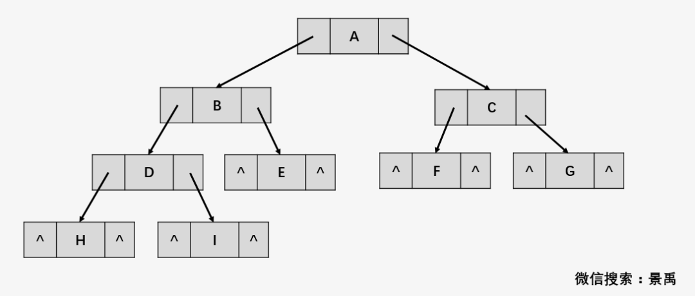

# 定义
- 单链表 不能满足设计要求，进而设计出 双链表
- 普通二叉树 -> 线索二叉树



在 32 bit 的机器上，上图包含 10 个 "^"，一个 "^" 占 4 个字节，总共浪费了 40 个字节！

对于一个有 n 个节点的二叉链表，每个节点有指向左右节点的 2 个指针域，整个二叉链表存在 2n 个指针域。而 n 个节点的二叉链表有 n-1 条分支线，那么空指针域的个数为： 2n-(n-1) = n+1 个空指针域，从存储空间的角度来看，这 n+1 个空指针域浪费了内存资源。

上图的前中后 3 种遍历方式如下：


中序遍历后结果是：**H**D**I**B**E**A**F**C**G**

红色的结点都是刚才 `^` 造成浪费的结点，中序遍历结果中它们刚好均处于字符中间，可以很好地利用 `^` 来存放前驱和后继的指针。


上图中的中序遍历结果为：HDIBACG，其中蓝色三角标注的是只有一个空闲的指针位置，如果是这样的话我们就面临一个问题：机器怎么识别到底是存放指针还是线索？


为此我们将已经定义好的结构进行“扩容”：
- ltag 为 0 时指向该结点的左孩子，为 1 时指向该结点的前驱。
- rtag 为 0 时指向该结点的右孩子，为 1 时指向该结点的后继。

综合以上面的分析，可以通过充分利用二叉链表中的空指针域，存放节点在某种遍历方式下的前驱和后继节点的指针。**我们把这种指向前驱和后继的指针称为线索，加上线索的二叉链表称为线索链表，对应的二叉树就称为“线索二叉树(Threaded Binary Tree)”** 。

我们对二叉树进行**中序遍历**，将所有的节点右子节点为空的指针域指向它的后继节点。将这颗二叉树的所有节点左指针域为空的指针域指向它的前驱节点，得到如下图所示结果：


# 实现
```cpp
// 全局变量，始终指向刚刚访问过的结点
BiThrTree pre;

// 中序遍历线索化
void InThreading(BiThrTree T)
{
    if (T)
    {
        InThreading(T->lchild); // 递归左孩子线索化

        if (!T->lchild) // 如果该结点没有左孩子，设置ltag为Thread，并把lchild指向刚刚访问的结点。
        {
            T->ltag = Thread;
            T->lchild = pre;
        }

        if (!pre->rchild)
        {
            pre->rtag = Thread;
            pre->rchild = T;
        }

        pre = T;

        InThreading(T->rchild); // 递归右孩子线索化
    }
}

void InOrderThreading(BiThrTree *p, BiThrTree T)
{
    *p = (BiThrTree)malloc(sizeof(BiThrNode));
    (*p)->ltag = Link;
    (*p)->rtag = Thread;
    (*p)->rchild = *p;
    if (!T)
    {
        (*p)->lchild = *p;
    }
    else
    {
        (*p)->lchild = T;
        pre = *p;
        InThreading(T);
        pre->rchild = *p;
        pre->rtag = Thread;
        (*p)->rchild = pre;
    }
}
```

todo: 用在什么地方，有哪些应用场景，时间复杂度和空间复杂度怎么计算
- 引入线索二叉树是为了加快查找节点前驱和后继的速度


# 参考资料
- [线索二叉树就是这么简单(修订版)](https://mp.weixin.qq.com/s/fQDh27twX4TcB_9uaPrfnQ)
- [实现](https://segmentfault.com/a/1190000008838480)

