<h1 align="center">树的遍历</h1>

* [1. 树结点](#1-树结点)
* [2. 遍历](#2-遍历)
    * [2.1. 前序遍历](#21-前序遍历)
    * [2.2. 中序遍历](#22-中序遍历)
    * [2.3. 后序遍历](#23-后序遍历)
    * [2.4. 层序遍历](#24-层序遍历)
* [3. 构造（待整理）](#3-构造待整理)
    * [3.1. 前序+后序](#31-前序后序)
    * [3.2. 前序+中序](#32-前序中序)
    * [3.3. 中序+后序](#33-中序后序)
* [4. LeetCode](#4-leetcode)
    * [4.1. 二叉树的层次遍历II](#41-二叉树的层次遍历ii)
* [5. 参考资料](#5-参考资料)

---

# 1. 树结点

```cpp
struct TreeNode
{
    int val;
    TreeNode *left;
    TreeNode *right;
    TreeNode(int x) : val(x), left(NULL), right(NULL) {}
};
```

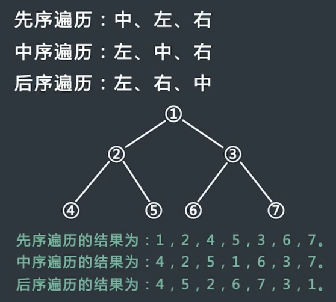

**前序遍历**（Preorder Traversal）：先访问根节点，然后前序遍历左子树，再前序遍历右子树。

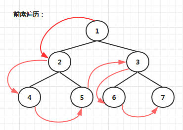

**中序遍历**（Inorder Traversal）：中序遍历根节点的左子树，然后是访问根节点，最后遍历右子树。

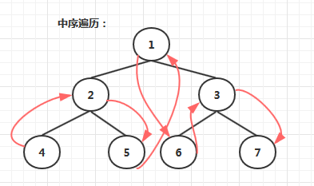

**后序遍历**（Postorder Traversal）：从左到右先叶子后结点的方式遍历左右子树，最后访问根节点。

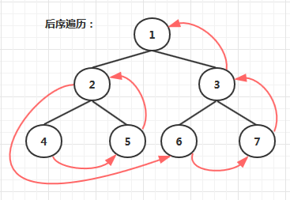

**层序遍历**：从根节点从上往下逐层遍历，在同一层，按从左到右的顺序对结点逐个访问。

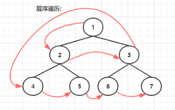


题号|题目|难度|完成度|备注
--|--|--|--|--
144 | 二叉树的前序遍历 | 🟡 | ✅ |迭代：将 right 压到栈中（对应 5.1.1）
94 | 二叉树的中序遍历 | 🟡 | ✅ |迭代：将 root 压到栈中（对应 5.1.2）
145 | 二叉树的后序遍历 | 🔴 | ✅ |迭代2：左右压入，反向输出（对应 5.1.3）
102 | 二叉树的层序遍历 | 🟡 | ✅ |队列：将 left 和 right 压到队列中（对应 5.1.4）
889 | 根据前序和后序遍历构造二叉树 | 🟡 | ✅ |
105 | 从前序与中序遍历序列构造二叉树 | 🟡 | ✅ |（对应 5.2.1）
106 | 从中序与后序遍历序列构造二叉树 | 🟡 | ✅ |（对应 5.2.2）
107 | 二叉树的层次遍历 II | 🟢 | ✅ |（对应 5.1.5）


未完成：

题号|题目|难度|完成度|备注
--|--|--|--|--
103|二叉树的锯齿形层次遍历| 🟡 |  |（对应 5.1.6）
99|恢复二叉搜索树|🔴 |  |（对应 5.1.7）


🟢🔴🟡✅❌

# 2. 遍历
## 2.1. 前序遍历
递归：

1. 先访问根节点
2. 再序遍历左子树
3. 最后序遍历右子树

```cpp
class Solution
{
public:
    std::vector<int> res; 
    std::vector<int> preorderTraversal(TreeNode *root)
    {  
        if (root == NULL)
            return res;

        res.push_back(root->val);

        if (root->left != NULL)
            preorderTraversal(root->left);
        if (root->right != NULL)
            preorderTraversal(root->right);
        return res;
    }
};
```

迭代：

1. 首先申请一个新的栈
2. 将头结点 head 压入 stack 中
3. 每次从 stack 中弹出栈顶节点，记为 cur
    
    * 如果 cur 的右孩子不为空，则其压入 stack 中
    * 如果 cur 的左孩子不为空，重置 cur 值

4. 重复步骤 3，直到 stack 为空

```cpp
class Solution
{
public:
    std::vector<int> preorderTraversal(TreeNode *root)
    {
        std::vector<int> res;
        if (root == NULL)
            return res;
        std::stack<TreeNode *> s;
        TreeNode *cur = root;
        while (!s.empty() || cur)
        {
            if (cur != NULL)
            {
                res.push_back(cur->val);
                if (cur->right != NULL)
                    s.push(cur->right);
                cur = cur->left;
            }
            // 直到cur为nullptr后，左子树到底了，开始处理栈中数据
            else
            {
                cur = s.top();
                s.pop();
            }
        }
        return res;
    }
};
```


## 2.2. 中序遍历
递归：

1. 先中序遍历左子树
2. 再访问根节点
3. 最后中序遍历右子树

```cpp
class Solution
{
public:
    std::vector<int> res;
    std::vector<int> inorderTraversal(TreeNode *root)
    {
        if (root == NULL)
            return res;
        
        if (root->left != NULL)
            inorderTraversal(root->left);

        res.push_back(root->val);

        if (root->right != NULL)
            inorderTraversal(root->right);

        return res;
    }
};
```

迭代：

1. 申请一个新栈，申请一个变量 cur，初始时令 cur 为头节点
2. 先把 cur 节点压入栈中，对以 cur 节点为头的整棵子树来说，依次把整棵树的 **左子树** 压入栈中，即不断令 `cur=cur->left`，然后重复步骤 2
3. 不断重复步骤 2，直到发现 cur 为空，此时从 stack 中弹出一个节点，并让 `cur = cur->right`，然后继续重复步骤 2
4. 当 stack 为空并且 cur 为空时结束

```cpp
class Solution
{
public:
    std::vector<int> inorderTraversal(TreeNode *root)
    {
        std::vector<int> res;
        std::stack<TreeNode *> s;
        TreeNode *cur = root;
        while (!s.empty() || cur != NULL)
        {
            if (cur != NULL)
            {
                s.push(cur);
                cur = cur->left;
            }
            else
            {
                cur = s.top();
                s.pop();
                res.push_back(cur->val);
                cur = cur->right;
            }
        }
        return res;
    }
};
```


## 2.3. 后序遍历
递归：

1. 先后序遍历左子树
2. 再后序遍历右子树
3. 最后访问根节点

```cpp
class Solution
{
public:
    std::vector<int> res;
    std::vector<int> postorderTraversal(TreeNode *root)
    {
        if (root == NULL)
            return res;
        
        if (root->left != NULL)
            postorderTraversal(root->left);
        if (root->right != NULL)
            postorderTraversal(root->right);

        res.push_back(root->val);
        
        return res;
    }
};
```

迭代 1：

1. 申请一个栈，将头节点压入 stack，同时设置一个变量 temp，表示当前 stack 的栈顶节点
2. 每次令 temp 等于当前 stack 的栈顶节点，但是**不从 stack 中弹出节点**，此时分 3 种情况：

    * 如果 temp 的左孩子不为空，则将 temp 的左孩子压入 stack 中，并 `temp->left = NULL;`
    * 如果情况 1 不成立，并且 temp 的右孩子不为空，则将 temp 的右孩子压入 stack 中，并 `temp->right = NULL;`
    * 如果情况 1 和 2 不成立，则将 temp 的值填充到 vector 中，**并从 stack 中弹出**

3. 一直重复步骤 2，直到 stack 为空

```cpp
class Solution
{
public:
    std::vector<int> postorderTraversal(TreeNode *root)
    {
        std::stack<TreeNode *> s;
        s.push(root);
        std::vector<int> res;
        if (root == NULL)
            return res;
        while (!s.empty())
        {
            TreeNode *temp = s.top();
            if (temp->left)
            {
                s.push(temp->left);
                temp->left = NULL; // 为了回溯时重新访问左子树为空
            }
            else if (temp->right)
            {
                s.push(temp->right);
                temp->right = NULL;
            }
            else
            {
                res.push_back(temp->val);
                s.pop();
            }
        }
        return res;
    }
};
```

迭代 2：**反向**，也就是：根节点 -> 右子树 -> 左子树

1. 申请一个栈 stack，将头结点压入 stack 中
2. 从 stack 中弹出的节点记为 cur，将 cur 的值填充到 vector 中
3. 然后先把 cur 的左孩子压入 stack 中，再把 cur 的右孩子压入 stack 中
4. 不断重复步骤 2 和步骤 3，直到 stack 为空，过程停止
5. **反向**输出 vector 就是结果了

```cpp
class Solution
{
public:
    std::vector<int> postorderTraversal(TreeNode *root)
    {
        std::vector<int> res;
        if (root == NULL)
            return res;
        std::stack<TreeNode *> s;
        s.push(root);
        while (!s.empty())
        {
            TreeNode *cur = s.top();
            s.pop();
            res.push_back(cur->val);
            if (cur->left)
                s.push(cur->left);
            if (cur->right)
                s.push(cur->right);
        }

        return std::vector<int>(res.rbegin(), res.rend());
    }
};
```


## 2.4. 层序遍历
使用队列：

1. 首先申请一个新的队列，将头结点 head 压入 queue 中
2. 每次从 queue 中出队，记为 cur，将 cur 的值填充到 vector 中
    * 如果 cur 的左孩子不为空，则将左孩子入队
    * 如果 cur 的右孩子不为空，则将右孩子入队
3. 重复步骤 2，直到 queue 为空


```cpp
// 返回一维数组
class Solution
{
public:
    std::vector<int> levelOrder(TreeNode *root)
    {
        std::vector<int> res;
        if (root == NULL)
            return res;
        std::queue<TreeNode *> q;
        q.push(root);

        while (!q.empty())
        {
            TreeNode *cur = q.front();
            res.push_back(cur->val);
            q.pop();
            if (cur->left)
                q.push(cur->left);
            if (cur->right)
                q.push(cur->right);
        }
        return res;
    }
};
// 返回二维数组
class Solution
{
public:
    std::vector<std::vector<int>> levelOrder(TreeNode *root)
    {
        std::vector<std::vector<int>> res;
        if (root == NULL)
            return res;
        std::queue<TreeNode *> q;
        q.push(root);
        while (q.empty() == 0)
        {
            vector<int> temp;
            int width = q.size();
            for (int i = 0; i < width; i++)
            {
                TreeNode *p = q.front();
                temp.push_back(p->val);
                q.pop();
                if (p->left)
                    q.push(p->left);
                if (p->right)
                    q.push(p->right);
            }
            res.push_back(temp);
        }
        return res;
    }
};
```

# 3. 构造（待整理）
**不同之处**：
1. 寻找当前根节点：这一部分总的来说是在寻找可以将左右子树划分开的根节点

- 前 + 后

    首先我们可以显然知道当前根节点为 `pre[pre_start]`，并且它在后序中的位置为`post_end`，因此这里我们需要找到能区分左右子树的节点。

    我们知道左子树的根节点为 `pre[pre_start + 1]`，因此只要找到它在后序中的位置就可以分开左右子树（index 的含义）

- 前 + 中

    首先我们可以显然知道当前根节点为 `pre[pre_start]`，只用找出它在中序中的位置，就可以把左右子树分开（index 的含义）

- 中 + 后

    首先我们可以显然知道当前根节点为 `post[post_end]`，只用找出它在中序中的位置，就可以把左右子树分开（index 的含义）

2. 左右遍历范围

    这一部分运用了一个技巧是 “**两种遍历中，同一子树的节点数目是相同的**”

    需要说明的是在 "前+后"，"前+中" 我们都运用到了 “**右子树起始位置为左子树终止位置 + 1**”，其实这个也可以运用上面这个技巧来计算出起始位置

- 前 + 后

    后序遍历中，我们知道 左子树：`[post_start, index]`，右子树：`[index+1, post_end-1]`

    在前序遍历中，左子树起始位置为 `pre_start + 1`，左子树个数一共有 `(index - post_start)` 个，因此左子树：`[pre_start+1, pre_start+1 + (index - post_start)]`

    右子树起始位置为左子树终止位置 + 1，终止位置为 `pre_end`，因此右子树：`[ pre_start+1 + (index - post_start) + 1, pre_end]`

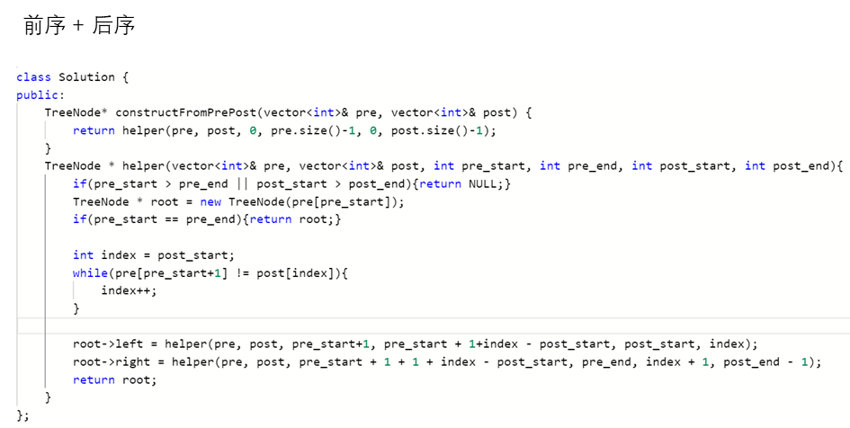

- 前 + 中

    中序遍历中，我们知道 左子树：`[inorder_start,index-1]`，右子树：`[index+1, inorder_end]`

    在前序遍历中，左子树起始位置为 `pre_start + 1`，左子树一共有 `(index-1 - inorder_start)` 个，因此左子树：`[pre_start+1, pre_start+1 + (index-1 - inorder_start)]`

    右子树起始位置为左子树终止位置 + 1，终止位置为 `pre_end`，因此右子树：`[ pre_start+1 + (index-1 - inorder_start) + 1, pre_end]`

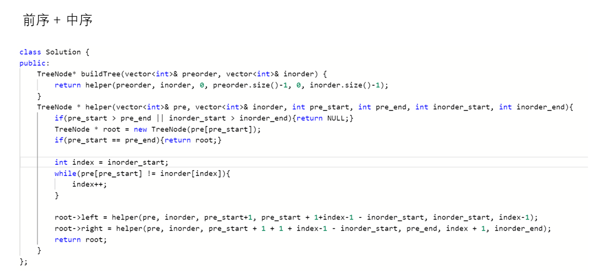

- 中 + 后

    中序遍历中，我们知道 左子树：`[inorder_start,index-1]`，右子树：`[index+1, inorder_end]`

    在后序遍历中，左子树起始位置为 `post_start`，左子树一共有 `(index-1 - inorder_start)` 个，因此左子树：`[post_start, post_start + (index-1 - inorder_start)]`

    右子树的终止位置为 `post_end - 1`，右子树一共有 `(inorder_end - (index+1))` 个，因此右子树：`[post_end - 1 - (inorder_end - (index+1)), post_end - 1]`

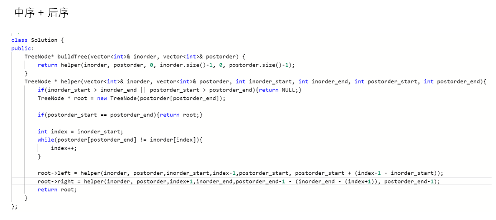


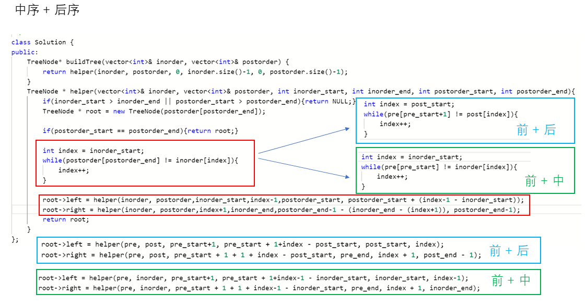


## 3.1. 前序+后序
**描述**：

```
返回与给定的前序和后序遍历匹配的任何二叉树。

 pre 和 post 遍历中的值是不同的正整数。

示例：

输入：pre = [1,2,4,5,3,6,7], post = [4,5,2,6,7,3,1]
输出：[1,2,3,4,5,6,7]
 
提示：

* 1 <= pre.length == post.length <= 30
* pre[] 和 post[] 都是 1, 2, ..., pre.length 的排列
* 每个输入保证至少有一个答案。如果有多个答案，可以返回其中一个。
```

思路分析：
- 二叉树前序遍历：先根节点，后左子树，再右子树
- 二叉树后序遍历：先左子树，后右子树，在根节点
- 所以我们需要确定左子树的 `[start, end]` 区间，右子树的 `[start, end]` 区间，然后递归，构造左子树、右子树。最重要的就是**确定边界**。

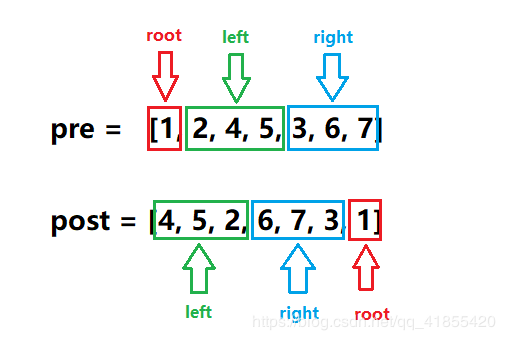

```cpp
class Solution
{
public:
    TreeNode *constructFromPrePost(vector<int> &pre, vector<int> &post)
    {
        return helper(pre, 0, pre.size() - 1, post, 0, post.size() - 1);
    }

    // 将前序遍历 pre[pre_start, pre_end] 序列段与对应的
    // 后序遍历 post[post_start, post_end] 序列段构造二叉树
    TreeNode *helper(vector<int> &pre, int pre_start, int pre_end, vector<int> &post, int post_start, int post_end)
    {
        // 子树序列长度为0，则说明是空树
        if (pre_start > pre_end || post_start > post_end)
            return NULL;

        // 前序遍历第一个节点是根
        TreeNode *root = new TreeNode(pre[pre_start]);
        // 如果前序遍历序列还有左子树、右子树
        if (pre_start != pre_end)
        {
            int index = post_start;
            while (pre[pre_start + 1] != post[index])
            {
                ++index;
            }
            // 构建左子树
            root->left = helper(pre, pre_start + 1, pre_start + 1 + index - post_start, post, post_start, index);
            // 构建右子树
            root->right = helper(pre, pre_start + 1 + 1 + index - post_start, pre_end, post, index + 1, post_end - 1);
        }
        return root;
    }
};
```

## 3.2. 前序+中序
描述：

```
根据一棵树的前序遍历与中序遍历构造二叉树。

注意:
你可以假设树中没有重复的元素。

例如，给出

前序遍历 preorder = [3,9,20,15,7]
中序遍历 inorder = [9,3,15,20,7]
返回如下的二叉树：

    3
   / \
  9  20
    /  \
   15   7
```

思路分析：采用递归的思想
1. 先构造根节点，根节点是先序遍历的第一个节点
2. 寻找根节点在中序序列中的位置
3. 递归构建根节点的左右子树
4. 用 map 存储中序遍历序列，加速在中序序列中查找根节点的过程

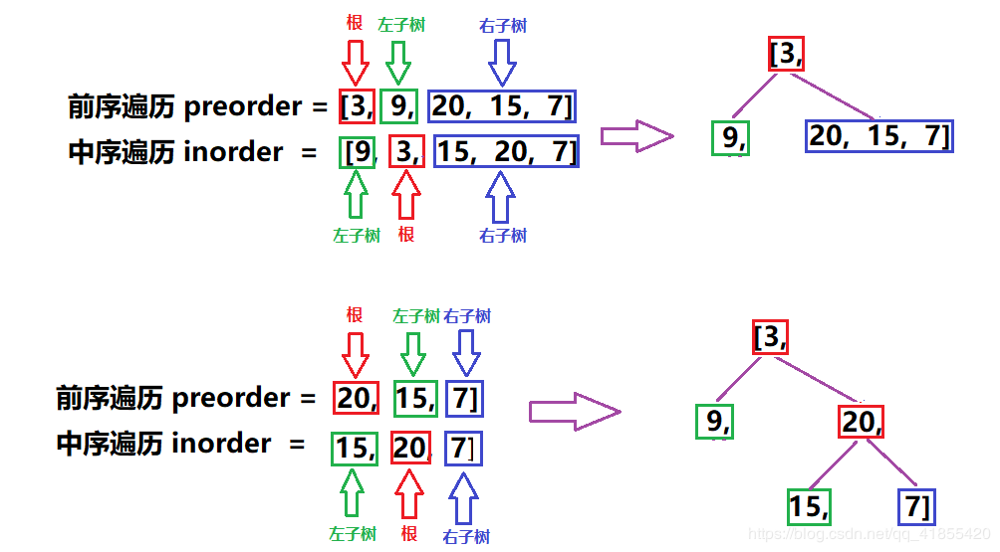


## 3.3. 中序+后序
描述：

```
根据一棵树的中序遍历与后序遍历构造二叉树。

注意:
你可以假设树中没有重复的元素。

例如，给出

中序遍历 inorder = [9,3,15,20,7]
后序遍历 postorder = [9,15,7,20,3]
返回如下的二叉树：

    3
   / \
  9  20
    /  \
   15   7

```

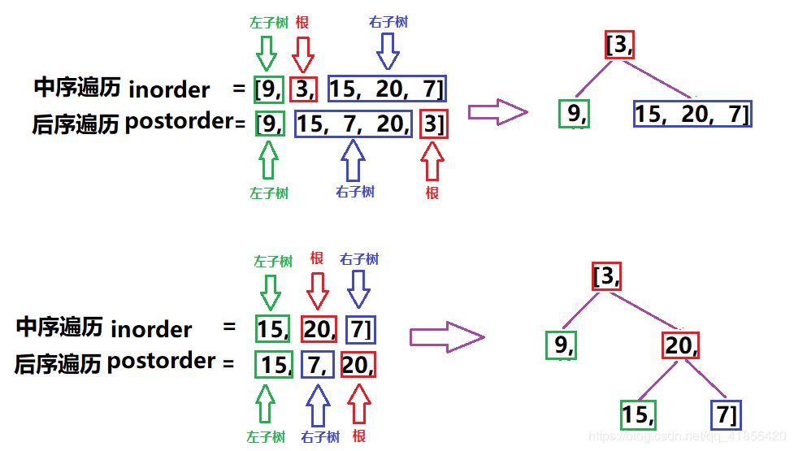

```cpp
class Solution
{
public:
    unordered_map<int, int> mp;
    TreeNode *buildTree(vector<int> &inorder, vector<int> &postorder)
    {
        if (inorder.empty())
            return NULL;
        for (int i = 0; i < inorder.size(); i++)
            mp[inorder[i]] = i; //记住每个数的位置
        return build(inorder, postorder, 0, inorder.size() - 1, 0, postorder.size() - 1);
    }
    TreeNode *build(vector<int> &inorder, vector<int> &postorder, int inL, int inR, int pL, int pR)
    {
        if (pL > pR)
            return NULL;
        TreeNode *root = new TreeNode(postorder[pR]);
        // cout << root->val << endl;
        int k = mp[postorder[pR]];
        root->left = build(inorder, postorder, inL, k - 1, pL, pL + k - inL - 1);
        root->right = build(inorder, postorder, k + 1, inR, pL + k - inL, pR - 1);
        return root;
    }
};
```

# 4. LeetCode
## 4.1. 二叉树的层次遍历II
**描述**：

```cpp
给定一个二叉树，返回其节点值自底向上的层次遍历。 （即按从叶子节点所在层到根节点所在的层，逐层从左向右遍历）

例如：
给定二叉树 [3,9,20,null,null,15,7],

    3
   / \
  9  20
    /  \
   15   7

返回其自底向上的层次遍历为：

[
  [15,7],
  [9,20],
  [3]
]
```

**思路**：

在层序遍历的基础上 `reverse()` 一下即可

递归版：时间复杂度：`O(n)`，空间复杂度：`O(n)`
```cpp
class Solution {
private:
    void traverse(TreeNode *root, size_t level, vector<vector<int>> &result) {
        if (!root)
            return;
        if (level > result.size())
            result.push_back(vector<int>());

        result[level - 1].push_back(root->val);
        traverse(root->left, level + 1, result);
        traverse(root->right, level + 1, result);
    }
public:
    vector<vector<int>> levelOrderBottom(TreeNode *root) {
        vector<vector<int>> result;
        traverse(root, 1, result);
        std::reverse(result.begin(), result.end()); // 比上一题多此一行
        return result;
    }
};
```

迭代版：时间复杂度：`O(n)`，空间复杂度：`O(1)`。

```cpp
class Solution {
public:
    vector<vector<int>> levelOrderBottom(TreeNode *root) {
        vector<vector<int>> result;
        if (root == NULL)
            return result;
        queue<TreeNode *> curr, next;
        vector<int> level; // elments in level level
        curr.push(root);
        
        while (!curr.empty()) {
            while (!curr.empty()) {
                TreeNode *node = curr.front();
                curr.pop();
                level.push_back(node->val);
                if (node->left != NULL)
                    next.push(node->left);
                if (node->right != NULL)
                    next.push(node->right);
            }
            result.push_back(level);
            level.clear();
            swap(next, curr);
        }
        reverse(result.begin(), result.end()); // 比上题多此一行
        return result;
    }
};
```


# 5. 参考资料
* [【图解数据结构】 二叉树遍历](https://www.cxyxiaowu.com/7599.html)
* [二叉树三种遍历两种方法（递归和迭代）](https://www.cnblogs.com/lMonster81/p/10433807.html)
* [LeetCode 根据前序和后序遍历构造二叉树（递归+图解）](https://blog.csdn.net/qq_41855420/article/details/92069432)
* [LeetCode 从前序与中序遍历序列构造二叉树（递归+图解）](https://blog.csdn.net/qq_41855420/article/details/87715163)
* [LeetCode 从中序与后序遍历序列构造二叉树（递归+图解）](https://blog.csdn.net/qq_41855420/article/details/87717203)
* [LeetCode 图解 | 105.用前序和中序遍历序列构建二叉树](https://mp.weixin.qq.com/s/PS0cRF5EgTcsJbE8gig4_Q?)


