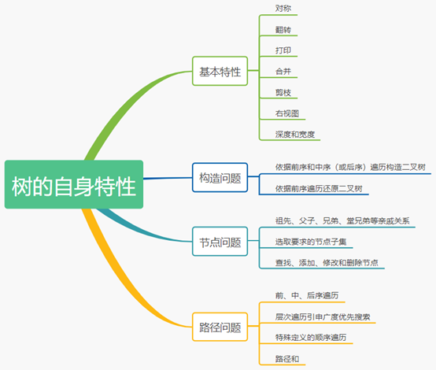
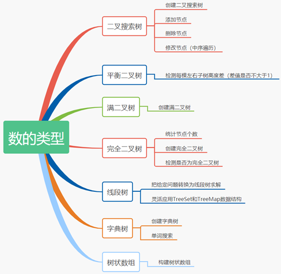
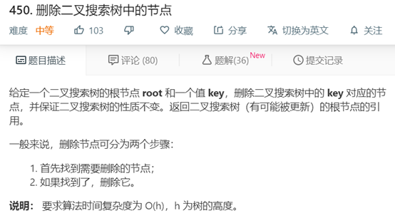
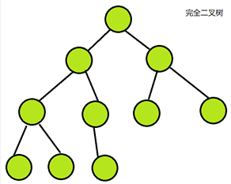
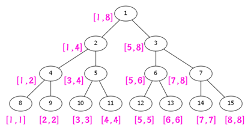
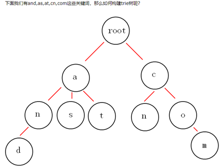
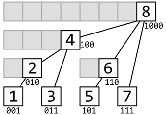

# 分类
树有关的标签有：树（123道题）、字典树（17道题）、线段树（11道题）、树状数组（6道题）。可归纳为以下四大类：

- 树的自身特性
- 树的类型
- 子树问题
- 新概念定义问题

## 树的自身特性
选取的例题共 21 道，其中简单题 5 道、中等题 13 道、困难题 3 道。

关于树的自身特性总结归纳为四个问题：

1. 基本特性问题：例1 -> 例 8
2. 构造问题：例 9、例 10
3. 节点问题：例 11 -> 例 16
4. 路径问题：例 17 -> 例 21




对于上述四个问题，基本特性和构造问题只需刷过一遍即可理解相关解法。对于树的节点和路径问题，则是本文例题中的相对困难的习题，一般需要重复刷或者深度分析和琢磨，才能感悟普适解法的套路。其中，在有关树的路径问题中，本文未收录树的前、中、后和层次遍历问题的习题，这些题目默认为较为基础的习题。

1. 对称二叉树
2. 翻转二叉树以匹配前序遍历
3. 输出二叉树
4. 合并二叉树
5. 二叉树剪枝
6. 二叉树的右视图
7. 二叉树的最小深度
8. 二叉树的最大宽度
9. 依据前序和后序遍历构造二叉树
10. 从先序遍历还原二叉树
11. 二叉树的最近公共祖先
12. 打家劫舍 III
13. 在二叉树中增加一行
14. 二叉树中所有距离为K的节点
15. 监控二叉树
16. 二叉树着色游戏
17. 二叉树的所有路径
18. 二叉树中分配硬币
19. 二叉树的垂序遍历
20. 二叉树中的最大路径和
21. 例21 路径总和 |||


## 树的类型
收录 17 道题，1 道简单题，10 道中等题，6 道困难题

在 LeetCode 题库中，考察到的不同种类的树有 7 种：
- 二叉搜索树
- 平衡二叉树
- 满二叉树
- 完全二叉树
- 线段树
- 字典树
- 树状数组

每一种类型的树，有着不同的特性以及对应的考察重点。考察重点可参考下图，下文按照树的类型分别划分了一个目录章节，并给出了对应的经典习题。



### 1 二叉树搜索树
**基本定义**：又称二叉查找树，二叉排序树。
- 若它的左子树不空，则左子树上所有结点的值均小于它的根结点的值；
- 若它的右子树不空，则右子树上所有结点的值均大于它的根结点的值；
- 它的左、右子树也分别为二叉搜索树。

**考察重点**：
- 二叉搜索树的创建问题
- 删除二叉树的指定节点
- 修改二叉树节点的值
- 添加节点

由于二搜索树自身的特殊性质，可知插入和查找具体节点的时间复杂度为 `O(logn)`。另外，需要谨记应用**中序遍历二叉搜索树得到的序列为升序序列**。对于添加、修改二叉树的节点问题，中序遍历的思想一般能够提供较好的解答思路。

**本部分收录的习题**：
1. 95.不同的二叉搜索树 II，难度：中等 （考察搜索二叉树的创建问题）
2. 99.恢复二叉搜索树，难度：困难 （考察搜索二叉树修改节点的问题）
3. 450.删除二叉搜索树中的节点，难度：中等（考察搜索二叉树节点删除问题）
4. 701.二叉搜索树中的插入，难度：中等（考察搜索二叉树节点的插入问题）

**注意**：对于删除操作可以采用地址覆盖的操作来实现


下面具体给出题号为 450 题目的描述及解答代码。

题目描述：



```java
class Solution {
    public TreeNode deleteNode(TreeNode root, int key) {
        if (root == null)
            return null;
        if (key < root.val) { // 待删除节点在左子树中
            root.left = deleteNode(root.left, key);
            return root;
        } else if (key > root.val) {  // 待删除节点在右子树中
            root.right = deleteNode(root.right, key);
            return root;
        } else {  // key == root.val，root 为待删除节点
            if (root.left == null)  // 返回右子树作为新的根
                return root.right;
            else if (root.right == null)  // 返回左子树作为新的根
                return root.left;
            else {  // 左右子树都存在，返回后继节点（右子树最左叶子）作为新的根
                TreeNode successor = min(root.right);
                successor.right = deleteMin(root.right);
                successor.left = root.left;
                return successor;
            }
        }
    }

    private TreeNode min(TreeNode node) {
        if (node.left == null)
            return node;
        return min(node.left);
    }

    private TreeNode deleteMin(TreeNode node) {
        if (node.left == null)
            return node.right;
        node.left = deleteMin(node.left);
        return node;
    }
}
```

### 2 平衡二叉树
**基本定义**：

它是一棵空树或它的左右两个子树的高度差的绝对值不超过 1，并且左右两个子树都是一棵平衡二叉树。

**考察重点**：
- 给定一棵二叉树，检测该树是否为平衡二叉树。即考察我们递归遍历树的每个节点，检测每个节点对应的左右子树的高度差是否不大于 1

**本部分收录的习题**：
- 110.平衡二叉树，难度：简单

### 3 满二叉树
**基本定义**：

每个结点恰好有 0 或 2 个子结点。

**考察重点**：
- 给定若干个元素，求能够组成的不同满二叉树的个数。

**本部分收录的习题**：
- 894.所有可能的满二叉树，难度：中等

### 4 完全二叉树
**基本定义**：

完全二叉树从根结点到倒数第二层满足完美二叉树，最后一层可以不完全填充，其叶子结点都靠左对齐。（附完美二叉树定义：一个深度为 k(>=-1) 且有 2^(k+1) - 1 个结点的二叉树称为完美二叉树。）



**考察重点**：
- 统计给定树的节点个数
- 创建完全二叉树
- 检测给定树是否为完成二叉树。

**本部分收录的习题**：
- 222.完全二叉树的节点个数，难度：中等（考察统计节点个数）
- 919.完全二叉树插入器，难度：中等（考察创建完全二叉树）
- 958.二叉树的完全性检验，难度：中等（考察检测是否为完全二叉树）

### 5 线段树
基本定义：线段树是一种二叉搜索树，与区间树相似，它将一个区间划分成一些单元区间，每个单元区间对应线段树中的一个叶结点。



实际应用：使用线段树可以快速的查找某一个节点在若干条线段中出现的次数，时间复杂度为 O(logN)。

考察重点：给定问题，灵活转换为线段树求解。

应用 Java 语言创建线段树时，可以借助内置的 TreeSet 和 TreeMap 数据结构。TreeSet 是 HashSet 的升级版，TreeMap 则是 HashMap 的升级版

本部分收录的习题：

- 715. Range模块，难度：困难（可以采用TreeSet构建线段树，需要熟悉TreeSet在Java中相关接口的用法）
- 732.我的日程安排表III ，难度：困难 (可以采用TreeMap构建模拟化线段树，需要熟悉TreeMap在Java中相关接口的用法)
- 850.矩形面积II，难度：困难（考察定义线段树的标准解法）

### 6 字典树
基本定义（百度百科）：又称单词查找树、前缀树、Trie树，是一种树形结构，是一种哈希树的变种。典型应用是用于统计，排序和保存大量的字符串（但不仅限于字符串），所以经常被搜索引擎系统用于文本词频统计。它的优点是：利用字符串的公共前缀来减少查询时间，最大限度地减少无谓的字符串比较，查询效率比哈希树高。参考示例图如下



考察重点：
- 创建字典树
- 单词搜索

本部分收录的习题：

- 208.实现Trie(前缀树)，难度：中等（考察创建字典树）
- 212.单词搜索II，难度：困难（考察单词搜索）
- 648.单词替换，难度：中等（考察单词搜索）

### 7 树状数组
基本定义（百度百科）：是一个查询和修改复杂度都为 log(n) 的数据结构。主要用于查询任意两位之间的所有元素之和，但是每次只能修改一个元素的值；经过简单修改可以在 log(n) 的复杂度下进行范围修改，但是这时只能查询其中一个元素的值(如果加入多个辅助数组则可以实现区间修改与区间查询)。



考察重点：构建树状数组。

本部分收录的习题：
- 307.区域和检索-数组可修改，难度：中等
- 315.计算右侧小于当前元素的个数，难度：困难


## 子树问题
**本部分收录的习题如下**：
1. 508.出现次数最多的子树元素和，难度：中等
2. 652.寻找重复的子树，难度：中等
3. 865.具有所有最深结点的最小子树，难度：中等
4. 1110.删点成林，难度：中等


## 新概念定义问题
**本部分收录习题如下**：
1. 117.填充每个节点的下一个右侧节点指针II, 难度: 中等（对应 5.1.12）
2. 297.二叉树的序列化与反序列化，难度：困难
3. 114.二叉树展开为链表，难度: 中等（对应 5.1.11）
4. 998.最大二叉树II, 难度：中等
5. 834.树中距离之和，难度：困难


# 参考资料
- [LeetCode刷题总结-树篇（上）](https://www.cnblogs.com/liuzhen1995/p/11921771.html)
- [LeetCode刷题总结-树篇（中）](https://www.cnblogs.com/liuzhen1995/p/11951163.html)
- [LeetCode刷题总结-树篇（下）](https://www.cnblogs.com/liuzhen1995/p/11961322.html)

