# 树的自身特性

序号|题号|题目|难度|完成|备注
:--:|:--:|:--|:--:|:--:|:--
1|101|对称二叉树|🟢|✔|递归/迭代（对应 5.1.9）
2|971|翻转二叉树以匹配前序遍历|🟡||关于翻转类习题，还可以参考题号226和951
4|617|合并二叉树|🟢|✔|深度优先遍历
7|111|二叉树的最小深度|🟢|✔|深度优先遍历
**11**|236|[二叉树的最近公共祖先](#二叉树的最近公共祖先)|🟡|✔|深度优先搜索
17|257|二叉树的所有路径|🟢|✔|深度优先遍历
21|437|路径总和 III|🟢|✔|前序遍历+递归

尚未实现：

题号|题目|难度|完成|备注
:--:|:--|:--:|:--:|:--
124|二叉树中的最大路径和|🔴||对应（5.4.5）
116|填充每个节点的下一个右侧节点指针|🟡||对应（5.4.6）
129|求根到叶子节点数字之和|🟡||对应（5.4.7）

🟢 🔴 🟡 ✔ ✖

**总结**：
- 迭代常用栈结构


## 对称二叉树
**题目描述**：

```
给定一个二叉树，检查它是否是镜像对称的。

例如，二叉树 [1,2,2,3,4,4,3] 是对称的。

    1
   / \
  2   2
 / \ / \
3  4 4  3
 
但是下面这个 [1,2,2,null,3,null,3] 则不是镜像对称的:

    1
   / \
  2   2
   \   \
   3    3

进阶：

你可以运用递归和迭代两种方法解决这个问题吗？
```

**解题思路**：

递归版：从以树的根节点的左右子节点为根开始进行深度优先搜索，依次判断两颗子树的左子树是否更与其右子树，右子树是否等于其左子树即可。
1. 空二叉树是特殊的对称二叉树
2. 两个根节点的值要想等
3. 左边的左子树 和 右边的右子树对称
4. 左边的右子树 和 右边的左子树对称
5. 对称: (1) 非空，值相等 (2) 都为空

时间复杂度：`O(n)`，空间复杂度：`O(logn)`
```cpp
class Solution {
public:
    bool isSymmetric(TreeNode *root) {
        if (root == NULL)
            return true;
        return dfs(root->left, root->right);
    }

    bool dfs(TreeNode *left, TreeNode *right)
    {
        if (left == NULL && right == NULL)
            return true;
        if (left == NULL || right == NULL || left->val != right->val)
            return false;
        return dfs(left->left, right->right) && dfs(left->right, right->left);
    }
};
```

迭代版：只需使用层次遍历，判断每层元素是否满足镜像对称即可
1. 左边:左中右遍历
2. 右边:右中左遍历
3. 利用**中序遍历**迭代的方法

时间复杂度：`O(n)`，空间复杂度：`O(logn)`

```cpp
// 版本 1
class Solution {
public:
    bool isSymmetric(TreeNode *root) {
        if (!root)
            return true;
        std::stack<TreeNode *> p, q;
        TreeNode *l = root->left;
        TreeNode *r = root->right;
        while (l || r || p.size() || q.size()) {
            while (l && r) {
                p.push(l), l = l->left;
                q.push(r), r = r->right;
            }
            if (l || r)
                return false;
            l = p.top(), p.pop();
            r = q.top(), q.pop();
            if (l->val != r->val)
                return false;
            l = l->right, r = r->left;
        }
        return true;
    }
};

// 版本 2
class Solution {
public:
    bool isSymmetric(TreeNode *root) {
        if (!root)
            return true;
        stack<TreeNode *> s;
        s.push(root->left);
        s.push(root->right);
        
        while (!s.empty()) {
            auto p = s.top();
            s.pop();
            auto q = s.top();
            s.pop();
            if (!p && !q)
                continue;
            if (!p || !q)
                return false;
            if (p->val != q->val)
                return false;
            s.push(p->left);
            s.push(q->right);
            s.push(p->right);
            s.push(q->left);
        }
        return true;
    }
};
```


## 翻转二叉树以匹配前序遍历
**题目描述**：

```
给定一个有 N 个节点的二叉树，每个节点都有一个不同于其他节点且处于 {1, ..., N} 中的值。

通过交换节点的左子节点和右子节点，可以翻转该二叉树中的节点。

考虑从根节点开始的先序遍历报告的 N 值序列。将这一 N 值序列称为树的行程。

（回想一下，节点的先序遍历意味着我们报告当前节点的值，然后先序遍历左子节点，再先序遍历右子节点。）

我们的目标是翻转最少的树中节点，以便树的行程与给定的行程 voyage 相匹配。 

如果可以，则返回翻转的所有节点的值的列表。你可以按任何顺序返回答案。

如果不能，则返回列表 [-1]。


示例 1：
输入：root = [1,2], voyage = [2,1]
输出：[-1]

示例 2：
输入：root = [1,2,3], voyage = [1,3,2]
输出：[1]

示例 3：
输入：root = [1,2,3], voyage = [1,2,3]
输出：[]
```

**解题思路**：

该题也是递归思想的应用。按照题目要求进行前序遍历，一旦遇到对应值与目标数组结果不同时，翻转遍历，接着继续遍历，如果最终结果依然不匹配则返回false，否则返回true。

```java
class Solution {
    private int index;
    private int[] voyage;
    private List<Integer> result;

    public List<Integer> flipMatchVoyage(TreeNode root, int[] voyage) {
        // index = 0;
        this.voyage = voyage;
        result = new ArrayList<>();
        dfs(root);
        // System.out.println("result = "+result);
        if(result.size() > 0 && result.get(result.size()-1) == -1)
            return new ArrayList<Integer>(Arrays.asList(-1));
        return result;
    }

    public void dfs(TreeNode root) {
        if(root == null)
            return;
        if(root.val != voyage[index++])
            result.add(-1);
        else {
            if(root.left != null && root.left.val != voyage[index]) {
                result.add(root.val);
                dfs(root.right);
                dfs(root.left);
            } else {
                dfs(root.left);
                dfs(root.right);
            }
        }
    }
}
```

## 例3 输出二叉树
题号：655，难度：中等

题目描述：

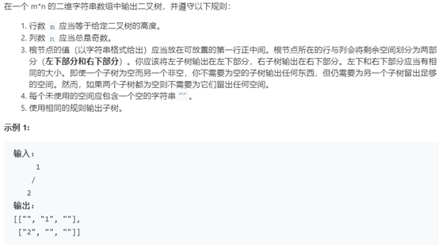

解题思路：

此题是要求以二维数组的形式画出给定的二叉树。需要建立一个以根节点为原点的平面直角坐标系，然后依据广度优先搜索（即层次遍历）的思想依次初始化每层数组中元素的值即可，其中应用到了二分查找来确定每个元素的具体坐标，能够有效降低检索时间。

```java
class Solution {
    public List<List<String>> printTree(TreeNode root) {
        List<List<String>> result = new ArrayList<>();
        int dep = getDepth(root);
        Queue<TreeNode> queue = new LinkedList<>();
        queue.add(root);
        // System.out.println("dep = "+dep);
        for(int i = 0;i < dep;i++) {
            List<String> list = new ArrayList<>();
            for(int j = 0;j < Math.pow(2, dep)-1;j++)
                list.add("");
            List<Integer> index = new ArrayList<>();
            getIndex(i, 0, list.size() - 1, index);
            for(int j = 0;j < Math.pow(2, i);j++) {
                TreeNode temp = queue.poll();
                if(temp == null) {
                    queue.add(temp);
                    queue.add(temp);
                } else {
                    list.set(index.get(j), ""+temp.val);
                    queue.add(temp.left);
                    queue.add(temp.right);
                }
            }
            result.add(list);
        }
        return result;
    }

    public int getDepth(TreeNode root) {
        if(root == null)
            return 0;
        return 1 + Math.max(getDepth(root.left), getDepth(root.right));
    }

    public void getIndex(int num, int left, int right, List<Integer> index) {
        int mid = (left + right) / 2;
        if(num == 0)
            index.add(mid);
        else {
            getIndex(num - 1, left, mid - 1, index);
            getIndex(num - 1, mid + 1, right, index);
        }
    }
}
```


## 合并二叉树
**题目描述**：

```
给定两个二叉树，想象当你将它们中的一个覆盖到另一个上时，两个二叉树的一些节点便会重叠。

你需要将他们合并为一个新的二叉树。合并的规则是如果两个节点重叠，那么将他们的值相加作为节点合并后的新值，否则不为 NULL 的节点将直接作为新二叉树的节点。

示例 1:

输入: 
	Tree 1                     Tree 2                  
          1                         2                             
         / \                       / \                            
        3   2                     1   3                        
       /                           \   \                      
      5                             4   7                  

输出: 
合并后的树:
	     3
	    / \
	   4   5
	  / \   \ 
	 5   4   7

注意: 合并必须从两个树的根节点开始。
```

**解题思路**：

选取其中一个根节点作为返回值的根节点。然后应用深度优先搜索的思想，采用相同顺序同时遍历两棵树，如果当前节点均存在则相加，否则则选取含有值的节点。

**备注**：

todo: 理解深度优先搜索的实现以及递归

```cpp
class Solution
{
public:
    TreeNode *mergeTrees(TreeNode *t1, TreeNode *t2)
    {
        if (t1 == nullptr)
            return t2;
        else if (t2 == nullptr)
            return t1;
        t1->left = mergeTrees(t1->left, t2->left);
        t1->right = mergeTrees(t1->right, t2->right);
        t1->val = t1->val + t2->val;

        return t1;
    }
};
```


## 例5 二叉树剪枝
题号：814，难度：中等（另外，还可以参考题号669，修剪二叉搜索树）

题目描述：

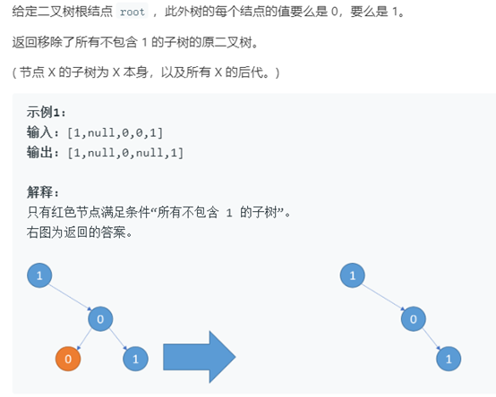

解题思路：

此题属于二叉树节点删除问题的实际应用，并且结合深度优先搜索（前序遍历的应用）和回溯的思想。具体实现过程请参考下方代码。

```java
class Solution {
    public TreeNode pruneTree(TreeNode root) {
        if(root == null)
            return root;
        if(root.val == 0 && root.left == null && root.right == null)
            root = root.left;
        else {
            root.left = pruneTree(root.left);
            root.right = pruneTree(root.right);
        }

        if(root != null && root.val == 0 && root.left == null && root.right == null)
            root = root.left;

        return root;
    }
}
```

## 例6 二叉树的右视图
题号：199，难度：中等

题目描述：

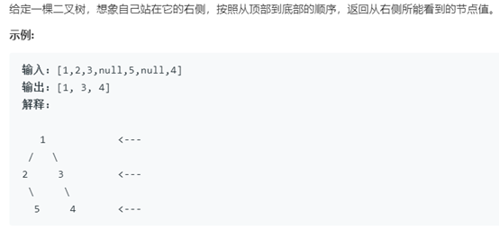

解题思路：

层次遍历的实际应用。只需依次保存每层最右边的一个节点即可。

```java
class Solution {
    public List<Integer> rightSideView(TreeNode root) {
        if(root == null)
            return new ArrayList<Integer>();
        Queue<TreeNode> queue = new LinkedList<>();
        queue.offer(root);
        List<Integer> result = new ArrayList<>();
        while(queue.size() > 0) {
            int count = queue.size();
            while(count-- > 0) {
                TreeNode temp = queue.poll();
                if(count == 0)
                    result.add(temp.val);
                if(temp.left != null)
                    queue.offer(temp.left);
                if(temp.right != null)
                    queue.offer(temp.right);
            }
        }

        return result;
    }
}
```


## 二叉树的最小深度
最大深度请参考题号：104

**题目描述**：

```
给定一个二叉树，找出其最小深度。

最小深度是从根节点到最近叶子节点的最短路径上的节点数量。

说明: 叶子节点是指没有子节点的节点。

示例:

给定二叉树 [3,9,20,null,null,15,7],

    3
   / \
  9  20
    /  \
   15   7

返回它的最小深度  2.
```

**解题思路**：

深度优先搜索的应用

```cpp
class Solution
{
public:
    int minDepth(TreeNode *root)
    {
        if (root == nullptr)
            return 0;
        if (root->left != nullptr && root->right != nullptr)
            return 1 + std::min(minDepth(root->left), minDepth(root->right));
        else
            return 1 + minDepth(root->right) + minDepth(root->left);
    }
};
```


## 例8 二叉树的最大宽度
题号：662，难度：中等（另外，可参考题号：543，二叉树的直径）

题目描述：

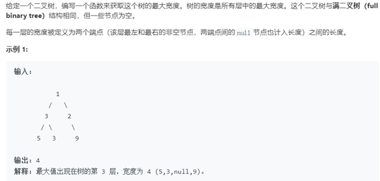

解题思路：

层次遍历的实际应用，依次更新每层最大宽度即可。

```java
class Solution {
    public int widthOfBinaryTree(TreeNode root) {
        if(root == null)
            return 0;
        int result = 0;
        Queue<TreeNode> queue = new LinkedList<>();
        Queue<Integer> index = new LinkedList<>();
        queue.offer(root);
        index.offer(1);
        while(queue.size() > 0) {
            int count = queue.size();
            int left = index.peek();
            // System.out.println("left = "+left+", count = "+count);
            while(count-- > 0) {
                TreeNode temp = queue.poll();
                int i = index.poll();
                if(temp.left != null) {
                    queue.offer(temp.left);
                    index.offer(i * 2);
                }
                if(temp.right != null) {
                    queue.offer(temp.right);
                    index.offer(i * 2 + 1);
                }
                if(count == 0)
                    result = Math.max(result, 1 + i - left);
            }
        }
        return result;
    }
}
```

## 例9 依据前序和后序遍历构造二叉树
题号：889，难度：中等（另外，可参考同类型习题，题号：105，106，1008）

题目描述：

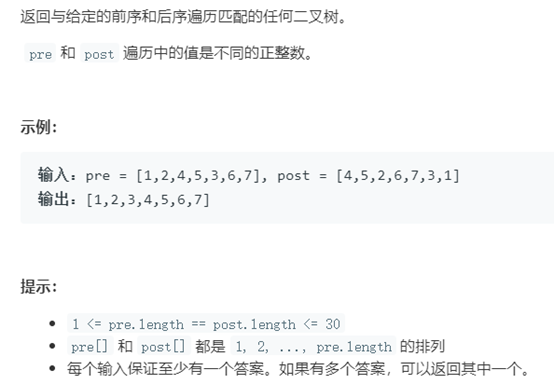

解题思路：

可以先手动构造画以下，体会其中的构造规则，然后采用深度优先搜索的思想来实现。每次找到当前子树的根节点，并确定左右子树的长度，并不断递归遍历构造即可。

```java
class Solution {
    private int[] pre;
    private int[] post;
    private Map<Integer, Integer> map;

    public TreeNode constructFromPrePost(int[] pre, int[] post) {
        this.pre = pre;
        this.post = post;
        map = new HashMap<>();
        for(int i = 0;i < post.length;i++)
            map.put(post[i], i);

        return dfs(0, pre.length-1, 0, post.length-1);
    }

    public TreeNode dfs(int pre_left, int pre_right, int post_left, int post_right) {
        if(pre_left > pre_right || post_left > post_right)
            return null;
        TreeNode root = new TreeNode(pre[pre_left]);
        int len = 0;
        if(pre_left + 1 < pre_right)
            len = map.get(pre[pre_left+1]) - post_left;
        root.left = dfs(pre_left+1, pre_left+1+len < pre_right ? pre_left+1+len: pre_right, post_left, post_left+len);
        root.right = dfs(pre_left+len+2, pre_right, post_left+len+1, post_right-1);

        return root;
    }
}
```

## 例10 从先序遍历还原二叉树
题号：1028，难度：困难

题目描述：

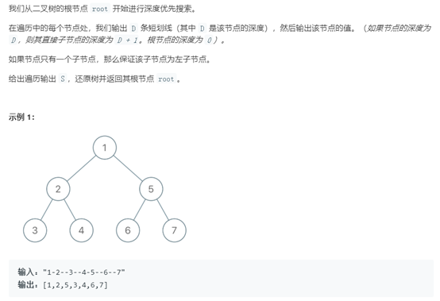

解题思路：

定义一个全局变量用于确定当前深度优先遍历元素处在左子树还是右子树，能够有效减少代码量，并提高代码的可阅读性。

```java
class Solution {
    int i = 0;  // 神来之笔， 定义全局变量i，可以有效区分左子树和右子树

    public TreeNode recoverFromPreorder(String s) {
        return buildtree(s,0);
    }

    public TreeNode buildtree(String s,int depth){
        if(i == s.length()) return null;
        TreeNode cur = null;
        int begin = i;
        while(s.charAt(begin) == '-')  begin ++;
        int end = begin;
        while(end < s.length() && s.charAt(end) - '0' >= 0 && s.charAt(end) - '0' < 10) end ++;
        if(begin - i == depth){
            cur = new TreeNode(Integer.valueOf(s.substring(begin,end)));
            i = end;
        }
        if(cur != null){
            // System.out.println("dep = "+depth+", cur = "+cur.val);
            cur.left = buildtree(s,depth + 1);
            cur.right = buildtree(s,depth + 1); // 通过全局变量i，可以在同一层深度找到右子树
        }
        return cur;
    }
}
```

## 二叉树的最近公共祖先
**描述**：

```
给定一个二叉树, 找到该树中两个指定节点的最近公共祖先。

百度百科中最近公共祖先的定义为：“对于有根树 T 的两个结点 p、q，最近公共祖先表示为一个结点 x，满足 x 是 p、q 的祖先且 x 的深度尽可能大（一个节点也可以是它自己的祖先）。”

例如，给定如下二叉树:  root = [3,5,1,6,2,0,8,null,null,7,4]

      3
    /   \
   5     1
  / \   / \
 6   2 0   8
    / \
   7   4

示例 1:

输入: root = [3,5,1,6,2,0,8,null,null,7,4], p = 5, q = 1
输出: 3
解释: 节点 5 和节点 1 的最近公共祖先是节点 3。

示例 2:

输入: root = [3,5,1,6,2,0,8,null,null,7,4], p = 5, q = 4
输出: 5
解释: 节点 5 和节点 4 的最近公共祖先是节点 5。因为根据定义最近公共祖先节点可以为节点本身。
 

说明:
* 所有节点的值都是唯一的。
* p、q 为不同节点且均存在于给定的二叉树中。
```

**思路**：

采用[深度优先搜索](https://leetcode-cn.com/problems/lowest-common-ancestor-of-a-binary-tree/solution/c-jing-dian-di-gui-si-lu-fei-chang-hao-li-jie-shi-/)的思想，搜索目标节点

1. 如果当前结点 root 等于 NULL，则直接返回 NULL
2. 如果 root 等于 p 或者 q ，那这棵树一定返回 p 或者 q
3. 然后递归左右子树，**因为是递归，使用函数后可认为左右子树已经算出结果**，用 left 和 right 表示
4. 此时若 left 为空，那最终结果只要看 right；若 right 为空，那最终结果只要看 left
5. 如果 left 和 right 都非空，因为只给了 p 和 q 两个结点，都非空，说明一边一个，因此 root 是他们的最近公共祖先
6. 如果 left 和 right 都为空，则返回空（其实已经包含在前面的情况中了）

时间复杂度 `O(n)`：每个结点最多遍历一次。空间复杂度 `O(n)`：需要系统栈空间


```cpp
class Solution
{
public:
    TreeNode *lowestCommonAncestor(TreeNode *root, TreeNode *p, TreeNode *q)
    {
        if (root == NULL)
            return NULL;
        if (root == p || root == q)
            return root;

        TreeNode *left = lowestCommonAncestor(root->left, p, q);
        TreeNode *right = lowestCommonAncestor(root->right, p, q);

        if (left == NULL)
            return right;
        if (right == NULL)
            return left;
        if (left && right) // p和q在两侧
            return root;

        return NULL; // 必须有返回值
    }
};
```

## 例12 打家劫舍 III
题号：337，难度：中等

题目描述：

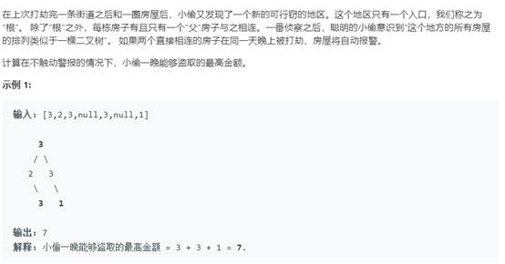

解题思路：

本题考察后序遍历思想的应用，感觉外加了一点动态规划的思维。题目要求是寻找一个想加和较大的节点集。具体实现思路请参考代码。

```java
class Solution {

    public int rob(TreeNode root) {
        return postorder(root);
    }

    public int postorder(TreeNode root){
        if(root == null)
            return 0;
        postorder(root.left);
        postorder(root.right);
        int res1 = 0;  // 左右
        int res2 = root.val;  //根
        if (root.left != null){
            res1 += root.left.val;
            if (root.left.left != null)
                res2 += root.left.left.val;
            if (root.left.right != null)
                res2 += root.left.right.val;
        }
        if (root.right != null){
            res1 += root.right.val;
            if (root.right.left != null)
                res2 += root.right.left.val;
            if (root.right.right!=null)
                res2 += root.right.right.val;
        }
        root.val = Math.max(res1, res2);
        return root.val;
    }
}
```

## 例13 在二叉树中增加一行
题号：623，难度：中等

题目描述：

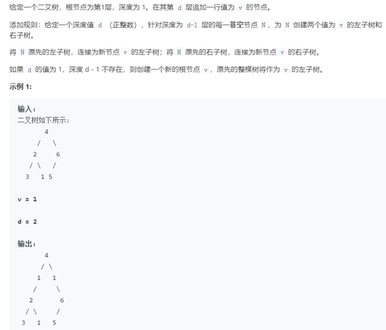

解题思路：

此题考察二叉树的添加节点的问题。并且保持原有节点的相对顺序不断，具体解题思路可参考代码。

```java
class Solution {
   public TreeNode addOneRow(TreeNode root, int v, int d) {
     if (d == 0 || d == 1) {
         TreeNode t = new TreeNode(v);
         if (d == 1) t.left = root;
         else t.right = root;
         return t;
     }
     if (root != null && d > 1) {
         root.left = addOneRow(root.left, v, d > 2 ? d - 1 : 1);
         root.right = addOneRow(root.right, v, d > 2 ? d - 1 : 0);
     }
     return root;
  }
}
```

## 例14 二叉树中所有距离为K的节点
题号：863，难度：中等

题目描述：

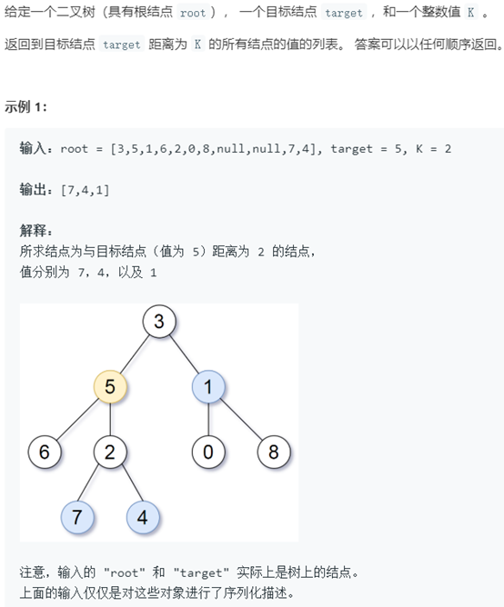

解题思路：

保存从根节点开始到叶子节点的每个路径，然后找到目标节点的位置，按照距离大小采用哈希定位的思想找到对应节点。

```java
class Solution {
    private Map<TreeNode,String>map=new HashMap<>();
    private String path;

    public List<Integer> distanceK(TreeNode root, TreeNode target, int K) {
        List<Integer>list=new ArrayList<>();
        getNodeDist(root,target,"");
        int i;
        for(TreeNode key:map.keySet()){
            String s=map.get(key);
            for(i=0;i<s.length()&&i<path.length()&&s.charAt(i)==path.charAt(i);i++);
            if(s.length()-i+path.length()-i==K)
                list.add(key.val);
        }
        return list;
    }

    public void getNodeDist(TreeNode root,TreeNode target,String p){
            if(root != null){
                path = root == target ? p : path;
                map.put(root, p);
                getNodeDist(root.left,target,p+"0");
                getNodeDist(root.right,target,p+"1");
            }
    }
}
```

## 例15 监控二叉树
题号：968，难度：困难

题目描述：

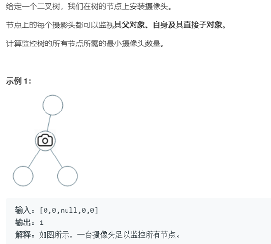

解题思路：

此题也是选取一个符合题目要求的节点子集，但是取的要求是间隔化取点，并且需要满足数量最小。具体实现可参考下方代码。

```java
class Solution {
    private int ans = 0;

    public int minCameraCover(TreeNode root) {
        if (root == null) return 0;
        if (dfs(root) == 2) ans++;
        return ans;
    }

    // 1：该节点安装了监视器 2：该节点可观，但没有安装监视器 3：该节点不可观
    private int dfs(TreeNode node) {
        if (node == null)
            return 1;
        int left = dfs(node.left), right = dfs(node.right);
        if (left == 2 || right == 2) {
            ans++;
            return 0;
        } else if (left == 0 || right == 0){
            return 1;
        } else
            return 2;
    }
}
```

## 例16 二叉树着色游戏
题号：1145，难度：中等

题目描述：

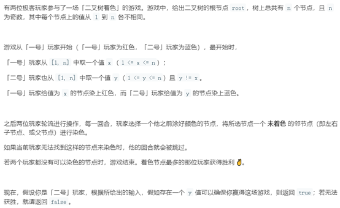

解题思路：

此题也是一道节点选择的问题，但是涉及到了博弈论。按照题目的要求我们会发现选择一个节点后正常情况下会把整棵树分为三个部分，只需要获胜者能够访问的一部分节点个数大于另一方即可确保最终获胜。

```java
class Solution {
   //极客1选的起始点有多少个左节点
    private int left = 0;
    //极客1选的起始点有多少个右节点
    private int right = 0;

    public boolean btreeGameWinningMove(TreeNode root, int n, int x) {
        //极客1选了第一个节点后，将树划分为了三个部分（可能为空）
        //第一部分：left 第二部分：right 第三部分：n - (left + right) - 1
        //只需要总结点的数的一半 < 三个部分中的最大值，极客2就可以获胜
        return getNum(root, x) / 2 < Math.max(Math.max(left, right), n - (left + right) - 1);
    }

    private int getNum(TreeNode node, int x) {
        if (node == null) {
            return 0;
        }
        int r = getNum(node.right, x);
        int l = getNum(node.left, x);
        if (node.val == x) {
            left = l;
            right = r;
        }
        return l + r + 1;
    }
}
```


## 二叉树的所有路径
**题目描述**：

```
给定一个二叉树，返回所有从根节点到叶子节点的路径。

说明: 叶子节点是指没有子节点的节点。

示例:

输入:

   1
 /   \
2     3
 \
  5

输出: ["1->2->5", "1->3"]

解释: 所有根节点到叶子节点的路径为: 1->2->5, 1->3
```

解题思路：

此题是路径选择的一个基本习题，是解决路径相关问题的必须掌握的一道题。采用深度优先搜索保存每条路径即可。

```cpp
// 递归
class Solution
{
public:
    vector<string> binaryTreePaths(TreeNode *root)
    {
        vector<string> res;
        if (!root)
            return res;

        if (!root->left && !root->right) // 对于叶子节点的处理
        {
            res.push_back(to_string(root->val)); // 在返回值中填入当前叶子的值
        }
        else // 对于非叶子节点的处理
        {
            if (root->left) // 对左子树的处理
            {
                vector<string> left = binaryTreePaths(root->left); // 将返回值保存在 left 中
                res.insert(res.end(), left.begin(), left.end());   // 将 left 追加到 res 的末尾
            }
            if (root->right) // 右子树同理
            {
                vector<string> right = binaryTreePaths(root->right);
                res.insert(res.end(), right.begin(), right.end());
            }

            for (int i = 0; i < res.size(); i++) // 对于非叶子节点，需要将路径表示出来
            {
                res[i].insert(0, "->");
                res[i].insert(0, to_string(root->val));
            }
        }
        return res;
    }
};

// 迭代：二叉树中序遍历的迭代方法。先存尽左子树，然后访问节点，接着转向top节点的右子树
class Solution
{
public:
    vector<string> binaryTreePaths(TreeNode *root)
    {
        vector<string> ans;
        if (root == NULL)
            return ans;
        TreeNode *p = root;
        stack<pair<TreeNode *, string>> s;
        string str;
        while (!s.empty() || p)
        {
            while (p)
            {
                if (p == root)
                    str = str + to_string(p->val);
                else
                    str = str + "->" + to_string(p->val);
                s.push(pair<TreeNode *, string>(p, str));
                p = p->left;
            }
            p = s.top().first;
            str = s.top().second;
            s.pop();
            if (p->right == NULL && p->left == NULL)
                ans.push_back(str);
            p = p->right;
        }
        return ans;
    }
};
```


## 例18 二叉树中分配硬币
题号：979，难度：中等

题目描述：

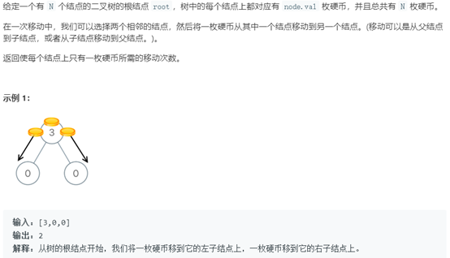

解题思路：

本题考察我们采用前序遍历，并抽象为本题解答的过程。

```java
class Solution {
    /**
     * 从后序遍历的第一个叶子节点开始，假设自己有x个金币，剩余x-1个金币都还给父节点，x-1可能为负数、0、正数
     * x-1 < 0说明不够金币，需要从父节点获得，因此子节点有|x-1|个入方向的操作，次数加上|x-1|
     * x-1 == 0说明刚好，无需与父节点有金币的交换，次数加0
     * x-1 > 0 说明有多余的金币，需要交给父节点，因此子节点有x-1个出方向的操作，次数加上|x-1|
     */
    private int ans = 0;// 移动次数
    public int distributeCoins(TreeNode root) {
        lrd(root);
        return ans;
    }
    public int lrd(TreeNode root){
        if(root == null){
            return 0;
        }
        if(root.left != null){
            root.val += lrd(root.left);
        }
        if(root.right != null){
            root.val += lrd(root.right);
        }
        ans += Math.abs(root.val - 1);
        return root.val - 1;
    }
}
```

## 例19 二叉树的垂序遍历
题号：987，难度：中等

题目描述：

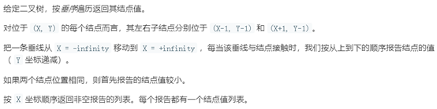

解题思路：

通过给每个节点定制编号的思路，采用前序遍历的思想来完成本题要求的垂序遍历。

```java
class Solution {
    private Map<Integer, List<List<Integer>>> map = new HashMap<>();
    private int depth;

    public List<List<Integer>> verticalTraversal(TreeNode root) {
        depth = getDepth(root);
        dfs(root, 0, 0);
        List<List<Integer>> result = new ArrayList<>();
        int min = 0;
        for(Integer key: map.keySet()){
            min = Math.min(min, key);
            result.add(new ArrayList<Integer>());
        }
        for(Integer key: map.keySet()){
            for(int i = 0;i < depth;i++) {
                List<Integer> temp = map.get(key).get(i);
                if(temp.size() == 1)
                    result.get(key-min).add(temp.get(0));
                else if(temp.size() > 1) {  // 同层同列的元素，按照从小到大排序
                    Collections.sort(temp);
                    for(Integer t: temp)
                        result.get(key-min).add(t);
                }
            }
        }
        return result;
    }

    public int getDepth(TreeNode root) {
        if(root == null)
            return 0;
        return 1 + Math.max(getDepth(root.left), getDepth(root.right));
    }

    public void dfs(TreeNode root, int x, int y) {
        if(root == null)
            return;
        List<List<Integer>> temp;
        if(map.containsKey(x))
            temp = map.get(x);
        else {
            temp = new ArrayList<>();
            for(int i = 0;i < depth;i++)
                temp.add(new ArrayList<Integer>());
        }
        temp.get(y).add(root.val);
        map.put(x, temp);
        dfs(root.left, x-1, y+1);
        dfs(root.right, x+1, y+1);
    }
}
```

## 例20 二叉树中的最大路径和
题号：124，难度：困难

题目描述：

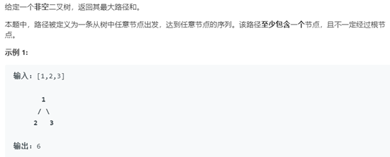

解题思路：

这道题的解题思路和例11 二叉树的最近公共祖先比较相似，都是采用深度优先搜索的思想，并分别寻找左右子树的结果，最后和根节点进行比较。

```java
class Solution {

    private int ret = Integer.MIN_VALUE;

    public int maxPathSum(TreeNode root) {
        /**
        对于任意一个节点, 如果最大和路径包含该节点, 那么只可能是两种情况:
        1. 其左右子树中所构成的和路径值较大的那个加上该节点的值后向父节点回溯构成最大路径
        2. 左右子树都在最大路径中, 加上该节点的值构成了最终的最大路径
        **/
        getMax(root);
        return ret;
    }

    private int getMax(TreeNode r) {
        if(r == null) return 0;
        int left = Math.max(0, getMax(r.left)); // 如果子树路径和为负则应当置0表示最大路径不包含子树
        int right = Math.max(0, getMax(r.right));
        ret = Math.max(ret, r.val + left + right); // 判断在该节点包含左右子树的路径和是否大于当前最大路径和
        return Math.max(left, right) + r.val;
    }
}
```


## 路径总和 III
**题目描述**：

```
给定一个二叉树，它的每个结点都存放着一个整数值。

找出路径和等于给定数值的路径总数。

路径不需要从根节点开始，也不需要在叶子节点结束，但是路径方向必须是向下的（只能从父节点到子节点）。

二叉树不超过1000个节点，且节点数值范围是 [-1000000,1000000] 的整数。

示例：

root = [10,5,-3,3,2,null,11,3,-2,null,1], sum = 8

      10
     /  \
    5   -3
   / \    \
  3   2   11
 / \   \
3  -2   1

返回 3。和等于 8 的路径有:

1.  5 -> 3
2.  5 -> 2 -> 1
3.  -3 -> 11
```

**解题思路**：

首先，此题并不简单。其次，本题是二叉树路径问题中一个很有代表性的问题。采用**前序遍历**的思想，以及**根节点和子树的关系**，不断更新最终结果。

双递归，前序遍历的变式，把每个遍历到的节点当作 root（起点）进行搜索

```cpp
class Solution
{
public:
    int helper(TreeNode *root, int sum)
    {
        if (root == NULL)
            return 0;
        sum -= root->val;
        return (sum == 0 ? 1 : 0) + helper(root->left, sum) + helper(root->right, sum);
    }
    int pathSum(TreeNode *root, int sum)
    {
        if (root == NULL)
            return 0;
        return helper(root, sum) + pathSum(root->left, sum) + pathSum(root->right, sum);
    }
};
```

# 树的类型
**1 二叉搜索树**：

题号|题目|难度|完成度|备注
--|--|--|--|--
95|不同的二叉搜索树 II|🟡||考察搜索二叉树的创建问题（对应 5.3.2）
99|恢复二叉搜索树|🔴||考察搜索二叉树修改节点的问题
450|删除二叉搜索树中的节点|🟡||考察搜索二叉树节点删除问题
701|二叉搜索树中的插入|🟡||考察搜索二叉树节点的插入问题


**2 平衡二叉树**：
题号|题目|难度|完成度|备注
--|--|--|--|--
110|平衡二叉树|🟢|✔|递归


**3 满二叉树**：
题号|题目|难度|完成度|备注
--|--|--|--|--
894|所有可能的满二叉树|🟡||


**4 完全二叉树**：

题号|题目|难度|完成度|备注
--|--|--|--|--
222|[完全二叉树的节点个数](#完全二叉树的节点个数)|🟡|✔|二分查找
919|完全二叉树插入器|🟡||考察创建完全二叉树
958|[二叉树的完全性检验](#二叉树的完全性检验)|🟡|✔|层级遍历


## 1 二叉搜索树
### 不同的二叉搜索树 II
**描述**：

```
给定一个整数 n，生成所有由 1 ... n 为节点所组成的 二叉搜索树 。

示例：

输入：3

输出：
[
  [1,null,3,2],
  [3,2,null,1],
  [3,1,null,null,2],
  [2,1,3],
  [1,null,2,null,3]
]

解释：
以上的输出对应以下 5 种不同结构的二叉搜索树：

   1         3     3      2      1
    \       /     /      / \      \
     3     2     1      1   3      2
    /     /       \                 \
   2     1         2                 3
 

提示：
* 0 <= n <= 8
```

### 删除二叉搜索树中的节点
**描述**：

```
给定一个二叉搜索树的根节点 root 和一个值 key，删除二叉搜索树中的 key 对应的节点，并保证二叉搜索树的性质不变。返回二叉搜索树（有可能被更新）的根节点的引用。

一般来说，删除节点可分为两个步骤：
    1. 首先找到需要删除的节点；
    2. 如果找到了，删除它。

说明： 要求算法时间复杂度为 O(h)，h 为树的高度。

示例:

root = [5,3,6,2,4,null,7]
key = 3

    5
   / \
  3   6
 / \   \
2   4   7

给定需要删除的节点值是 3，所以我们首先找到 3 这个节点，然后删除它。

一个正确的答案是 [5,4,6,2,null,null,7], 如下图所示。

    5
   / \
  4   6
 /     \
2       7

另一个正确答案是 [5,2,6,null,4,null,7]。

    5
   / \
  2   6
   \   \
    4   7
```


## 2 平衡二叉树
### 平衡二叉树
**描述**：

```
给定一个二叉树，判断它是否是高度平衡的二叉树。

本题中，一棵高度平衡二叉树定义为：

    一个二叉树每个节点 的左右两个子树的高度差的绝对值不超过1。

示例 1:

给定二叉树 [3,9,20,null,null,15,7]

    3
   / \
  9  20
    /  \
   15   7
返回 true 。

示例 2:

给定二叉树 [1,2,2,3,3,null,null,4,4]

       1
      / \
     2   2
    / \
   3   3
  / \
 4   4
返回 false 。
```

**思路**：使用递归

递归函数的功能，在逻辑上需要以下的步骤：
1. 检测左子树的平衡性、高度
2. 检测右子树的平衡性、高度
3. 对比两侧子树的高度差
4. 当两侧子树都各自平衡，并且高度差小于等于 1 时，即可认为当前节点引出的树也平衡

如何减少不必要的递归调用与计算？

上面提到了平衡性的判断分为四步：检测左子树、检测右子树、计算高度差、返回较大的那个高度。但是在不平衡的情况下，这四步不会完全走完，前三步任何一个条件一旦不满足，就不必继续接下来的步骤。因此我们分别依次执行前三个步骤，测到哪一个步骤不满足就立刻返回负数值

```cpp
class Solution
{
public:
    bool isBalanced(TreeNode *root)
    {
        return TreeHeight(root) != -1;
    }

    int TreeHeight(TreeNode *root)
    {
        if (!root)
            return 0;
        if (!root->left && !root->right)
            return 1;

        // 如果左子树不平衡，则不需要计算右子树
        int left_subtree_height = TreeHeight(root->left);
        if (left_subtree_height < 0)
            return -1;

        // 如果右子树步平衡，则不需要计算 hegiht
        int right_subtree_height = TreeHeight(root->right);
        if (right_subtree_height < 0)
            return -1;

        // 验证平衡条件
        if (abs(left_subtree_height - right_subtree_height) > 1)
            return -1;

        // 返回最大深度
        return max(left_subtree_height, right_subtree_height) + 1;
    }
};
```

未仔细看：
```cpp
bool isBalanced(TreeNode *node)
{
	return maxDeath2(node) != -1;
}

int maxDeath2(TreeNode *node)
{
	if (node == NULL)
		return 0;

	int left = maxDeath2(node->left);
	int right = maxDeath2(node->right);

	if (left == -1 || right == -1 || abs(left - right) > 1)
	{
		return -1;
	}
	return max(left, right) + 1;
}
```


## 4 完全二叉树
### 完全二叉树的节点个数
**描述**：

```
给出一个完全二叉树，求出该树的节点个数。

说明：

完全二叉树的定义如下：在完全二叉树中，除了最底层节点可能没填满外，其余每层节点数都达到最大值，并且最下面一层的节点都集中在该层最左边的若干位置。若最底层为第 h 层，则该层包含 1~ 2h 个节点。

示例:

输入: 
    1
   / \
  2   3
 / \  /
4  5 6

输出: 6
```

**思路 1**：

直接使用**深度优先遍历**树的所有节点，不过没有使用到完全二叉树的性质。

**思路 2**：

根据完全二叉树的性质简化遍历次数：分为左子树和右子树，根据深度差判断那边是满二叉树，最后再递归另外一边不是满二叉树的子树

**思路 3**：

使用[二分查找](https://leetcode-cn.com/problems/count-complete-tree-nodes/solution/c-san-chong-fang-fa-jie-jue-wan-quan-er-cha-shu-de/)

根据完全二叉树的性质：**总节点数 = 倒数第二层以上的节点数 + 最后一层的节点数**。
- 除最后一层外，这棵树为满二叉树，节点数为：`2^depth_prev - 1`，`depth_prev` 为倒数第二层树的深度
- 最后一层的节点数的范围是 `[1, 2^depth_prev]`；并且依次靠左排列

所以现在的问题就转换为判断最后一层节点数：

**最后一层节点情况**：1 代表非空节点，0 代表空节点：

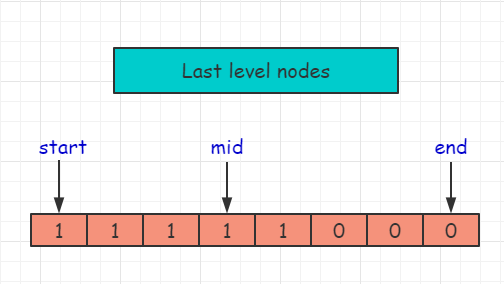

现在的问题就可以简单的看成：**获取最后一个 1 的索引位置**：

**给定最后一层某节点的位置索引 index，将他和分界线比大小，就可以判断该节点在左子树还是右子树**，例如：现在查找 6 这个节点，索引为 3，大于分界线2，所以 6 在右子树；对右子树重复操作即可，剩下的工作就交给迭代了

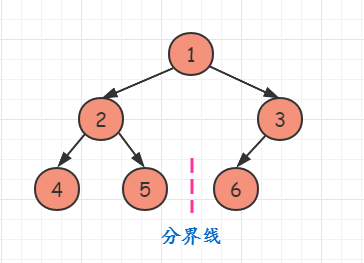

```cpp
class Solution
{
public:
    int countNodes(TreeNode *root)
    {
        TreeNode *cur = root;
        int level = 1;
        int h = getDepth(root);
        int numbers = 0;
        while (cur)
        {
            TreeNode *temp = cur->right;
            if (level + getDepth(temp) == h && temp)
            {
                cur = cur->right;
                numbers += pow(2, h - level - 1);
                level += 1;
            }
            else
            {
                cur = cur->left;
                level += 1;
            }
        }
        return numbers + pow(2, h - 1);
    }

    int getDepth(TreeNode *root)
    {
        int depth = 0;
        while (root)
        {
            root = root->left;
            depth++;
        }
        return depth;
    }
};
```


### 二叉树的完全性检验
**描述**：

```
给定一个二叉树，确定它是否是一个完全二叉树。

百度百科中对完全二叉树的定义如下：

若设二叉树的深度为 h，除第 h 层外，其它各层 (1～h-1) 的结点数都达到最大个数，第 h 层所有的结点都连续集中在最左边，这就是完全二叉树。（注：第 h 层可能包含 1~ 2h 个节点。）

示例 1：

输入：[1,2,3,4,5,6]
输出：true
解释：最后一层前的每一层都是满的（即，结点值为 {1} 和 {2,3} 的两层），且最后一层中的所有结点（{4,5,6}）都尽可能地向左。

示例 2：
输入：[1,2,3,4,5,null,7]
输出：false
解释：值为 7 的结点没有尽可能靠向左侧。

提示：
1. 树中将会有 1 到 100 个结点。
```

**思路**：

[层级遍历](https://leetcode-cn.com/problems/check-completeness-of-a-binary-tree/solution/c-er-cha-shu-ceng-ji-bian-li-by-da-li-wang/)

```cpp
class Solution
{
public:
    bool isCompleteTree(TreeNode *root)
    {
        if (root == NULL)
            return true;

        queue<TreeNode *> q;
        q.push(root);
        // 达到最终的父节点
        bool hit_final_parent = false;
        while (!q.empty())
        {
            auto node = q.front();
            q.pop();
            if (node->left != NULL)
            {
                if (hit_final_parent)
                    return false;
                q.push(node->left);
            }
            else
            {
                hit_final_parent = true;
            }
            if (node->right != NULL)
            {
                if (hit_final_parent)
                    return false;
                q.push(node->right);
            }
            else
            {
                hit_final_parent = true;
            }
        }
        return true;
    }
};
```

未仔细查看：

```cpp
bool isCompleteTreeNode(TreeNode *root)
{
	if (root == NULL)
		return false;
	queue<TreeNode*> q;
	q.push(root);
	bool result = true;
	bool hasNoChild = false;
	while (!q.empty())
	{
		TreeNode* current = q.front();
		q.pop();
		if (hasNoChild)
		{
			if (current->left != NULL || current->right != NULL)
			{
				result = false;
				break;
			}
		}
		else
		{
			if (current->left != NULL && current->right != NULL)
			{
				q.push(current->left);
				q.push(current->right);
			}
			else if (current->left != NULL && current->right == NULL)
			{
				q.push(current->left);
				hasNoChild = true;
			}
			else if (current->left == NULL && current->right != NULL)
			{
				result = false;
				break;
			}
			else
			{
				hasNoChild = true;
			}
		}
	}
	return result;
}
```

 


