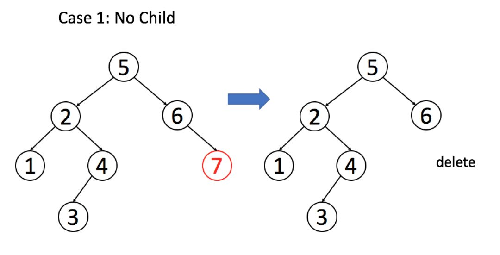
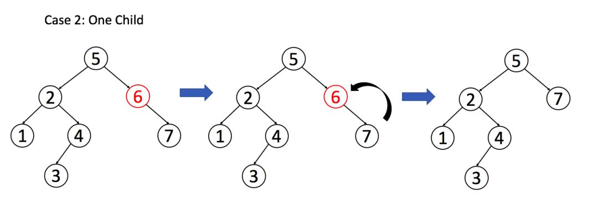
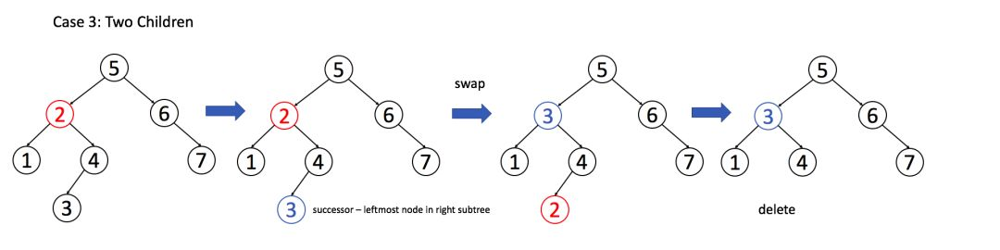

# 知识点

二叉树算法的设计的总路线：**明确一个节点要做的事情，然后剩下的事抛给框架**。

```cpp
void traverse(TreeNode *node) {
    // node 需要做什么？在这做。
    // 其他的不用 node 操心，抛给框架
    traverse(node->left);
    traverse(node->right);
}
```

1. 把二叉树所有的节点中的值加 1

```cpp
void plusOne(TreeNode *root) {
    if (root == NULL)
        return;
    root->val += 1;

    plusOne(root->left);
    plusOne(root->right);
}
```

2. 如何判断两棵二叉树是否完全相同？

```cpp
bool isSameTree(TreeNode *root1, TreeNode *root2)
{
    // 都为空，显然相同
    if (root1 == NULL && root2 == NULL)
        return true;
    // 一个为空，一个非空，显然不同
    if (root1 == NULL || root2 == NULL)
        return false;
    // 两个非空，但 val 不一样也不行
    if (root1->val != root2->val)
        return false;

    // root1 和 root2 该比的都比完了
    return isSameTree(root->left, root2->left)
        && isSameTree(root->right, root2->right);
}
```

# 具体题目
## 在BST中查找一个数是否存在（查找）
框架：

```cpp
bool isInBST(TreeNode *root, int target) {
    if (root == NULL)
        return false;
    if (root->val == target)
        return true;

    return isInBST(root->left, int target)
        || isInBST(root->right, int target);
}
```

再充分利用 BST 的 “左小右大” 的特性：可以根据 target 和 root->val 的大小比较，就能排除一边

```cpp
bool isInBST(TreeNode *root, int target) {
    if (root == NULL)
        return false;
    if (root->val == target)
        return true;

    if (root->val < target)
        isInBST(root->right, int target);
    if (root->val > target)
        isInBST(root->left, int target);
}
```

**针对 BST 的遍历框架**：

```cpp
void BST(TreeNode *root, int target) {
    if (root->val == target)
        // 找到目标，做点什么

    if (root->val < target)
        BST(root->right, target);
    if (root->val > target)
        BST(root->left, target);
}
```

## 在BST中插入一个数（增加）
一旦涉及 **改**，函数就要返回 TreeNode* 类型，并且对递归调用的返回值进行接收。

```cpp
TreeNode *insetIntoBST(TreeNode *root, int val) {
    // 找到空位置插入新节点
    if (root == NULL)
        return new TreeNode(val);
    
    // if(root->val == val)
    // BST 中一般不会插入已存在元素
    if (root->val < val)
       root->right = insetIntoBST(root->right, int val);
    if (root->val > val)
        root->left = insetIntoBST(root->left, int val);
    return root;
}
```

## 在BST中删除一个数（删除）
先 “找” 再 “改”

框架：

```cpp
TreeNode *deleteNode(TreeNode *root, int key) {
    if (root->val == key) {
        // 找到了，进行删除
    }else if (root->val > key)
        root->left = insetIntoBST(root->left, int key);
    if (root->val < key)
       root->right = insetIntoBST(root->right, int key);
    return root;
}
```

情况 1：A 恰好是末端节点，两个子节点都为空，那么可以直接删除

```cpp
if (root->left == NULL && root->right == NULL)
    return NULL;
```



情况 2：A 只有一个非空子节点，那么它要让这个孩子接替自己的位置。

```cpp
// 排除了情况 1 之后
if (root->left == NULL)
    return root->right;
if (root->right == NULL)
    return root->left;
```



情况 3：A 有两个子节点，麻烦了，为了不破坏 BST 的性质，A 必须找到左子树中最大的那个节点，或者右子树中最小的那个节点来接替自己。两种策略是类似的，我们以第二种方式讲解。



```cpp
if (root->left != NULL && root->right != NULL) {
    // 找到右子树的最小节点
    TreeNode minNode = getMin(root->right);
    // 把 root 改成 minNode
    root->val = minNode->val;
    // 转而去删除 minNode
    root->right = deleteNode(root->right, minNode->val);
}
```

填入框架：

```cpp
TreeNode *deleteNode(TreeNode *root, int key) {
    if (root == NULL)
        return NULL;
    // 找到了，进行删除
    if (root->val == key) {
        // 这2个if把情况1和情况2都正确处理了
        if (root->left == NULL)
            return root->right;
        if (root->right == NULL)
            return root->left;
        // 处理情况3
        TreeNode minNode = getMin(root->right);
        root->val = minNode->val;
        root->right = deleteNode(root->right, minNode->val);
    }else if (root->val > key)
        root->left = insetIntoBST(root->left, int key);
    if (root->val < key)
       root->right = insetIntoBST(root->right, int key);
    return root;
}

TreeNode* getMin(TreeNode* node) {
    // BST 最左边的就是最小的
    while (node->left != NULL)
        node = node->left;
    return node;
}
```

**注意**：这个删除操作并不完美，因为我们最好不要像 root.val = minNode.val 这样通过修改节点内部的数据来改变节点，而是通过一系列略微复杂的链表操作交换 root 和 minNode 两个节点。


# 参考资料
- [二叉搜索树操作集锦](https://mp.weixin.qq.com/s?__biz=MzAxODQxMDM0Mw==&mid=2247484518&idx=1&sn=f8ef8d7ce7959b4fd779e38f47419ac6&chksm=9bd7fa6eaca073785cb6f808421241bcb641203c8ec7f30a9269a221b3d92c661334af1b75f5&scene=21#wechat_redirect)
