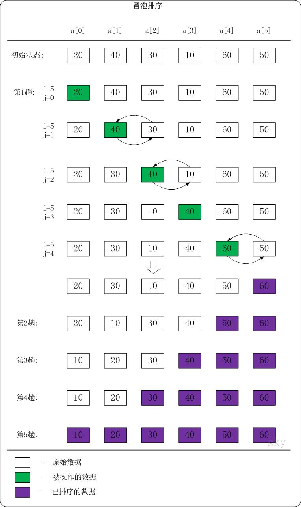

<h2 align="center">冒泡排序</h2>

**总结**：

相邻两两之间比较，大的互换，从头到尾的顺序进行

**算法思想**：

1. 比较相邻的元素。如果第一个比第二个大，就交换他们两个。
2. 对每一对相邻元素作同样的工作，从开始第一对到结尾的最后一对。这步做完后，最后的元素会是最大的数。
3. 针对所有的元素重复以上的步骤，除了最后一个。
4. 持续每次对越来越少的元素重复上面的步骤，直到没有任何一对数字需要比较。

* 初始版本

```cpp
void bubble_sort(int *arr, int len)
{
    for (int i = len - 1; i > 0; i--)
    {
        // 将a[0...i]中最大的数据放在末尾
        for (int j = 0; j < i; j++)
        {
            if (arr[j] > arr[j + 1])
                std::swap(arr[j], arr[j + 1]);
        }
    }
}
```

* 有可能中途执行某次后数组就有序了，进行优化：设置一个哨兵

```cpp
void bubble_sort(int *arr, int len)
{
    // 哨兵初始化标记为 0
    bool flag = false;
    for (int i = len - 1; i > 0; i--)
    {
        // 将 a[0...i] 中最大的数据放在末尾
        for (int j = 0; j < i; j++)
        {
            if (arr[j] > arr[j + 1])
            {
                std::swap(arr[j], arr[j + 1]);
                flag = true; // 若发生交换，则设标记为 1
            }
        }
        if (!flag)
            break; // 若没发生交换，则说明数列已有序。
    }
}
```

Go 版本：

```go
func bubble_sort(arr []int) []int {
    if len(arr) <= 1 {
        return arr
    }

    for i := 0; i < len(arr); i++ {
        flag := false
        for j := 0; j < len(arr) - i - 1; j++ {
            if arr[j] > arr[j+1] {
                arr[j], arr[j+1] = arr[j+1], arr[j]
                flag = true
            }
        }
        if !flag {
            break
        }
    }
    return arr
}
```




时间复杂度是 O(n<sup>2</sup>)：假设被排序的数列中有 `n` 个数。遍历一趟的时间复杂度是 `O(n)`，总共需要遍历 `n-1` 次。
