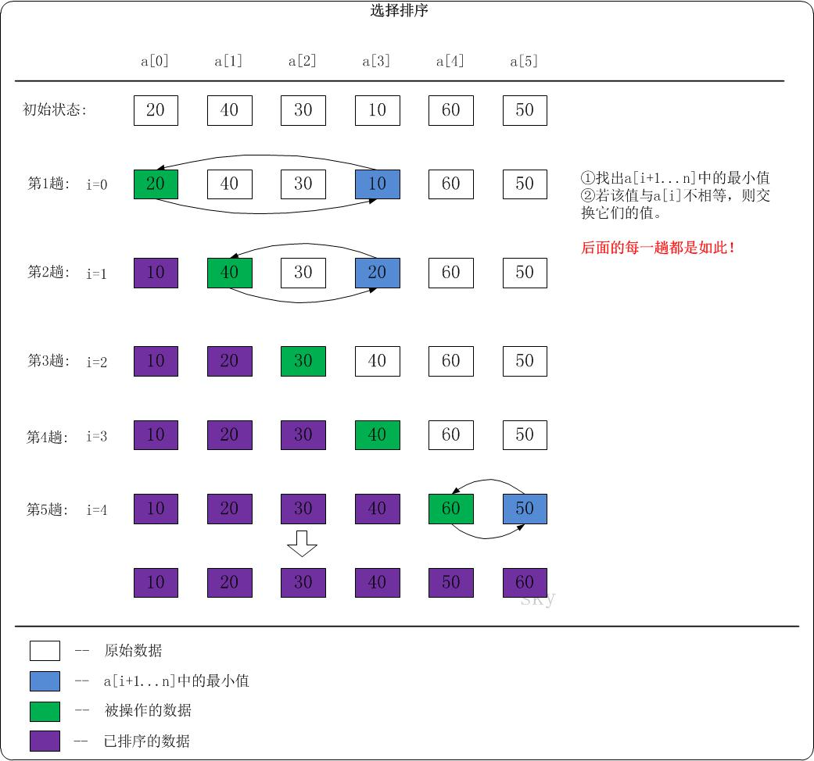

<h2 align="center">选择排序</h2>

**总结**：

全局找最小（大）值。

**原理**：

选择排序算法的实现思路有点类似**插入排序**，也分已排序区间和未排序区间。但是选择排序每次会从未排序区间中找到最小的元素，将其放到已排序区间的末尾。这样一来，当遍历完未排序区间，就意味着已经完成整个序列的排序了。

**算法思想**：

1. 在未排序序列中找到最小（大）元素，存放到排序序列的起始位置；
2. 从剩余未排序元素中继续寻找最小（大）元素，然后放到已排序序列的末尾；
3. 以此类推，直到所有元素均排序完毕。

```cpp
void select_sort(int *arr, int len)
{
    for (int i = 0; i < len; i++)
    {
        // 无序区中最小元素位置
        int min = i; 
        // 找出"arr[i+1] ... arr[len]"之间的最小元素，并赋值给min。
        for (int j = i + 1; j < len; j++)
        {
            if (arr[j] < arr[min])
                min = j;
        }

        // 若min!=i，则交换 arr[i] 和 arr[min]。
        // 交换之后，保证了a[0] ... arr[i] 之间的元素是有序的。
        if (min != i)
            std::swap(arr[i], arr[min]);
    }
}
```

Go 版本：

```go
// 切片是引用类型，因而不必定义返回值
func select_sort(arr []int) {
    if len(arr) <= 1 {
        return
    }
    // 已排序区间初始化为空，未排序区间初始化待排序切片
    for i := 0; i < len(arr); i++ {
        // 未排序区间最小值初始化为第一个元素
        min := i
        // 从未排序区间第二个元素开始遍历，直到找到最小值
        for j := i + 1; j < len(arr); j++ {
            if arr[j] < arr[min] {
                min = j
            }
        }
        // 将最小值与未排序区间第一个元素互换位置（等价于放到已排序区间最后一个位置）
        if min != i {
            arr[i],arr[min] = arr[min], arr[i]
        }
    }
}
```




