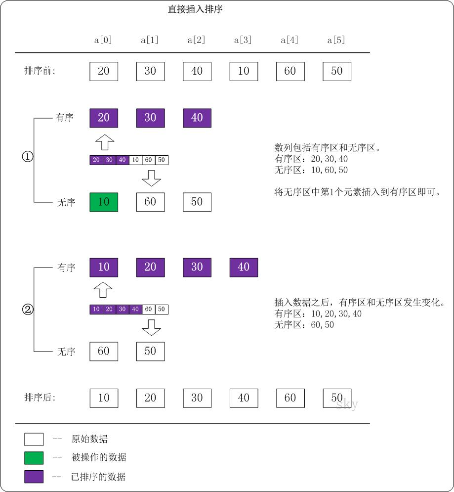

<h2 align="center">插入排序</h2>

**总结**：

假设当前已是有序列表，逐一比较插入（整理扑克牌的顺序）。

**原理**：

我们将数组中的数据分为两个区间，已排序区间和未排序区间。初始已排序区间只有一个元素，就是数组的第一个元素。插入算法的核心思想是取未排序区间中的元素，在已排序区间中找到合适的插入位置将其插入，并保证已排序区间数据一直有序。重复这个过程，直到未排序区间中元素为空，算法结束。

**算法思想**：

1. 从第一个元素开始，该元素可以认为已经被排序；
2. 取出下一个元素，在已经排序的元素序列中<font color="red">从后向前</font>扫描；
3. 如果该元素（已排序）大于新元素，将该元素移到下一位置；
4. 重复步骤 3，直到找到已排序的元素小于或者等于新元素的位置；
5. 将新元素插入到该位置后；
6. 重复步骤 2~5。

```cpp
void insert_sort(int *arr, int len)
{
    for (int i = 1; i < len; i++)
    {
        int key = arr[i];
        int j = i - 1;
        while ((j >= 0) && (key < arr[j]))
        {
            arr[j + 1] = arr[j];
            j--;
        }
        arr[j + 1] = key;
    }
}
```

Go 版本：

```go
func insert_sort(arr []int) []int {
    if len(arr) <= 1 {
        return arr
    }
    for i := 0; i < len(arr); i++ {
       // 每次从未排序区间取一个数据 value
        value := arr[i]
        // 在已排序区间找到插入位置
        j := i - 1
        for ; j >= 0; j-- {
           // 如果比 value 大后移
            if arr[j] > value {
                arr[j+1] = arr[j]
            } else {
                break
            }
        }
        // 插入数据 value
        arr[j+1] = value
    }
    return arr
}
```




