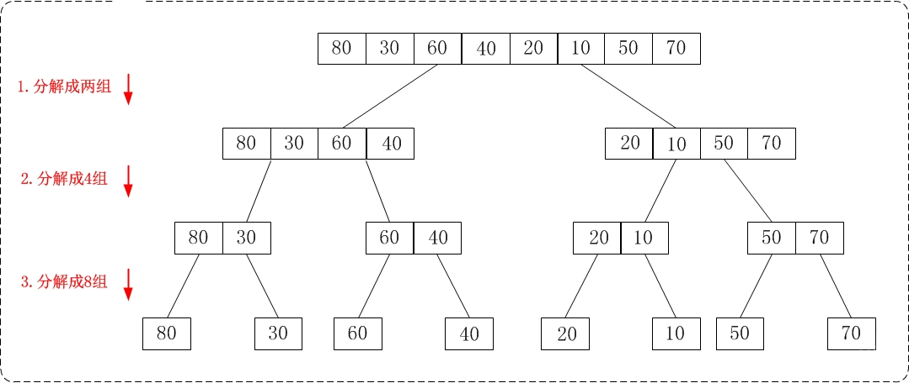
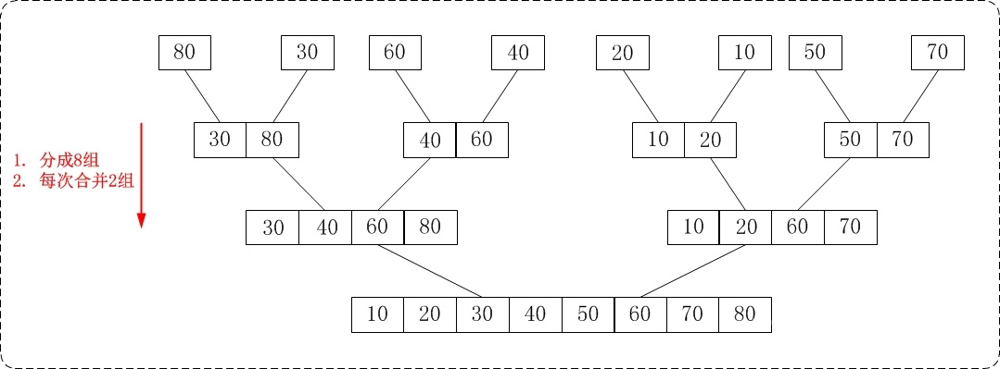

<h2 align="center">归并排序</h2>

> 将两个的有序数列合并成一个有序数列，我们称之为 **归并**。

> 若将两个有序表合并成一个有序表，称为 **2-路归并**。

**总结**：

分解再合并。归并 = 递归 + 合并。

**算法思想**：利用 **归并** 思想，将已有序的子序列合并，得到完全有序的序列；即**先使每个子序列有序，再使子序列段间有序**。

1. 把长度为 `n` 的输入序列分成 2 个长度为 `n/2` 的子序列；
2. 对这 2 个子序列分别采用归并排序；
3. 将 2 个排序好的子序列合并成 1 个最终的排序序列；

包括 “从上往下” 和 “从下往上” 2 种方式。

**从上往下**：（主要采用这种方法）

1. 分解：将当前区间一分为二，即求分裂点 `mid = (low + high) / 2`
2. 求解：递归地对两个子区间 `a[low...mid]` 和 `a[mid+1...high]` 进行归并排序。递归的终结条件是子区间长度为 1
3. 合并：将已排序的两个子区间 `a[low...mid]` 和 `a[mid+1...high]` 归并为一个有序的区间 `a[low...high]`

**从下往上**：

1. 将待排序的数列分成若干个长度为 1 的子数列
2. 然后将这些数列两两合并；得到若干个长度为 2 的有序数列
3. 再将这些数列两两合并；得到若干个长度为 4 的有序数列
4. 再将它们两两合并；直接合并成一个数列为止


**递归**思路：先进行分解，再递归执行合并操作






```cpp
/*
 * 将一个数组中的两个相邻有序区间合并成一个
 * arr        包含两个有序区间的数组
 * start    第1个有序区间的起始地址
 * mid      第1个有序区间的结束地址。也是第2个有序区间的起始地址
 * end      第2个有序区间的结束地址。
 */
void merge(int *arr, int start, int mid, int end)
{
	// temp 是汇总 2 个有序区的临时区域
	int *temp = new int[end - start + 1];
	// 第 1 个有序区的索引
	int i = start;
	// 第 2 个有序区的索引
	int j = mid + 1;
	// 临时区域的索引
	int k = 0;

	while (i <= mid && j <= end)
	{
		if (arr[i] <= arr[j])
			temp[k++] = arr[i++];
		else
			temp[k++] = arr[j++];
	}

	while (i <= mid)
		temp[k++] = arr[i++];

	while (j <= end)
		temp[k++] = arr[j++];

	// 将排序后的元素，全部都整合到数组 arr 中
	for (i = 0; i < k; i++)
		arr[start + i] = temp[i];

	delete[] temp;
}

/*
 * arr		待排序的数组
 * start	数组的起始地址
 * end		数组的结束地址
 */
void merge_sort_up2down(int *arr, int start, int end)
{
	if (arr == NULL || start >= end)
		return;

	int mid = (end + start) / 2;
	// 递归排序 arr[start...mid]
	merge_sort_up2down(arr, start, mid);
	// 递归排序 arr[mid+1...end]
	merge_sort_up2down(arr, mid + 1, end);

	// arr[start...mid] 和 arr[mid...end] 是两个有序空间
	// 将它们排序成一个有序空间 arr[start...end]
	merge(arr, start, mid, end);
}

void merge_sort(int *arr, int len)
{
	merge_sort_up2down(arr, 0, len - 1);
}
```


Go 版本

```go
// 归并排序
func merge_sort(arr []int) []int {
    if len(arr) <= 1 {
        return arr
    }
    // 获取分区位置
    p := len(arr) / 2
    // 通过递归分区
    left := merge_sort(arr[0:p])
    right := merge_sort(arr[p:])
    // 排序后合并
    return merge(left, right)
}
// 排序合并
func merge(left []int, right []int) []int {
    i, j := 0, 0
    m, n := len(left), len(right)
    // 用于存放结果集
    var result []int
    for {
        // 任何一个区间遍历完，则退出
        if i >= m || j >= n {
            break
        }
        // 对所有区间数据进行排序
        if left[i] <= right[j] {
            result = append(result, left[i])
            i++
        } else {
            result = append(result, right[j])
            j++
        }
    }
    // 如果左侧区间还没有遍历完，将剩余数据放到结果集
    if i != m {
        for ; i < m; i++ {
            result = append(result, left[i])
        }
    }
    // 如果右侧区间还没有遍历完，将剩余数据放到结果集
    if j != n {
        for ; j < n; j++ {
            result = append(result, right[j])
        }
    }
    // 返回排序后的结果集
    return result
}
```

**迭代**思路：不考虑分解，直接根据数组的 index，执行合并操作


```cpp
void merge_sort(int *arr, int len)
{
    int *temp = new int[len];
    for (int seg = 1; seg < len; seg += seg)
    {
        for (int start = 0; start < len; start += seg + seg)
        {
            // 避免超过有效索引
            int mid = std::min(start + seg, len);
            int high = std::min(start + seg + seg, len);
            // 临时区域的索引
            int k = start;
            // 第一个区间
            int start1 = start, end1 = mid;
            // 第二个区间
            int start2 = mid, end2 = high;
            // 填充
            while (start1 < end1 && start2 < end2)
                temp[k++] = arr[start1] < arr[start2] ? arr[start1++] : arr[start2++];
            while (start1 < end1)
                temp[k++] = arr[start1++];
            while (start2 < end2)
                temp[k++] = arr[start2++];
        }
        // 更新原数组
        for (int i = 0; i < len; i++)
            arr[i] = temp[i];
    }
    delete[] temp;
}
```

递归时的另一种分解思路：（TODO:**暂未总结**）

```cpp
/* 对数组a做若干次合并：数组a的总长度为len，将它分为若干个长度为gap的子数组；将"每2个相邻的子数组" 进行合并排序
 * a：待排序的数组
 * len：数组的长度
 * gap：子数组的长度
 */
void merge_groups(int *a, int len, int gap)
{
	int i;

	// 将"每2个相邻的子数组" 进行合并排序。
	for (i = 0; i + 2 * gap - 1 < len; i += (2 * gap))
	{
		merge(a, i, i + gap - 1, i + 2 * gap - 1);
	}

	// 若 i+gap-1 < len-1，则剩余一个子数组没有配对。
	// 将该子数组合并到已排序的数组中。
	if (i + gap - 1 < len - 1)
	{
		merge(a, i, i + gap - 1, len - 1);
	}
}

void merge_sort_down2up(int *a, int len)
{
	if (a == NULL || len <= 0)
		return;

	for (int n = 1; n < len; n *= 2)
		merge_groups(a, len, n);
}
```


**时间复杂度**：`O(n * logn)`：

假设被排序的数列中有 `n` 个数。遍历一趟的时间复杂度是 `O(n)`，归并排序的形式就是一棵二叉树，它需要遍历的次数就是二叉树的深度，由此可得出它的时间复杂度是 `O(n * logn)`
