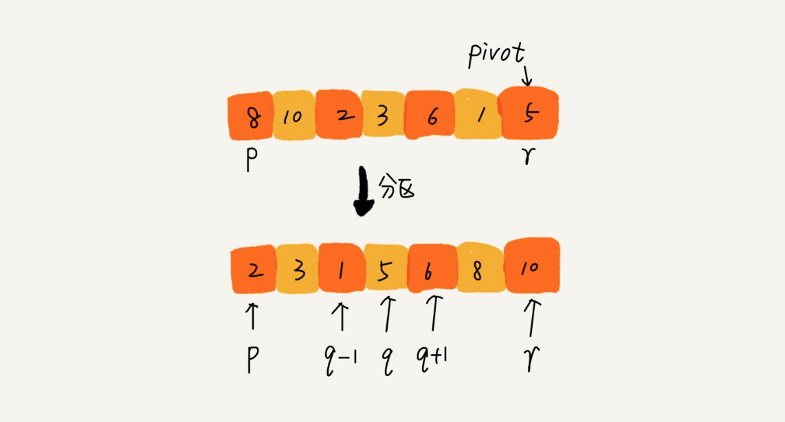
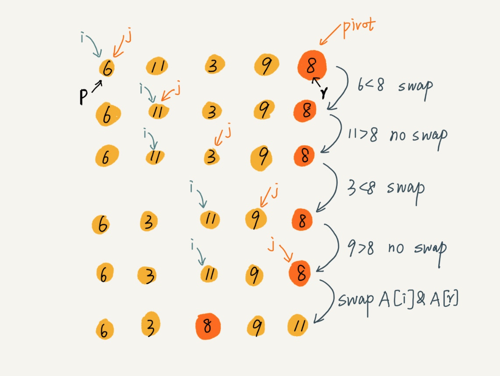
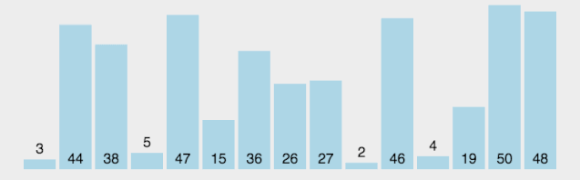

<h2 align="center">快速排序</h2>

**总结**：

选基准，对半递归排序。分为 2 部分，再依次对这 2 部分排序。其实可以理解为：每一次分治都是以第一个基准点为父节点的**二叉搜索树**，最终按照中序排序打印即可

**策略一**：

如果要排序数据序列中下标从 p 到 r 之间的一组数据，我们选择 p 到 r 之间的任意一个数据作为 pivot（分区点），假设对应下标是 q。

遍历 p 到 r 之间的数据，将小于 pivot 的放到左边，将大于 pivot 的放到右边，将 pivot 放到中间。经过这一步骤之后，数据序列 p 到 r 之间的数据就被分成了三个部分，前面 p 到 q-1 之间都是小于 pivot 的，中间是 pivot，后面的 q+1 到 r 之间是大于 pivot 的。



根据分治、递归的处理思想，我们可以用递归排序下标从 p 到 q-1 之间的数据和下标从 q+1 到 r 之间的数据，直到区间缩小为 1，就说明所有的数据都有序了，而且你可以看到我们不需要像归并排序那样做合并操作，也就不需要额外的内存空间，在时间复杂度和归并排序一样的情况下，有着更好的空间复杂度表现。

（双指针相似的思路）快速排序首先要找到分区点 pivot，一般我们会将数据序列最后一个元素或者第一个元素作为 pivot。假设我们以最后一个元素作为分区点，然后通过两个变量 i 和 j 作为下标来遍历数据序列，当下标 j 对应数据小于 pivot 时，交换 i 和 j 对应的数据，并且将 i 的指针往后移动一位，否则 i 不动。下标 j 是始终往后移动的，j 到达终点后，将 pivot 与下标 i 对应数据交换，这样最终将 pivot 置于数据序列中间，[0...i-1] 区间的数据都比 pivot 小，[i+1...j] 之间的数据都比 pivot 大，我们以递归的方式处理该流程，最终整个数据序列都会变成有序的，对应的算法操作流程如下：



```go
// 定位 pivot
func partition(arr []int, p int, r int) int {
    // 以当前数据序列最后一个元素作为初始 pivot
    pivot := arr[r]
    // 初始化 i、j 下标
    i := p
    // 后移 j 下标的遍历过程
    for j := p; j < r; j++ {
        // 将比 pivot 小的数丢到 [p...i-1] 中，剩下的 [i...j] 区间都是比 pivot 大的
        if arr[j] < pivot {
            // 互换 i、j 下标对应数据
            arr[i], arr[j] = arr[j], arr[i]
            // 将 i 下标后移一位
            i++
        }
    }
    // 最后将 pivot 与 i 下标对应数据值互换
    // 这样一来，pivot 就位于当前数据序列中间，i 也就是 pivot 值对应的下标
    arr[i], arr[r] = pivot, arr[i]
    // 返回 i 作为 pivot 分区位置
    return i
}
// 快速排序入口函数
func quick_sort(arr []int, p int, r int) {
    // 递归终止条件
    if p >= r {
        return
    }
    // 获取分区位置
    q := partition(arr, p, r)
    // 递归分区（排序是在定位 pivot 的过程中实现的）
    quick_sort(arr, p, q - 1)
    quick_sort(arr, q + 1, r)
}
```

**策略2**：使用**分治法**策略把一个序列分为两个子序列

1. 选取第一个数为基准
2. 将比基准小的数交换到前面，比基准大的数交换到后面（相同的数可以到任一边），在这个分区退出之后，该基准就处于数列的中间位置（分治操作）
3. 对左右区间重复第二步，直到各区间只有一个数

```cpp
void quick_sort_recursive(int *arr, int start, int end)
{
    if (start >= end)
        return;

    int left = start;    // 左边下标
    int right = end;     // 右边下标
    int key = arr[left]; // 设第一个为基准

    while (left < right)
    {
        // 特别注意：这 2 个 while 循环实际上只执行一个而已
        while (left < right && arr[right] > key)
            right--; // 从右向左找第一个小于key的数
        while (left < right && arr[left] < key)
            left++; // 从左向右找第一个大于key的数
        if (left < right)
        {
            std::swap(arr[left], arr[right]);
        }
    }

    arr[left] = key;

    quick_sort_recursive(arr, start, left - 1); // 前半递归
    quick_sort_recursive(arr, left + 1, end);   // 后半递归
}

void quick_sort(int *arr, int len)
{
    quick_sort_recursive(arr, 0, len - 1);
}
```





**时间复杂度**：

在最坏情况下是 O(n<sup>2</sup>)，平均的时间复杂度是 `O(n log n)`：假设被排序的数列中有 `n` 个数。遍历一次的时间复杂度是 `O(n)`，需要遍历多少次呢？至少 `log(n+1)` 次，最多 `n` 次

1. 为什么最少是 `log(n+1)` 次？快速排序是采用的分治法进行遍历的，我们将它看作一棵二叉树，它需要遍历的次数就是二叉树的深度，而根据完全二叉树的定义，它的深度至少是 `log(n+1)`。因此，快速排序的遍历次数最少是 `log(n+1)` 次
2. 为什么最多是 `n` 次？这个应该非常简单，还是将快速排序看作一棵二叉树，它的深度最大是 `n`。因此，快读排序的遍历次数最多是 `n` 次
