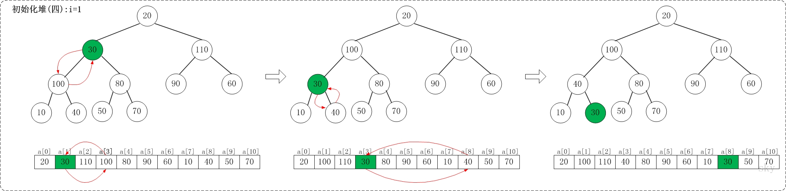

<h2 align="center">堆排序</h2>

**总结**：

1. 只需知道父，就能知道左孩子和右孩子
2. 堆近似于一个**完全二叉树**，因此也就具备完全二叉树的性质，如点 3
3. 总共调整 n / 2 - 1 次（也就是二叉树中父节点的个数）
4. 取出最大值后，取最后一个数补充，再对树进行调整
5. 步骤：逐个插入并调整，打印时删除最大值并调整

实现最大堆后，最小堆只需修改 2 个判断值的点就可以

利用 **堆** 这种数据结构进行排序。最大堆通常被用来进行 **升序** 排序，而最小堆通常被用来进行 **降序** 排序。堆是一个近似完全二叉树的结构，并同时满足堆积的性质：即子结点的键值或索引总是小于（或者大于）它的父节点。

**算法思想**：最大堆进行升序排序的基本思想：

1. 初始化堆：将数列 a[1...n] 构造成最大堆
2. 交换数据：将 a[1] 和 a[n] 交换，使 a[n] 是 a[1...n] 中的最大值；然后将 a[1...n-1] 重新调整为最大堆
3. 接着，将 a[1] 和 a[n-1] 交换，使 a[n-1] 是 a[1...n-1] 中的最大值
4. 然后将 a[1...n-2] 重新调整为最大值
5. 依次类推，直到整个数列都是有序的


在第一个元素的索引为 0 的情形中，有以下性质：
1. 索引为 i 的左孩子的索引是 2*i+1
2. 索引为 i 的左孩子的索引是 2*i+2
3. 索引为 i 的父结点的索引是 floor((i-1)/2)

    例如，对于最大堆 `{110,100,90,40,80,20,60,10,30,50,70}` 而言：索引为 0 的左孩子的所有是 1；索引为 0 的右孩子是 2；索引为 8 的父节点是 3


```cpp
/* 
 * 最大堆的向下调整算法
 * 第n个节点的左孩子的索引值是 2n+1，右孩子的索引是 2n+2（n从0开始）
 * arr      待排序的数组
 * start    被下调节点的起始位置(一般为0，表示从第1个开始)
 * end      截至范围(一般为数组中最后一个元素的索引)
 */
void maxheap_down(int *arr, int start, int end)
{
    int cur = start;        // 当前节点的位置
    int left = 2 * cur + 1; // 左孩子的位置
    int temp = arr[cur];    // 当前节点的大小
    for (; left <= end; cur = left, left = 2 * left + 1)
    {
        // "left"是左孩子，"left+1"是右孩子
        // 最小堆修改点 1 ：if (left < end && arr[left] > arr[left + 1])
        if (left < end && arr[left] < arr[left + 1])
            left++; // 左右两孩子中选择较大者
        // 最小堆修改点 1 ：if (temp <= arr[left])
        if (temp < arr[left]) // 交换值
        {
            arr[cur] = arr[left];
            arr[left] = temp;
        }
        else 
            break; // 调整结束
    }
}

/* 堆排序(从小到大)，升序排序 */
void heap_sort(int *arr, int len)
{
    // 从(len/2-1) --> 0逐次遍历。遍历之后，得到的数组实际上是一个(最大)二叉堆。
    // 备注：从数组后，也就是从二叉树叶节点的父节点处开始调整
    for (int i = len / 2 - 1; i >= 0; i--)
        maxheap_down(arr, i, len - 1);

    // 备注：这一步实际上只是对存储排好序的完全二叉树的数组进行升序打印
    // 从最后一个元素开始对序列进行调整，不断的缩小调整的范围直到第一个元素
    for (int i = len - 1; i > 0; i--)
    {
        // 交换a[0]和a[i]。交换后，a[i]是a[0...i]中最大的。
        std::swap(arr[0], arr[i]);
        // 调整a[0...i-1]，使得a[0...i-1]仍然是一个最大堆。
        // 即，保证a[i-1]是a[0...i-1]中的最大值。
        maxheap_down(arr, 0, i - 1);
    }
}
```


**图解**：

1. 数组 `a = {20, 30, 90, 40, 70, 110, 60, 10, 100, 50, 80}`, n=11 对应的初始化结构

    

2. 初始化堆：i=11/2-1，即 i=4

    maxheap_down(a, 4, 9) 调整过程。maxheap_down(a, 4, 9) 的作用是将 a[4...9] 进行下调；a[4] 的左孩子是 a[9]，右孩子是 a[10]。调整时，选择左右孩子中较大的一个（即 a[10]）和 a[4] 交换

    

3. i=3

    maxheap_down(a, 3, 9) 调整过程。maxheap_down(a, 3, 9) 的作用是将 a[3...9] 进行下调；a[3] 的左孩子是 a[7]，右孩子是 a[8]。调整时，选择左右孩子中较大的一个（即 a[8]）和 a[4] 交换

    

4. i=2

    maxheap_down(a, 2, 9) 调整过程。maxheap_down(a, 2, 9) 的作用是将 a[2...9] 进行下调；a[2] 的左孩子是 a[5]，右孩子是 a[6]。调整时，选择左右孩子中较大的一个（即 a[5]）和 a[2] 交换

    

5. i=1

    maxheap_down(a, 1, 9) 调整过程。maxheap_down(a, 1, 9) 的作用是将 a[1...9] 进行下调；a[1] 的左孩子是 a[3]，右孩子是 a[4]。调整时，选择左右孩子中较大的一个(即 a[3] )和 a[1] 交换。交换之后，a[3] 为 30，它比它的右孩子 a[8] 要大，接着，再将它们交换

    

6. i=0

    maxheap_down(a, 0, 9) 调整过程。maxheap_down(a, 0, 9) 的作用是将 a[0...9] 进行下调；a[0] 的左孩子是 a[1]，右孩子是 a[2]。调整时，选择左右孩子中较大的一个(即 a[2] )和 a[0] 交换。交换之后，a[2] 为 20，它比它的左右孩子要大，选择较大的孩子(即左孩子)和 a[2] 交换

    

7. 调整完毕，就得到了最大堆。此时，数组 `{20,30,90,40,70,110,60,10,100,50,80}` 也就变成了 `{110,100,90,40,80,20,60,10,30,50,70}`
8. 交换数据：

    当 n=10 时，交换数据的示意图：

    当 n=10 时，首先交换 a[0] 和 a[10]，使得 a[10] 是 a[0...10] 之间的最大值；然后，调整 a[0...9] 使它称为最大堆。交换之后：a[10] 是有序的！

    当 n=9 时，首先交换 a[0] 和 a[9]，使得 a[9] 是 a[0...9] 之间的最大值；然后调整 a[0...8] 使它称为最大堆。交换之后：a[9...10] 是有序的！

    ...

    依此类推，直到 a[0...10] 是有序的

    

时间复杂度是 `O(n*logn)`：

假设被排序的数列中有 n 个数。遍历一趟的时间复杂度是 O(n)，需要遍历多少次呢？堆排序是采用的二叉堆进行排序的，二叉堆就是一棵二叉树，它需要遍历的次数就是二叉树的深度，而根据完全二叉树的定义，它的深度至少是 log(n+1)。最多是多少呢？由于二叉堆是完全二叉树，因此，它的深度最多也不会超过 log(2n)。因此，遍历一趟的时间复杂度是 O(n)，而遍历次数介于 log(n+1) 和 log(2n) 之间；因此得出它的时间复杂度是 O(n*logn)
