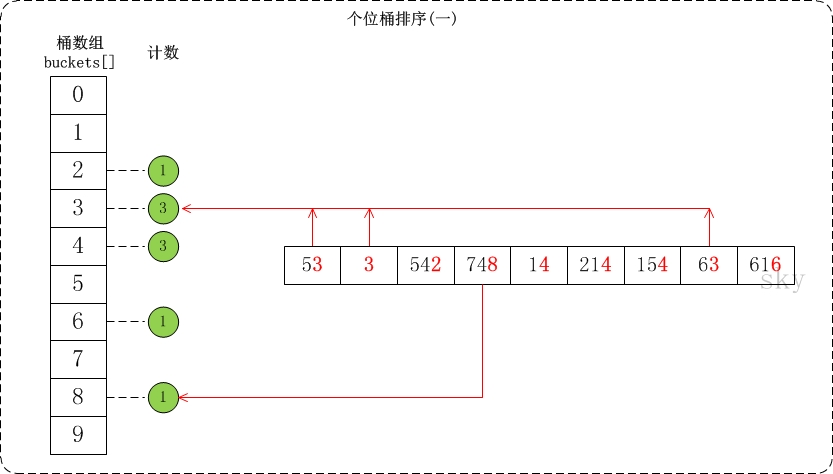

<h2 align="center">基数排序</h2>

**总结**：

按位数，从低位开始进行排序

基数排序也是一种桶排序：桶排序是按值区间划分桶，基数排序是按数位来划分。

**算法思想**：将整数按位数切割成不同的数字，然后按每个位数分别比较

**步骤**：

1. 将所有待比较数值统一为同样的数位长度，数位较短的数前面补零
2. 从最低位开始，依次进行一次排序
3. 这样从最低位排序一直到最高位排序完成以后，数列就变成一个有序序列

**图解**：

使用基数排序对 `{53, 3, 542, 748, 14, 214, 154, 63, 616}` 进行排序，首先将所有待比较数组元素统一位数长度，接着从最低位开始，依次进行排序：按照个位数进行排序、按照十位数进行排序、按照百位数进行排序


```cpp
/*
 * 对数组按照"某个位数"进行排序(桶排序)
 *  arr -- 数组
 *  len -- 数组长度
 *  exp -- 指数。对数组a按照该指数进行排序。
 *
 * 例如，对于数组arr={50, 3, 542, 745, 2014, 154, 63, 616}；
 *    (01) 当exp=1表示按照"个位"对数组arr进行排序
 *    (02) 当exp=10表示按照"十位"对数组arr进行排序
 *    (03) 当exp=100表示按照"百位"对数组arr进行排序
 *    ...
 */
void count_sort(int *arr, int len, int exp)
{
    // 存储"被排序数据"的临时数组
    int *temp = new int[len];
    int buckets[10] = {0};

    // 将数据出现的次数存储在buckets[]中
    // (arr[i] / exp) % 10：取某一位上的数
    for (int i = 0; i < len; i++)
        buckets[(arr[i] / exp) % 10]++;

    // 更改buckets[i]。目的是让更改后的buckets[i]的值，是该数据在temp[]中的位置。
    for (int i = 1; i < 10; i++)
        buckets[i] += buckets[i - 1];

    // 将数据存储到临时数组 temp[]中
    for (int i = len - 1; i >= 0; i--)
    {
        temp[buckets[(arr[i] / exp) % 10] - 1] = arr[i];
        buckets[(arr[i] / exp) % 10]--;
    }

    // 将排序好的数据赋值给arr[]
    for (int i = 0; i < len; i++)
        arr[i] = temp[i];

    delete[] temp;
}

void radix_sort(int *arr, int len)
{
    // 数组arr中的最大值
    int max = arr[0];
    for (int i = 1; i < len; i++)
        if (arr[i] > max)
            max = arr[i];

    // 指数。当对数组按个位进行排序时，exp=1
    // 按十位进行排序时，exp=10; ...
    // 从个位开始，对数组arr按"指数"进行排序
    for (int exp = 1; max / exp > 0; exp *= 10)
        count_sort(arr, len, exp);
}
```

对数组 `{53, 3, 542, 748, 14, 214, 154, 63, 616}` 按个位数进行排序的流程
1. 个位的数值范围是 `[0,10)`。因此，创建桶数组 `buckets[]`，将数组按照个位数值添加到桶中



2. 接着是根据桶数组 `buckets[]` 来进行排序。假设将排序后的数组存在 `temp[]` 中；找出 `temp[]` 和 `buckets[]` 之间的联系就可以对数据进行排序了


