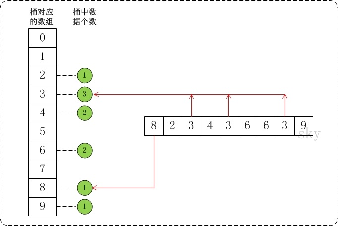

<h2 align="center">桶排序</h2>

**总结**：

需要知道最大值，跟数组下标结合起来。对每个桶内部使用**插入排序**

**算法思想**：

将数组分到有限数量的桶子里。假设待排序的数组 `a` 中共有 `n` 个整数，并且已知数组 `a` 中数据的范围 `[0, max)`。在桶排序时，创建容量为 `max` 的桶数组 `r`，并将桶数组元素都初始化为 0；将容量为 `max` 的桶数组中的每一个单元都看作一个"桶"。

在排序时，逐个遍历数组 `a`，将数组 `a` 的值作为 “ 桶数组 `r` ” 的下标。当 `a` 中数据被读取时，就将桶的值加 1。例如，读取到数组 `a[3]=5`，则将 `r[5]` 的值 +1。

**复杂度**：

`n` 个待排数据，`m` 个桶，平均每个桶 `n/m` 个数据的桶排序平均时间复杂度为：`O(n) + O(m * (n/m) * log(n/m))` = `O(n + n * (logn - logm))` = `O(n + n * (logn - logm))`，当 `n=m` 时，即极限情况下每个桶只有一个数据时。桶排序的最好效率能够达到 `O(n)`。当然最坏的情况是只有 1 只桶，那应避免这种情况。空间复杂度为：`O(n+m)`。对于同样的 `n`，桶数量 `m` 越大，其时间效率越高，但相应的空间开销也会越大

指定 n 个桶：

```cpp
void bucket_sort(int *arr, int len)
{
	const int num = 3;
	std::vector<int> buckets[num]; //每个桶

	// 获取最大最小值
	int min = arr[0], max = arr[0];
	for (int i = 0; i < len; i++)
	{
		if (min > arr[i]) min = arr[i];
		if (max < arr[i]) max = arr[i];
	}
	// 一个桶的存储大小
	const int interval = (max - min) / num + 1;
	// 将值填充到桶中
	for (int i = 0; i < len; i++)
		buckets[(arr[i] - min) / interval].push_back(arr[i]);

	// 对每个桶内部进行排序
	for (int i = 0; i < num; i++)
	{
		if (!buckets[i].empty())
		{
			std::sort(buckets[i].begin(), buckets[i].end());
		}
	}

	int index = 0;
	for (int i = 0; i < num; i++)
	{
		if (!buckets[i].empty())
		{
			for (int j = 0; j < buckets[i].size(); j++)
			{
				arr[index++] = buckets[i][j];
			}
		}
	}
}
```


特殊的桶排序：

```cpp
void bucket_sort(int *a, int n, int max)
{
    int i, j;
    int *buckets;
    if (a == NULL || n < 1 || max < 1)
        return;
    // 创建一个容量为max的数组buckets，并且将buckets中的所有数据都初始化为0。
    if ((buckets = (int *)malloc(max * sizeof(int))) == NULL)
        return;
    std::memset(buckets, 0, max * sizeof(int));
    // 1. 计数
    for (i = 0; i < n; i++)
        buckets[a[i]]++;
    // 2. 排序
    for (i = 0, j = 0; i < max; i++)
        while ((buckets[i]--) > 0)
            a[j++] = i;
    free(buckets);
}
```

假设 `a={8,2,3,4,3,6,6,3,9}`，`max=10`。此时将数组 `a` 的所有数据都放到需要为 0-9 的桶中。如下图：



也可以不用创建 max，比如说分为 3 个桶，各自的范围为：`[0, max/3)`，`[max/3, 2*max/3)`，`[2*max/3, max]`

