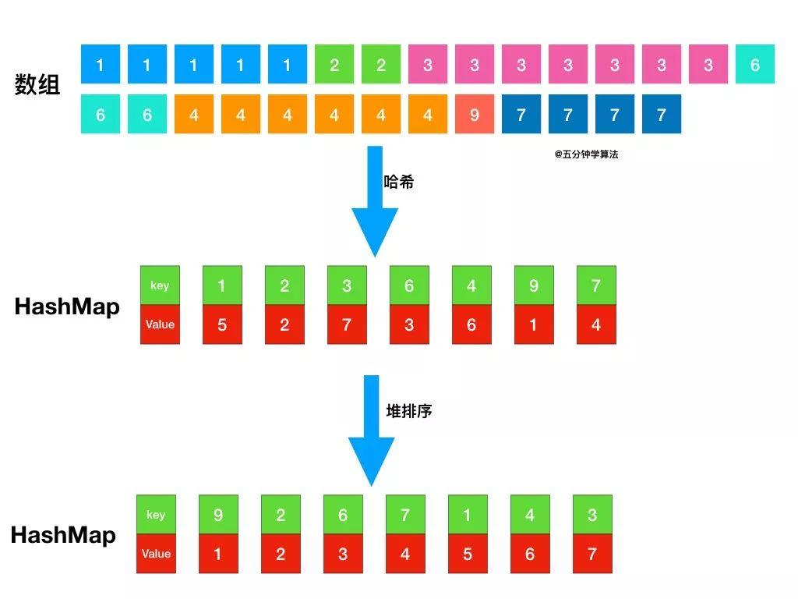
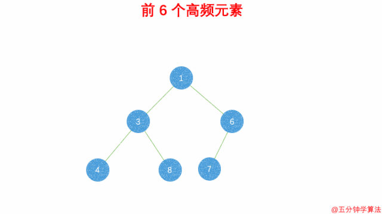

# 类型
>[LeetCode刷题总结-排序、并查集和图篇](https://www.cnblogs.com/liuzhen1995/p/12080078.html)

1. 数组问题
- 题号：164. 最大间距，难度困难
- 题号：324. 摆动排序 II，难度中等

2. 数学问题
- 题号：179. 最大数，难度中等

3. 实际场景应用问题
- 题号：853. 车队，难度中等
- 题号：1235. 规划兼职工作，难度困难


# LeetCode

Top K 问题

题号|题目|难度|完成度|备注
--|--|--|--|--
347|前K个高频元素|🟡|✔|
215|数组中的第K个最大元素|🟡|✔|
40|最小的k个数|🟢|✔|剑指 Offer

题号|题目|难度|完成度|备注
--|--|--|--|--
88|合并两个有序数组|🟢|✔|（对应 6.1）
147|对链表进行插入排序|🟡|✔|（对应 6.4）

未完成

题号|题目|难度|完成度|备注
--|--|--|--|--
41|缺失的第一个正数|🔴||（对应 6.6）
75|颜色分类|🟡||（对应 6.7）


🟢🔴🟡✔✖


## 前K个高频元素
**描述**：

```
给定一个非空的整数数组，返回其中出现频率前 k 高的元素。

示例 1:
输入: nums = [1,1,1,2,2,3], k = 2
输出: [1,2]

示例 2:
输入: nums = [1], k = 1
输出: [1]

提示：

* 你可以假设给定的 k 总是合理的，且 1 ≤ k ≤ 数组中不相同的元素的个数。
* 你的算法的时间复杂度必须优于 O(n log n) , n 是数组的大小。
* 题目数据保证答案唯一，换句话说，数组中前 k 个高频元素的集合是唯一的。
* 你可以按任意顺序返回答案。
```

**思路 1**：最小堆

题目最终需要返回的是前 k 个频率最大的元素，可以想到借助堆这种数据结构，对于 k 频率之后的元素不用再去处理。



具体操作为：

1. 借助 **哈希表** 来建立数字和其出现次数的映射，遍历一遍数组统计元素的频率
2. 维护一个元素数目为 k 的最小堆
3. 每次都将新的元素与堆顶元素（堆中频率最小的元素）进行比较
4. 如果新的元素的频率比堆顶端的元素大，则弹出堆顶端的元素，将新的元素添加进堆中
5. 最终，堆中的 k 个元素即为前 k 个高频元素

堆中的元素就是前 k 个频率最大的元素：



**复杂度分析**：
- 时间复杂度：`O(nlogk)`：
    
    `n` 表示数组的长度。首先，遍历一遍数组统计元素的频率，这一系列操作的时间复杂度是 `O(n)`；接着，遍历用于存储元素频率的 `map`，如果元素的频率大于最小堆中顶部的元素，则将顶部的元素删除并将该元素加入堆中，**这里维护堆的数目是 k**，所以这一系列操作的时间复杂度是 `O(nlogk)` 的；因此，总的时间复杂度是 `O(nlog⁡k)` 。

- 空间复杂度：`O(n)`：

    最坏情况下（每个元素都不同），`map` 需要存储 `n` 个键值对，优先队列需要存储 `k` 个元素，因此，空间复杂度是 `O(n)`。

```cpp
class Solution
{
public:
    vector<int> topKFrequent(vector<int> &nums, int k)
    {
        unordered_map<int, int> map;
        for (int i : nums)
            map[i]++;
        // 遍历
        priority_queue<pair<int, int>, vector<pair<int, int>>, greater<pair<int, int>>> q; //最小堆
        for (auto it : map)
            if (q.size() == k)
            {  // 队列满了
                if (it.second > q.top().first)
                {  // 堆排
                    q.pop();
                    q.push(make_pair(it.second, it.first));
                }
            }
            else
                q.push(make_pair(it.second, it.first));
       
        vector<int> res;
        while (q.size())
        {   // 将优先队列中k个高频元素存入vector
            res.push_back(q.top().second);
            q.pop();
        }
        return vector<int>(res.rbegin(), res.rend());
    }
};
```

**思路 2**：桶排序

首先依旧使用 哈希表 统计频率，统计完成后，创建一个数组，将频率作为数组下标，对于出现频率不同的数字集合，存入对应的数组下标即可。


**复杂度分析**：
- 时间复杂度：`O(n)`：
    
    `n` 表示数组的长度。首先，遍历一遍数组统计元素的频率，这一系列操作的时间复杂度是 `O(n)`；桶的数量为 `n + 1`，所以桶排序的时间复杂度为 `O(n)`；因此，总的时间复杂度是 `O(n)`。

- 空间复杂度：`O(n)`

```cpp
class Solution
{
public:
    vector<int> topKFrequent(vector<int> &nums, int k)
    {
        unordered_map<int, int> p;
        // 统计每个元素出现的次数，元素为键，元素出现的次数为值
        for (int i = 0; i < nums.size(); i++)
        {
            p[nums[i]]++;
        }

        // 将频率作为数组下标，对于出现频率不同的数字集合，存入对应的数组下标
        vector<vector<int>> ant(nums.size() + 1);
        int max_size = INT_MIN;
        for (auto iter = p.begin(); iter != p.end(); iter++)
        {
            // 获取出现的次数作为下标
            ant[iter->second].push_back(iter->first);
            max_size = max(max_size, iter->second);
        }
        int sum = 0;
        vector<int> ans;
        // 倒序遍历数组获取出现顺序从大到小的排列
        for (int i = max_size; i >= 0; i--)
        {
            if (ant[i].size() != 0)
            {
                for (int j = 0; j < ant[i].size(); j++)
                {
                    ans.push_back(ant[i][j]);
                    ++sum;
                    if (sum >= k)
                        break;
                }
            }
            if (sum >= k)
                break;
        }

        return ans;
    }
};
```

>[前 K 个高频元素告诉你桶排序有啥用](https://www.cxyxiaowu.com/662.html)


## 数组中的第K个最大元素
**描述**：

```
在未排序的数组中找到第 k 个最大的元素。请注意，你需要找的是数组排序后的第 k 个最大的元素，而不是第 k 个不同的元素。

示例 1:
    输入: [3,2,1,5,6,4] 和 k = 2
    输出: 5
示例 2:
    输入: [3,2,3,1,2,4,5,5,6] 和 k = 4
    输出: 4
说明:
    你可以假设 k 总是有效的，且 1 ≤ k ≤ 数组的长度。
```

**思路 1**：[链接](https://leetcode-cn.com/problems/kth-largest-element-in-an-array/solution/shu-zu-zhong-de-di-kge-zui-da-yuan-su-cshi-xian-sa/)

使用**最小堆**，维持 k 个最大数，堆里最小的数就是答案

时间复杂度：`O(n*logk)`，空间复杂度：`O(1)`

备注：堆在 C++ 中就是优先队列

```cpp
int findKthLargest(vector<int> &nums, int k)
{
    int size = int(nums.size());
    if (size == 0 || k > size) {
        return 0;
    }

    int rs = 0;
    
    // 升序
    priority_queue<int, vector<int>, greater<int>> store;
    // 堆中维持k个最大数
    for (int i = 0; i < size; i++)
    {
        store.push(nums[i]);
        if (store.size() > k) {
            // 移除堆顶元素，也就是最小的那一个
            store.pop();
        }
    }

    rs = store.top();
    return rs;
}
```

**思路 2**：[快速排序，数组拆分](https://leetcode-cn.com/problems/kth-largest-element-in-an-array/solution/kuai-su-pai-xu-si-xiang-shu-zu-hua-fen-by-liushang/)

- 利用快速排序思想，对数组进行划分，并且判断划分的边界元素位置 mid 是否为第 k 大的数(k - 1)，若是则返回该数。
- 若 `mid > k - 1` 说明第 k 大的数在左半边数组里；
- 若 `mid < k - 1` 说明在右半边数组里。对其继续进行数组划分，直到找到第 k 大的数。
- 数组划分函数 `partation` 采用数组中心位置的元素值作为 bound（边界），也可以采用随机元素，最好不要用第一个（最后一个）元素，防止数组绝大部分元素是有序的，影响查找效率。

```cpp
class Solution {
public:
    int findKthLargest(vector<int> &nums, int k) {
        int low = 0, high = nums.size() - 1, mid = 0;
        while (low <= high) {
            mid = partation(nums, low, high);
            if (mid == k - 1)
                return nums[mid];
            else if (mid > k - 1)
                high = mid - 1;
            else
                low = mid + 1;
        }
        // 实际上返回 -1 代表没有第 k 大的数，这里不存在
        return -1;
    }

    int partation(vector<int> &nums, int low, int high) {
        int left = low + 1, right = high;
        swap(nums[low], nums[(low + high) / 2]);
        int bound = nums[low];
        
        // 双指针，快速排序，交换不符合条件的数据
        while (left <= right) {
            while (left < high && nums[left] >= bound)
                left++;
            while (nums[right] < bound)
                right--;
            if (left < right)
                swap(nums[left++], nums[right--]);
            else
                break;
        }
        // 将bound放到换分完成后的两个数组之间，作为边界, 返回bound的位次
        swap(nums[low], nums[right]);
        return right;
    }
};
```


TODO: 搞不懂

**思路 2**：选择算法

形如快排的算法，不过只进入一边。partition 后，比 current 小，则进入左边递归，不然进入右边递归。partition 随机寻找一个第 current 小的数

例如：
```
原数组：2 1 4 3
目的：求第三大的数
思路：先将求第 k 大的问题改为求 size+1-k 小的问题
转换为：求第二小的数

函数：cut = partition(nums, left, right);
原数组：    2   1   4   3
一次分治：  2   1   3   4
                    ↘ cut(得到第3小的数)
二次分治：  1   2   3   4
            ↘ cut(得到第1小的数)
三次分治：  1   2   3   4
                ↘ cut(得到第2小的数)
答案：2
```

时间复杂度：`O(n)`，空间复杂度：`O(1)`

```cpp
class Solution {
public:
    int findKthLargest(vector<int> &nums, int k) {
        int size = int(nums.size());
        if (size == 0 || k > size)
            return 0;

        // 寻找第kMIN小的数
        int kMin = size - k + 1;
        int rs = select(nums, 0, size - 1, kMin);
        return rs;
    }

    int select(vector<int> &nums, int left, int right, int target) {
        if (left == right)
        {
            return nums[left];
        }
        int cut = partition(nums, left, right);
        // 当前第 currentResult 小的元素
        int currentResult = cut - left + 1;
        if (target == currentResult)
            return nums[cut];
        else if (target < currentResult)
            return select(nums, left, cut - 1, target);
        else
            // 寻找接下来第 target - currentResult 小的数
            return select(nums, cut + 1, right, target - currentResult);
    }

    int partition(vector<int> &nums, int left, int right) {
        // i 指向大堆的最左边的数，j 指向下一个判断的数
        int i = left;
        for (int j = left; j < nums[right]; j++)
        {
            if (nums[j] <= nums[right])
            {
                swap(nums[i], nums[j]);
                i++;
            }
        }
        swap(nums[i], nums[right]);
        return i;
    }
};
```

## 最小的k个数 
**描述**：

```
输入整数数组 arr ，找出其中最小的 k 个数。例如，输入4、5、1、6、2、7、3、8这8个数字，则最小的4个数字是1、2、3、4。 

示例 1：
    输入：arr = [3,2,1], k = 2
    输出：[1,2] 或者 [2,1]

示例 2：
    输入：arr = [0,1,2,1], k = 1
    输出：[0]
 
限制：
    0 <= k <= arr.length <= 10000
    0 <= arr[i] <= 10000
```

**思路**：堆排序

```cpp
class Solution {
public:
    vector<int> getLeastNumbers(vector<int> &arr, int k) {
        vector<int> res(k);
        priority_queue<int, vector<int>, less<int>> que;
        
        for (int i = 0; i < arr.size(); i++) {
            que.push(arr[i]);
            if (que.size() > k)
                que.pop();
        }

        for (int i = k - 1; i >= 0; i--) {
            res[i] = que.top();
            que.pop();
        }
        return res;
    }
};
```


## 合并两个有序数组
**描述**：

```
给你两个有序整数数组 nums1 和 nums2，请你将 nums2 合并到 nums1 中，使 nums1 成为一个有序数组。

说明:
* 初始化 nums1 和 nums2 的元素数量分别为 m 和 n 。
* 你可以假设 nums1 有足够的空间（空间大小大于或等于 m + n）来保存 nums2 中的元素。
 
示例:

输入:
    nums1 = [1,2,3,0,0,0], m = 3
    nums2 = [2,5,6],       n = 3
输出: [1,2,2,3,5,6]
```

**思路**：

尾部插入法

时间复杂度：`O(m + n)`，空间复杂度：`O(1)`

```cpp
class Solution {
public:
    void merge(vector<int>& nums1, int m, vector<int>& nums2, int n) {
        int tail1 = m - 1, tail2 = n - 1, curr = m + n - 1;
        while (tail1 >= 0 && tail2 >= 0) {
            nums1[curr--] = nums1[tail1] >= nums2[tail2] ? nums1[tail1--] : nums2[tail2--];
        }

        while (tail2 >= 0) {
            nums1[curr--] = nums2[tail2--];
        }
    }
};
```

## 对链表进行插入排序
**描述**：

```
对链表进行插入排序。

插入排序算法：
1. 插入排序是迭代的，每次只移动一个元素，直到所有元素可以形成一个有序的输出列表。
2. 每次迭代中，插入排序只从输入数据中移除一个待排序的元素，找到它在序列中适当的位置，并将其插入。
3. 重复直到所有输入数据插入完为止。
 

示例 1：

输入: 4->2->1->3
输出: 1->2->3->4

示例 2：

输入: -1->5->3->4->0
输出: -1->0->3->4->5
```

插入排序的动画演示如上。从第一个元素开始，该链表可以被认为已经部分排序（用黑色表示）。
每次迭代时，从输入数据中移除一个元素（用红色表示），并原地将其插入到已排好序的链表中。


**思路**：

时间复杂度：O(n<sup>2</sup>)，空间复杂度：`O(1)`

```cpp
class Solution {
private:
    ListNode *findInsertPos(ListNode *head, int x) {
        ListNode *prev = NULL;
        ListNode *curr = head;
        while (curr != NULL && curr->val <= x) {
            prev = curr;
            curr = curr->next;
        }
        return prev;
    }
public:
    ListNode *insertionSortList(ListNode *head) {
        ListNode dummy(INT_MIN);
        //dummy.next = head;
        ListNode *curr = head;
        while (curr != NULL) {
            ListNode *pos = findInsertPos(&dummy, curr->val);
            ListNode *temp = curr->next;
            curr->next = pos->next;
            pos->next = curr;
            curr = temp;
        }

        return dummy.next;
    }
};
```


# 未整理


**相关题目**：
- Insertion Sort List，见 §6.4

## 6.6 First Missing Positive
**描述**：

Given an unsorted integer array, find the first missing positive integer.

For example, Given [1,2,0] return 3, and [3,4,-1,1] return 2.

Your algorithm should run in O(n) time and uses constant space.

给定一个未排序的整数数组，查找丢失的第一个正整数。

例如，给定 [1,2,0] 返回 3，而 [3,4，-1,1] 返回 2。

你的算法应该在 O(n) 时间内运行并且使用恒定的空间。

**分析**：

本质上是桶排序（bucket sort），每当 `A[i] != i+1` 的时候，将 `A[i]` 与 `A[A[i]-1]` 交换，直到无法交换为止，终止条件是：`A[i] == A[A[i]-1]`


**备注**：

当提及到正整数，可以想到使用桶排序

todo： 这里的交换是什么意思

todo: 复习桶排序的相关知识

**代码**：时间复杂度：O(n)，空间复杂度：O(1)

```cpp
class Solution
{
public:
    int firstMissingPositive(vector<int> &nums)
    {
        bucket_sort(nums);
        for (int i = 0; i < nums.size(); ++i)
            if (nums[i] != (i + 1))
                return i + 1;
        return nums.size() + 1;
    }

private:
    static void bucket_sort(vector<int> &A)
    {
        const int n = A.size();
        for (int i = 0; i < n; i++)
        {
            while (A[i] != i + 1)
            {
                if (A[i] <= 0 || A[i] > n || A[i] == A[A[i] - 1])
                    break;
                swap(A[i], A[A[i] - 1]);
            }
        }
    }
};
```

**相关题目**：
-  Sort Colors，见 §6.7

## 6.7 Sort Colors
**描述**：

Given an array with n objects colored red, white or blue, sort them so that objects of the same color are adjacent, with the colors in the order red, white and blue.

Here, we will use the integers 0, 1, and 2 to represent the color red, white, and blue respectively.

Note: You are not suppose to use the library’s sort function for this problem.

**Follow up**:

A rather straight forward solution is a two-pass algorithm using counting sort.

First, iterate the array counting number of 0’s, 1’s, and 2’s, then overwrite array with total number of 0’s, then 1’s and followed by 2’s.

Could you come up with an one-pass algorithm using only constant space?

```
给定一个包含 n 个颜色为红、白、蓝的对象的数组，对它们进行排序，使相同颜色的对象相邻，颜色的顺序为红、白、蓝。
这里，我们将使用整数 0、1 和 2 分别表示红色、白色和蓝色。
注意:对于这个问题，您不应该使用库的排序函数。
Follow up:
一个相当直接的解决方案是使用计数排序的两遍算法。
首先，迭代数组计数 0、1 和 2 的个数，然后用总数为 0 的数覆盖数组，然后是 1，然后是 2。
你能想出一个只使用常数空间的一遍算法吗?
```

**分析**：

第 1 种思路：由于 0，1，2 非常紧凑，首先想到计数排序（counting sort），但需要扫描 2 遍，不符合题目要求。

第 2 种思路：由于只有 3 种颜色，可以设置 2 个 index。一个是 red 的 index，一个是 blue 的 index，两边往中间走。时间复杂度：O(n)，空间复杂度：O(1)。

第 3 种思路：利用快速排序里的 partition 的思想，第一次将数组按 0 分割，第二次按 1 分割，排序完毕，可以推广到 n 种颜色，每种颜色有重复元素的情况。

**代码 1**：计数排序：时间复杂度：O(n)，空间复杂度：O(1)

```cpp
class Solution
{
public:
    void sortColors(vector<int> &A)
    {
        int counts[3] = {0}; // 记录每个颜色出现的次数
        for (int i = 0; i < A.size(); i++)
            counts[A[i]]++;
        for (int i = 0, index = 0; i < 3; i++)
            for (int j = 0; j < counts[i]; j++)
                A[index++] = i;
    }
};
```

**代码 2**：双指针：时间复杂度：O(n)，空间复杂度：O(1)

```cpp
class Solution
{
public:
    void sortColors(vector<int> &A)
    {
        // 一个是 red 的 index，一个是 blue 的index，两边往中间走
        int red = 0, blue = A.size() - 1;
        for (int i = 0; i < blue + 1;)
        {
            if (A[i] == 0)
                swap(A[i++], A[red++]);
            else if (A[i] == 2)
                swap(A[i], A[blue--]);
            else
                i++;
        }
    }
};
```

**代码 3**：使用 partition() ：时间复杂度：O(n)，空间复杂度：O(1)

```cpp
class Solution
{
public:
    void sortColors(vector<int> &nums)
    {
        partition(partition(nums.begin(), nums.end(), bind1st(equal_to<int>(), 0)),
                  nums.end(), bind1st(equal_to<int>(), 1));
    }
};
```

**代码 4**：重新实现 partition() ：时间复杂度：O(n)，空间复杂度：O(1)

```cpp

class Solution
{
public:
    void sortColors(vector<int> &nums)
    {
        partition(partition(nums.begin(), nums.end(), bind1st(equal_to<int>(), 0)),
                  nums.end(), bind1st(equal_to<int>(), 1));
    }

private:
    template <typename ForwardIterator, typename UnaryPredicate>
    ForwardIterator partition(ForwardIterator first, ForwardIterator last,
                              UnaryPredicate pred)
    {
        auto pos = first;
        for (; first != last; ++first)
            if (pred(*first))
                swap(*first, *pos++);
        return pos;
    }
};
```

**相关题目**：
- First Missing Positive, 见 §6.6
