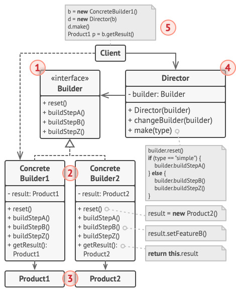

<h1 align="center">目录</h1>


# 生成器模式
> 亦称：建造者模式、Builder

生成器模式是一种创建型设计模式， 使你能够分步骤创建复杂对象。 该模式允许你**使用相同的创建代码生成不同类型和形式的对象**。

使用生成器模式可避免 “**重叠构造函数** （telescopic constructor）” 的出现。（解决构造函数中多个可选参数的问题）。

# 模式结构



1. 生成器 （Builder） 接口声明在所有类型生成器中通用的产品构造步骤。
2. 具体生成器 （Concrete Builders） 提供构造过程的不同实现。具体生成器也可以构造不遵循通用接口的产品。
3. 产品 （Products） 是最终生成的对象。由不同生成器构造的产品无需属于同一类层次结构或接口。
4. 主管 （Director） 类定义调用构造步骤的顺序，这样你就可以创建和复用特定的产品配置。
5. 客户端 （Client） 必须将某个生成器对象与主管类关联。一般情况下，你只需通过主管类构造函数的参数进行一次性关联即可。此后主管类就能使用生成器对象完成后续所有的构造任务。但在客户端将生成器对象传递给主管类制造方法时还有另一种方式。在这种情况下，你在使用主管类生产产品时每次都可以使用不同的生成器。

TODO: 未完待续


# 代码示例

```cpp
#include <iostream>
#include <vector>

/**
 * It makes sense to use the Builder pattern only when your products are quite
 * complex and require extensive configuration.
 *
 * Unlike in other creational patterns, different concrete builders can produce
 * unrelated products. In other words, results of various builders may not
 * always follow the same interface.
 */

class Product1 {
public:
    std::vector<std::string> parts_;

    void ListParts() const {
        std::cout << "Product parts: ";
        for (size_t i = 0; i < parts_.size(); i++) {
            if (parts_[ i ] == parts_.back()) {
                std::cout << parts_[ i ];
            } else {
                std::cout << parts_[ i ] << ", ";
            }
        }
        std::cout << "\n\n";
    }
};

/**
 * The Builder interface specifies methods for creating the different parts of
 * the Product objects.
 */
class Builder {
public:
    virtual ~Builder() {
    }
    virtual void ProducePartA() const = 0;
    virtual void ProducePartB() const = 0;
    virtual void ProducePartC() const = 0;
};
/**
 * The Concrete Builder classes follow the Builder interface and provide
 * specific implementations of the building steps. Your program may have several
 * variations of Builders, implemented differently.
 */
class ConcreteBuilder1 : public Builder {
private:
    Product1 *product;

    /**
     * A fresh builder instance should contain a blank product object, which is
     * used in further assembly.
     */
public:
    ConcreteBuilder1() {
        this->Reset();
    }

    ~ConcreteBuilder1() {
        delete product;
    }

    void Reset() {
        this->product = new Product1();
    }
    /**
     * All production steps work with the same product instance.
     */

    void ProducePartA() const override {
        this->product->parts_.push_back("PartA1");
    }

    void ProducePartB() const override {
        this->product->parts_.push_back("PartB1");
    }

    void ProducePartC() const override {
        this->product->parts_.push_back("PartC1");
    }

    /**
     * Concrete Builders are supposed to provide their own methods for
     * retrieving results. That's because various types of builders may create
     * entirely different products that don't follow the same interface.
     * Therefore, such methods cannot be declared in the base Builder interface
     * (at least in a statically typed programming language). Note that PHP is a
     * dynamically typed language and this method CAN be in the base interface.
     * However, we won't declare it there for the sake of clarity.
     *
     * Usually, after returning the end result to the client, a builder instance
     * is expected to be ready to start producing another product. That's why
     * it's a usual practice to call the reset method at the end of the
     * `getProduct` method body. However, this behavior is not mandatory, and
     * you can make your builders wait for an explicit reset call from the
     * client code before disposing of the previous result.
     */

    /**
     * Please be careful here with the memory ownership. Once you call
     * GetProduct the user of this function is responsable to release this
     * memory. Here could be a better option to use smart pointers to avoid
     * memory leaks
     */

    Product1 *GetProduct() {
        Product1 *result = this->product;
        this->Reset();
        return result;
    }
};

/**
 * The Director is only responsible for executing the building steps in a
 * particular sequence. It is helpful when producing products according to a
 * specific order or configuration. Strictly speaking, the Director class is
 * optional, since the client can control builders directly.
 */
class Director {
    /**
     * @var Builder
     */
private:
    Builder *builder;
    /**
     * The Director works with any builder instance that the client code passes
     * to it. This way, the client code may alter the final type of the newly
     * assembled product.
     */

public:
    void set_builder(Builder *builder) {
        this->builder = builder;
    }

    /**
     * The Director can construct several product variations using the same
     * building steps.
     */

    void BuildMinimalViableProduct() {
        this->builder->ProducePartA();
    }

    void BuildFullFeaturedProduct() {
        this->builder->ProducePartA();
        this->builder->ProducePartB();
        this->builder->ProducePartC();
    }
};
/**
 * The client code creates a builder object, passes it to the director and then
 * initiates the construction process. The end result is retrieved from the
 * builder object.
 */
/**
 * I used raw pointers for simplicity however you may prefer to use smart
 * pointers here
 */
void ClientCode(Director &director) {
    ConcreteBuilder1 *builder = new ConcreteBuilder1();
    director.set_builder(builder);
    std::cout << "Standard basic product:\n";
    director.BuildMinimalViableProduct();

    Product1 *p = builder->GetProduct();
    p->ListParts();
    delete p;

    std::cout << "Standard full featured product:\n";
    director.BuildFullFeaturedProduct();

    p = builder->GetProduct();
    p->ListParts();
    delete p;

    // Remember, the Builder pattern can be used without a Director class.
    std::cout << "Custom product:\n";
    builder->ProducePartA();
    builder->ProducePartC();
    p = builder->GetProduct();
    p->ListParts();
    delete p;

    delete builder;
}

int main() {
    Director *director = new Director();
    ClientCode(*director);
    delete director;
    return 0;
}
```

```
Standard basic product:
Product parts: PartA1

Standard full featured product:
Product parts: PartA1, PartB1, PartC1

Custom product:
Product parts: PartA1, PartC1
```